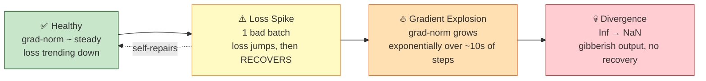

# Section 2 — Training Instability (Slides 14–21)

> **Why this matters:** Fine-tuning a pretrained model is like doing surgery on a
> delicately balanced system. One oversized step can undo hours of training. This section
> is the *pathology* (how runs die) followed by the *treatment* (a stability checklist you
> can apply on every run).

---

## 2.1 Why fine-tuning becomes unstable (Slide 15)

The root feedback loop: **one oversized update damages the weights → produces worse
predictions → larger loss → even bigger gradients on the next step.** Left unchecked, this
runs away. Five forces that trigger or amplify it:

1. **Sharp loss landscapes.** Pretrained optima sit in *narrow valleys*. A step sized for
   gentle terrain overshoots the valley walls.
2. **Low-precision arithmetic.** fp16 overflows above ~65,504. One large activation becomes
   `Inf`, which poisons the gradient for every downstream parameter.
3. **Heterogeneous batches.** A single outlier batch — extreme length, corrupted text,
   unusual tokens — can produce a gradient **10–100× the typical norm**.
4. **Scale amplifies everything.** Deeper networks multiply perturbations layer by layer, so
   a small early error compounds into a large one by the output.
5. (The **feedback loop** itself from the top — bad update begets a worse one.)

> 💡 **Learning Thought:** Instability is almost always a **step-size problem in
> disguise.** Sharp valleys, outlier batches, and fp16 overflow all end the same way: an
> update far too large for where the model currently sits. Keep that framing — it makes
> the mitigations obvious.

---

## 2.2 The three failure modes (Slides 16–18)

These are three points on **one spectrum** — from recoverable to fatal. They are **not three
different diseases**; they are the early, middle and late stages of the *same* one.

### The one picture that makes all three click

Think of training as a **hiker walking down a narrow mountain valley in fog.**

- **Valley floor** = low loss (good weights). **Valley walls** = high loss.
- **Gradient** = which way is downhill and how steep. Steeper slope → bigger gradient.
- **Learning rate** = how long a stride the hiker takes.
- Fine-tuning starts the hiker **already near the valley floor** — that's what pretraining
  bought you — and the valley is **narrow**, a few meters wide, not a few kilometers.

The three failure modes are just three ways that walk goes wrong:

| | Hiker version | Training version |
|---|---|---|
| **Loss Spike** | One over-long stride puts them partway up the far wall. Next stride they see downhill and walk back. | One bad batch → one oversized update → loss jumps → **later steps repair it.** |
| **Gradient Explosion** | Each stumble lands them somewhere steeper, so the next stride is longer, landing them steeper still. | Bad update → worse loss → **bigger** gradient → **worse** update. Compounds. |
| **Divergence** | They're over the ridge, on a featureless plateau. There is no "downhill" to follow anymore. | Weights have left every good region. Gradients point nowhere useful. **No self-repair.** |

---

### (a) Loss Spike (Slide 16) — recoverable, annoying

**What happens:** One batch produced an outsized gradient, usually because that batch was
*weird* — a 4,000-token example among 512-token ones, a chunk of corrupted text, a burst of
rare tokens. The update was far too big for where the model sits, so it knocked the weights
partway up the valley wall.

But the model is **still inside the valley.** So the very next batch's gradient correctly
points back down, and the run **repairs itself** over the next tens-to-hundreds of steps.

```
step 1180  loss 1.82  grad_norm 0.79
step 1181  loss 1.79  grad_norm 0.84
step 1182  loss 6.41  grad_norm 47.3   ← ⚠️ one bad batch
step 1183  loss 3.12  grad_norm 2.10
step 1184  loss 2.28  grad_norm 1.05
...
step 1240  loss 1.83  grad_norm 0.81   ← recovered, ~60 steps burned
```

**The signature:** grad-norm returns to baseline **immediately** — one step later. That
single-step return is what distinguishes a spike from an explosion.

```
loss
 │         ╱╲                        ← one step ruins it
 │        ╱  ╲
 │       ╱    ╲__
 │──────╱        ───___________      ← back on trend within ~50–200 steps
 └───────────────────────────────► step
        ▲ spike          ▲ recovered
```

**Why "just after warmup"?** Warmup ramps the LR from 0 to peak. The moment warmup ends,
your stride is at its **maximum for the entire run**, and the model is still early so the
terrain is at its roughest. Biggest stride + roughest terrain = the window where an outlier
batch can most easily knock you off. That's why spikes *cluster* there instead of spreading
evenly across the run.

**Cost:** hundreds of steps of compute spent undoing damage. One or two per run is normal.
A dozen means your LR is too high — the spike is a *symptom*, not the disease.

---

### (b) Gradient Explosion (Slide 17) — the danger zone

This is the one that's hardest to picture, so use a different analogy: **microphone
feedback.** A mic picks up the speaker, the speaker plays it louder, the mic picks up *that*,
and within a second you have an ear-splitting squeal. Nothing new was added — the system's
own output fed back into its own input with gain > 1.

Training does exactly this:

```
bad update  →  weights worse  →  loss higher  →  gradient bigger  →  worse update
     ▲                                                                    │
     └────────────────────────────────────────────────────────────────────┘
```

**The key difference from a spike is where the energy comes from.** A spike is a one-off
external shock the system absorbs. An explosion is the system **feeding itself** — every
step makes the next step worse. Once the loop's gain exceeds 1, no outside help is needed;
it runs away on its own.

**Here's the trap, and it's the whole point of the slide:**

```
step 3100  loss 1.80  grad_norm 0.91
step 3105  loss 1.81  grad_norm 1.42
step 3110  loss 1.84  grad_norm 2.25    ← loss still looks completely fine!
step 3115  loss 1.91  grad_norm 3.61
step 3120  loss 2.44  grad_norm 5.90
step 3125  loss 4.10  grad_norm 9.80
step 3130  loss 8.7   grad_norm 16.4
step 3134  loss nan   grad_norm inf     ← fp16 overflow → game over
```

Look at steps 3100–3115. The **grad-norm has already quadrupled** while the loss crawled
from 1.80 to 1.91 — a change you'd dismiss as noise on any dashboard. That gap is why you
monitor grad-norm: **it is a leading indicator; loss is a lagging one.** By the time the
loss looks alarming, you are ~20 steps from `NaN`.

```
 grad-norm (log scale)              loss
  │              ╱                   │            ╱
  │           ╱                      │        __╱
  │       ╱                          │───────           ← looks fine for ~20 steps
  │ ─────                            │
  └──────────────► step              └──────────────► step
    ▲ doubling every few steps         ▲ only NOW does it move
    ▲ YOU ARE HERE — act now
```

**Why fp16 turns this from bad into fatal:** fp16's largest representable number is
**65,504**. During an explosion some activation or gradient crosses that ceiling and becomes
`Inf`. Then `Inf × 0 = NaN` and `Inf − Inf = NaN`, so `NaN` spreads through the backward
pass into **every parameter it touches.** One overflowed value poisons the whole model in a
single step, and `NaN` is absorbing: any weight that touches it stays `NaN` forever. No
amount of further training recovers it. (With AMP's `GradScaler` you'll first see repeated
`Gradient overflow. Skipping step...` messages — same alarm, treat it as such.) bf16 keeps
fp32's exponent range and so never hits this ceiling — see §2.5.

---

### (c) Divergence (Slide 18) — terminal

**What happens:** The end state. Weights have been pushed so far that they've left every
region the pretrained model knew how to be good in. Updates no longer point downhill in any
useful sense — the hiker is over the ridge on a flat, featureless plateau where every
direction looks the same.

**It takes two shapes, and both mean the same thing:**

1. **Loss rises without bound** — 3 → 7 → 15 → 40 → `NaN`. Weights are literally blowing up.
2. **Loss flatlines at "random-guess level"** — and this number is worth memorizing, because
   it's the fastest way to confirm the diagnosis:

   > For cross-entropy, uniform random guessing over `V` options gives loss **ln(V)**.
   > - Causal LM, vocab 32,000 → **ln(32000) ≈ 10.4**
   > - Causal LM, vocab 128,000 → **ln(128000) ≈ 11.8**
   > - Binary classification → **ln(2) ≈ 0.69**
   >
   > **A loss sitting flat at ~10.4 means the model is emitting pure noise.** It has been
   > destroyed — this is *not* "training slowly."

```
loss
 │      ______________________   ← flat at ln(V) ≈ 10.4 = pure random guessing
 │     ╱
 │    ╱
 │───╱
 └──────────────────────────► step
      ▲ crossed the ridge; no recovery, ever
```

**Confirm it without even opening a chart** — just generate a sample:

```
prompt: "Summarize the contract clause below:"

gibberish   → " ऀ tekst_ARGB;;;; )( .-- ⟨§ ⟨§ 諸 諸"
repetition  → " the the the the the the the the the the"
empty       → ""
```

All three are the same failure: the output distribution has collapsed — to noise, to one
high-frequency token, or to immediate EOS.

**The critical distinction from a spike:** a spike recovers because the model never left the
valley. Divergence doesn't because it did. Waiting it out does nothing — **only a checkpoint
restore saves the run.** And note *which* checkpoint: the last one saved **before the
grad-norm started climbing** (phase b), not just before the `NaN`. The weights were already
contaminated during the explosion.

---

### Cheat sheet — telling them apart from your logs

| | Timescale | Grad-norm | Loss | Self-repairs? | What to do |
|---|---|---|---|---|---|
| **(a) Loss Spike** | 1 step, recovers over ~50–200 | One isolated jump (0.8 → 47), then back to normal | Jumps, then comes back down | ✅ **Yes** | Note it, keep training. Frequent → lower LR |
| **(b) Gradient Explosion** | ~10–50 steps | **Grows exponentially** (~doubling), never returns to baseline | Barely moves at first — *the trap* | ❌ No | **Stop now.** Restore checkpoint, lower LR |
| **(c) Divergence** | Already over | `Inf` / `NaN`, or meaningless | Rises forever, or flat at ln(V) | ❌ No | Run is dead. Restore the checkpoint from *before* (b) |

> 💡 **Learning Thought:** The ordering is your diagnostic clock:
> **grad-norm explodes → loss spikes → NaN → divergence.** Monitoring the *gradient norm*
> buys you the earliest warning, often tens of steps before the loss looks wrong. By the
> time you see `NaN` in the loss, you're already too late — restore from a checkpoint.

> 💡 **Learning Thought — the one-sentence separator.** If you remember nothing else:
> **a spike is an external shock the system absorbs; an explosion is the system feeding
> itself; divergence is the system having left the map.** Absorbed → compounding → gone.

**The escalation, as a timeline** — notice how the *gradient norm* (top) moves first:



The dotted arrow is the key distinction: a **spike self-heals**; once you're in
**explosion → divergence**, only a checkpoint restore saves the run.

---

## 2.3 Mitigation #1: Gradient Clipping (Slide 19)

**Rescale any gradient whose norm exceeds a cap — direction preserved, magnitude
bounded.** This directly defuses the outlier-batch and explosion problems.

```python
# Manual training loop
loss.backward()
torch.nn.utils.clip_grad_norm_(model.parameters(), max_norm=1.0)
optimizer.step()

# HF Trainer: one argument
TrainingArguments(
    max_grad_norm=1.0,   # default — keep it
)
```

Note that `clip_grad_norm_` **returns the pre-clip total norm** — that's your early-warning
signal from §2.2. Log it and alert when it jumps above its running median:

```python
loss.backward()
total_norm = torch.nn.utils.clip_grad_norm_(model.parameters(), max_norm=1.0)
# total_norm is measured BEFORE clipping — this is what you monitor/plot
if total_norm > 5 * running_median:          # ~5–10× median = explosion warning (§2.2)
    print(f"⚠️  grad-norm {total_norm:.1f} >> median — LR likely too high")
optimizer.step()
```

**Tuning the cap:**
- `1.0` is the standard default for LLM fine-tuning.
- **Log the pre-clip norm.** If **>20% of steps are clipping, your LR is too high** —
  clipping is a *seatbelt, not a steering wheel.*

> 💡 **Learning Thought:** Clipping bounds the *worst case* but doesn't fix a systematically
> too-large LR. If you're clipping constantly, you're driving with the handbrake on — lower
> the learning rate instead.

---

## 2.4 Mitigation #2: Learning-Rate Scheduling (Slide 20)

The most powerful single lever. §4 covers the **six schedule shapes** in depth; this section
covers the *stability* argument and the **arg-by-arg mechanics** of the config block.

```python
TrainingArguments(
    learning_rate=2e-5,
    lr_scheduler_type="cosine",   # smooth decay to ~0 at run end
    warmup_ratio=0.03,            # ramp up from 0 to avoid step-zero spikes
    num_train_epochs=2,
)
# linear = same idea, straight line;  constant = only for short LoRA runs
```

### 2.4.1 The claim: the safe step size shrinks as the run progresses

Return to the hiker from §2.2. Here's the part that section left out: **the valley gets
narrower the further down you walk.**

```
   Early in the run (30%)              Late in the run (90%)
      \                    /              \        /
       \                  /                \      /
        \                /                  \    /
         \____________ /                     \__/
         ←─── wide ───→                       ←→ narrow
      a 2e-5 stride is fine            a 2e-5 stride hits the far wall
```

Early on the model is far from the optimum and the surface is broad — a big step lands
somewhere useful. Late on it sits *inside* a tight basin, and the same step carries it up the
opposite wall. **Nothing about the learning rate changed — the terrain did.**

**Real example from the slide:** Legal-domain SFT at a *constant* 2e-5 spiked repeatedly in
the last 20% of training. Switching to **cosine** (identical *peak* LR) removed every late
spike **and** improved final validation loss by **4%**.

Why, in one number — what the LR was actually *doing* at 90% through the run:

| At 90% of the run | LR | Relative stride |
|---|---|---|
| Constant | 2.0e-5 | 1× |
| Cosine (same peak) | ~5.2e-7 | **~40× smaller** |

The constant run was still taking full-size strides in a basin that had narrowed enormously,
so it kept overshooting — which is exactly the loss-spike mechanism of §2.2(a). The 4%
val-loss gain isn't a separate benefit: once the steps get fine enough, the model stops
bouncing around the minimum and **settles into it.**

**Where this sits relative to clipping:**

| Mitigation | Nature |
|---|---|
| Clipping (§2.3) | **Reactive** — catches an outlier gradient *after* it's computed. A seatbelt. |
| Scheduling (§2.4) | **Proactive** — makes the oversized step impossible in the first place. Steering. |

That's the precise reason §2.3 says *"if you clip on >20% of steps, lower the LR"* — you'd be
using the seatbelt to steer.

---

### 2.4.2 First, what is a "step"? (the prerequisite)

Everything below collapses if you conflate two things that both get called "batch" and "step":

| | What it is | Costs |
|---|---|---|
| **Forward/backward pass** | Push some examples through the model, compute gradients | **VRAM** — this is what OOMs you |
| **Optimizer step** | Actually change the weights: `W ← W − lr × grad` | Nothing extra |

Naively these are 1:1 — process a batch, update the weights. **Gradient accumulation breaks
that 1:1**, and once broken, "step" always means the second one. When HF says
`warmup_steps=94` or `total_steps=3125`, it means **optimizer steps — weight updates.**

**`gradient_accumulation_steps` — "how many passes before I update."** You want each update
based on 32 examples, but only 8 fit in VRAM. *Analogy:* you want to poll **32 people** before
deciding, but your meeting room seats **8**. So you bring them in **4 groups of 8** — each
group gives their opinion, you **add it to a running tally sheet**, they leave. Only after all
4 groups do you look at the tally and decide. The decision reflects all 32; **the room never
got bigger.**

```
room size        = per_device_train_batch_size = 8   ← VRAM limit
number of groups = gradient_accumulation_steps = 4   ← free in memory, costs time
tally sheet      = the .grad buffers on each parameter
the decision     = optimizer.step()
```

The mechanic works because `loss.backward()` **adds into** `param.grad` rather than
overwriting it. Accumulation is simply *not erasing it for a while* (see §5.2):

```python
ACCUM = 4
for i, batch in enumerate(loader):          # each batch = 8 examples
    loss = loss_fn(model(**batch), batch["labels"]) / ACCUM   # ← divide! see below
    loss.backward()                          # ADDS into .grad — tally sheet grows
    if (i + 1) % ACCUM == 0:                 # every 4th micro-batch...
        clip_grad_norm_(model.parameters(), 1.0)   # clip the FULL tally (§2.3)
        optimizer.step()                     # ...ONE weight update
        optimizer.zero_grad()                # wipe the tally sheet
```

⚠️ **Why the `/ ACCUM`?** You want the **average** gradient over 32 examples, not the **sum**.
Skip it and your gradient is 4× too large — silently equivalent to a 4× learning rate, and a
fast route to §2.2. `Trainer` handles this; a manual loop does not. Note also **where clipping
sits**: after the full tally, before the step — you clip the gradient actually being applied.

**`effective batch` — the only number that deserves the name "batch size."**

$$\text{effective batch} = \underbrace{8}_{\text{per device}} \times \underbrace{4}_{\text{accum}} \times \underbrace{1}_{\text{GPUs}} = 32$$

The three factors are **interchangeable for learning purposes** — all of these learn the same
way, differing only in memory and wall-clock:

| micro | accum | GPUs | effective | |
|---|---|---|---|---|
| 8 | 4 | 1 | 32 | fits a small GPU, slowest |
| 32 | 1 | 1 | 32 | needs a big GPU, fastest |
| 8 | 1 | 4 | 32 | 4 GPUs, fast, expensive |

**`steps_per_epoch` — why you divide by 32, not 8.** One epoch = every example seen once; one
step consumes one *effective* batch:

$$\text{steps per epoch} = \frac{\text{dataset size}}{\text{effective batch}} = \frac{50{,}000}{32} \approx 1{,}562$$

```
                          ┌─── 1 optimizer step ───┐
 micro-batch  micro-batch  micro-batch  micro-batch
   8 exs   →    8 exs   →    8 exs   →    8 exs      → step()  ← weights change HERE
   ╰──────────── 32 examples averaged ─────────────╯

HF computes it as:  ceil(50,000/8) = 6,250 micro-batches;  6,250 // 4 = 1,562 steps
Sanity check:       3,125 steps × 32 examples = 100,000 = 50,000 × 2 epochs  ✓
```

---

### 2.4.3 The four arguments, traced on a real run

**These four are not independent knobs.** They jointly define one curve, and
`num_train_epochs` secretly controls the other two.

```
50,000 training examples
per_device_train_batch_size = 8
gradient_accumulation_steps = 4
1 GPU
→ effective batch = 8 × 4 × 1 = 32
→ steps_per_epoch = 50,000 / 32        ≈ 1,562
→ total_steps     = 1,562 × 2 epochs   ≈ 3,125     ← from num_train_epochs
→ warmup_steps    = 3,125 × 0.03       ≈ 94        ← from warmup_ratio
```

#### `learning_rate=2e-5` — the **peak**, not the constant

The most common misreading. This is not the LR you train at; it is the LR **ceiling**. The
scheduler multiplies it by a factor between 0 and 1 at every step:

```
actual_lr(step) = learning_rate × schedule_factor(step)
```

You are at 2e-5 for exactly **one step** of a 3,125-step run — the moment warmup ends.

| If wrong | What you see |
|---|---|
| **Too high** (1e-4 full FT) | The entire §2.2 cascade — spikes after warmup, then explosion. Also drives catastrophic forgetting (§3). |
| **Too low** (1e-6) | Perfectly stable, loss barely moves, run ends under-converged. Wasted compute. |

Ranges: **1e-5–2e-5 full FT**, **1e-4–2e-4 LoRA** (~10× higher — LoRA moves only a small set
of adapter params with the base frozen, so bigger steps are both safe and necessary).

#### `lr_scheduler_type="cosine"` — the shape of the descent

After warmup, HF computes:

```python
progress = (step - warmup_steps) / (total_steps - warmup_steps)   # 0 → 1
factor   = 0.5 * (1 + cos(pi * progress))                          # 1 → 0
```

Traced on our run:

| Step | % of run | progress | factor | **actual LR** |
|---|---|---|---|---|
| 0 | 0% | (warmup) | 0.00 | **0** |
| 47 | 1.5% | (warmup) | 0.50 | 1.0e-5 |
| **94** | **3%** | 0.00 | **1.00** | **2.0e-5 ← peak** |
| 800 | 26% | 0.23 | 0.87 | 1.74e-5 |
| 1,600 | 51% | 0.50 | 0.51 | 1.01e-5 |
| 2,400 | 77% | 0.76 | 0.13 | 2.70e-6 |
| 3,000 | 96% | 0.96 | 0.004 | 8.4e-8 |
| 3,125 | 100% | 1.00 | 0.00 | **0** |

The last quarter of the run happens at LRs **10–100× below peak.** That fine tail buys both
the stability and the 4% val-loss gain.

**Cosine vs. linear, precisely:**

| progress | linear | cosine | |
|---|---|---|---|
| 0.25 | 0.75 | **0.85** | cosine is *higher* — more time at productive step sizes |
| 0.50 | 0.50 | 0.505 | essentially identical |
| 0.75 | 0.25 | **0.15** | cosine is *lower* — much finer tail |

**Cosine lingers near the peak in the first half and decays harder in the second.** That is
the entire difference, and it's why cosine is the stability default.

#### `warmup_ratio=0.03` — protecting the fragile start

The first 3% of *steps* ramp the LR **linearly from 0** to peak — here, steps 0 → 94.

Why it exists: at step 0 the pretrained weights meet a data distribution they have never seen.
The gradients are large, noisy, and **wrong** — they reflect the shock of the new distribution,
not a real direction of improvement. A full 2e-5 step on that gradient is the most reliable
way to kill a run before it starts. (Second reason: Adam's variance estimates are
near-meaningless for the first ~dozen steps, so the *adaptive* part of the optimizer is also
untrustworthy early.) Warmup keeps the stride near zero until both settle.

⚠️ **Two gotchas:**
1. **`warmup_steps` silently overrides `warmup_ratio`.** HF uses
   `warmup_steps if warmup_steps > 0 else ceil(total_steps * warmup_ratio)`. Set both and the
   ratio is ignored, with no warning.
2. **3% is dangerously small on short runs.** A 300-step LoRA run gets **9 warmup steps** —
   barely a ramp. This is the concrete reason behind "raise warmup to 5–10% for short or
   unstable runs" (§4.3).

#### `num_train_epochs=2` — the hidden master knob

It sets `total_steps`, and **`total_steps` defines the entire time axis of the schedule.**
Change 2 → 3 and nothing else:

| | 2 epochs | 3 epochs |
|---|---|---|
| total_steps | 3,125 | 4,687 |
| warmup_steps (3%) | 94 | **141** |
| LR at step 2,400 | 2.70e-6 | **9.4e-6** — 3.5× higher |

The cosine curve **stretches to fit the new endpoint.** At step 2,400 the 2-epoch run is deep
in its fine tail; the 3-epoch run is still mid-descent. Same four arguments, different LR at
the same step. (`max_steps`, when set > 0, overrides `num_train_epochs` entirely.)

⚠️ **The one that bites in production:** `total_steps` also depends on **dataset size, batch
size, gradient accumulation, and GPU count** — *none of which appear in these four arguments.*
Move this exact config from 1 GPU to 8 GPUs and `total_steps` drops ~8× → warmup collapses
from 94 steps to ~12, **and** your effective batch is 8× larger, so by the Linear Scaling Rule
(§5.5) you now want a higher peak LR too. **The same four lines produce a different schedule
on different hardware.** Always log the *resolved* `total_steps` and `warmup_steps`, not just
the ratios.

---

### 2.4.4 Putting it together

```
LR
2e-5 ┤      ╭─────╮
     │     ╱       ╰──╮
     │    ╱            ╰───╮
1e-5 ┤   ╱                  ╰────╮
     │  ╱                         ╰──────╮
   0 ┼─╱───────────────────────────────────╰────────►  step
     0  94                1600            3000   3125
     └─┬─┘└────────┬────────┘└────────┬─────────┘
   warmup      peak / rapid        fine tail
   (fragile)    learning         (narrow valley)
   ← 3% ─→                        ← 10–100× below peak →
```

| Argument | Prevents | Failure if wrong |
|---|---|---|
| `learning_rate` (peak) | Overshooting the valley walls at all times | Too high → spikes → explosion → divergence |
| `warmup_ratio` | **Step-zero** spikes and instant divergence | Too short → blow-up in the first 50 steps |
| `lr_scheduler_type` | **Late-run** spikes as the valley narrows | `constant` → the legal-SFT failure above |
| `num_train_epochs` | (defines the axis for the other three) | Changing it silently rescales warmup *and* the decay curve |

> 💡 **Learning Thought:** The valley narrows as training progresses. A step size that was
> safe at 30% of the run overshoots at 90%. Decaying the LR isn't just about final polish —
> it's about *keeping the step proportional to how sharp the local landscape has become.*

> 💡 **Learning Thought — how the four arguments divide the labor.** The **peak LR** asks
> *"how big is my biggest safe step?"* Warmup and the decay shape ask *"what fraction of that
> is safe **right now**?"* — small at the fragile start, full through the productive middle,
> tiny in the narrowing valley. **`num_train_epochs` is what tells "right now" where it is on
> the map.**

---

## 2.5 The Stability Checklist That Compounds (Slide 21)

No single setting saves you — they **stack**. This is the money slide of the section:

| Layer | Setting | What it prevents |
|-------|---------|------------------|
| **Clipping** | `max_grad_norm=1.0` | Loss spikes; starves the explosion loop |
| **Schedule** | `lr_scheduler_type="cosine"` | Late-run spikes as the valley narrows |
| **Warmup** | `warmup_ratio=0.03` | Step-zero spikes and instant divergence |
| **Precision** | `bf16=True` (not fp16) | Overflow → Inf/NaN cascade |
| **Peak LR** | `1e-5–2e-5` full FT / `1e-4–2e-4` LoRA | Overshooting sharp valley walls |
| **Monitoring** | log grad-norm; alert at 5–10× median | Catching explosion before divergence |
| **Checkpoints** | save every N steps; keep last 3 | Losing the run when divergence strikes |

> 💡 **Learning Thought — the bf16 vs fp16 point is a favorite interview trap.** Both are
> 16-bit. But **[bf16](https://cloud.google.com/blog/products/ai-machine-learning/bfloat16-the-secret-to-high-performance-on-cloud-tpus)**
> keeps fp32's *exponent range* (8 bits) while sacrificing mantissa
> precision, so it **can't overflow** at 65,504 the way fp16 does — it trades numerical
> *precision* for numerical *range*, and range is what prevents the Inf/NaN cascade. On
> hardware that supports it (Ampere+), **always prefer bf16 for training.**

The bit layouts, side by side (the exponent field is what matters):

```
fp32  : 1 sign | 8 exponent | 23 mantissa   → range ~1e38,  high precision
bf16  : 1 sign | 8 exponent |  7 mantissa   → range ~1e38,  low precision   ✅ no overflow
fp16  : 1 sign | 5 exponent | 10 mantissa   → range ~65504, med precision   ❌ overflows
```

---

## 🎯 Interview Questions

**Q1. Describe the feedback loop that causes training to diverge.**
> An oversized update damages the weights → predictions worsen → loss rises → gradients
> grow larger → the next update is even more oversized. Without intervention (clipping, LR
> decay) this compounds exponentially into gradient explosion and then divergence.

**Q2. What's the difference between a loss spike, gradient explosion, and divergence?**
> A **spike** is a single bad step that self-repairs over subsequent steps. **Explosion** is
> the gradient norm growing exponentially over tens of steps — the pre-divergence phase.
> **Divergence** is terminal: weights have left all good regions, loss keeps rising with no
> recovery, outputs degenerate. They're three points on one severity spectrum.

**Q3. Why do spikes tend to occur right after warmup?**
> That's where the LR is at its peak. Warmup ramps LR up; immediately after, step sizes are
> largest, so an outlier batch is most able to knock weights off the valley.

**Q4. How does gradient clipping work, and what does it *not* fix?**
> If the global gradient norm exceeds a cap (e.g., 1.0), it's rescaled down to the cap,
> preserving direction. It bounds outlier batches. It does **not** fix a systematically too-
> high LR — if you clip on >20% of steps, lower the LR; clipping is a seatbelt, not steering.

**Q5. Why prefer bf16 over fp16 for fine-tuning?**
> fp16 overflows above ~65,504; one large activation becomes Inf and poisons gradients.
> bf16 has the same exponent range as fp32, so it doesn't overflow — it trades mantissa
> precision for dynamic range, which is exactly what prevents the Inf/NaN cascade.

**Q6. Which metric gives the earliest warning of instability, and why?**
> The **gradient norm**. It grows exponentially during the explosion phase *before* the loss
> visibly diverges, so alerting at ~5–10× its running median catches trouble tens of steps
> early — well before you'd see NaN in the loss.

**Q7. (Senior) Why does a cosine schedule with the *same peak LR* as constant improve
stability and final loss?**
> Pretrained optima are sharp valleys that narrow as training proceeds. A constant LR keeps
> full-size steps even late, causing overshoot spikes near convergence. Cosine shrinks the
> step in step with the narrowing valley, removing late spikes and letting the model settle
> deeper into the minimum — better final loss at identical peak LR.

**Q8. (Senior) You hit a NaN loss at step 8,000. What's your recovery playbook?**
> Restore the last good checkpoint (before the grad-norm blew up), then lower peak LR and/or
> lengthen warmup, confirm bf16 (not fp16), verify `max_grad_norm` is set, and inspect the
> batches around the failure for corrupted/extreme-length outliers. Resume from checkpoint,
> not from scratch.

**Q9. In `TrainingArguments`, is `learning_rate` the rate you train at?**
> No — it's the **peak**. The scheduler multiplies it by a factor in [0, 1] every step, so you
> sit at the nominal value for exactly one step (the end of warmup). With cosine, the final
> quarter of the run runs 10–100× below it.

**Q10. What is gradient accumulation, and what would break if you forgot to divide the loss
by the accumulation count?**
> It runs *k* small forward/backward passes, letting gradients accumulate in `.grad`, and steps
> only every *k*-th — giving a large **effective batch** (`micro × accum × GPUs`) at small-batch
> memory cost, paid in wall-clock time. Forgetting the `/k` gives you the **sum** instead of the
> **average**, i.e. a gradient *k*× too large — silently a *k*× learning rate, and a direct route
> to loss spikes and explosion.

**Q11. (Senior) You move an unchanged training config from 1 GPU to 8. What silently changed?**
> `total_steps` dropped ~8×, so `warmup_ratio=0.03` now buys ~1/8 as many warmup steps and the
> cosine curve is compressed into a much shorter run. Simultaneously the **effective batch** is
> 8× larger, so by the Linear Scaling Rule the peak LR is now too *low* for the batch. Two
> opposing errors from changing nothing in the schedule block — which is why you log the
> *resolved* `total_steps`/`warmup_steps`, not the ratios.

---

## One-line takeaway

**Instability is a step-size problem: the fix is a *compounding stack* — clip the outliers,
warm up then decay the LR, train in bf16, keep the peak LR conservative, monitor the
gradient norm as an early alarm, and checkpoint so a blow-up costs minutes, not the run.**

---

## 🔗 Further reading

- **[Understanding Mixed Precision Training](https://pytorch.org/docs/stable/amp.html)** (PyTorch AMP docs)
  and NVIDIA's [Train With Mixed Precision guide](https://docs.nvidia.com/deeplearning/performance/mixed-precision-training/index.html)
  — the definitive explanation of fp16/bf16, loss scaling, and why overflow happens.
- **[bfloat16: The secret to high performance](https://cloud.google.com/blog/products/ai-machine-learning/bfloat16-the-secret-to-high-performance-on-cloud-tpus)**
  (Google) — the clearest write-up of the range-vs-precision trade-off in §2.5.
- **[Why gradient clipping accelerates training](https://arxiv.org/abs/1905.11881)** (Zhang et al.)
  — the theory behind §2.3; clipping tames "heavy-tailed" gradient noise.
- **Loss spikes in the wild:** the [OPT-175B logbook](https://github.com/facebookresearch/metaseq/blob/main/projects/OPT/chronicles/OPT175B_Logbook.pdf)
  and [GLM-130B](https://arxiv.org/abs/2210.02414) (which has a whole section on training
  stability) document real teams fighting exactly these spikes at scale — §2.2 in production.
- **[HF Trainer — TrainingArguments](https://huggingface.co/docs/transformers/main_classes/trainer#transformers.TrainingArguments)**
  reference for `max_grad_norm`, `bf16`, `warmup_ratio`, `save_steps` — every knob in §2.5.
- **[The curious case of the loss curve that goes to NaN](https://karpathy.github.io/2019/04/25/recipe/)**
  — Karpathy's *"A Recipe for Training Neural Networks"*, the classic debugging checklist.
