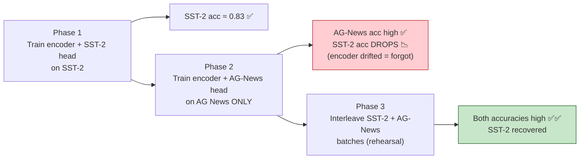

# Section 3 — Catastrophic Forgetting (Slides 22–31)

> **Why this matters:** You fine-tune a model to be great at your task — and it silently
> gets *worse at everything else*. This is the single most common way a fine-tune "succeeds"
> on paper while being useless in production. This section covers *why* it happens and a
> **stack of six mitigations** with a decision table for choosing among them.

---

## 3.1 What is catastrophic forgetting? (Slide 23)

When a pretrained LLM is fine-tuned on a narrow task, gradient updates **overwrite the
weights that encode its broad, general-purpose knowledge.** The model gets better at the
new task — and *quietly worse at almost everything else.*

- **Skill regression:** reasoning, coding, multilinguality, and instruction-following all
  degrade after domain fine-tuning.
- **Silent failure:** task metrics *improve* while general benchmarks *collapse* — invisible
  unless you measure both.
- **Worst in full fine-tuning:** updating *all* weights at a *high* LR on *narrow* data
  erases prior knowledge fastest.

**The canonical picture:**
```
Base LLM (math, code, French, facts, instructions)
        │  full fine-tune on medical Q&A only
        ▼
Specialist LLM: great at medical Q&A … but forgot how to
   write Python · follow instructions · speak French · do arithmetic
```

> 💡 **Learning Thought:** The defining feature is that it's **silent.** Your eval dashboard
> lights up green on the target task while three other capabilities quietly die. The only
> defense is to *measure the things you're not training on.*

---

## 3.2 Why fine-tuning erases knowledge (Slide 24)

Four mechanisms:

1. **Shared, distributed weights.** Knowledge is *superimposed* across the same parameters —
   there's no "French neuron" to leave alone; touching a weight for the new task perturbs
   everything else stored there too.
2. **Narrow gradient signal.** Fine-tuning data covers a *tiny slice* of the pretraining
   distribution, so gradients only ever "care about" that slice.
3. **Weight drift from the initial model.** The further parameters move from the pretrained
   optimum, the more the *prior-task loss* rises.
4. **No replay, no anchor.** Vanilla AdamW has no memory of old tasks. Unless you re-expose
   old data or penalize drift, nothing protects prior knowledge.

> 💡 **Learning Thought:** These four mechanisms map one-to-one onto the four *classes* of
> mitigation. Narrow gradient → **rehearsal** (re-add old data). Weight drift → **regularize
> toward init** or **conservative HPs**. No anchor → **freeze layers** (hard anchor). Lost
> directions → **weight averaging** (recover after the fact). Learn the *cause*, and the fix
> is obvious.

---

## 3.3 Measure it first: benchmarks before vs. after (Slide 25)

You cannot manage what you don't measure. Illustrative run: a **7B model fully fine-tuned
for 3 epochs on legal contracts** — target-task accuracy jumps while general benchmarks
fall. **Always run a fixed general eval suite before and after every fine-tune.**

> 💡 **Learning Thought:** Build a small, *fixed* "canary" eval suite (a few hundred items
> spanning reasoning, code, instruction-following, maybe multilingual) and run it at every
> checkpoint. It's your smoke detector for forgetting. This is also what you'll early-stop on
> (§3.6), not training loss.

---

## 🧪 See it happen — and reverse it — in Demo 3 (`Catastrophic-Forgetting`)

This is the demo that makes the whole section concrete. It uses **one shared DistilBERT
encoder** with **two task heads** (sentiment = SST-2, topic = AG News), and runs three
phases. Because both heads share the encoder, training the second task *drags the encoder's
weights away* from where task 1 needed them — that drift **is** the forgetting.



**The shared-encoder / two-heads model** — one body, two task-specific outputs:

```python
class MultiHeadModel(nn.Module):
    def __init__(self, model_name, n_classes_a=2, n_classes_b=4):
        super().__init__()
        self.encoder = AutoModel.from_pretrained(model_name)   # SHARED — this is what drifts
        hidden = self.encoder.config.hidden_size
        self.head_sst2   = nn.Linear(hidden, n_classes_a)      # sentiment head
        self.head_agnews = nn.Linear(hidden, n_classes_b)      # topic head

    def encode(self, input_ids, attention_mask):
        out = self.encoder(input_ids=input_ids, attention_mask=attention_mask)
        return out.last_hidden_state[:, 0]                     # [CLS] representation
```

**Phase 2 is where forgetting is measured** — train AG News only, then check *both* tasks:

```python
# Phase 2: fine-tune encoder + AG-News head on AG News only (SST-2 head untouched)
for ep in range(EPOCHS_PER_PHASE):
    train_one_epoch(agnews_train_loader, model.forward_agnews, optimizer_phase2)

acc_agnews = evaluate(agnews_test_loader, model.forward_agnews)
acc_sst2   = evaluate(sst2_test_loader,   model.forward_sst2)
print(f"AG News acc = {acc_agnews:.3f}")
print(f"SST-2   acc = {acc_sst2:.3f}   <- DROPPED: encoder drifted away from task 1")
```

**Phase 3 is the fix (rehearsal / §3.4)** — interleave both tasks so the encoder must stay
good at both. The loss is simply the *sum* of both tasks' losses per step:

```python
def train_one_epoch_replay(sst2_loader, agnews_loader, optimizer):
    model.train()
    for sst2_batch, agnews_batch in zip(sst2_loader, agnews_loader):
        # ... move both batches to DEVICE ...
        optimizer.zero_grad()
        sst2_logits   = model.forward_sst2(s_ids, s_mask)
        agnews_logits = model.forward_agnews(a_ids, a_mask)
        loss = loss_fn(sst2_logits, s_labels) + loss_fn(agnews_logits, a_labels)  # ← defend BOTH
        loss.backward()
        optimizer.step()
```

> 💡 **Learning Thought:** DistilBERT here is a *stand-in* for a big LLM's shared weights.
> The lesson scales exactly: fine-tuning task B on shared parameters silently degrades task
> A, and **mixing task-A data back in (rehearsal) repairs it** — no architecture change, just
> the data the gradient sees. The output bar chart (SST-2 vs AG-News accuracy across the three
> phases) is the picture worth memorizing.

---

## The six mitigations

Think of these as a *stack* — you'll often use several together. Presented cheapest-first.

### 3.4 Mitigation 1 — Rehearsal / data mixing (Slide 26)

**Blend a slice of general-purpose data into every batch** so gradients keep defending old
skills. Attacks the *narrow gradient* cause directly.

- **How:** interleave **1–10%** general instruction/pretraining-style data with domain data.
  The optimizer can no longer trade away general ability for task gains "for free."
- **What to replay:** diverse instruction data, code, math, multilingual samples — whatever
  distribution you most fear losing.
- **Cost:** slightly slower target-task convergence; requires access to (or a proxy of)
  general data.

```python
from datasets import load_dataset, interleave_datasets
domain  = load_dataset("my_org/legal_contracts")["train"]
general = load_dataset("teknium/OpenHermes-2.5")["train"]
# 95% domain, 5% general replay in every batch
train_ds = interleave_datasets(
    [domain, general],
    probabilities=[0.95, 0.05],
    seed=42, stopping_strategy="all_exhausted")
```

### 3.5 Mitigation 2 — Regularize toward the pretrained weights (Slide 27)

**Add a penalty for drifting from initialization.** Attacks the *weight drift* cause.

- **[L2-SP](https://arxiv.org/abs/1802.01483):** penalize `‖θ − θ₀‖²` — pull *every* weight
  back toward its pretrained value. Simple, one hyperparameter (λ).
- **[EWC (Elastic Weight Consolidation)](https://arxiv.org/abs/1612.00796):** weight the
  penalty by **Fisher information `Fᵢ`**,
  so parameters *important to old tasks* are held tighter than unimportant ones.
- **Trade-off:** λ too high → underfits the new task; too low → forgets. Tune λ against your
  canary evals.

```python
theta0 = {n: p.detach().clone() for n, p in model.named_parameters()}  # snapshot init

def loss_fn(batch, lam=0.01):
    task_loss = model(**batch).loss
    reg = 0.0
    for n, p in model.named_parameters():
        reg += ((p - theta0[n])**2).sum()          # L2-SP: uniform pull to init
        # EWC: reg += (F[n]*(p - theta0[n])**2).sum()  # weight by importance
    return task_loss + lam * reg
```

> 💡 **Learning Thought:** L2-SP treats all weights as equally precious; **EWC is smarter** —
> it uses the Fisher information as a proxy for "how much did this weight matter to the old
> tasks?" and clamps the important ones harder. The cost is you must *estimate Fisher* on old
> data, which needs a pass over (a proxy of) the pretraining distribution.

### 3.6 Mitigation 3 — Conservative hyperparameters (Slide 28)

**The cheapest mitigation: make the update small.** Most forgetting horror stories are just
aggressive schedules. This is the *always-on baseline.*

- **Learning rate:** fine-tune at **1e-5–2e-5** (full FT), not pretraining-scale rates.
  *LR is the single biggest lever on drift.*
- **Duration:** **1–2 epochs** is usually enough; loss keeps falling long after
  generalization stops improving — *train less than feels safe.*
- **Schedule:** warmup + cosine decay; **early-stop on canary evals, not on training loss.**

```python
args = TrainingArguments(
    learning_rate=1e-5,          # not 1e-4
    num_train_epochs=1,          # not 5
    warmup_ratio=0.03,
    lr_scheduler_type="cosine",
    per_device_train_batch_size=8,
    gradient_accumulation_steps=4,
    eval_strategy="steps",       # run the canary suite
    eval_steps=200,
    load_best_model_at_end=True,
)
```

### 3.7 Mitigation 4 — Weight averaging ([WiSE-FT](https://arxiv.org/abs/2109.01903) / merging) (Slide 29)

**Fine-tune freely, then interpolate the result back toward the original weights** — recover
generality *after the fact.* Attacks *lost directions.*

- **Why it works:** the fine-tuned and base models sit in a *connected low-loss region*, so
  interpolating keeps most of *both* behaviors.
- **Choosing α:** sweep **α ∈ {0.3 … 0.9}** and pick the knee on the target-vs-general
  trade-off curve. No retraining per point — just re-mix and re-evaluate.

```python
alpha = 0.6   # 0 = base model, 1 = fine-tuned
with torch.no_grad():
    for name, p in merged.named_parameters():
        p.copy_((1 - alpha) * base[name] + alpha * ft[name])
```

> 💡 **Learning Thought:** This is astonishing when you first meet it — you can *average the
> weights of two different models element-wise* and get something that works. It only holds
> because both models live in the same low-loss basin (they share an ancestor). It's the
> cheapest possible "undo" dial for forgetting, applied post-hoc with zero retraining.

### 3.8 Mitigation 5 — Freeze layers, tune selectively (Slide 30)

**Restrict which parts of the network can change** — protect where general knowledge
concentrates. A *hard anchor.*

- **How:** freeze embeddings and lower blocks (broad linguistic/world knowledge); tune only
  the **top N blocks** or specific modules closest to the task.
- **Rules of thumb:** tuning the **top 25–50% of blocks** captures most task gains; freezing
  the embeddings and LM head is a cheap stability win.

```python
N_LAYERS = model.config.num_hidden_layers   # e.g., 32
TUNE_TOP = 8                                 # tune only blocks 24–31
for p in model.parameters():
    p.requires_grad = False                  # freeze all
for block in model.model.layers[-TUNE_TOP:]:
    for p in block.parameters():
        p.requires_grad = True               # unfreeze the top blocks
# ~25% of weights trainable; embeddings + lower blocks (and their knowledge) untouched
```

> 💡 **Learning Thought:** This encodes a real fact about transformers: **lower layers learn
> general/syntactic features, upper layers learn task-specific/semantic ones.** Freezing the
> bottom protects the general substrate. It also cuts memory (fewer gradients/optimizer
> states) — a two-for-one with PEFT-style efficiency.

> 🧪 **From Demo 1 (`LW-BW-P-FT-and-LRs`).** Demo 1 implements *three* freezing schedules as
> plain `requires_grad` toggles, switched per-epoch by a `TrainerCallback`. Here's the
> **block-wise** strategy verbatim — freeze everything, then unfreeze exactly one "block" per
> phase (heads → transformer → embeddings):
>
> ```python
> def set_block_wise_freezing(model, epoch):
>     for p in model.parameters():
>         p.requires_grad = False                       # freeze EVERYTHING first
>     if epoch == 0:
>         for p in model.heads.parameters():            # only the task heads
>             p.requires_grad = True
>     elif epoch in [1, 2]:
>         for p in model.encoder.transformer.parameters():   # only the transformer body
>             p.requires_grad = True
>     else:
>         for p in model.encoder.embeddings.parameters():    # only the embeddings
>             p.requires_grad = True
> ```
>
> A HF `TrainerCallback` calls this at the start of each epoch, so the *trainable set*
> changes as training proceeds:
>
> ```python
> class FreezingScheduleCallback(TrainerCallback):
>     def on_epoch_begin(self, args, state, control, model=None, **kwargs):
>         set_block_wise_freezing(model, int(state.epoch))   # re-apply the freeze plan each epoch
> ```
>
> The demo also implements **layer-wise** (unfreeze one *pair* of layers at a time) and
> **progressive** (keep accumulating unfrozen layers until the whole model thaws) — three
> flavours of the same idea in §3.8.

### 3.9 Choosing your mitigation stack (Slide 31)

The decision table — memorize this:

| Strategy | Attacks (cause) | Extra cost | When to reach for it |
|----------|-----------------|-----------|----------------------|
| **Conservative hyperparameters** | Weight drift | None | **Always** — the default baseline |
| **Rehearsal / data mixing** | Narrow gradients | Data curation | You have (proxy) general data |
| **L2-SP / EWC** | Weight drift | Memory for θ₀ (+ Fisher) | Full FT required, no general data available |
| **Weight averaging (WiSE-FT)** | Lost directions | One merge pass | Model already fine-tuned & degraded |
| **Layer freezing** | Update size | None | Tight compute or very small datasets |

> 💡 **Learning Thought:** Start with **conservative HPs** (free, always). Add **rehearsal**
> if you can get general data. Reach for **freezing** when compute/data is tight. Use
> **L2-SP/EWC** only when you *must* do full FT with no general data. Keep **WiSE-FT** in your
> back pocket for rescuing an already-damaged model. They compose.

---

## 🎯 Interview Questions

**Q1. What is catastrophic forgetting and why is it dangerous?**
> When fine-tuning on a narrow task overwrites shared weights encoding general knowledge, so
> the model improves on-task but regresses on reasoning, code, instruction-following, etc.
> It's dangerous because it's *silent* — target metrics rise while general benchmarks fall,
> invisible unless you explicitly measure both.

**Q2. Mechanistically, why does it happen?**
> Knowledge is stored *distributed* across shared parameters (no isolated "skill neurons"),
> the fine-tuning gradient reflects only a narrow slice of the original distribution, weights
> *drift* from the pretrained optimum (raising prior-task loss), and vanilla AdamW has no
> memory or anchor to old tasks.

**Q3. Which fine-tuning setups forget the most?**
> Full fine-tuning, at a high learning rate, for many epochs, on narrow data. All four
> maximize weight drift away from the pretrained optimum.

**Q4. Contrast rehearsal, regularization, and layer-freezing.**
> **Rehearsal** re-adds 1–10% general data so gradients keep defending old skills (needs old
> data). **Regularization** (L2-SP/EWC) penalizes drift from init, EWC weighting by parameter
> importance (needs θ₀, and Fisher for EWC). **Freezing** simply forbids the lower/embedding
> layers from changing at all (free, protects the general substrate).

**Q5. How does EWC differ from plain L2-SP?**
> L2-SP penalizes drift *uniformly* across all weights. EWC scales each weight's penalty by
> its Fisher information — an estimate of how important that weight was to prior tasks — so
> important weights are held much tighter. EWC needs a Fisher estimate computed on old-task
> data.

**Q6. Explain WiSE-FT / weight averaging. Why does averaging two models even work?**
> Fine-tune freely, then linearly interpolate `(1−α)·base + α·finetuned`. It works because
> base and fine-tuned models sit in the same connected low-loss basin (shared ancestry), so
> the interpolant retains much of both behaviors. Sweep α and pick the knee on the
> target-vs-general trade-off. It recovers generality post-hoc with no retraining.

**Q7. How would you *detect* forgetting during a run?**
> Maintain a fixed general "canary" eval suite (reasoning, code, instruction-following,
> multilingual) and run it before training and at every checkpoint. Watch for general scores
> dropping while target scores rise, and early-stop on the canary suite rather than training
> loss.

**Q8. (Senior) You must full-fine-tune a 7B model on proprietary data you can't mix with
public data, and it's forgetting. What's your plan?**
> No rehearsal possible → lean on **conservative HPs** (LR 1e-5, ≤2 epochs, cosine+warmup),
> **freeze embeddings + lower blocks** to shrink drift, add **L2-SP/EWC** regularization
> toward init since general data isn't available, monitor a canary suite, and if it still
> degrades, **WiSE-FT merge** the result back toward base and sweep α for the best trade-off.

---

## One-line takeaway

**Fine-tuning overwrites shared, distributed knowledge as weights drift from the pretrained
optimum — so *measure a fixed general eval before and after*, keep updates small by default,
and layer on rehearsal, regularization, freezing, or weight-averaging as the situation
demands.**

---

## 🔗 Further reading

- **The original phenomenon:** McCloskey & Cohen (1989), *"Catastrophic Interference in
  Connectionist Networks"* — where the term was coined. Modern LLM evidence:
  [An Empirical Study of Catastrophic Forgetting in LLMs during Continual Fine-tuning](https://arxiv.org/abs/2308.08747).
- **Regularization mitigations:** [EWC (Kirkpatrick et al., PNAS 2017)](https://arxiv.org/abs/1612.00796)
  — the Fisher-weighted penalty in §3.5; [L2-SP (Li et al., 2018)](https://arxiv.org/abs/1802.01483).
- **Weight averaging:** [WiSE-FT (Wortsman et al., 2022)](https://arxiv.org/abs/2109.01903)
  and [Model Soups](https://arxiv.org/abs/2203.05482) — the "average two models' weights and
  it just works" result from §3.7. Background: [Linear Mode Connectivity](https://arxiv.org/abs/1912.05671).
- **Rehearsal / continual learning survey:** [A Continual Learning Survey (De Lange et al.)](https://arxiv.org/abs/1909.08383)
  puts rehearsal, regularization, and architectural methods in one taxonomy.
- **The cheaper alternative that sidesteps most forgetting:** [LoRA (Hu et al., 2021)](https://arxiv.org/abs/2106.09685)
  and the [HF PEFT library](https://huggingface.co/docs/peft) — freezing the base weights
  entirely and training tiny adapters is §3.8 taken to its logical extreme.
- **Hands-on:** [Mergekit](https://github.com/arcee-ai/mergekit) implements WiSE-FT-style
  interpolation and many other merge recipes you can run today.
