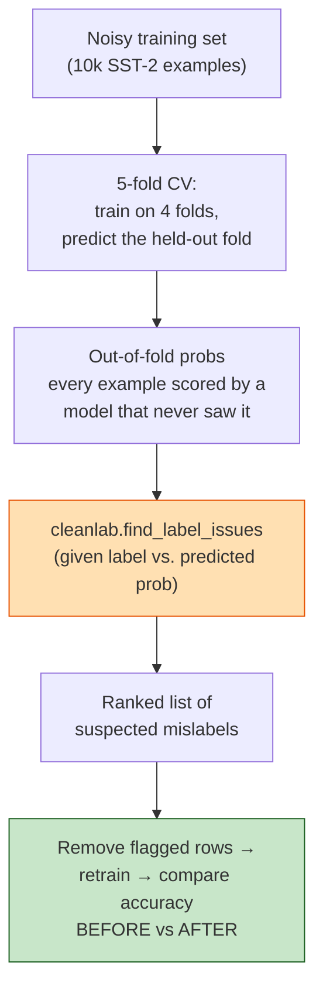

# Section 6 — Preparing the Data (Slides 54–66)

> **Why this matters:** Every earlier section optimized *how* you step downhill. This section
> asks whether the hill points anywhere worth going. *"Garbage in, garbage out"* is not a
> cliché in fine-tuning — it's the dominant failure mode. The lecture frames **five data
> challenges that quietly break models.** "Quietly" is the operative word: none of these throw
> an error; they just make your model worse in ways your training loss won't reveal.

---

## 6.0 The five challenges (Slide 55)

1. **Data Quality Issues** — noisy data, incorrect labels, duplicates, inconsistent
   formatting, outdated information.
2. **Insufficient Training Data** — small datasets, limited edge-case coverage, lack of diversity.
3. **Imbalanced Datasets** — skewed class distributions and the accuracy paradox.
4. **Data Splitting** — train/validation/test design and avoiding leakage.
5. **Domain & Distribution Shift** — when production data stops looking like training data.

---

## 6.1 Challenge 1 — Data Quality (Slides 56–60)

Five sub-problems, each a way "quality" fails:

### (a) Noisy data (Slide 56)
Low-quality or corrupted text — *raw Common Crawl is mostly not clean prose.*
- **Boilerplate & artifacts** — menus, cookie banners, ads, broken HTML surviving extraction.
- **SEO spam & machine text** — keyword-stuffed pages, content farms at massive scale.
- **OCR errors** — scanned books with character-level garbage, broken hyphenation.
- **Gibberish & lists** — code fragments, lorem ipsum, word salads.
- **AI-generated slop** — the web increasingly contains LLM output, risking *degenerative
  feedback loops* (models trained on model output).

### (b) Incorrect "labels" (Slide 57)
For LLMs the "label" is the *next token* — so wrong *content* is a wrong label.
- **Wrong content as truth** — misinformation, conspiracy sites, confidently-wrong answers.
- **Buggy code** — incorrect snippets teach broken patterns.
- **Language-ID errors** — low-resource "languages" that are mostly wrong-language text.
- **Mislabeled quality scores** — noisy classifiers silently deciding what enters the corpus.

### (c) Duplicate samples (Slide 58)
Web crawls are massively redundant; duplication *wastes compute, amplifies memorization,
contaminates evals.*
- **Crawl redundancy** — the same article mirrored and re-crawled thousands of times.
- **Verbatim memorization** — duplicated passages are far more likely to be regurgitated
  word-for-word — a *privacy and copyright* risk.
- **Templated near-duplicates** — product/license pages differing by a few tokens.
- **Benchmark contamination** — test sets (MMLU, GSM8K, HumanEval) in the crawl inflate scores.

### (d) Inconsistent formatting (Slide 59)
Same content arrives as HTML, Markdown, LaTeX, PDF text, plain text.
- **Lost structure** — tables/math/code flattened into unreadable text.
- **Encoding chaos** — mixed Unicode forms, control characters.
- **Whitespace & line breaks** — PDF extraction splitting sentences mid-line.
- **Math & code variance** — same equation as LaTeX/MathML/Unicode; mixed indentation.
- **Tokenizer interactions** — inconsistent digit grouping/punctuation inflate token counts and
  *hurt arithmetic.*

### (e) Outdated information (Slide 60)
- **Training cutoff** — names a former officeholder as current; misses recent events.
- **Deprecated APIs** — code using functions that no longer exist.
- **Stale web pages** — old prices, policies, superseded science.
- **Conflicting snapshots** — many crawl versions teach contradictory "facts" over time.

> 💡 **Learning Thought:** For an LLM the training signal *is* the text, so **every quality
> defect is silently teaching the model something wrong.** Duplicates are the most
> underestimated: they don't just waste compute — they cause *memorization* (privacy/copyright
> leakage) and *benchmark contamination* (your eval scores become fiction). Dedup and
> decontamination are not optional hygiene; they protect the *validity of your evaluation.*
> **This is exactly what Demo 2 (`sst2-with-cleanlab`) demonstrates — using confident learning
> to auto-surface mislabeled examples.**

---

## 🧪 Auto-finding mislabeled data in Demo 2 (`sst2-with-cleanlab`)

Demo 2 tackles §6.1(b) — *incorrect labels* — with **[Confident Learning](https://arxiv.org/abs/1911.00068)**
via the [cleanlab](https://docs.cleanlab.ai/) library. The key insight: to judge whether an
example's label is wrong, you need the model's prediction on that example **from a model that
never trained on it** — otherwise the model has just memorized the (possibly wrong) label.
K-fold cross-validation gives exactly that: *out-of-fold* predictions.



**Step 1 — get honest (out-of-fold) probabilities** with `StratifiedKFold`. A *fresh* model
per fold guarantees no fold leaks into another (note the §6.4 leakage discipline in action):

```python
from sklearn.model_selection import StratifiedKFold
from scipy.special import softmax

skf = StratifiedKFold(n_splits=5, shuffle=True, random_state=42)
out_of_fold_probs = np.zeros((len(train_ds), 2))

for fit_idx, holdout_idx in skf.split(all_indices, train_labels):
    model = BertForSequenceClassification.from_pretrained(MODEL_NAME, num_labels=2)  # fresh each fold
    trainer = Trainer(model=model, args=fold_args, train_dataset=train_ds.select(fit_idx))
    trainer.train()
    # predict ONLY the held-out fold — the model never trained on these rows
    logits = trainer.predict(train_ds.select(holdout_idx)).predictions
    out_of_fold_probs[holdout_idx] = softmax(logits, axis=1)
```

**Step 2 — let cleanlab rank the suspects** from those out-of-fold probabilities:

```python
from cleanlab.filter import find_label_issues

issue_indices = find_label_issues(
    labels=np.array(train_ds["label"]),
    pred_probs=out_of_fold_probs,
    return_indices_ranked_by="self_confidence",   # most-likely-wrong first
)
print("Suspected label issues:", len(issue_indices))
for idx in issue_indices[:10]:
    print(f"given={labels[idx]} | probs={out_of_fold_probs[idx]} | {dataset['train'][int(idx)]['sentence']}")
```

**Step 3 — prove it helped**: remove the flagged rows, retrain, and compare on a clean
validation set (the demo's before/after A/B):

```python
clean_idx     = np.where(~label_issue_mask)[0].tolist()   # keep everything NOT flagged
train_ds_clean = train_ds.select(clean_idx)
# train_and_eval(train_ds, ...)        → "BEFORE cleanlab"
# train_and_eval(train_ds_clean, ...)  → "AFTER cleanlab"   ← usually higher val accuracy
```

> 💡 **Learning Thought:** Two transferable ideas here. **(1)** "Confidence" only means
> something on data the model *didn't* train on — hence out-of-fold predictions; using
> in-sample predictions would just rediscover the noisy labels. **(2)** The demo's own
> recommendation is wise: don't blindly delete *every* flagged row — remove only the
> top-ranked ones and re-check, because the detector has false positives too. Cleaning labels
> is a *scalpel, not a bulldozer.*

---

## 6.2 Challenge 2 — Insufficient Data (Slides 61–63)

Three distinct sub-failures:

### (a) Small datasets (Slide 61)
Too few labeled samples to estimate parameters reliably → *high variance, easy overfitting.*
Examples: rare-disease studies (~200 scans), low-resource NLP, brand-new products, costly
expert labels (radiology, legal).
**Mitigations:**
- **Transfer learning** — fine-tune a pretrained model. *The dominant, most effective strategy
  today* (this whole lecture!).
- **Data augmentation** — rotations/crops (images); back-translation, paraphrasing (text).
- **Synthetic data** — simulation or generative models (*validate carefully*).
- **Right-sized models** — simpler models + strong regularization; cross-validation over a
  single split.
- **Few-shot / zero-shot** — foundation models handle small-data tasks via prompting.

### (b) Limited edge-case coverage (Slide 62)
The *long tail* of rare-but-important scenarios is missing — the model *fails exactly where
failure matters most.* Examples: autonomous driving in snow/glare; novel fraud patterns;
adversarial chatbot queries; 1-in-100k manufacturing defects.
**Mitigations:**
- **Targeted collection** — actively source data for known gaps, don't just sample more of the same.
- **Simulation** — synthetic generation of rare scenarios (standard in AV programs).
- **Active learning** — mine production traffic for *high-uncertainty* samples, label those first.

### (c) Lack of diversity (Slide 63)
Data over-represents a narrow slice of the population → works for some groups, poorly for others.
Examples: speech recognition on non-native accents; clinical models across demographics; vision
models trained on Western imagery.
**Mitigations:**
- **Stratified sourcing** — explicit coverage targets across demographics/devices/conditions.
- **Disaggregated evaluation** — report metrics *per subgroup*, not one global average.
- **Bias audits** — independent pre-release audits; document in datasheets / model cards.
- **Diverse annotation teams** — reduce culturally one-sided labels.

> 💡 **Learning Thought:** "Small," "edge-case," and "diversity" are *three different axes* of
> insufficiency. You can have a *huge* dataset that's still catastrophically insufficient because
> it lacks edge cases or diversity. Volume ≠ coverage. The fix for each is different: transfer
> learning for *small*, targeted/active collection for *edge cases*, stratified sourcing for
> *diversity.*

---

## 6.3 Challenge 3 — Imbalanced Datasets (Slide 64)

One class vastly outnumbers others → a model can *look accurate while never detecting the class
you care about.*

**The accuracy paradox — the canonical example (credit-card fraud):** predicting "never fraud"
scores **99.8% accuracy and catches zero fraud.** Similar skews: disease screening (~1:1000),
defect detection, churn.

**Mitigations:**
- **Right metrics** — precision, recall, F1, PR-AUC. *Never plain accuracy on skewed data.*
- **Resampling** — oversample minority ([SMOTE](https://arxiv.org/abs/1106.1813) and variants)
  or undersample majority.
- **Cost-sensitive learning** — class weights or **[focal loss](https://arxiv.org/abs/1708.02002)**
  make minority errors expensive.

> 💡 **Learning Thought:** The accuracy paradox is *the* classic interview trap. The instant you
> hear "imbalanced," your metric must change — accuracy is actively misleading. Reach for
> **PR-AUC / F1** and think about the *cost* of each error type, not the raw count.

---

## 6.4 Challenge 4 — Data Splitting & Leakage (Slide 65)

**How you split decides whether your reported performance is an honest estimate of real-world
performance.**

**Standard split:** Train **70%** (fit parameters) · Validation **15%** (tune hyperparameters)
· Test **15%** (*touch once, at the end*).

**Common pitfalls (leakage):**
- **Preprocessing before splitting** — scaling/imputing on the full dataset leaks test
  statistics into training.
- **Duplicates across splits** — near-identical samples in train and test inflate scores.
- **Random splits of time series** — the model "sees the future"; collapses in production.
- **Grouped data split randomly** — same patient/user/device in both train and test.

**Best practices:**
- **Split first, fit transforms on train only**, then apply to val/test.
- **Stratify** — preserve class proportions in every split (vital when imbalanced).
- **Time-based splits** — train on the past, test on the future for temporal data.
- **Group-aware splits** — keep each patient/user entirely in one split.
- **k-fold cross-validation** — for small data; hold the test set sacred, use it once.

> 💡 **Learning Thought — the golden rule:** **Split FIRST, then fit everything (scalers,
> imputers, tokenizers-stats, dedup) on the training split only.** Every leakage bug is a
> variant of "information from val/test snuck into training." Leakage makes your offline numbers
> *look great and mean nothing* — the model collapses in production. The test set is *sacred:*
> touch it once.

---

## 6.5 Challenge 5 — Domain & Distribution Shift (Slide 66)

The model is trained on scraped documents but deployed on *live conversations, tools, and a
moving world.* Three kinds of shift:

- **Usage shift** (documents → dialogue) — web pages at training time; instructions, chats,
  agent loops at deployment.
- **Temporal shift** (the world moves on) — new events, APIs, even LLM-influenced writing styles
  after the cutoff.
- **Domain shift** (general → specialist) — web-trained models deployed on clinical notes,
  contracts, or proprietary code.

**Real-world examples:**
- **Base vs. chat** — a raw pretrained model *continues* your text instead of answering — *the
  training task isn't the deployment task.*
- **Code drift** — assistants suggest APIs from old library versions common in the crawl.
- **Enterprise gap** — web-trained models underperform on internal jargon/formats/private text.

**Mitigations:**
- **Post-training alignment** — instruction tuning + RLHF bridge the document→dialogue gap *(now
  standard).*
- **Mid-training / annealing** — shift the late-training mixture toward deployment-like data
  (chat, code, math).
- **Continual & domain-adaptive pretraining** — refresh on recent/in-domain corpora *with replay*
  (note the callback to §3 forgetting!).
- **Retrieval & tools** — ground answers in current, in-domain sources at inference (RAG).
- **Monitor in production** — track quality on live traffic; refresh models when drift shows.

> 💡 **Learning Thought:** Distribution shift is the bridge back to the rest of the course. "Base
> vs chat" is *why instruction tuning and RLHF exist.* "Ground in current sources" is *why RAG
> exists.* "Refresh with replay" ties straight back to **rehearsal** in §3. Fine-tuning is
> fundamentally an act of *deliberately shifting* the model's distribution toward deployment —
> so understanding shift is understanding the whole point.

---

## 🎯 Interview Questions

**Q1. Name the five data challenges and give a one-line risk for each.**
> Quality (teaches wrong things), Insufficient data (overfits/misses cases), Imbalance (accuracy
> paradox), Splitting/leakage (dishonest metrics), Distribution shift (train ≠ deploy).

**Q2. Why is deduplication important beyond saving compute?**
> Duplicates amplify *verbatim memorization* (privacy/copyright leakage) and cause *benchmark
> contamination* — if test items (MMLU, GSM8K, HumanEval) appear in training, reported scores are
> inflated and meaningless. Dedup protects both privacy and the validity of evaluation.

**Q3. Explain the accuracy paradox with an example.**
> On heavily imbalanced data, a trivial majority-class predictor scores high accuracy while
> being useless. Fraud at 0.2% prevalence: "never fraud" is 99.8% accurate and catches zero
> fraud. Use precision/recall/F1/PR-AUC and cost-sensitive methods instead.

**Q4. What is data leakage? Give three concrete forms.**
> Any time information from validation/test influences training, inflating offline metrics.
> Forms: fitting a scaler/imputer on the full dataset before splitting; near-duplicate samples
> spanning train and test; random-splitting time series (peeking at the future); splitting
> grouped data (same patient) across train and test.

**Q5. How do you split time-series or grouped (per-patient) data correctly?**
> Time series: time-based split — train on the past, test on the future. Grouped: group-aware
> split — every record for a given patient/user/device stays entirely within one split. Both
> prevent the model from "seeing" what it won't have at deployment.

**Q6. Distinguish "small dataset," "poor edge-case coverage," and "lack of diversity."**
> Small = too few samples overall (high variance/overfitting) → transfer learning, augmentation.
> Edge cases = the rare-but-critical long tail is missing → targeted/active collection,
> simulation. Diversity = a narrow slice of the population is over-represented → stratified
> sourcing, disaggregated evaluation. A large dataset can still fail the latter two.

**Q7. What is distribution shift, and how does instruction tuning relate to it?**
> When deployment data differs from training data (usage/temporal/domain). "Base vs chat" is a
> usage shift — a base model continues text instead of answering. Instruction tuning + RLHF are
> exactly the post-training that bridges the document→dialogue gap; RAG bridges temporal/domain
> shift by grounding in current sources.

**Q8. (Senior) You have a large web corpus for domain fine-tuning. What's your data pipeline?**
> Extract cleanly (preserve structure), filter noise/boilerplate/spam, run quality
> classification, **deduplicate and decontaminate against benchmarks**, normalize
> encoding/formatting, check for label/content correctness (e.g., cleanlab-style confident
> learning), **split first** with stratification and group/time awareness, verify coverage and
> diversity per subgroup, and mix in general-data replay to guard against forgetting during the
> shift toward the target domain.

---

## One-line takeaway

**Data prep decides the ceiling of your fine-tune: clean and *deduplicate* (memorization +
contamination), ensure enough *coverage and diversity* (not just volume), fix *imbalance* with
the right metrics, *split first* to avoid leakage, and treat fine-tuning itself as a deliberate,
monitored *distribution shift* toward deployment.**

---

## 🔗 Further reading

- **Label errors (Demo 2):** [Confident Learning (Northcutt et al., 2021)](https://arxiv.org/abs/1911.00068),
  the [cleanlab docs](https://docs.cleanlab.ai/), and [labelerrors.com](https://labelerrors.com/)
  — a gallery of mislabels found in *ImageNet, MNIST, SST-2* and other "gold" benchmarks.
- **Deduplication:** [Deduplicating Training Data Makes Language Models Better (Lee et al., 2021)](https://arxiv.org/abs/2107.06499)
  and [Deduplicating Training Data Mitigates Privacy Risks (Kandpal et al., 2022)](https://arxiv.org/abs/2202.06539)
  — the memorization/contamination arguments in §6.1(c).
- **What "cleaning a web corpus" really means:** the [C4 / T5 paper](https://arxiv.org/abs/1910.10683),
  [The Pile](https://arxiv.org/abs/2101.00027), and [Gopher's data appendix](https://arxiv.org/abs/2112.11446).
- **Imbalance:** [Focal Loss](https://arxiv.org/abs/1708.02002) · [SMOTE](https://arxiv.org/abs/1106.1813)
  · [imbalanced-learn library](https://imbalanced-learn.org/) · scikit-learn's
  [precision/recall & PR-AUC guide](https://scikit-learn.org/stable/auto_examples/model_selection/plot_precision_recall.html).
- **Leakage & splitting:** [Leakage in Data Mining (Kaufman et al.)](https://dl.acm.org/doi/10.1145/2382577.2382579)
  and [scikit-learn cross-validation](https://scikit-learn.org/stable/modules/cross_validation.html)
  (see `GroupKFold`, `TimeSeriesSplit`, `StratifiedKFold` for §6.4).
- **Distribution shift → why post-training exists:** [InstructGPT (Ouyang et al., 2022)](https://arxiv.org/abs/2203.02155)
  (the base→chat gap) and the [RAG paper (Lewis et al., 2020)](https://arxiv.org/abs/2005.11401)
  (grounding in current sources) — the callbacks in §6.5.
- **Datasheets & model cards:** [Datasheets for Datasets](https://arxiv.org/abs/1803.09010) and
  [Model Cards](https://arxiv.org/abs/1810.03993) — how to document the coverage/diversity of §6.2.
