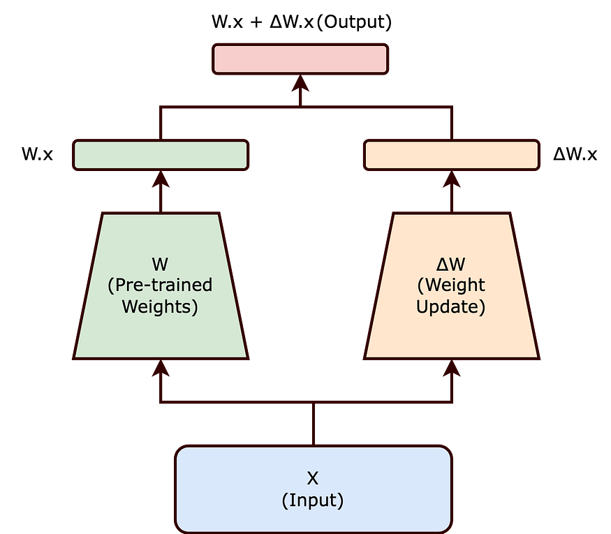
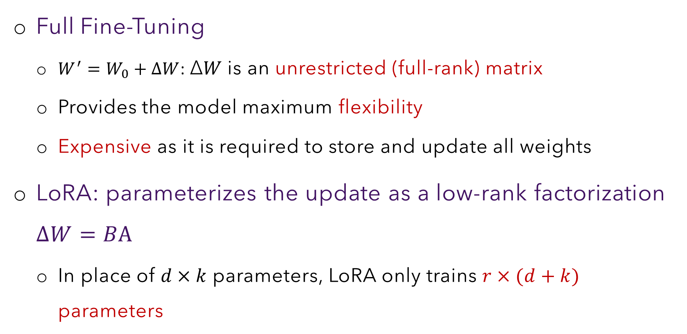

# Section B — Re-Parameterization Theory & LoRA
### Slides 9–17 · The conceptual heart of the session

> **Objective:** understand *why* a low-rank update is sufficient, not just that
> it is cheap. The cheapness is obvious; the sufficiency is the real claim.

---

## B1. Intrinsic dimension (slide 9)

**Definition (slide):** the **intrinsic dimension** is the *minimum number of
dimensions actually needed to find an optimal solution to a learning problem*.

Contrast the two dimensions in play:

| | Meaning |
|---|---|
| **Ambient / nominal dimension** | The number of parameters the model *happens* to have. A 7B model nominally lives in a 7-billion-dimensional space. |
| **Intrinsic dimension** | The *true degrees of freedom* the learning problem requires. |

From the pre-read, the number that should shock you:

> **BERT fine-tuned on MRPC** (paraphrase detection) has an intrinsic dimension
> of roughly **200** — a good solution can be found by optimizing only ~200 free
> parameters, even though BERT has **110 million**.

That's a ratio of about **1 : 550,000**.

### How Li et al. actually measured this

The experiment is worth knowing, because it makes "intrinsic dimension"
concrete rather than mystical. You constrain the model to a **random
d-dimensional subspace** and only let it move within that subspace:

```
θ  =  θ₀  +  P · θ_d
      ──    ─────────
   frozen   random projection matrix P (D×d, fixed, never trained)
   init     times a small trainable vector θ_d  (only d parameters)
```

Then sweep `d` upward and find the smallest `d` at which you reach ~90% of the
full-training performance. **That `d` is the intrinsic dimension.**

```python
import torch, torch.nn as nn

class SubspaceWrapper(nn.Module):
    """Train a model through a random d-dimensional subspace (Li et al. 2018)."""
    def __init__(self, model, d):
        super().__init__()
        self.model = model
        self.theta0 = {n: p.detach().clone() for n, p in model.named_parameters()}
        D = sum(p.numel() for p in model.parameters())
        # P is FIXED random, never trained. theta_d is the ONLY trainable thing.
        self.P       = torch.randn(D, d) / (d ** 0.5)
        self.theta_d = nn.Parameter(torch.zeros(d))
        print(f"ambient D = {D:,}   intrinsic d = {d:,}   ratio = {D/d:,.0f}:1")

    def project(self):
        delta, i = self.P @ self.theta_d, 0
        for n, p in self.model.named_parameters():
            p.data = self.theta0[n] + delta[i:i + p.numel()].view_as(p)
            i += p.numel()

# Sweep d = 10, 50, 100, 200, 500, ... and plot accuracy.
# The knee of that curve IS the intrinsic dimension.
```

### Why models are over-parameterized in the first place

From the lecture:

> *"You do not know whether they are important or not. You are just starting
> with the oversized model. We do not have any idea what the minimal model is
> that can solve the problem optimally. That is why you start with the oversized
> model — and we know there is a smaller model which can solve this problem
> optimally."*

💡 **Learning Thought — this is the single most important idea in the session**
> Over-parameterization is not waste; it is a **search strategy**. You don't
> know the right sub-model in advance, so you train a huge one and let gradient
> descent find a good solution inside it. Intrinsic dimension is the statement
> that the solution it finds *lives on a low-dimensional manifold* inside that
> huge space.
>
> PEFT's entire justification is: if the solution lives on a low-dimensional
> manifold, **parameterize the manifold, not the ambient space**.

**📚 Go deeper**
- [Li et al., *Measuring the Intrinsic Dimension of Objective Landscapes* (2018)](https://arxiv.org/abs/1804.08838) — the foundation; see also the [Uber AI blog post](https://www.uber.com/en-IN/blog/intrinsic-dimension/) with interactive figures
- [Aghajanyan et al., *Intrinsic Dimensionality Explains the Effectiveness of Language Model Fine-Tuning* (2020)](https://arxiv.org/abs/2012.13255) — where the BERT/MRPC ≈ 200 number comes from; the direct bridge to LoRA
- [The Lottery Ticket Hypothesis](https://arxiv.org/abs/1803.03635) — a different but related answer to "why over-parameterize?"

---

## B2. The implication for PEFT (slide 9)

> *"Updating the full parameter matrix is not required. Updating a low-rank
> ('smaller') parameter matrix is sufficient."*

From the pre-read, sharpened:

> If the fine-tuning problem has intrinsic dimension **r**, then **any
> parameterization that spans at least r dimensions in weight space is
> sufficient** to find a near-optimal solution.

This is the licence to compress. Note carefully what it does *not* say: it does
not say some parameters are more important than others. It says the *update*
needs few degrees of freedom, regardless of which parameters carry it.

⚠️ **Trap — from live Q&A** (this confusion came up twice)
> *"How are parameters ranked in low-rank adaptation?"*
>
> **Answer:** They are **not** ranked or sorted. `W₀` is untouched. The update
> `ΔW` is *represented* as `B_r A_r` where r is a chosen rank; gradient descent
> learns the values in `A_r` and `B_r`. "Low rank" means **restricting ΔW to a
> smaller subspace**, not selecting the most important individual parameters.
>
> If you take one thing from this file: **low-rank ≠ pruning ≠ importance
> selection**.

⚠️ **Trap — from live Q&A**
> *"What do we mean by a change in weights? Does it mean a decrease in the
> number of parameters?"*
>
> **Answer:** No. A change in weights means changing the **numerical values** of
> existing parameters so the model performs better on the target task. The
> parameter count is unchanged.

---

## B3. Core idea #1 — the bottleneck network (slides 10, 11)

**The live poll from the lecture.** Two networks, both mapping 1000-dim input
to 1000-dim output:

```
Network A:                       Network B:
  1000 ──────────────► 1000        1000 ──► 100 ──► 1000
      one 1000×1000 matrix           1000×100  then  100×1000
```

**Which has more parameters?**

```
Network A:  1000 × 1000                  = 1,000,000
Network B:  1000 × 100  +  100 × 1000    =   200,000
```

**Network A** — by 5×. B does "the same thing" (1000-dim → 1000-dim) with 20% of
the parameters.

### Verify it, and see what you gave up

```python
import torch, torch.nn as nn

A_net = nn.Linear(1000, 1000, bias=False)
B_net = nn.Sequential(nn.Linear(1000, 100, bias=False),
                      nn.Linear(100, 1000, bias=False))

print(sum(p.numel() for p in A_net.parameters()))   # 1,000,000
print(sum(p.numel() for p in B_net.parameters()))   #   200,000  -> 5x fewer

# But parameter count is only half the story. What about EXPRESSIVENESS?
W_A = A_net.weight
W_B = B_net[1].weight @ B_net[0].weight             # the effective 1000x1000 matrix

print(torch.linalg.matrix_rank(W_A).item())         # 1000  -- full rank
print(torch.linalg.matrix_rank(W_B).item())         #  100  -- capped by the bottleneck
```

💡 **Learning Thought — what the bottleneck actually costs you**
> B is not free. A 1000×1000 matrix can have rank up to 1000; B's product can
> have rank **at most 100**. You bought a 5× parameter saving by giving up
> 900 of the 1000 available directions.
>
> The whole LoRA bet is that for a *fine-tuning update* (not for the weights
> themselves), those 900 directions were never being used anyway.

**Generalize it.** For a d×k matrix with bottleneck r:

```
Full:        d × k          parameters
Bottleneck:  r × (d + k)    parameters

Saving whenever:   r(d+k) < dk    ⟺    r < dk/(d+k)
For d = k:         r < d/2
```

So for a square matrix, *any rank below half the dimension* is a win — and in
practice we use r ≈ 8–64 against d ≈ 4096, which is r < d/64.

---

## B4. Core idea #2 — apply the bottleneck to ΔW, not to W (slides 10–12)

This is the step people miss. Rewrite fine-tuning as:

```
W′  =  W₀  +  ΔW

W′  = updated (post-fine-tuning) parameter matrix
W₀  = pre-trained parameter matrix          ← FROZEN
ΔW  = the fine-tuning update                ← what we actually learn
```

LoRA does **not** bottleneck `W₀`. `W₀` stays full-rank and frozen. LoRA
bottlenecks **ΔW**.

**Slide 12 — the two-path picture.** The input `x` flows through *both* the
frozen weights and the update, and the two outputs are summed:



### The LoRA hypothesis (slide 12)

Two sentences, and they are the paper's entire claim:

1. *"The learned over-parametrized models reside on a low intrinsic dimension."*
2. *"Change in weights during model adaptation also has a low 'intrinsic rank'."*

Statement 1 is Li et al. 2018. Statement 2 is Hu et al.'s **extension** of it —
and it is a strictly stronger, separate claim that they validated empirically.

### See it for yourself — is ΔW really low-rank?

This experiment takes 30 seconds and is the most convincing thing in this file.
Take any base model and its fine-tuned counterpart, subtract, and look at the
singular value spectrum of the difference:

```python
import torch
from transformers import AutoModelForCausalLM

base = AutoModelForCausalLM.from_pretrained("EleutherAI/pythia-410m")
tuned = AutoModelForCausalLM.from_pretrained("your-org/pythia-410m-finetuned")

layer = "gpt_neox.layers.5.attention.query_key_value.weight"
W0 = dict(base.named_parameters())[layer].detach().float()
W1 = dict(tuned.named_parameters())[layer].detach().float()

dW = W1 - W0                                    # THE UPDATE
S_dW = torch.linalg.svdvals(dW)
S_W0 = torch.linalg.svdvals(W0)

def energy_rank(S, frac=0.90):
    """How many singular values to capture `frac` of the total energy?"""
    c = torch.cumsum(S**2, 0) / (S**2).sum()
    return int((c < frac).sum()) + 1

print(f"W0 shape          : {tuple(W0.shape)}")
print(f"rank for 90% of W0: {energy_rank(S_W0)}")   # LARGE - close to full rank
print(f"rank for 90% of dW: {energy_rank(S_dW)}")   # SMALL - this is the LoRA claim
```

The expected result — and the empirical content of the whole paper — is that
`dW` needs an order of magnitude fewer directions than `W0` does.

💡 **Learning Thought — why ΔW is *more* compressible than W**
> `W₀` encodes everything the model learned from a trillion tokens of the
> internet: syntax, facts, reasoning patterns, dozens of languages. That is
> genuinely high-rank information.
>
> `ΔW` encodes *"also, answer in SQL"* or *"also, use compliance-hedged
> phrasing."* That is a narrow behavioural shift. There is no reason for it to
> need thousands of independent directions — and empirically it doesn't.
>
> **The compressibility lives in the delta, not in the model.** State this in an
> interview and you will sound like you read the paper.

---

## B5–B6. The mathematics (slides 13, 14)

### Standard parameter update

```
W′ = W₀ + ΔW        where  W₀, ΔW, W′ ∈ ℝ^(d×k)
```

Note the lecture generalizes to non-square: input dim **d**, output dim **k**,
with k >, <, or = d. The square matrices on the slides are illustration only.

⚠️ **Trap — from live Q&A**
> *"Why are we assuming a square matrix for pretrained weights?"*
>
> **Answer:** We aren't. In general `W₀ ∈ ℝ^(d_out × d_in)`,
> `B_r ∈ ℝ^(d_out × r)`, `A_r ∈ ℝ^(r × d_in)`. Square is used in slides only to
> simplify the picture.

### Low-rank parameter update

```
ΔW  =  B A        with   B ∈ ℝ^(d×r),   A ∈ ℝ^(r×k),   r ≪ min(d, k)

W′  =  W₀ + BA
```

`rank(BA) ≤ r` always — that's the constraint you're imposing.

### The forward pass — two paths that merge

```
              ┌─────────  W₀  ─────────┐   (frozen)
        x ────┤                         ├──►  (+)  ──►  h
              └──── A ──► B ── ×α/r ────┘   (trainable)
```

### The LoRA formula (slide 14)

```
        h  =  W₀ x  +  (α / r) · B A x
              ─────     ───────────────
              frozen      LoRA update
```

Four components, each with a job:

| Term | Role |
|---|---|
| `W₀` | **Frozen model.** Never updated. Gradients never computed for it. |
| `α` | **LoRA strength** — how much you let LoRA deviate from the frozen base |
| `r` | **Normalization** — keeps update magnitude stable as r varies |
| `B`, `A` | **The trainable parameters** — the only things that receive gradients |

### The minimal implementation

Everything above, in 15 lines you could write from memory in an interview:

```python
import math, torch, torch.nn as nn

class MinimalLoRA(nn.Module):
    def __init__(self, base: nn.Linear, r=8, alpha=16):
        super().__init__()
        self.base = base
        for p in self.base.parameters():
            p.requires_grad_(False)                     # W0 is FROZEN
        self.A = nn.Parameter(torch.randn(r, base.in_features) * 0.01)  # Gaussian
        self.B = nn.Parameter(torch.zeros(base.out_features, r))        # ZERO
        self.scaling = alpha / r                        # the alpha/r coefficient

    def forward(self, x):
        return self.base(x) + self.scaling * (x @ self.A.T @ self.B.T)

layer = nn.Linear(4096, 4096)
lora  = MinimalLoRA(layer, r=8, alpha=16)

trainable = sum(p.numel() for p in lora.parameters() if p.requires_grad)
frozen    = sum(p.numel() for p in lora.parameters() if not p.requires_grad)
print(f"trainable {trainable:,} | frozen {frozen:,} | {100*trainable/frozen:.3f}%")
# trainable 65,536 | frozen 16,781,312 | 0.391%
```

---

### B6a. Understanding α — the "LoRA strength" knob

From the lecture:

> *"Alpha is a factor — if it is greater, we are relying more on this update
> path. That is why this is called the LoRA strength. It dictates how much you
> let LoRA contribute, and that means how much it is deviating from the frozen
> model. **If you want to avoid catastrophic forgetting, you should not deviate
> much.** If you deviate much, catastrophic forgetting may be inevitable."*

💡 **Learning Thought**
> α is a **catastrophic-forgetting dial**. Large α → the adapter dominates → the
> model learns your task fast but drifts from its pre-trained competence. Small
> α → conservative, retains general ability, may underfit the new task.
>
> This reframing is much more useful than "α is a scaling hyperparameter."

**Practical tuning recipe from the lecture:**
> *"Generally we fix one r value, and with that r we find the optimal α with a
> validation set, and we keep that α constant for all the r values."*

A common alternative convention (used in the demo notebook's rank sweep) is
**α = 2r**, which holds the effective scale `α/r = 2` constant while r varies —
so the sweep measures the effect of *rank alone*, not of scale.

---

### B6b. Understanding α/r — why divide by the rank?

From the lecture:

> *"If you increase r, the magnitude of this multiplication increases, because
> you are adding more and more elements in the matrix... As more and more
> elements come into this multiplication, the magnitude has a tendency to
> increase. To tackle that, we normalize by r, to discount the factor — so it
> should not change much with increasing or decreasing r."*

The mechanism: `(BA)_ij = Σ_{m=1}^{r} B_im A_mj` — a sum of **r** terms. Under
i.i.d. initialization the sum's scale grows with r (variance grows ∝ r, so
magnitude ∝ √r).

### Measure the effect in five lines

```python
import torch
torch.manual_seed(0)
d = 512
for r in (1, 4, 16, 64, 256):
    A = torch.randn(r, d) * 0.01
    B = torch.randn(d, r) * 0.01           # both random, to see the raw growth
    BA = B @ A
    print(f"r={r:>3}  ||BA||={BA.norm():7.4f}   ||(1/r)BA||={(BA/r).norm():7.4f}")

# r=  1  ||BA|| = 0.0541   ||(1/r)BA|| = 0.0541
# r=  4  ||BA|| = 0.0995   ||(1/r)BA|| = 0.0249
# r= 16  ||BA|| = 0.2073   ||(1/r)BA|| = 0.0130
# r= 64  ||BA|| = 0.4089   ||(1/r)BA|| = 0.0064
# r=256  ||BA|| = 0.8192   ||(1/r)BA|| = 0.0032
```

**The raw norm grows like √r**: 0.0541 → 0.8192 as r goes 1 → 256, a factor of
**15.1**, against √256 = 16. The prediction is confirmed almost exactly.

So **a learning rate tuned at r=8 would be far too aggressive at r=64** without
normalization.

Note what the right-hand column shows, though: dividing by `r` doesn't hold the
norm *constant* — it now **shrinks** by 16×, because the growth was √r and the
correction is r. LoRA's normalization deliberately over-corrects. That
observation is exactly what the rsLoRA paper picks up (see below).

⚠️ **Trap — from live Q&A** (a sharp question, worth reading twice)
> *"How can we say the magnitude of B_rA_r will increase when r increases?
> Doesn't it depend on the learned values? Is there a mathematical proof?"*
>
> **Answer:** Correct — it does **not** necessarily increase for every matrix,
> because it depends on the learned values. But more summed components increase
> its *expected* scale under common initialization assumptions. LoRA uses
> `ΔW = (α/r)B_rA_r` to keep the update magnitude *approximately* stable. It is
> a heuristic normalization, not a theorem. (Note the table above divides by r
> while the norm grows like √r — so the correction is deliberately conservative,
> which is part of why people also use `rslora` with a √r denominator.)

⚠️ **Trap — from live Q&A** (this was a Menti dispute in class)
> *"The professor said the normalization parameter r controls the magnitude of
> B_rA_r, but the second option was marked correct — please explain."*
>
> **Answer: both matter, at different jobs.** Dividing by `r` *normalizes* the
> update as rank changes; `α` sets the final *strength*. They appear together as
> the single coefficient `α/r`. In code it collapses to one float:
> `scaling = alpha / r`.

**📚 Go deeper**
- [rsLoRA — *A Rank Stabilization Scaling Factor for LoRA*](https://arxiv.org/abs/2312.03732) — argues the denominator should be √r, not r; available as `use_rslora=True` in PEFT
- [LoRA+ — different learning rates for A and B](https://arxiv.org/abs/2402.12354) — a one-line change with measurable gains
- [Sebastian Raschka, *Practical Tips for Finetuning LLMs Using LoRA*](https://magazine.sebastianraschka.com/p/practical-tips-for-finetuning-llms) — the best empirical write-up on choosing r and α

---

### B6c. Initialization — the detail that decides whether training works at all

```
A  ~  Gaussian random values
B  =  0
```

Therefore at step 0: `BA = 0`, so `h = W₀x` exactly. **The adapted model is
bit-identical to the pre-trained model before the first gradient arrives.**

From the lecture:
> *"This initialization with zero ensures that initially you have not fine-tuned
> — you will only be getting the transformation done by the pre-trained
> weights."*

### Prove the alternatives break

```python
import torch, torch.nn as nn

d, r = 128, 8
x = torch.randn(4, d)

def probe(init_A, init_B, label):
    A = nn.Parameter(init_A.clone()); B = nn.Parameter(init_B.clone())
    out = (x @ A.T @ B.T)
    out.sum().backward()
    print(f"{label:<22} |BA·x| = {out.norm():.4f}   "
          f"grad_A = {A.grad.norm():.4f}   grad_B = {B.grad.norm():.4f}")

probe(torch.randn(r, d)*.01, torch.zeros(d, r),        "A random, B zero  ✅")
probe(torch.randn(r, d)*.01, torch.randn(d, r)*.01,    "both random       ❌")
probe(torch.zeros(r, d),     torch.zeros(d, r),        "both zero         ❌")

# A random, B zero  ✅   |BA·x| = 0.0000   grad_A = 0.0000   grad_B = 1.1832
# both random       ❌   |BA·x| = 0.0788   grad_A = 0.0284   grad_B = 1.2044
# both zero         ❌   |BA·x| = 0.0000   grad_A = 0.0000   grad_B = 0.0000
```

Read the three rows:
- **Row 1 (correct):** output is exactly 0 (clean start) **and** `grad_B ≠ 0`, so
  the adapter can start learning. `grad_A` is 0 at step 0 but becomes non-zero
  as soon as B moves off zero.
- **Row 2:** output is non-zero — you have **perturbed the pre-trained model**
  before learning anything.
- **Row 3:** every gradient is 0. The adapter is **mathematically frozen at
  zero forever**. Training silently does nothing.

💡 **Learning Thought — why not both random? why not both zero?**
> - **Both random** → `BA ≠ 0` → you inject noise into a carefully pre-trained
>   network before learning anything. You corrupt the model at step 0.
> - **Both zero** → gradients are zero for both (`∂L/∂A ∝ Bᵀ(...) = 0` and
>   `∂L/∂B ∝ (...)Aᵀ = 0`) → **the adapter never escapes zero**. Dead on arrival.
> - **One zero, one random** → product is zero (clean start) *but* gradients
>   flow, because `∂L/∂B` depends on `A ≠ 0`.
>
> The asymmetry is not arbitrary — it's the only configuration that gives you
> both properties. This is a classic interview question.

⚠️ **Note the notebook differs slightly from the slide.** Slide 14 says "A is
initialized to Gaussian random values." The demo notebook uses
`nn.init.kaiming_uniform_(self.lora_A.weight, a=math.sqrt(5))` — which is what
PyTorch's `nn.Linear` uses by default, and what the official LoRA repo does.
Uniform vs Gaussian is immaterial; the property that matters is **A ≠ 0, B = 0**.

---

## B7. LoRA is a generalization of full fine-tuning (slides 15, 16)



| | Full Fine-Tuning | LoRA |
|---|---|---|
| ΔW | **Unrestricted, full-rank** matrix | Low-rank factorization `BA` |
| Flexibility | Maximum | Constrained to rank ≤ r |
| Trainable params | `d × k` | `r × (d + k)` |
| Cost | Expensive: store + update all weights | Cheap |

The spectrum, stated on slide 16:

```
r → 0            r small              r ≈ rank(W₀) = d
   │                │                        │
frozen model    efficient FT          ≈ full fine-tuning
(no adaptation) (cheap, expressive)   (same expressive power)
```

From the lecture:
> *"Whenever r is close to d, you are doing full fine-tuning. Whenever r is
> small, you are doing efficient fine-tuning."*

### The cost side of that spectrum — the notebook's budget function

```python
def lora_parameter_budget(d_model=1024, n_layers=24, ffn_mult=4,
                          ranks=(1, 2, 4, 8, 16, 32, 64, 128, 256, 512)):
    """Trainable parameters vs rank for a GPT-style stack, adapting every linear layer."""
    # per layer: qkv (d -> 3d), out (d -> d), ffn up (d -> 4d), ffn down (4d -> d)
    shapes = [(d_model, 3 * d_model), (d_model, d_model),
              (d_model, ffn_mult * d_model), (ffn_mult * d_model, d_model)]
    dense = n_layers * sum(a * b for a, b in shapes)
    rows = []
    for r in ranks:
        lora = n_layers * sum(r * (a + b) for a, b in shapes)
        rows.append({"rank r": r, "LoRA params": lora,
                     "% of dense": 100 * lora / dense,
                     "compression": dense / lora})
    return pd.DataFrame(rows), dense
```

Plot `% of dense` against `r` on log-log axes and you get a straight line
crossing 100% at `r ≈ d`. **That straight line *is* slide 16.**

💡 **Learning Thought — reframe the whole field**
> Full fine-tuning is **not a separate paradigm**. It is the limiting case of
> re-parameterization at full rank. LoRA generalizes it by introducing **rank as
> a continuous knob trading representational capacity against parameter
> efficiency**.
>
> That framing turns "should I use LoRA or full fine-tuning?" from a binary
> choice into "where on the rank axis does my task sit?" — a much better
> question, and one you can answer empirically with a rank sweep.

⚠️ **Trap — from live Q&A**
> *"Doesn't full fine-tuning mean updating the original model's parameters?
> Here we have a separate ΔW matrix."*
>
> **Answer:** Yes — full FT directly updates the original parameters. LoRA
> **freezes** the originals and learns a *separate* low-rank update that changes
> the model's behaviour. Mathematically equivalent in effect
> (`W′ = W₀ + ΔW`), completely different in memory cost.

⚠️ **Trap — from live Q&A**
> *"Do we lose information through the bottleneck?"*
>
> **Answer:** Potentially yes. But most downstream tasks do not require changing
> every parameter; task-specific information can usually be represented in a
> much smaller subspace. The loss is real but empirically not binding for
> typical adaptation tasks.

---

## B7b. No additional inference latency (pre-read)

A property unique to re-parameterization, and a favourite interview topic:

**During training:** keep `B`, `A` separate from `W₀`; compute `W₀x + BAx`.
**After training:** merge, one time, offline:

```
W_merged  =  W₀  +  (α/r) · B A
```

The notebook implements exactly this:

```python
@torch.no_grad()
def merge_lora_(layer: LoRALinear) -> nn.Module:
    """Fold the adapter back into W0:  W0 <- W0 + (alpha/r) * B @ A.

    After merging, inference costs exactly what the original model cost - LoRA adds
    *zero* latency in deployment. Only valid for an un-quantized base layer; for a
    4-bit base you must dequantize first (or simply keep the adapter separate, which
    is what people do in practice because it lets one base model serve many adapters).
    """
    delta = layer.scaling * (layer.lora_B.weight @ layer.lora_A.weight)
    layer.base_layer.weight += delta.to(layer.base_layer.weight.dtype)
    return layer.base_layer
```

Verify the merge is exact:

```python
x = torch.randn(8, 4096)
lora.eval()
before = lora(x)                       # two matmuls: W0·x  and  BA·x
merged = merge_lora_(lora)             # one-time offline fold
after  = merged(x)                     # ONE matmul
print(torch.allclose(before, after, atol=1e-4))   # True -- same function, less compute
```

💡 **Learning Thought — the merge is also the trade-off**
> Merging gives you zero latency but **destroys hot-swapping** — a merged model
> is one client's model forever. So there are two deployment modes:
>
> | Mode | Latency | Multi-tenant? |
> |---|---|---|
> | **Merged** | Zero overhead | No — one adapter baked in |
> | **Unmerged** (LoRAX style) | Small overhead: extra `BAx` per layer | **Yes** — swap per request |
>
> Section A's 200-client architecture *requires* unmerged serving. Knowing why
> you'd pick each is the real answer to "does LoRA add latency?"

---

## B8. Concrete adapter size — LLaMA-13B (slide 17)

The exact worked example from the lecture. **Learn to reproduce this.**

### Setup

| Symbol | Meaning | Value |
|---|---|---|
| `d = k` | Hidden dimension of LLaMA-13B | **5120** |
| `L` | Number of transformer layers | **40** |
| `M` | LoRA-injected matrices per layer (Q, K, V, and output projection) | **4** |
| `r` | Rank (hyperparameter) | **16** |

### The calculation

```
Per matrix:        r × (d + k)  =  16 × (5120 + 5120)  =  16 × 10,240
                                =  163,840 parameters

Per layer:         M × 163,840  =  4 × 163,840
                                =  655,360 parameters

All 40 layers:     L × 655,360  =  40 × 655,360
                                =  26,214,400  ≈  26.2 M parameters

Storage (FP16):    2 bytes × 26.2 M
                                =  52.4 MB

vs. base model:    26.2 M / 13 B  ≈  0.2 %
```

**52.4 MB.** Compare to the ~50 MB per adapter quoted in the Section A use
case — the lecture explicitly closes that loop: *"we started with 50 megabytes
in the use case, so it is somewhat closer to that."*

### As a reusable function

```python
def adapter_size(d, k, n_layers, n_matrices_per_layer, r, bytes_per_param=2,
                 base_params=None):
    per_matrix = r * (d + k)
    per_layer  = n_matrices_per_layer * per_matrix
    total      = n_layers * per_layer
    mb         = total * bytes_per_param / 1e6
    print(f"per matrix : {per_matrix:>12,}")
    print(f"per layer  : {per_layer:>12,}")
    print(f"all layers : {total:>12,}  ({total/1e6:.1f} M)")
    print(f"storage    : {mb:>12.1f} MB   @ {bytes_per_param} bytes/param")
    if base_params:
        print(f"vs base    : {100*total/base_params:>12.3f} %")
    return total

# LLaMA-13B, exactly as the lecture computes it
adapter_size(d=5120, k=5120, n_layers=40, n_matrices_per_layer=4, r=16,
             base_params=13e9)
# per matrix :      163,840
# per layer  :      655,360
# all layers :   26,214,400  (26.2 M)
# storage    :         52.4 MB   @ 2 bytes/param
# vs base    :        0.202 %
```

Change `r=16` to `r=8` and the adapter halves to 26.2 MB. Change
`n_matrices_per_layer=4` to `7` (adapting the MLP too, as QLoRA recommends) and
it grows proportionally. **This one function answers most sizing questions.**

💡 **Learning Thought**
> Memorize the *structure* of this calculation, not the numbers:
> **`r(d+k) × M × L`, then × bytes-per-param.** Every adapter-size question in
> every interview is this formula with different inputs. Being able to run it
> live, out loud, is a strong signal.

---

## 📝 The Menti poll questions (asked live — expect these verbatim)

**Poll 1: In LoRA, which parameters are updated during fine-tuning?**
- ☐ Only the pre-trained weight matrix W
- ☑ **Only the low-rank matrices A and B**
- ☐ Both W and the embedding layer
- ☐ All model parameters

> *Reasoning from the lecture:* two paths. The path through the pre-trained
> weight matrix is **never** updated — that is the whole idea of PEFT. Only A
> and B receive updates.

**Poll 2: A pre-trained weight matrix W has size 1024×1024. Using LoRA with rank r=8, how many trainable parameters are introduced?**
- ☐ 8,192
- ☐ 1,048,576
- ☑ **16,384**

> ```
> r × (d + k) = 8 × (1024 + 1024) = 8 × 2048 = 16,384
> ```
> The distractors are instructive: **8,192** is `r × d` (forgetting one of the
> two matrices); **1,048,576** is `d × k` (the full matrix, i.e. no LoRA at all).

**Poll 3 (referenced in the Q&A): what does α control vs. r?**
> See B6b — α sets strength, r normalizes; both live in the coefficient `α/r`.

---

## 🎯 Interview Questions — Section B

**Q1. Explain LoRA to someone who knows linear algebra but not deep learning.**

> You have a large matrix W₀ that already works well. You want to nudge its
> behaviour. Instead of learning a full d×k correction matrix, you learn its
> **rank-r factorization**: `ΔW = BA` with B being d×r and A being r×k. You've
> restricted the correction to a rank-r subspace, cutting parameters from `dk`
> to `r(d+k)`. The empirical finding is that useful corrections for fine-tuning
> tasks *already* live in a low-rank subspace, so you lose almost nothing.

**Q2. Why initialize B to zero and A to Gaussian? What breaks with other choices?**

> See B6c. Both-random corrupts the pre-trained model at step 0; both-zero
> makes gradients vanish for both matrices so the adapter never leaves zero.
> One-zero-one-random is the unique configuration giving a clean start *and*
> flowing gradients. I'd demonstrate with the three-row gradient probe above.

**Q3. Where does the memory saving in LoRA actually come from? The adapter is extra parameters — isn't that more memory?**

> *(Direct from the live Q&A — an excellent question.)* Yes, LoRA **adds** small
> trainable matrices. But the dominant saving is that you **do not store
> gradients and optimizer states for the frozen base weights**. Adam holds two
> moment estimates per trainable parameter; at FP32 that's 8 bytes/param, plus
> 2 bytes of gradient. Eliminating that for 13B parameters and paying it only
> for 26M is where the order-of-magnitude comes from. The forward-pass weights
> are the *same size* in both cases.

**Q4. How do you choose r?**

> *(From the live Q&A.)* r is a hyperparameter chosen from task complexity,
> available GPU memory, and required accuracy. Start with literature-standard
> values — **4, 8, 16, 32, 64** — and select the **smallest r giving acceptable
> validation performance**. Empirically quality rises steeply from r=1 to
> r≈8–16 and then flattens, while memory cost stays nearly flat — so the knee is
> around 8–16 for most tasks. The demo notebook's rank sweep demonstrates this.

**Q5. At inference, are LoRA weights recomputed per input?**

> *(From the live Q&A — a common misconception.)* No. `A` and `B` are learned
> during fine-tuning and are **fixed** at inference. Only the *activations*
> depend on the current input x. Optionally the adapter is merged into `W₀`
> entirely before deployment.

**Q6. Which layers are frozen, and on what basis?**

> All original pre-trained parameters are frozen; only the injected adapter
> parameters train. The basis is the PEFT assumption: the pre-trained model
> already contains useful general knowledge and needs only a small task-specific
> update. As for *where to inject*: the original LoRA paper adapted attention
> projections (Q, K, V, O — the M=4 in the slide-17 calculation); the **QLoRA
> paper recommends adapting every linear layer** in the transformer block,
> including the MLP, since it costs little and consistently helps.

**Q7. LoRA vs. adapters vs. prefix tuning — pick one and justify it.**

> - **LoRA** when inference latency matters or you're multi-tenant: mergeable,
>   zero overhead, hot-swappable.
> - **Adapters** when you want strong modularity and don't mind added depth;
>   they're well-studied for multi-task composition (AdapterFusion).
> - **Prefix tuning** when you can't touch weights at all (e.g. API-level
>   constraints) and can afford to spend context length.
>
> In 2024+ practice LoRA/QLoRA dominates for exactly the mergeability and
> serving reasons.

---

## 🔬 Notebook link — the production-grade version

Notebook **Section 2** implements this from scratch, no `peft` library. Study
the full class; the annotations are excellent:

```python
class LoRALinear(nn.Module):
    """A frozen linear layer plus a trainable low-rank update.

        h = W0 @ x  +  (alpha / r) * B @ (A @ x)
    """
    def __init__(self, base_layer, r=16, alpha=32, dropout=0.0):
        super().__init__()
        self.base_layer = base_layer
        for p in self.base_layer.parameters():
            p.requires_grad_(False)          # W0 is frozen. This is the whole point.

        d_in, d_out  = base_layer.in_features, base_layer.out_features
        self.r, self.alpha = r, alpha
        self.scaling = alpha / r             # alpha / r, computed once
        device = next(base_layer.parameters()).device

        # Adapters always in FP32: they are the only weights an optimizer touches,
        # and FP32 updates are what keeps that stable.
        self.lora_A = nn.Linear(d_in, r, bias=False, device=device, dtype=torch.float32)
        self.lora_B = nn.Linear(r, d_out, bias=False, device=device, dtype=torch.float32)

        nn.init.kaiming_uniform_(self.lora_A.weight, a=math.sqrt(5))
        nn.init.zeros_(self.lora_B.weight)   # B = 0 -> BA = 0 -> identical at step 0

        self.lora_dropout = nn.Dropout(dropout) if dropout > 0 else nn.Identity()

    def forward(self, x):
        base_out = self.base_layer(x)                                    # frozen path
        h = self.lora_A(self.lora_dropout(x.to(self.lora_A.weight.dtype)))
        return base_out + self.scaling * self.lora_B(h).to(base_out.dtype)
```

**Three things worth noticing:**

1. `scaling = alpha / r` — the entire α/r discussion collapses into one float.
2. `base_layer` is never type-inspected. Pass an `nn.Linear` → that's **LoRA**.
   Pass a `bitsandbytes.nn.Linear4bit` → the *same class* becomes **QLoRA**.
   That is the whole difference between the two methods, in one line.
3. Adapters are **FP32** even when the base is FP16/NF4 — because they're the
   only thing the optimizer updates, and low-precision optimizer updates are
   where training instability comes from.

And the injection machinery (Section 3), which finds targets without hard-coding
architecture-specific module names:

```python
def find_lora_targets(model, exclude=("lm_head", "embed_out", "score")):
    """Every linear layer worth adapting. Catches nn.Linear AND bitsandbytes Linear4bit."""
    return [n for n, m in model.named_modules()
            if (isinstance(m, nn.Linear) or
                m.__class__.__name__ in ("Linear4bit", "Linear8bitLt"))
            and not any(t in n for t in exclude)]

def inject_lora(model, names, r, alpha, dropout=0.05):
    for name in names:
        parent_name, _, child = name.rpartition(".")
        parent = model.get_submodule(parent_name) if parent_name else model
        setattr(parent, child, LoRALinear(getattr(parent, child), r, alpha, dropout))
    return model

def mark_only_lora_as_trainable(model):
    for n, p in model.named_parameters():
        p.requires_grad_("lora_" in n)
```

### The same thing with the `peft` library (what you'd write at work)

```python
from peft import LoraConfig, get_peft_model, TaskType

config = LoraConfig(
    task_type=TaskType.CAUSAL_LM,
    r=16,
    lora_alpha=32,                 # effective scale = alpha/r = 2
    lora_dropout=0.05,
    target_modules="all-linear",   # QLoRA paper's recommendation
    bias="none",
)
model = get_peft_model(base_model, config)
model.print_trainable_parameters()
# trainable params: 26,214,400 || all params: 13,041,000,000 || trainable%: 0.2010
```

Note that last line reproduces the slide-17 numbers exactly.

**📚 Go deeper**
- [Hu et al., *LoRA: Low-Rank Adaptation of Large Language Models* (2022)](https://arxiv.org/abs/2106.09685) — the paper; §7.2 ("What is the optimal rank r?") and §7.3 (subspace similarity) are the empirical heart
- [microsoft/LoRA](https://github.com/microsoft/LoRA) — the authors' reference implementation
- [Lightning AI — *Code LoRA from Scratch*](https://lightning.ai/lightning-ai/studios/code-lora-from-scratch) — the template the notebook credits
- [PEFT `LoraConfig` API reference](https://huggingface.co/docs/peft/package_reference/lora)

---

## ✅ Self-check before moving on

1. State the LoRA hypothesis in two sentences. Which half is Li et al. and which
   is Hu et al.?
2. Why is ΔW more compressible than W₀? How would you *measure* that claim?
3. Derive the trainable parameter count for a 1024×1024 matrix at r=8.
4. Reproduce the LLaMA-13B adapter size (26.2M params, 52.4 MB) from d, L, M, r.
5. Why is B initialized to zero? What breaks if A is too? (Run the gradient probe.)
6. What does α control? What does dividing by r accomplish — and does it
   over- or under-correct?
7. Explain "LoRA is a generalization of full fine-tuning" in terms of r.
8. Does LoRA add inference latency? Give the two-mode answer.
9. Write `MinimalLoRA` from memory in under 15 lines.

➡️ **Next:** [Section C — Quantization Foundations](C-quantization-foundations.md)
