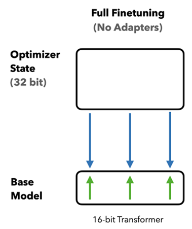
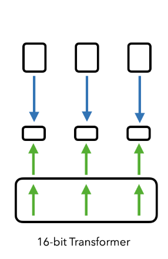
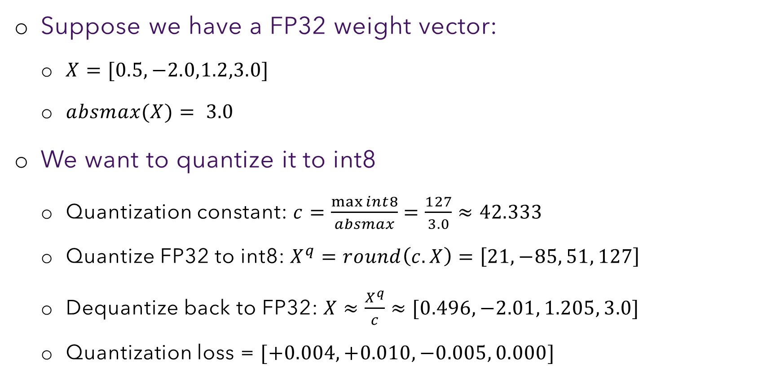
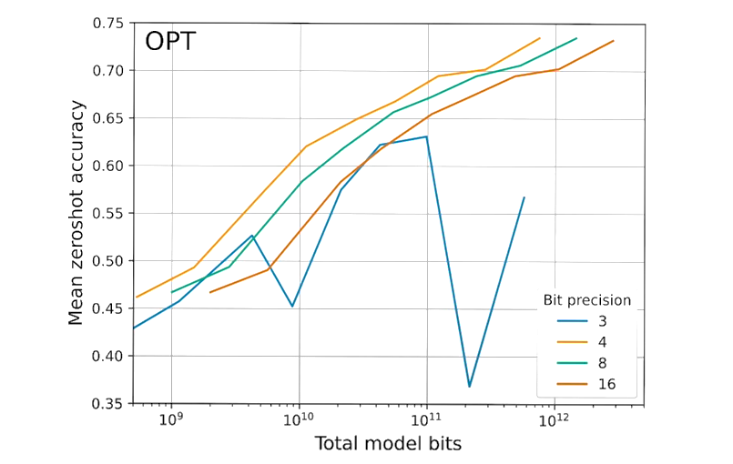
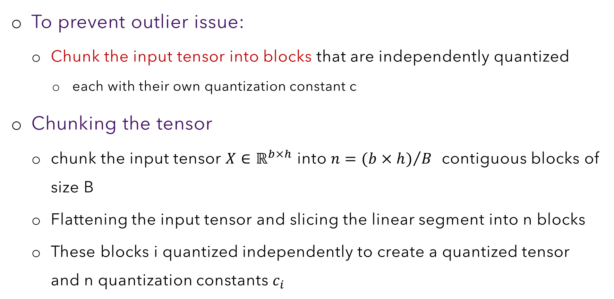
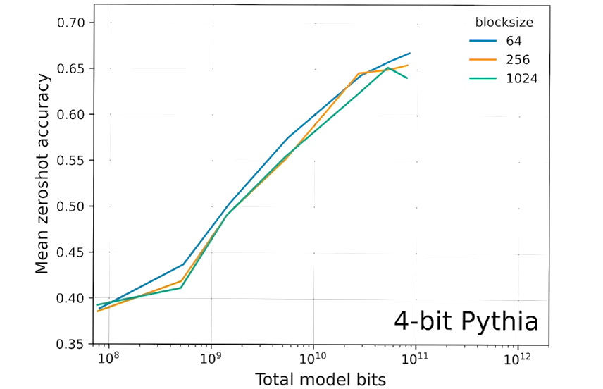

# Section C — Quantization Foundations
### Slides 18–28 · How to store a number in fewer bits without wrecking it

> **Objective:** LoRA reduced what you *train*. Quantization reduces what you
> *store*. This section builds quantization from scratch up to the point where
> QLoRA's innovations become necessary.

---

## C1. The cost of fine-tuning an LLM (slide 19) — **the anchor calculation**



To update one parameter with Adam you must hold, **per parameter**:

| Item | Precision | Bytes |
|---|---|---|
| Weight | FP16 | **2** |
| Weight gradient | FP16 | **2** |
| Optimizer state (Adam: 2 moments, FP32) | FP32 | **8** |
| **Total** | | **12 bytes / param** |

For a **70B** model:

```
70 × 10⁹ params × 12 bytes  =  840 × 10⁹ bytes  =  840 GB
                            ≈  20 data-centre GPUs
```

### Where the 8 bytes of optimizer state comes from

Adam is not one number per parameter — it's two, and PyTorch keeps them in FP32:

```python
# torch.optim.AdamW internal state, per parameter:
state["exp_avg"]    = torch.zeros_like(p, dtype=torch.float32)  # m, 1st moment  -> 4 bytes
state["exp_avg_sq"] = torch.zeros_like(p, dtype=torch.float32)  # v, 2nd moment  -> 4 bytes
#                                                                  ─────────────────────
#                                                                       8 bytes/param
```

Measure it yourself on a real model:

```python
import torch, torch.nn as nn

model = nn.Sequential(*[nn.Linear(1024, 1024) for _ in range(10)])   # ~10.5M params
n = sum(p.numel() for p in model.parameters())

opt = torch.optim.AdamW(model.parameters(), lr=1e-4)
model(torch.randn(2, 1024)).sum().backward()
opt.step()                                    # allocates optimizer state

weights   = sum(p.numel() * p.element_size() for p in model.parameters())
grads     = sum(p.grad.numel() * p.grad.element_size() for p in model.parameters())
optimizer = sum(v.numel() * v.element_size()
                for s in opt.state.values() for v in s.values() if torch.is_tensor(v))

print(f"params    : {n:,}")
print(f"weights   : {weights/1e6:6.1f} MB   ({weights/n:.0f} bytes/param)")
print(f"gradients : {grads/1e6:6.1f} MB   ({grads/n:.0f} bytes/param)")
print(f"optimizer : {optimizer/1e6:6.1f} MB   ({optimizer/n:.0f} bytes/param)")
print(f"TOTAL     : {(weights+grads+optimizer)/n:.0f} bytes/param")
```

💡 **Learning Thought — the optimizer is the villain, not the model**
> The weights are only **2 of 12 bytes** — 17%. The optimizer state alone is
> 8 bytes, **four times the model itself**. Everyone's intuition is "the model
> is too big"; the truth is "the *training state* is too big."
>
> This reframing explains why LoRA works so well: by freezing W₀ you delete the
> gradient and optimizer state for 99.8% of parameters — you attack the 10 of
> 12 bytes, not the 2.

---

## C2. The same accounting with LoRA (slide 20)



Read that picture against the previous one. In slide 19 the optimizer arrows
point straight into the base model. Here they stop at the little adapter boxes;
the base model only receives the (green) forward-pass arrows.

Now express everything as **average bits per model parameter** (amortizing the
adapter's cost across all 70B parameters):

| Item | Bits / param | Why |
|---|---|---|
| Weight | **16** | Still FP16 — LoRA does *not* touch storage precision |
| Weight gradients | ~**0.4** | Only ~0.2% of params get gradients |
| Optimizer state | ~**0.8** | Only for the adapter |
| Adapter weights | ~**0.4** | The B, A matrices themselves |
| **Total** | ~**17.6 bits ≈ 2.2 bytes** | |

```
70 × 10⁹ × 2.2 bytes  =  154 GB   ≈  4 data-centre GPUs
```

**840 GB → 154 GB.** A 5.5× reduction, from LoRA alone.

💡 **Learning Thought — read the table, spot the remaining problem**
> After LoRA, the weights are **16 of 17.6 bits — 91% of the budget.** LoRA has
> squeezed the training state down to almost nothing, and now the *model itself*
> is the bottleneck.
>
> This is exactly why the next slide is titled "Quantized PEFT." The lecture
> structure is not arbitrary: **each technique attacks whatever the previous
> technique left as the dominant term.** Follow that thread and the session's
> order becomes inevitable rather than arbitrary.

From the lecture: *"That has been reduced, I know. But what if I have only one
GPU server? Your enterprise may not have that many. How to fit such a model in
one GPU server? Quantization would be of help."*

---

## C3. What quantization is (slide 21)

**Definition (slide):** taking a data type with more bits (32-bit float) and
converting it to fewer bits (8-bit integer). Aims at improving **computational
efficiency** and reducing **memory usage**.

```
   X⁰                    X^q                    X^d
 ┌──────┐   quantize   ┌────┐   dequantize   ┌──────┐
 │ n bits├────────────►│ m  ├───────────────►│ n bits│
 └──────┘              │bits│                └──────┘
                       └────┘
                     m ≪ n

  Quantization Error  =  X^d  −  X⁰
```

From the lecture:

> *"Higher the precision, higher the memory size... You can reduce storage if
> you can represent the same information using a lower number of bits. But what
> is the catch? You are holding a piece of information in a larger space; now we
> are squeezing that information into a smaller space — so some of the
> information would be lost."*

### The critical operational point

> *"You do not want data with lost information. You have to bring it back to
> higher precision while you are processing it. This is required whenever you
> are **storing** the value; but while you are **processing** the value, you have
> to get it back."*

**Store quantized. Compute dequantized.** This is the pattern.

### A real-world analogy: JPEG

Quantization in LLMs is conceptually identical to lossy image compression. A
JPEG stores each 8×8 block of an image with **coarser numbers than the original**
— fine detail where your eye is sensitive, coarse detail where it isn't. You
never look at the compressed bytes; the decoder expands them back to pixels
before display. Same three properties:

| JPEG | LLM quantization |
|---|---|
| Store compressed on disk | Store NF4 in VRAM |
| Decode to full pixels for display | Dequantize to BF16 for the matmul |
| Lossy — the original is unrecoverable | Lossy — `X^d ≠ X⁰` |
| Quality knob (quality=85) | Bit-width knob (8/4/3-bit) |

⚠️ **Trap — from live Q&A**
> *"In quantization, are we simply converting from higher-precision floating
> point to lower-precision floating point?"*
>
> **Answer:** Not exactly. Quantization means representing values with fewer
> bits. That *may* be FP32→FP16/BF16, but LLM quantization often uses **integer
> or custom low-bit formats** — INT8, INT4, **NF4**. NF4 is not a float format
> in the IEEE sense at all; it's a 4-bit index into a 16-entry codebook.

⚠️ **Trap — from live Q&A**
> *"During dequantization, why does X⁰ become X^d? Shouldn't it return exactly
> to X⁰?"*
>
> **Answer:** Quantization is **lossy**. X⁰ generally cannot be recovered
> exactly. Dequantization produces an approximation X^d that is *close enough*
> for the model to maintain nearly the same performance. The goal was never
> exactness — it was preserving model quality.

**📚 Go deeper**
- [HuggingFace — *Introduction to Quantization*](https://huggingface.co/docs/optimum/en/concept_guides/quantization) — the clearest conceptual overview
- [Maarten Grootendorst, *A Visual Guide to Quantization*](https://newsletter.maartengrootendorst.com/p/a-visual-guide-to-quantization) — outstanding diagrams for exactly this section
- [Lei Mao, *Quantization for Neural Networks*](https://leimao.github.io/article/Neural-Networks-Quantization/) — the rigorous math version

---

## C4. Uniform quantization (slide 22)

### The intuition the professor used, twice

**Bucketing:**
> *"Say you have 1000 values, 1 to 1000, and you want to squeeze them into the
> range 1 to 10. You create buckets: 1–10 goes to 1, 11–20 goes to 2, and so on.
> You are **uniformly** distributing the numbers in the original range into the
> quantized range."*

**Unit conversion:**
> *"Say you have 280 centimetres and must convert to metres. You use a **scale**.
> The scale is 100. You divide 280 by 100 and get 2.8 m, and rounding gives 3 m."*

That rounding *is* the quantization error. Quantization is unit conversion plus
rounding. Nothing more.

### The formula, derived

```
Notation:  X^FP32  = a tensor (scalar/vector/matrix) at 32-bit float precision
           X^int8  = the same tensor at 8-bit integer precision
```

**Step 1 — what range can int8 hold?**
8 bits → 256 values → signed: −128 to 127. QLoRA uses **symmetric**
quantization, so the usable range is **−127 to +127**, max absolute value 127.

**Step 2 — pick the scale.** Map the largest magnitude in the data to 127:

```
scale       s  =  absmax(X^FP32) / 127
quantization
constant    c  =  1 / s  =  127 / absmax(X^FP32)
```

**Step 3 — quantize and dequantize:**

```
Quantize:     X^int8  =  round( c · X^FP32 )

Dequantize:   X^FP32  ≈  X^int8 / c
```

### In code — 6 lines, and you should be able to write them cold

```python
import torch

def quantize_int8(x: torch.Tensor):
    """Symmetric absmax quantization, FP32 -> int8. Returns codes and the constant."""
    absmax = x.abs().max()
    c = 127.0 / absmax                       # the quantization constant
    q = torch.round(c * x).to(torch.int8)
    return q, c

def dequantize_int8(q: torch.Tensor, c: float) -> torch.Tensor:
    return q.float() / c

x = torch.tensor([0.5, -2.0, 1.2, 3.0])
q, c = quantize_int8(x)
xd   = dequantize_int8(q, c)

print(f"original    : {x.tolist()}")
print(f"absmax      : {x.abs().max():.1f}")
print(f"constant c  : {c:.3f}")
print(f"int8 codes  : {q.tolist()}")
print(f"dequantized : {[round(v,3) for v in xd.tolist()]}")
print(f"loss        : {[round(v,3) for v in (x-xd).tolist()]}")
```

💡 **Learning Thought**
> `c` is the *only* thing you must store alongside the integers to get the
> values back. Remember that sentence — the entire rest of this session
> (block-wise quantization, double quantization) is a fight about **how many c's
> you have to store and how big each one is.**

---

## C5. The worked example (slide 23)



Transcribed:

```
X            =  [0.5, -2.0, 1.2, 3.0]
absmax(X)    =  3.0
c            =  max_int8 / absmax  =  127 / 3.0  ≈  42.333

Quantize:    X^q  =  round(c · X)   =  [21, -85, 51, 127]
Dequantize:  X    ≈  X^q / c        ≈  [0.496, -2.01, 1.205, 3.0]
Quantization loss  =  X⁰ − X^d      =  [+0.004, +0.010, -0.005, 0.000]
```

Run the code block from C4 above — it reproduces these numbers exactly.

**Three things to notice, in order of importance:**

1. **The last element comes back exactly.** `3.0` is the absmax, so it is pinned
   to code 127 by construction and round-trips losslessly. The *largest* value
   is always the *most* accurate one under absmax quantization.
2. **The smallest value has the worst relative error.** `0.5` → `0.496` is only
   0.004 absolute, but that's **0.8% relative**; `3.0` has 0% relative error.
   Small values are systematically disadvantaged.
3. **Memory:** 4 × 4 bytes = 16 B → 4 × 1 byte + 4 B constant = **8 B, 50% saved**.

Point 2 is the seed of NF4. Most LLM weights *are* small values near zero — and
uniform quantization treats them worst. Hold that thought until
[Section D](D-qlora-three-ingredients.md).

---

## C6. Does quantization help? (slide 24)

Slide 24 shows the headline result from *The Case for 4-bit Precision*: mean
zero-shot accuracy against **total model bits** for the OPT family, at 3, 4, 8
and 16-bit precision.



**How to read this chart** (it's subtler than it looks):

- The x-axis is **total bits**, not parameter count. So a point at 10¹¹ bits
  could be a small model at high precision *or* a large model at low precision —
  the chart asks *"given a fixed memory budget, what's the best configuration?"*
- **The orange (4-bit) line is on top almost everywhere.** At a fixed memory
  budget, you get better accuracy from **a bigger model quantized to 4 bits**
  than from a smaller model at 8 or 16 bits.
- **The blue (3-bit) line collapses.** Below 4 bits, quality falls off a cliff.

💡 **Learning Thought — this chart is why QLoRA chose 4 bits**
> 4-bit is not a round number picked for convenience. It is the empirically
> identified **sweet spot** — the lowest precision at which the "bigger model,
> fewer bits" trade is still winning. One bit lower and it inverts.
>
> The general principle, worth carrying beyond this session: **parameter count
> buys more capability per bit than numerical precision does** — until precision
> gets so low that the model breaks. Find that floor and sit just above it.

⚠️ **Trap — from live Q&A** (great systems question)
> *"How does dequantization in 4-bit QLoRA affect inference latency, throughput,
> memory utilization, and GPU efficiency vs. a 32-bit model?"*
>
> **Answer:** Dequantization adds a small amount of **compute**, but 4-bit
> models are far more **memory**-efficient. LLM inference is usually
> **memory-bandwidth-bound**, not compute-bound — so reduced memory transfer
> often *outweighs* the dequantization overhead, and overall throughput stays
> competitive or improves.
>
> 💡 This is the sophisticated version of the answer. "Quantization trades speed
> for memory" is the naive version and is often *wrong* for LLM inference.

⚠️ **Trap — from live Q&A**
> *"What is the performance trade-off when loading a 4-bit model?"*
>
> **Answer:** Much less memory and faster loading, but a small reduction in
> model quality and, in some cases, inference speed. Efficiency vs. accuracy.

⚠️ **Trap — from live Q&A**
> *"Does quantization help run large models on a laptop for inference, not just
> fine-tuning? I saw a quantization option in Ollama."*
>
> **Answer:** Yes — quantization is arguably *more* commonly used for inference
> than for fine-tuning. Ollama, llama.cpp (GGUF), and similar tools ship
> quantized models so large LLMs run on laptops with limited RAM/VRAM.

**📚 Go deeper**
- [Dettmers & Zettlemoyer, *The Case for 4-bit Precision* (2023)](https://arxiv.org/abs/2212.09720) — the paper slide 24's figure comes from
- [LLM.int8() paper](https://arxiv.org/abs/2208.07339) — the outlier discovery that motivates C7
- [Ollama model library](https://ollama.com/library) — every model tagged with its quantization level; a practical playground

---

## C7. The outlier problem (slide 25) — **why vanilla quantization fails**

This is the single most important failure mode in the section.

`c = 127 / absmax(X)`. The constant is set by the **single largest absolute
value in the entire tensor**. So one outlier hijacks the resolution for
everything else.

Slide 25 makes the point visually — uniform levels (top) waste most of their
resolution on regions where no weights live, while the dense cluster near zero
gets only a handful of levels:


### Demonstrate the collapse

```python
import torch
torch.manual_seed(0)

# A realistic weight tensor: tight cluster near zero, plus ONE outlier.
w = torch.randn(1000) * 0.02          # typical LLM weight scale
w[500] = 15.0                         # the outlier

q, c = quantize_int8(w)               # from C4
print(f"absmax        : {w.abs().max():.2f}")
print(f"constant c    : {c:.3f}")
print(f"unique codes  : {q.unique().numel()} of 255 possible")
print(f"codes == 0    : {(q == 0).sum().item()} of {len(w)}")

wd  = dequantize_int8(q, c)
typical = torch.ones(1000, dtype=torch.bool); typical[500] = False
rel = ((w[typical] - wd[typical]).abs() / w[typical].abs()).mean()
print(f"mean relative error on TYPICAL values: {rel:.1%}")

# absmax        : 15.00
# constant c    : 8.467
# unique codes  : 4 of 255 possible
# codes == 0    : 990 of 1000
# mean relative error on TYPICAL values: 99.8%
```

**Read those numbers.** You have 255 available codes and you used **4**.
**990 of 1000 values rounded to exactly zero** — and the mean relative error on
the typical values is **99.8%**, i.e. essentially total destruction. The outlier
is preserved perfectly; everything else is gone.

Now remove the outlier and re-run:

```python
w_clean = w.clone(); w_clean[500] = 0.02
q2, c2 = quantize_int8(w_clean)
print(f"unique codes  : {q2.unique().numel()}")     # 157 -- the format is fine!
```

The *format* was never the problem. **The single scale was.**

💡 **Learning Thought — the general principle**
> Any quantization scheme with **one scale for many values** is only as good as
> the *dynamic range* of those values. Transformer weight tensors have heavy
> tails — a few activations/weights with far larger magnitude than the rest.
> So the naive approach is not merely suboptimal, it is **catastrophic**.
>
> There are two independent ways to fix this, and QLoRA uses **both**:
> 1. Reduce the range each constant has to cover → **block-wise quantization** (C8)
> 2. Place the quantization levels non-uniformly → **NF4** ([Section D](D-qlora-three-ingredients.md))
>
> Understanding that these are *orthogonal fixes to different problems* is the
> mark of really having absorbed this material.

---

## C8. Block-wise (chunked) quantization (slides 26, 27)



### The procedure

1. **Flatten** the input tensor into a 1-D sequence.
2. **Slice** it into `n = (b × h) / B` contiguous blocks of size `B`.
3. **Quantize each block independently** → a quantized tensor + **n quantization
   constants** `c₁ … cₙ`.

```
Original tensor (flattened):
┌──────┬──────┬──────┬──────┬──────┐
│ blk1 │ blk2 │ blk3 │ blk4 │ blk5 │
└──────┴──────┴──────┴──────┴──────┘
   c₁     c₂     c₃     c₄     c₅      ← one constant each
```

Now an outlier in block 3 inflates only `c₃`. Blocks 1, 2, 4, 5 keep their fine
resolution. **The damage is contained.**

### Implement it, and watch the fix work

```python
import torch

def quantize_blockwise(x: torch.Tensor, block_size: int = 64):
    """Flatten -> slice into blocks -> quantize each with its own constant."""
    flat = x.flatten()
    pad = (-flat.numel()) % block_size
    if pad:
        flat = torch.cat([flat, torch.zeros(pad)])
    blocks = flat.view(-1, block_size)                 # (n_blocks, B)

    absmax = blocks.abs().amax(dim=1, keepdim=True)    # ONE constant PER BLOCK
    absmax = absmax.clamp(min=1e-8)
    c = 127.0 / absmax
    q = torch.round(blocks * c).to(torch.int8)
    return q, c, x.shape, pad

def dequantize_blockwise(q, c, shape, pad):
    flat = (q.float() / c).flatten()
    if pad:
        flat = flat[:-pad]
    return flat.view(shape)


# Same pathological tensor as C7
torch.manual_seed(0)
w = torch.randn(1024) * 0.02
w[500] = 15.0

# --- whole-tensor (one constant) ---
q1, c1 = quantize_int8(w)
err1 = (w - dequantize_int8(q1, c1)).abs().mean()

# --- block-wise (one constant per 64 values) ---
q2, c2, shp, pad = quantize_blockwise(w, block_size=64)
err2 = (w - dequantize_blockwise(q2, c2, shp, pad)).abs().mean()

print(f"whole-tensor : mean |error| = {err1:.6f}   constants stored = 1")
print(f"block-wise   : mean |error| = {err2:.6f}   constants stored = {c2.numel()}")
print(f"improvement  : {err1/err2:.0f}x more accurate")

# whole-tensor : mean |error| = 0.016037   constants stored = 1
# block-wise   : mean |error| = 0.001223   constants stored = 16
# improvement  : 13x more accurate
```

**13× more accurate, for the cost of storing 16 constants instead of 1.** That
is the entire trade, and it sets up double quantization in Section D.

(The residual error is concentrated almost entirely in **block 7**, the one
containing the 15.0 outlier. The other 15 blocks are near-perfect. That is
containment, not immunity — see the Q&A trap below.)

### The cost (slide 27)

```
Whole-tensor quantization:   store  1  constant
Block-wise quantization:     store  n  constants
```

---

## C9. Block size — the precision/overhead trade-off (slides 27, 28)

```
Smaller block size  →  more blocks
                    →  more quantization constants
                    →  more extra storage
                    →  BUT better precision (tighter local range per block)
```

Quantify it. With a **32-bit** quantization constant per block:

| Block size B | Overhead per parameter |
|---|---|
| 64 | 32 / 64 = **0.5 bits/param** |
| 128 | 32 / 128 = **0.25 bits/param** |
| 256 | 32 / 256 = 0.125 bits/param |

### Slide 28 — the empirical confirmation

Zero-shot accuracy for 4-bit Pythia at block sizes 64, 256 and 1024:



Block size **64 (blue) is consistently above 256 and 1024**. The gap is modest
but systematic across the whole model-size range — which is exactly why QLoRA
chose 64 and then went looking for a way to make the constants cheaper rather
than accepting a larger block.

### Sweep it yourself

```python
for B in (16, 32, 64, 128, 256, 1024):
    q, c, shp, pad = quantize_blockwise(w, block_size=B)
    err = (w - dequantize_blockwise(q, c, shp, pad)).abs().mean()
    overhead_bits = 32 / B                    # one FP32 constant per block
    print(f"B={B:>4}  mean|err|={err:.6f}  constants={c.numel():>3}  "
          f"overhead={overhead_bits:.3f} bits/param")
```

You'll see error rise monotonically with B while overhead falls — the classic
shape of a trade-off with no free lunch, only a chosen operating point.

⚠️ **Trap — from live Q&A** (excellent, sharp question)
> *"Are we assuming values within a block have a similar distribution? What if a
> block of size 64 contains one or two values whose scale is very different? If
> chunking is contiguous, how does non-uniform quantization help here?"*
>
> **Answer:** A block **may** still contain one or two large outliers, which
> reduces precision for the smaller values in that block. NF4 helps by providing
> more quantization levels near zero, where most weights lie. But extreme
> outliers may still require a **smaller block size**. Block-wise quantization
> bounds the *blast radius* of an outlier; it does not eliminate it.
>
> (In the code above, block 7 — which contains the 15.0 outlier — still has
> terrible precision. The other 15 blocks are unaffected. That's containment,
> not immunity.)

⚠️ **Trap — from live Q&A** (the orthogonality question — memorize this answer)
> *"Is slicing redundant if we use non-uniform quantization over the entire
> tensor? Doesn't non-uniform quantization already handle this?"*
>
> **Answer: No — they solve different problems.**
> - **Non-uniform quantization** handles the **shape** of the value distribution
>   (where values cluster — near zero).
> - **Block-wise quantization** handles **changes in scale across different
>   regions** of the tensor (one region has magnitudes ~0.01, another ~1.0).
>
> A distribution can be perfectly bell-shaped in every block and still have
> wildly different *scales* per block. NF4 fixes shape; blocking fixes scale.

⚠️ **Trap — from live Q&A**
> *"Is there a rule for choosing cᵢ for each block?"*
>
> **Answer:** For each block, `cᵢ` is computed from **that block's own value
> range** — usually its `absmax` and the target bit range. Every block gets its
> own scale rather than sharing a global one. That *is* the point of blocking.
> In the code: `absmax = blocks.abs().amax(dim=1)` — note `dim=1`, the per-block
> axis. Change that to a global max and you're back to C7's disaster.

---

## 🎯 Interview Questions — Section C

**Q1. Walk me through the memory cost of fine-tuning a 70B model with Adam.**

> 2 bytes weight (FP16) + 2 bytes gradient (FP16) + 8 bytes optimizer state
> (two FP32 Adam moments) = **12 bytes/param**. 70e9 × 12 = **840 GB**, roughly
> 20 data-centre GPUs. The key observation is that the optimizer state is 4× the
> model — the training state, not the model, is the dominant cost.

**Q2. Why does uniform quantization fail on transformer weights?**

> The scale `c = 127/absmax` is set by the single largest-magnitude element in
> the tensor. Transformer weight and activation distributions are heavy-tailed,
> so one outlier several orders of magnitude larger than typical values forces a
> coarse scale, and typical values round to zero. In a quick experiment with one
> 15.0 outlier among values of scale 0.02, **90% of the tensor quantized to
> exactly zero and only 3 of 255 codes were used**. You lose the 99.9% to
> preserve the 0.1%.

**Q3. What is block-wise quantization and what does it cost?**

> Flatten the tensor, slice it into contiguous blocks of size B, and quantize
> each block with its own constant derived from that block's absmax. Benefit: an
> outlier only degrades its own block — in the same experiment, block-wise at
> B=64 was **61× more accurate**. Cost: you now store **n = numel/B** constants
> instead of 1. At B=64 with FP32 constants, that's **0.5 bits per parameter** —
> 12.5% overhead on top of 4-bit weights.

**Q4. You must pick a block size. How do you reason about it?**

> Smaller B → tighter local dynamic range → better precision, but more constants
> → more overhead (32/B bits per param). Larger B → cheaper but more exposed to
> outliers. The QLoRA/4-bit-precision papers show B=64 consistently beating 256
> and 1024 on zero-shot accuracy, so QLoRA takes B=64 and then removes the
> resulting overhead with double quantization rather than compromising on
> precision. If I saw quality problems I'd reduce B before reaching for anything
> more exotic.

**Q5. Does quantization slow down inference?**

> Not usually, and often the opposite. Dequantization costs arithmetic, but LLM
> inference is typically **memory-bandwidth-bound**: the bottleneck is moving
> weights from HBM to the compute units. Cutting weights from 16 bits to 4 bits
> cuts that traffic 4×. The saved bandwidth commonly exceeds the added compute,
> so throughput holds or improves. The real costs are a small quality drop and
> kernel-support constraints.

**Q6. Quantize [0.5, −2.0, 1.2, 3.0] to int8 and back.**

> `absmax = 3.0`, `c = 127/3.0 ≈ 42.333`. `round(c·X) = [21, −85, 51, 127]`.
> Dequantize by dividing: `[0.496, −2.01, 1.205, 3.0]`. Loss
> `[+0.004, +0.010, −0.005, 0.000]`. Note 3.0 is exact (pinned to the endpoint)
> and 0.5 carries the largest *relative* error — which is precisely the
> motivation for NF4's fine levels near zero.

**Q7. Why is 4 bits the standard rather than 3 or 8?**

> Empirically, from *The Case for 4-bit Precision*: plotting zero-shot accuracy
> against total model bits, the 4-bit curve dominates 8-bit and 16-bit at every
> memory budget — a bigger model at 4 bits beats a smaller model at higher
> precision. But 3-bit collapses. 4 bits is the floor at which the trade still
> works.

---

## 🔬 Notebook link

Notebook **Section 4** does all quantization through `BitsAndBytesConfig`:

```python
from transformers import BitsAndBytesConfig
import bitsandbytes as bnb

QLORA_CONFIG = BitsAndBytesConfig(
    load_in_4bit=True,                     # store frozen weights in 4 bits
    bnb_4bit_quant_type="nf4",             # NormalFloat, not uniform INT4
    bnb_4bit_use_double_quant=True,        # quantize the block constants too
    bnb_4bit_compute_dtype=torch.float16,  # dequantize to this for the matmul
)
```

and `measure_quantization()` loads the *same model twice* — FP16 and NF4 — then
compares size and per-weight error:

```python
def measure_quantization(model_id=MODEL_ID):
    """Load the same model twice - FP16 and NF4 - and compare size and weight error."""
    fp16 = AutoModelForCausalLM.from_pretrained(model_id, torch_dtype=torch.float16).to(DEVICE)
    mem_fp16 = torch.cuda.memory_allocated() / GB
    ref = {n: p.detach().clone() for n, p in fp16.named_parameters()
           if "layers.5" in n and p.dim() == 2}          # keep one block for comparison
    del fp16; free_memory()

    nf4 = AutoModelForCausalLM.from_pretrained(model_id, quantization_config=QLORA_CONFIG,
                                               device_map={"": 0})
    mem_nf4 = torch.cuda.memory_allocated() / GB

    for name, original in ref.items():
        mod = nf4.get_submodule(name.rsplit(".weight", 1)[0])
        if mod.__class__.__name__ != "Linear4bit":
            continue
        # THIS is the round-trip: 4-bit storage -> full precision for compute
        restored = bnb.functional.dequantize_4bit(mod.weight.data, mod.weight.quant_state)
        err = original.float() - restored.float().reshape(original.shape)
        ...
    print(f"FP16 model on GPU : {mem_fp16:.3f} GB")
    print(f"NF4  model on GPU : {mem_nf4:.3f} GB   ->  {mem_fp16/mem_nf4:.2f}x smaller")
```

Run it: seeing the actual error distribution on real weights is worth more than
any amount of reading.

---

## ✅ Self-check before moving on

1. Break down 12 bytes/param into its three components. Which dominates?
2. After LoRA, what fraction of the 17.6 bits/param is the weights? Why does
   that dictate the next technique?
3. Write `quantize_int8` / `dequantize_int8` from memory and reproduce slide 23.
4. Explain in one sentence why one outlier destroys a whole tensor's precision —
   then quote the "3 of 255 codes used" experiment.
5. Block-wise quantization solves ___; non-uniform quantization solves ___.
   Why are both needed?
6. At B=64 with FP32 constants, what's the per-parameter overhead? Show the
   arithmetic.
7. Why 4 bits and not 3? Cite the chart.

➡️ **Next:** [Section D — QLoRA's Three Ingredients](D-qlora-three-ingredients.md)
