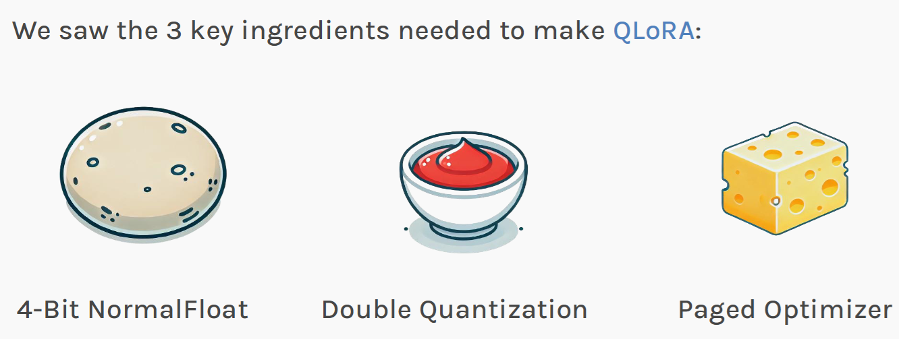
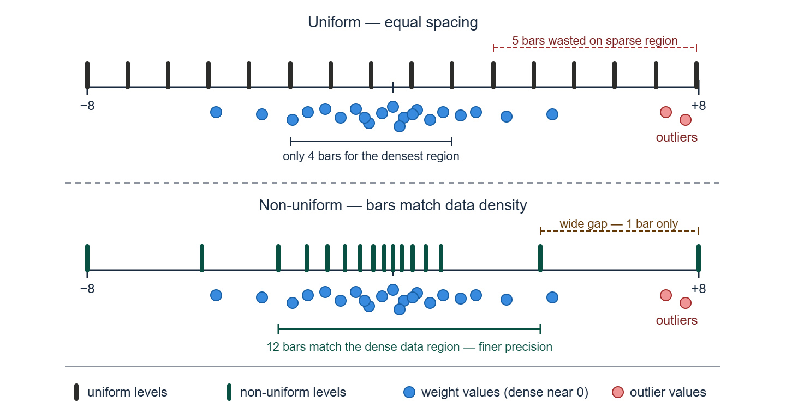
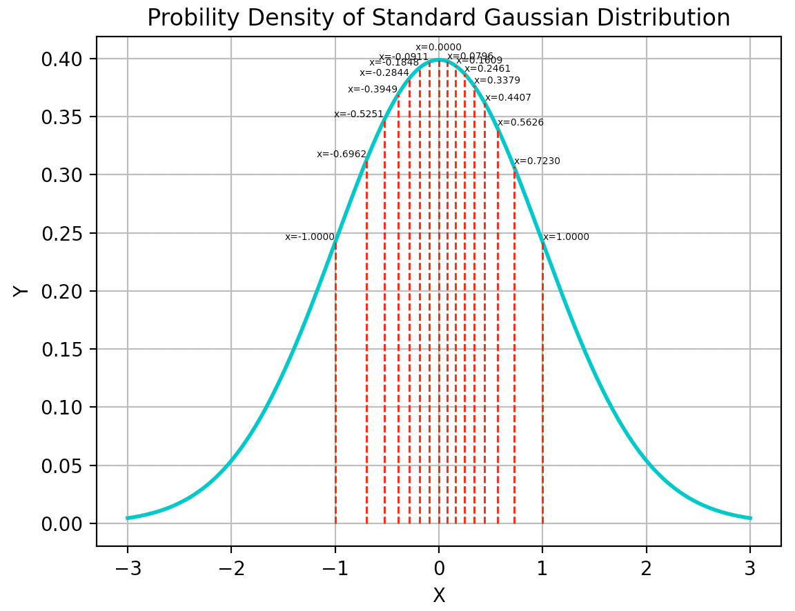
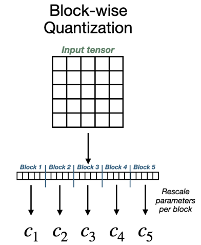
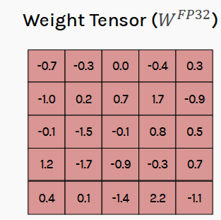
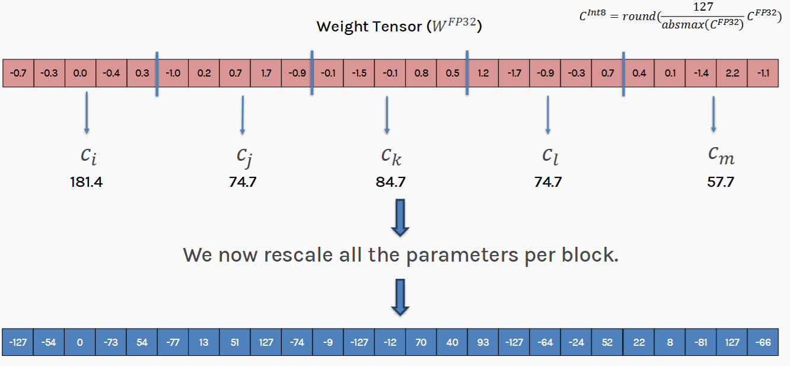

# Section D — QLoRA's Three Ingredients
### Slides 29–40 · NF4, Double Quantization, Paged Optimization

> **Objective:** Section C left us with two unsolved problems — quantization
> levels are in the wrong places, and block-wise quantization costs 0.5 bits per
> parameter in constants. QLoRA fixes both, then adds a third trick for
> memory spikes.

---

## D1. The three core ideas (slide 29)



| # | Idea | Problem it solves |
|---|---|---|
| 1 | **4-bit NormalFloat (NF4) quantization** | A new data type matched to the *distribution* of LLM weights |
| 2 | **Double quantization** | Reduces memory needed to store the block-wise quantization constants |
| 3 | **Paged optimization** | Helps when the GPU runs out of memory |

Ingredient 3 is covered in [Section E](E-memory-engineering.md) alongside
gradient checkpointing, since they solve the same problem.

💡 **Learning Thought — QLoRA is an engineering paper, not a theory paper**
> There is no new mathematics in QLoRA. There is one new *data type*, one
> *recursion* applied to an existing technique, and one *systems* trick borrowed
> from operating systems. Each is individually simple. The contribution is that
> together they cross a threshold — 70B fine-tuning on one GPU — that none of
> them crosses alone.
>
> Read the paper with that lens and it becomes much easier to remember.

**📚 Go deeper**
- [Dettmers et al., *QLoRA: Efficient Finetuning of Quantized LLMs* (2023)](https://arxiv.org/abs/2305.14314) — the paper; §3 is exactly this section
- [bitsandbytes documentation](https://huggingface.co/docs/bitsandbytes/main/en/index) — the library that implements all of it
- [HuggingFace blog — *Making LLMs even more accessible with 4-bit quantization and QLoRA*](https://huggingface.co/blog/4bit-transformers-bitsandbytes) — the official walkthrough

---

## D2–D3. Why NF4? Quantile quantization meets the normal distribution (slide 30)

### Quantile quantization

**Definition (slide):** ensures **each quantization bin has an equal number of
values** assigned from the input tensor.

Contrast with uniform quantization, which gives each bin an equal *width* of the
value range — regardless of how many values fall in it. Slide 25 showed this
directly: uniform levels waste 5 of 16 bars on a sparse tail while the dense
region near zero gets only 4.



### The key empirical fact

> **LLM weights are typically normally distributed** — roughly zero-mean
> Gaussian.

Therefore, from the slide, the design principle:

- Have **more precision near the mean (zero)**
- **Reduce precision** for value ranges moving away from zero
- Create **more, finer quantization levels near zero** and **fewer, coarser
  levels in the tails**

### Slide 30 — the levels drawn on the Gaussian they came from



This is the most information-dense picture in the deck. Read it carefully:

- The curve is the **standard normal PDF** — the assumed distribution of LLM
  weights.
- Each dashed red line is one of the **16 NF4 levels**.
- They are **crowded near x=0** (where the curve is tall — where the weights
  are) and **spread out toward ±1** (where the curve is falling off).
- The outermost lines sit at exactly **−1.0000 and +1.0000**.

Each adjacent pair of lines bounds a region of **roughly equal area under the
curve** — that's what "equal number of values per bin" means geometrically.

### Verify the weights really are Gaussian

Don't take it on faith — check a real model:

```python
import torch
from transformers import AutoModelForCausalLM

model = AutoModelForCausalLM.from_pretrained("EleutherAI/pythia-410m")
w = dict(model.named_parameters())["gpt_neox.layers.5.mlp.dense_h_to_4h.weight"]
w = w.detach().float().flatten()

print(f"mean      : {w.mean():+.5f}")     # ~0  -> zero-centred
print(f"std       : {w.std():.5f}")
print(f"skew      : {((w-w.mean())**3).mean()/w.std()**3:+.3f}")   # ~0 -> symmetric
print(f"kurtosis  : {((w-w.mean())**4).mean()/w.std()**4:.3f}")    # ~3 -> Gaussian-ish

# What fraction lies within 1 std? Gaussian says 68.3%.
print(f"within 1σ : {((w-w.mean()).abs() < w.std()).float().mean():.1%}")
```

Zero-centred, symmetric, kurtosis near 3, ~68% within one σ. **The NF4
assumption is empirically justified**, which is why a fixed codebook works at
all.

### Derive the NF4 levels yourself

The codebook is not magic — it's 16 quantiles of a normal distribution:

```python
import torch
from scipy.stats import norm

def make_nf4_levels():
    """Reproduce the NF4 codebook: quantiles of N(0,1), normalized to [-1, +1]."""
    # 8 levels for the negative side (incl. 0), 8 for the positive (incl. 0) -> 16 total
    offset = 0.5 * (1/32 + 1/30)                       # avoids infinite tails
    neg = norm.ppf(torch.linspace(offset, 0.5, 9)[:-1]).tolist()      # 8 negatives
    pos = norm.ppf(torch.linspace(0.5, 1 - offset, 8)).tolist()       # 8 positives
    levels = torch.tensor(neg + pos)
    return levels / levels.abs().max()                 # normalize to [-1, +1]

levels = make_nf4_levels()
for i, v in enumerate(levels):
    print(f"{i:>2}  {i:04b}  {v:+.4f}")
```

You will land within rounding distance of the table in D4 — the endpoints
exactly at ∓1.0000 and a level exactly at 0.0000.

💡 **Learning Thought — information-theoretically optimal**
> Quantile quantization is optimal in the sense that each of the 16 codes is
> used equally often, so all 4 bits carry maximum information. With uniform
> quantization on Gaussian data, most codes are almost never used — you're
> paying for 16 levels and effectively using 5 or 6.
>
> The catch: exact quantile quantization requires *estimating quantiles from the
> data*, which is expensive. NF4's trick is to assume the data is
> **standard normal** and precompute the quantiles **once, offline**, into a
> fixed 16-entry codebook. It is quantile quantization with the expensive part
> amortized to zero.

⚠️ **Trap — from live Q&A**
> *"How are the NF4 level values calculated?"*
>
> **Answer:** NF4 levels are derived from **quantiles of a standard normal
> distribution**. The distribution is divided into **16 regions of roughly equal
> probability**, representative values are taken, and those are **normalized to
> the range [−1, +1]**. That normalization is why the table's endpoints are
> exactly −1.0000 and +1.0000.

⚠️ **Trap — from live Q&A**
> *"Within each block, are we using uniform or non-uniform quantization?"*
>
> **Answer:** Within each block, NF4 uses **non-uniform** quantization with
> levels concentrated near zero. Each block *also* has its own scaling constant
> (that's the blocking from Section C), and **double quantization compresses
> those constants separately**. Three mechanisms, three jobs.

---

## D4. STEP 1 — The NF4 codebook (slide 31)

The 16 levels. Note the asymmetry (8 negative including zero, 7 positive plus
the endpoint) and the tight spacing near zero.

| Index | 4-bit | NF4 level | | Index | 4-bit | NF4 level |
|---|---|---|---|---|---|---|
| 0 | `0000` | **−1.0000** | | 8 | `1000` | **+0.0796** |
| 1 | `0001` | −0.6962 | | 9 | `1001` | +0.1609 |
| 2 | `0010` | −0.5251 | | 10 | `1010` | +0.2461 |
| 3 | `0011` | −0.3949 | | 11 | `1011` | +0.3379 |
| 4 | `0100` | −0.2844 | | 12 | `1100` | +0.4407 |
| 5 | `0101` | −0.1848 | | 13 | `1101` | +0.5626 |
| 6 | `0110` | −0.0911 | | 14 | `1110` | +0.7230 |
| 7 | `0111` | **0.0000** | | 15 | `1111` | **+1.0000** |

**Read the spacing:**

```
Near zero:   |−0.0911 → 0.0000|   =  0.0911   gap
             |0.0000 → +0.0796|   =  0.0796   gap
In the tail: |−1.0000 → −0.6962|  =  0.3038   gap   ← 3.8× coarser
             |+0.7230 → +1.0000|  =  0.2770   gap
```

Fine where the data is, coarse where it isn't. Exactly as designed.

💡 **Learning Thought — zero is exactly representable**
> Index 7 is **exactly 0.0000**. This matters more than it looks: neural network
> weights include many near-zero values, and padding/masking produces exact
> zeros. A format that can't represent zero exactly introduces bias everywhere.
> NF4 guarantees it.

---

## D5–D8. The six-step NF4 pipeline (slides 32–35)

The slides work one 2×3 tensor all the way through. Here is the whole pipeline
as runnable code, followed by the slide's numbers step by step.

```python
import torch

NF4_LEVELS = torch.tensor([
    -1.0000, -0.6962, -0.5251, -0.3949, -0.2844, -0.1848, -0.0911,  0.0000,
     0.0796,  0.1609,  0.2461,  0.3379,  0.4407,  0.5626,  0.7230,  1.0000])

def nf4_quantize(w: torch.Tensor):
    """STEPS 2-5: normalize by absmax, snap to nearest level, pack 2 indices per byte."""
    absmax = w.abs().max()                                   # STEP 3
    normalized = w / absmax
    # STEP 4: nearest level for each value
    idx = (normalized.flatten()[:, None] - NF4_LEVELS[None, :]).abs().argmin(dim=1)
    # STEP 5: pack two 4-bit indices into one byte (high nibble | low nibble)
    idx_u8 = idx.to(torch.uint8)
    packed = (idx_u8[0::2] << 4) | idx_u8[1::2]
    return packed, absmax, idx, w.shape

def nf4_dequantize(packed, absmax, shape):
    """STEP 6: unpack -> look up level -> multiply by absmax."""
    hi, lo = packed >> 4, packed & 0x0F
    idx = torch.stack([hi, lo], dim=1).flatten().long()
    return (NF4_LEVELS[idx] * absmax).view(shape)


# --- The slide's exact tensor ---
W = torch.tensor([[-1.2000, 0.0800, -0.4500],
                  [ 0.3300, -0.9200, 1.6500]])

packed, absmax, idx, shape = nf4_quantize(W)
Wd = nf4_dequantize(packed, absmax, shape)

print(f"absmax            : {absmax:.4f}")                  # 1.6500
print(f"normalized        : {(W/absmax).flatten().tolist()}")
print(f"NF4 indices       : {idx.tolist()}")                # [1, 8, 4, 9, 2, 15]
print(f"packed bytes      : {packed.tolist()}")             # [24, 73, 47]
print(f"dequantized       : {Wd.flatten().tolist()}")
print(f"error             : {(W-Wd).abs().flatten().tolist()}")

orig_bytes = W.numel() * 4
new_bytes  = packed.numel() + 4                             # codes + FP32 absmax
print(f"memory: {orig_bytes} B -> {new_bytes} B  "
      f"({100*(orig_bytes-new_bytes)/orig_bytes:.1f}% reduction)")
```

### STEP 2–3 — Fetch and normalize (slide 32)

```
Weights = [[-1.2000,  0.0800, -0.4500],
           [ 0.3300, -0.9200,  1.6500]]

Normalization factor (absmax) = 1.6500

Normalized = [[-0.7273,  0.0485, -0.2727],
              [ 0.2000, -0.5576,  1.0000]]
```

Each entry is `w / 1.65`. Check: `-1.2000 / 1.65 = -0.7273` ✓

💡 **Learning Thought**
> `absmax` **is** the quantization constant from Section C, wearing a different
> hat. In the C4 formula it was `c = 127/absmax`; here the codebook is already
> normalized to ±1, so the constant is just `absmax` itself. Same idea, and it's
> the value we'll have to store per block — which is what double quantization
> attacks.

### STEP 4 — Snap to the nearest level (slide 33)

| Original weight | Normalized | Closest NF4 value | NF4 level (index) |
|---|---|---|---|
| −1.2000 | −0.727 | −0.696 | **1** |
| 0.0800 | 0.048 | 0.080 | **8** |
| −0.4500 | −0.273 | −0.285 | **4** |
| 0.3300 | 0.200 | 0.161 | **9** |
| −0.9200 | −0.558 | −0.525 | **2** |
| 1.6500 | 1.000 | 1.000 | **15** |

**Verify one by hand** (worth doing once): normalized `0.048` sits between level
7 (`0.0000`) and level 8 (`+0.0796`). `|0.048 − 0.0796| = 0.0316` vs
`|0.048 − 0| = 0.048`. Level **8** is closer. ✓

Note the last row: the absmax element maps to level 15 = 1.0000 exactly, so it
round-trips **losslessly** — same property we saw in C5.

### STEP 5 — Pack for storage (slide 34)

> *"Since we can't actually store individual 4-bit values, we pack 2 indices in
> a byte."*

```
Quantized indices (4-bit):  [1, 8, 4, 9, 2, 15]

Pack pairs — high nibble | low nibble:
   1, 8   →  0001 1000  =  00011000  =  24
   4, 9   →  0100 1001  =  01001001  =  73
   2, 15  →  0010 1111  =  00101111  =  47

Packed data (bytes): [24, 73, 47]
```

The packing is one line of bit arithmetic: `(hi << 4) | lo`, and unpacking is
`>> 4` and `& 0x0F`. That's the whole "4-bit storage" trick — there is no 4-bit
machine type, so you interleave two values per byte.

**Memory accounting:**

```
Original memory:      6 values × 4 bytes (FP32)  =  24 bytes
Quantized memory:     3 bytes (packed 4-bit indices)
Plus absmax (FP32):   4 bytes
                                        ─────────────
Total quantized:                          7 bytes

Memory reduction:  (24 − 7) / 24  =  70.8 %
```

💡 **Learning Thought — spot the problem in that table**
> The data is 3 bytes. The **constant is 4 bytes** — *bigger than the data it
> describes*. This tiny example has a block size of 6, so overhead dominates.
>
> This is not a contrived artifact. At the real block size of 64, an FP32
> constant is 4 bytes against 32 bytes of data — still **12.5% overhead**. Slide
> 34 is quietly setting up slide 36. Notice the setup and double quantization
> stops feeling like an arbitrary extra trick.

### STEP 6 — Dequantize (slide 35)

```
Dequantized value  =  NF4_codebook[index]  ×  absmax
```

Worked: index 1 → NF4 value −0.6962 → `−0.6962 × 1.65 = −1.149`

| Original | Dequantized | Error |
|---|---|---|
| −1.200 | −1.149 | 0.051 |
| 0.080 | 0.131 | 0.051 |
| −0.450 | −0.469 | 0.019 |
| 0.330 | 0.266 | 0.064 |
| −0.920 | −0.866 | 0.054 |
| **1.650** | **1.650** | **0.000** |

*(Slide 35 prints "-1.1.49" — a typo for −1.149.)*

**Reading the errors:** absolute errors are all ≈0.02–0.06 while the values span
0.08 to 1.65. So *relative* error is much worse for small values here — because
this 6-element toy block has a huge dynamic range. In a real 64-element block of
similar-scale weights, NF4's dense near-zero levels do their job properly.

### Prove NF4 beats INT4 on real weights

```python
def int4_roundtrip(w):
    """Uniform 4-bit for comparison: 16 EQUALLY SPACED levels."""
    levels = torch.linspace(-1, 1, 16)
    absmax = w.abs().max()
    idx = ((w/absmax).flatten()[:, None] - levels[None, :]).abs().argmin(dim=1)
    return (levels[idx] * absmax).view(w.shape)

def nf4_roundtrip(w):
    packed, absmax, _, shape = nf4_quantize(w)
    return nf4_dequantize(packed, absmax, shape)

torch.manual_seed(0)

w = torch.randn(64) * 0.02                       # a realistic Gaussian weight block
print(f"GAUSSIAN  NF4={  (w-nf4_roundtrip(w)).abs().mean():.6f}"
      f"  INT4={(w-int4_roundtrip(w)).abs().mean():.6f}")

u = torch.rand(64)                               # UNIFORM data -- the control
print(f"UNIFORM   NF4={  (u-nf4_roundtrip(u)).abs().mean():.6f}"
      f"  INT4={(u-int4_roundtrip(u)).abs().mean():.6f}")

# GAUSSIAN  NF4=0.001691  INT4=0.002108     -> NF4 is 1.25x MORE accurate
# UNIFORM   NF4=0.037727  INT4=0.032342     -> NF4 is 0.86x, i.e. WORSE
```

**This is the key experiment in the section, and the control matters more than
the treatment.**

- On **Gaussian** data — real LLM weights — NF4 is **1.25× more accurate**.
  Modest per-weight, but applied to 70 billion weights it's the difference
  between a usable and an unusable 4-bit model.
- On **uniform** data, NF4 is **worse than INT4** (0.86×). Its levels are
  bunched near zero, which is exactly wrong when the data is spread evenly.

💡 NF4 is not a "better format." It is a format **matched to a specific
distribution**, and it wins only when that assumption holds. The reason it holds
for LLMs is the Gaussianity check you ran above. State it that way in an
interview and you have demonstrated you understand *why*, not just *what*.

⚠️ **Trap — from live Q&A** (important, frequently misunderstood)
> *"How many times are quantization and dequantization performed? After how many
> quantize–dequantize cycles does a parameter drift away from the original?"*
>
> **Answer:** The frozen weights are quantized **once, for storage**, and
> dequantized **temporarily during each forward/backward computation**. The
> dequantized values are **never re-quantized into a new stored version**.
> Therefore **quantization errors do not accumulate across training steps.**
>
> 💡 This is a crucial design property. The error is a *one-time* fixed
> perturbation of the base model, not a drift. If it accumulated, QLoRA would
> degrade over long training runs — it doesn't.

Demonstrate that it doesn't accumulate:

```python
w = torch.randn(64) * 0.02
current = w.clone()
for step in range(1, 6):
    current = nf4_roundtrip(current)             # re-quantizing EVERY time (the WRONG way)
    print(f"repeated quantization, step {step}: error = {(w-current).abs().mean():.6f}")

print()
# The RIGHT way -- what QLoRA actually does: quantize once, dequantize many times.
packed, absmax, _, shape = nf4_quantize(w)       # ONCE
for step in range(1, 6):
    used = nf4_dequantize(packed, absmax, shape) # temporary, discarded after the matmul
    print(f"quantize-once,        step {step}: error = {(w-used).abs().mean():.6f}")
```

The second loop prints the **same error every step**. That is the whole point.

⚠️ **Trap — from live Q&A**
> *"In QLoRA, what exactly are we quantizing? Are we quantizing ΔW?"*
>
> **Answer:** The **frozen pre-trained weights W₀** are quantized — **not** the
> LoRA update. The trainable matrices A and B stay in higher precision (FP16 /
> BF16). Quantizing the thing you're computing gradients for would wreck the
> gradients.

⚠️ **Trap — from live Q&A**
> *"Is QLoRA the combination of quantizing frozen model weights and using LoRA?"*
>
> **Answer:** Yes, exactly. QLoRA stores W₀ in 4-bit form and fine-tunes small
> LoRA matrices A and B kept in higher precision. **QLoRA = NF4(W₀) + LoRA.**

⚠️ **Trap — from live Q&A** (subtle memory question)
> *"In QLoRA, memory increases during each forward pass because of
> dequantization. Would peak GPU memory therefore be similar to LoRA?"*
>
> **Answer:** No — the **entire W₀ is not dequantized at once**. Each layer/block
> is dequantized **only when needed** for its computation and discarded after,
> while the rest stays in 4-bit. Peak memory holds one layer's worth of
> dequantized weights, not the whole model. This is what preserves QLoRA's
> advantage.

---

## D9. Why double quantization? (slide 36)



The chain of reasoning, straight from the slide:

```
Small block size is preferable for increased precision with 4 bits
        ↓
Smaller block size  →  more blocks
        ↓
More blocks  →  more quantization constants
        ↓
More constants  →  more extra storage
```

Quantified with a 32-bit constant:

| Block size | Overhead |
|---|---|
| 128 | 32/128 = **0.25 bits/param** |
| 64 | 32/64 = **0.5 bits/param** |

You are caught in a bind: you *want* B=64 for precision, but it doubles your
constant overhead.

**Solution: Double Quantization** — quantize the quantization constants.

---

## D10. How double quantization works (slides 37, 38, 39)

Slides 37–38 work a concrete 25-value tensor. Start with the weights:



Then flatten, slice into 5 blocks of 5, and compute one constant per block:



### Level 1 — the first quantization

```
Block 1: [-0.7, -0.3,  0.0, -0.4,  0.3]   absmax 0.7  →  c₁ = 127/0.7 = 181.4
Block 2: [-1.0,  0.2,  0.7,  1.7, -0.9]   absmax 1.7  →  c₂ = 127/1.7 =  74.7
Block 3: [-0.1, -1.5, -0.1,  0.8,  0.5]   absmax 1.5  →  c₃ = 127/1.5 =  84.7
Block 4: [ 1.2, -1.7, -0.9, -0.3,  0.7]   absmax 1.7  →  c₄ = 127/1.7 =  74.7
Block 5: [ 0.4,  0.1, -1.4,  2.2, -1.1]   absmax 2.2  →  c₅ = 127/2.2 =  57.7

int8 output: [-127, -54, 0, -73, 54 | -77, 13, 51, 127, -74 | ...]
```

Notice how **each block's largest element becomes ±127** — block 1's `-0.7`,
block 2's `1.7`, block 5's `2.2`. Each block gets the full int8 range for its
own local scale. That is the containment property from Section C.

### Level 2 — the recursion (slide 39)

From the slide: *"Now we have a new array. Repeat quantization on the
quantization constants → double quantization."*

```
The constants ARE just an array of floats:
   C = [181.4, 74.7, 84.7, 74.7, 57.7]

So quantize IT, with its own constant:
   absmax(C) = 181.4  →  c_outer = 127/181.4 = 0.700
   C^int8    = round(0.700 × C) = [127, 52, 59, 52, 40]

Now store: 25 int8 weights + 5 int8 constants + 1 FP32 outer constant
```

```
   Weights (FP32)
        │  block-quantize (B=64 in the real thing)
        ▼
   ┌─────────────┐        ┌──────────────────┐
   │ 4-bit codes │   +    │ FP32 constants   │  c₁..cₙ
   └─────────────┘        └────────┬─────────┘
                                   │  block-quantize again (B=256)
                                   ▼
                          ┌──────────────┐   ┌──────────┐
                          │ 8-bit consts │ + │ 1 × FP32 │
                          └──────────────┘   └──────────┘
```

### Implement the recursion

```python
def double_quantize(x, block_size=64, const_block_size=256):
    """Level 1: quantize weights per block. Level 2: quantize the constants."""
    flat = x.flatten()
    pad = (-flat.numel()) % block_size
    if pad:
        flat = torch.cat([flat, torch.zeros(pad)])
    blocks = flat.view(-1, block_size)

    # --- LEVEL 1: weights -> int8, one FP32 constant per block
    absmax = blocks.abs().amax(dim=1, keepdim=True).clamp(min=1e-8)
    c1 = 127.0 / absmax
    q_w = torch.round(blocks * c1).to(torch.int8)

    # --- LEVEL 2: those constants are just numbers. Quantize them too.
    c1_flat = c1.flatten()
    c_absmax = c1_flat.abs().max()                     # ONE FP32 for the whole tensor
    c_outer = 127.0 / c_absmax
    q_c = torch.round(c1_flat * c_outer).to(torch.int8)

    return q_w, q_c, c_outer, x.shape, pad

# --- storage comparison for a realistic tensor ---
w = torch.randn(4096 * 4096) * 0.02                    # 16.7M weights
n = w.numel()

fp32       = n * 4
single     = n * 1 + 4                                 # int8 + one global constant
blockwise  = n * 1 + (n // 64) * 4                     # int8 + FP32 constant per block
doublequant= n * 1 + (n // 64) * 1 + 4                 # int8 + int8 constants + 1 FP32

for label, b in [("FP32", fp32), ("single-constant", single),
                 ("block-wise (B=64)", blockwise), ("double-quantized", doublequant)]:
    print(f"{label:<20} {b/1e6:8.2f} MB   {8*b/n:.3f} bits/param")

# FP32                    67.11 MB   32.000 bits/param
# single-constant         16.78 MB    8.000 bits/param
# block-wise (B=64)       17.83 MB    8.500 bits/param   <- +0.5 bits of constants
# double-quantized        17.04 MB    8.125 bits/param   <- +0.125, saved 0.375
```

**In the actual QLoRA paper:** weights use NF4 with block size 64; the
quantization constants are then quantized to **FP8 with block size 256**.

```
Before:  32 / 64                        =  0.500 bits/param
After:   8/64  +  32/(64 × 256)
      =  0.125  +  0.002               =  0.127 bits/param

Saving:  ≈ 0.37 bits per parameter
```

That **0.37 bits/param** figure appears in the demo notebook's "things to try
next" table: setting `bnb_4bit_use_double_quant=False` costs *"+0.37 bits/param,
identical quality."* For a 70B model that's **≈3.2 GB recovered for free**.

💡 **Learning Thought — the shape of the trick**
> Double quantization is recursion applied to metadata. Once you see that the
> quantization constants are *themselves just an array of floats*, applying the
> same tool to them is obvious.
>
> Why stop at two levels? Because the third level's metadata is already tiny —
> the returns vanish immediately. This is a good instinct to develop generally:
> **compress the metadata when the metadata becomes a meaningful fraction of the
> payload, and stop when it doesn't.**

---

## D11. The full byte accounting (slide 40) — **the payoff table**

The same 25 values. Four storage strategies:

| Strategy | Data | Constants | **Total** |
|---|---|---|---|
| **No quantization** (FP32) | 25 × 4 = 100 B | — | **100 B** |
| **Non-block, single quant** (int8, 1 global constant) | 25 × 1 = 25 B | 4 B | **29 B** |
| **Block-based, single quant** (5 blocks of 5, FP32 constants) | 25 × 1 = 25 B | 5 × 4 = 20 B | **45 B** |
| **Block-based, double quant** (constants → int8 + 1 FP32) | 25 × 1 = 25 B | 5 × 1 = 5 B, + 4 B | **34 B** |

### How to read this table — the whole story in four rows

1. **100 → 29 B**: plain quantization is a huge win, but it's the version that
   **breaks on outliers** (Section C7). Cheap and fragile.
2. **29 → 45 B**: blocking fixes outliers but costs *more storage than not
   quantizing in blocks at all*. The constants (20 B) nearly equal the data
   (25 B). **Precision bought at a painful price.**
3. **45 → 34 B**: double quantization recovers most of that overhead — 11 of the
   16 wasted bytes — while **keeping the outlier robustness**.

💡 **Learning Thought — the honest summary**
> Double quantization does **not** make block-wise quantization free (34 B > 29 B).
> It makes it **affordable**. You still pay 5 bytes over the naive scheme, and
> in exchange you get quantization that doesn't collapse on real transformer
> weights.
>
> The block size here is 5, which is unrealistically small and exaggerates
> overhead. At B=64 the picture is far more favourable (see the code above:
> 8.5 → 8.125 bits/param) — which is exactly why QLoRA can afford B=64.

⚠️ **Trap — from live Q&A**
> *"In double quantization, shouldn't the dequantization error be much larger?"*
>
> **Answer:** Double quantization **does** introduce an additional error source,
> since the scaling constants are themselves quantized. But the extra error is
> usually small because (a) there are far fewer constants than weights, and
> (b) constants have a **limited dynamic range** — they're all absmax values of
> similar-sized blocks of the same tensor, so they cluster tightly and quantize
> well. Look at slide 38's constants: `[181.4, 74.7, 84.7, 74.7, 57.7]` — a
> spread of only about 3×, versus weight tensors that span orders of magnitude.
> The notebook's verdict: *"+0.37 bits/param, identical quality."*

⚠️ **Trap — from live Q&A**
> *"Does double quantization increase computation? Do we trade speed for
> storage?"*
>
> **Answer:** Yes, there's a small overhead — the quantized constants must be
> dequantized before you can dequantize the weights. But it's minor: you're
> dequantizing `n/64` constants versus `n` weights, so the extra work is ~1.5%
> of the weight dequantization. The main benefit is memory.

⚠️ **Trap — from live Q&A** (a nice cross-domain question)
> *"Does this resemble IVF + PQ in vector search?"*
>
> **Answer:** Conceptually similar — both use compression ideas, both use
> codebooks, both partition data before compressing it. But the objectives
> differ: **IVF+PQ** enables efficient approximate nearest-neighbour *search*;
> **QLoRA** enables memory-efficient model *fine-tuning*. PQ optimizes for
> preserving distances; NF4 optimizes for preserving individual weight values.

---

## 🎯 Interview Questions — Section D

**Q1. What is NF4 and why is it better than INT4 for LLM weights?**

> NF4 is a 4-bit **NormalFloat** data type: a fixed 16-entry codebook whose
> levels are the quantiles of a standard normal distribution, normalized to
> [−1,+1]. INT4 spaces its 16 levels **uniformly**. LLM weights are
> approximately zero-mean Gaussian (verifiable: skew ≈ 0, kurtosis ≈ 3), so
> uniform spacing wastes most levels on tail regions that contain almost no
> weights, while the dense region near zero gets only a few levels. NF4 puts
> fine levels where the mass is and coarse levels in the tails, so all 16 codes
> are used roughly equally — information-theoretically optimal for
> normally-distributed data. Measured on Gaussian blocks NF4 is **1.25× more
> accurate** than INT4; on *uniform* data it is **0.86×, i.e. worse**. That
> control is the important half of the answer: NF4 isn't a better format, it's a
> format matched to a distribution, and it wins only because LLM weights actually
> are near-Gaussian (skew ≈ 0, kurtosis ≈ 3).

**Q2. Walk me through quantizing a weight to NF4 and back.**

> Take the block, compute `absmax`, divide every weight by it to land in
> [−1,+1]. For each normalized weight, find the nearest of the 16 codebook
> values and store its 4-bit index; pack two indices per byte with
> `(hi << 4) | lo`. Store the absmax alongside. To dequantize: unpack with
> `>> 4` and `& 0x0F`, look up the codebook value, multiply by absmax. Worked
> example: weight −1.2, block absmax 1.65 → normalized −0.727 → nearest level
> −0.6962 (index 1) → dequantized −0.6962 × 1.65 = −1.149, error 0.051.

**Q3. Explain double quantization and quantify its benefit.**

> Block-wise quantization at block size 64 with FP32 constants costs
> 32/64 = 0.5 bits per parameter in metadata. Double quantization treats that
> array of constants as data and quantizes it too — FP8 with block size 256 —
> giving `8/64 + 32/(64×256) = 0.127` bits/param. Net saving **≈0.37 bits per
> parameter** at essentially no quality cost. For a 70B model that's ~3.2 GB.
> It works because constants have a narrow dynamic range, so they quantize well.

**Q4. Does quantization error accumulate over training steps in QLoRA?**

> No. W₀ is quantized **once** for storage. During each forward/backward pass,
> weights are dequantized *temporarily* for computation and the results are
> discarded — they are never re-quantized back into storage. So the error is a
> single fixed perturbation of the base model, not a compounding drift. This is
> why long QLoRA runs don't degrade. (Easy to demonstrate: a loop that
> re-quantizes its own output degrades every step; a loop that dequantizes from
> a fixed store prints the same error forever.)

**Q5. In QLoRA, which tensors are in which precision?**

> - `W₀` (frozen base weights): **NF4, 4-bit**
> - Quantization constants: **FP8** (after double quantization)
> - LoRA matrices `A`, `B`: **FP16 / BF16** — these are trainable, so they need
>   precision for gradients
> - Activations and the compute dtype: **BF16** typically
> - Optimizer state for A, B: FP32, but paged (Section E)

**Q6. Block-wise quantization and NF4 both address the outlier/distribution problem. Is one redundant?**

> No — they're orthogonal. NF4 addresses the **shape** of the distribution
> within a block (values cluster near zero). Block-wise quantization addresses
> **scale variation across regions** of the tensor (one region has magnitudes
> ~0.01, another ~1.0). NF4 with a single global constant would still be
> destroyed by a global outlier; blocking with uniform levels would still waste
> levels within each block. QLoRA uses both.

**Q7. Why does the QLoRA paper use block size 64 when 128 halves the overhead?**

> Precision. At 4 bits you only have 16 levels, so reconstruction fidelity is
> very sensitive to how tight each block's dynamic range is — smaller blocks
> mean less chance of an outlier inflating absmax and crushing the rest. Slide
> 28's chart shows B=64 consistently above B=256 and B=1024 on zero-shot
> accuracy across the whole model-size range. The paper takes B=64 for quality
> and then eliminates the resulting 0.5 bits/param overhead with double
> quantization rather than compromising on block size. It's an "and," not an "or."

---

## 🔬 Notebook link

Notebook **Section 4** exposes exactly these knobs:

```python
QLORA_CONFIG = BitsAndBytesConfig(
    load_in_4bit=True,
    bnb_4bit_quant_type="nf4",         # vs "fp4"
    bnb_4bit_use_double_quant=True,    # the D9-D11 trick
    bnb_4bit_compute_dtype=torch.float16,
)
```

You can inspect what bitsandbytes actually stored — this is the best way to make
the theory concrete:

```python
import bitsandbytes as bnb
from transformers import AutoModelForCausalLM

model = AutoModelForCausalLM.from_pretrained(
    "EleutherAI/pythia-410m", quantization_config=QLORA_CONFIG, device_map={"": 0})

layer = model.get_submodule("gpt_neox.layers.5.mlp.dense_h_to_4h")
qs = layer.weight.quant_state

print(f"stored dtype       : {layer.weight.dtype}")        # uint8 (2 weights per byte)
print(f"logical shape      : {qs.shape}")
print(f"quant type         : {qs.quant_type}")             # 'nf4'
print(f"block size         : {qs.blocksize}")              # 64
print(f"double quantized   : {qs.state2 is not None}")     # True
print(f"n block constants  : {qs.absmax.numel():,}")
print(f"constants dtype    : {qs.absmax.dtype}")           # uint8 when double-quantized!

# The full round trip, one call:
restored = bnb.functional.dequantize_4bit(layer.weight.data, qs)
print(f"restored shape/dtype: {tuple(restored.shape)}, {restored.dtype}")
```

That `constants dtype: uint8` line **is** double quantization, visible in your
own process memory.

From the notebook's "things to try next" table:

| Change | What you should see |
|---|---|
| `bnb_4bit_use_double_quant=False` | +0.37 bits/param, identical quality |
| `bnb_4bit_quant_type="fp4"` | slightly worse — confirms NF4's distribution-matching earns its keep |

Running both ablations is the fastest way to convert this section from knowledge
into conviction.

**📚 Go deeper**
- [bitsandbytes `functional.py` — the NF4 kernel](https://github.com/bitsandbytes-foundation/bitsandbytes/blob/main/bitsandbytes/functional.py) — search for `quantize_4bit`; the codebook is literally hard-coded there
- [Tim Dettmers' QLoRA talk](https://www.youtube.com/watch?v=y9PHWGOa8HA) — the author explaining the design decisions
- [GGUF quantization types explained](https://huggingface.co/docs/hub/gguf) — how llama.cpp solves the same problem differently (K-quants), useful contrast

---

## ✅ Self-check before moving on

1. What distribution are NF4's levels derived from, and how many bins?
2. Why is index 7 exactly 0.0000, and why does that matter?
3. Quantize `0.5` in a block with absmax `2.0` to NF4. Which index?
4. Pack indices `[3, 12]` into a byte. What's the decimal value? (`0x3C` = 60)
5. Derive the 0.5 bits/param overhead at B=64, then the 0.127 after double quant.
6. Why doesn't quantization error accumulate over training steps? Write the
   two-loop demonstration.
7. In the slide-40 table, why is block-based single quant (45 B) *worse* than
   non-block (29 B), and why do we do it anyway?
8. Verify slide 38's constant `c₁ = 181.4` from block 1's values.

➡️ **Next:** [Section E — Memory Engineering](E-memory-engineering.md)
