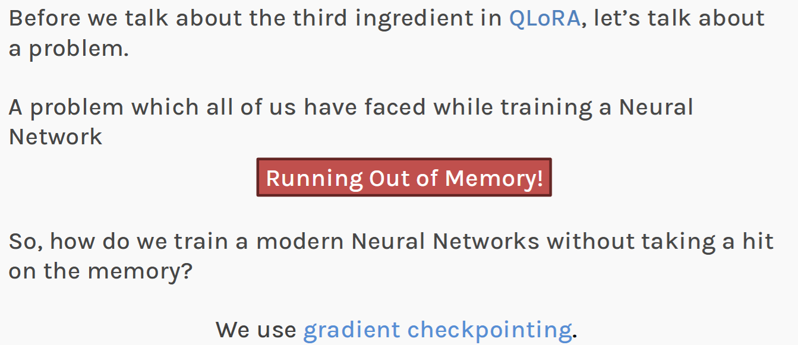
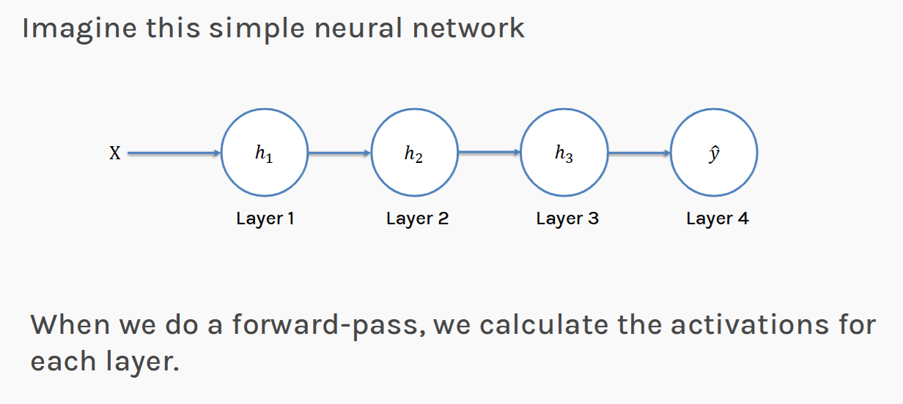
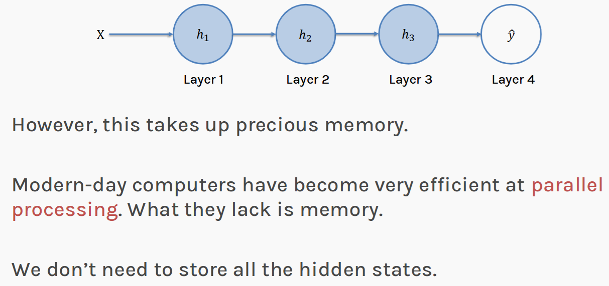
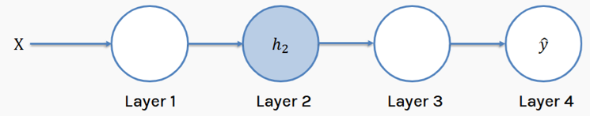
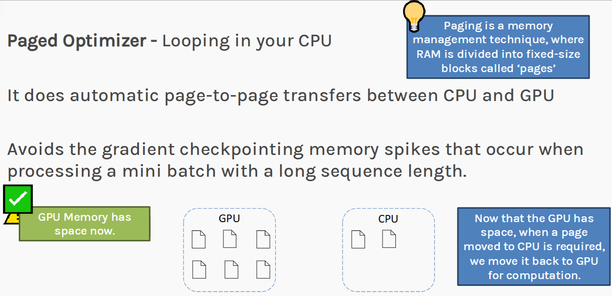

# Section E — Memory Engineering
### Slides 41–48 · Gradient Checkpointing & Paged Optimizers

> **Objective:** LoRA cut the *trainable* parameters. NF4 cut the *stored*
> weights. Neither touched the third memory consumer — **activations** — or the
> transient spikes that kill a run at 3 a.m. This section closes both gaps.

---

## E1. The GPU out-of-memory problem (slide 41)



Recall the three consumers of GPU memory during training:

| Consumer | Addressed by | Status after Sections B–D |
|---|---|---|
| **Model weights** | NF4 quantization | ✅ 16 bits → 4 bits |
| **Gradients + optimizer state** | LoRA (freeze W₀) | ✅ ~99.8% eliminated |
| **Activations** (stored for backprop) | — | ❌ **untouched** |

💡 **Learning Thought — why activations survive every trick so far**
> Activations are not parameters. They are **intermediate results** — the output
> of every layer for every token in the batch — and backpropagation needs them
> to compute gradients via the chain rule.
>
> Crucially, **activation memory scales with `batch_size × sequence_length ×
> hidden_dim × n_layers`**, not with parameter count. So it is completely
> orthogonal to everything LoRA and quantization do. Freezing weights doesn't
> help: you still need the activations of frozen layers to backprop *through*
> them to the adapter below.
>
> That last sentence is the one people get wrong in interviews.

### Measure activation memory yourself

The formula is abstract until you watch it grow. Run this and change one
variable at a time:

```python
import torch, torch.nn as nn

def activation_memory_probe(batch, seq_len, d_model=1024, n_layers=24, dtype=torch.bfloat16):
    """Rough activation footprint: ~2 tensors kept per layer for backprop."""
    bytes_per = torch.finfo(dtype).bits // 8
    per_layer = batch * seq_len * d_model * bytes_per
    total = per_layer * n_layers * 2                    # attn out + mlp out, roughly
    print(f"batch={batch:<3} seq={seq_len:<5} -> {total/1e9:6.2f} GB of activations")
    return total

activation_memory_probe(batch=1,  seq_len=512)    #  0.05 GB
activation_memory_probe(batch=4,  seq_len=512)    #  0.20 GB
activation_memory_probe(batch=4,  seq_len=2048)   #  0.81 GB
activation_memory_probe(batch=16, seq_len=2048)   #  3.22 GB
activation_memory_probe(batch=16, seq_len=8192)   # 12.88 GB   <- long context hurts
```

And the empirical version, which counts what PyTorch actually holds:

```python
model = nn.Sequential(*[nn.Linear(1024, 1024) for _ in range(24)]).cuda()
x = torch.randn(16, 2048, 1024, device="cuda")

torch.cuda.reset_peak_memory_stats()
base = torch.cuda.memory_allocated()

out = model(x)                       # forward -- activations are now RETAINED
after_fwd = torch.cuda.memory_allocated()
print(f"activations retained for backward: {(after_fwd - base)/1e9:.2f} GB")

with torch.no_grad():                # same forward, nothing retained
    torch.cuda.empty_cache()
    b2 = torch.cuda.memory_allocated()
    _ = model(x)
    print(f"same forward under no_grad       : "
          f"{(torch.cuda.memory_allocated()-b2)/1e9:.2f} GB")
```

The gap between those two numbers **is** the activation memory — the price of
being able to compute gradients at all.

### Rough scale

For a 13B-class model, batch 4, sequence 2048, ~40 layers, hidden 5120, BF16 —
activations run into **tens of GB**. On long sequences they can exceed the
quantized weights entirely.

---

## E2. Gradient checkpointing — the mechanism (slides 42, 43, 44)

Slide 42 sets up the simplest possible case — a 4-layer network:



### The normal forward pass

Standard training stores **every** intermediate activation, because the backward
pass will need them:



That caption is the entire argument for gradient checkpointing, in the deck's
own words: **compute is cheap, memory is scarce — so trade one for the other.**

```
x ──►[L1]──►[L2]──►[L3]──►[L4]──►[L5]──►[L6]──► loss
      a1     a2     a3     a4     a5     a6
      ▲      ▲      ▲      ▲      ▲      ▲
      └──────┴──────┴──────┴──────┴──────┘
         ALL kept in memory until backward
```

Memory: **O(n)** for n layers.

### The naive fix (slide 44)

> *"Keep discarding activations after computing the next hidden state."*

```
x ──►[L1]──►[L2]──►[L3]──►[L4]──►[L5]──►[L6]──► loss
      ✗      ✗      ✗      ✗      ✗      a6
   discarded once the next layer has consumed it
```

Memory: **O(1)**. Beautiful — and broken.

### Why it's broken (slide 45)

> *"Problem: during backpropagation we must compute all the discarded
> activations again."*

To get `∂L/∂W₃` you need `a₂` (the input to layer 3). You threw it away. To
recompute `a₂` you must re-run layers 1–2 **from the input**. And you'll need
that for every layer, from the top down.

Recomputation cost: **O(n²)**. You traded a memory explosion for a compute
explosion.

---

## E3–E4. The √n compromise (slide 46)

**The insight:** don't keep everything, and don't keep nothing. Keep a **sparse
set of checkpoints** you can restart recomputation from.



> **Checkpoints are usually placed at every √n layer, considering we have an
> n-layer neural network. So when we re-compute the activations for the backward
> pass, we don't have to start from the beginning!**

```
n = 16 layers,  √n = 4  → checkpoint every 4th layer

x ─►[L1][L2][L3][L4]─►[L5][L6][L7][L8]─►[L9][L10][L11][L12]─►[L13][L14][L15][L16]
                 ●                  ●                    ●                     ●
              CHECKPOINT        CHECKPOINT           CHECKPOINT           CHECKPOINT

Backward through L11: restart from the checkpoint after L8,
                     recompute only L9, L10, L11 — 3 layers, not 11.
```

### The arithmetic that makes √n optimal

Let `k` = number of checkpoints, `n` = layers, so each segment is `n/k` layers.

```
Memory   =  k          (checkpoints held)
          + n/k        (activations within the segment being recomputed)

Minimize k + n/k   →   d/dk (k + n/k) = 1 − n/k² = 0   →   k = √n
Minimum value      =   2√n
```

Confirm numerically:

```python
import math

n = 64
for k in (1, 2, 4, 8, 16, 32, 64):
    print(f"k={k:>3} checkpoints  segment={n//k:>3} layers  memory ∝ {k + n/k:6.1f}"
          f"{'   <- minimum, k = sqrt(n)' if k == int(math.sqrt(n)) else ''}")

# k=  1 checkpoints  segment= 64 layers  memory ∝   65.0
# k=  2 checkpoints  segment= 32 layers  memory ∝   34.0
# k=  4 checkpoints  segment= 16 layers  memory ∝   20.0
# k=  8 checkpoints  segment=  8 layers  memory ∝   16.0   <- minimum, k = sqrt(n)
# k= 16 checkpoints  segment=  4 layers  memory ∝   20.0
# k= 32 checkpoints  segment=  2 layers  memory ∝   34.0
# k= 64 checkpoints  segment=  1 layers  memory ∝   65.0
```

The curve is symmetric around √n — too few checkpoints means long recompute
segments, too many means the checkpoints themselves dominate.

| | Memory | Compute overhead |
|---|---|---|
| Store everything | O(n) | none |
| Store nothing | O(1) | O(n²) |
| **Checkpoint every √n** | **O(√n)** | **~1 extra forward pass** |

For a 40-layer model: √40 ≈ 6 checkpoints, memory ∝ ~13 instead of 40 — a
**~3× activation-memory reduction** for roughly **30% extra training time**.

### Measure the real trade-off

```python
import time, torch, torch.nn as nn

class Block(nn.Module):
    def __init__(self, d=2048):
        super().__init__()
        self.net = nn.Sequential(nn.Linear(d, 4*d), nn.GELU(), nn.Linear(4*d, d))
    def forward(self, x):
        return x + self.net(x)

def bench(use_checkpointing, n_layers=24, batch=8, seq=512, d=2048):
    torch.cuda.empty_cache(); torch.cuda.reset_peak_memory_stats()
    blocks = nn.ModuleList([Block(d) for _ in range(n_layers)]).cuda()
    x = torch.randn(batch, seq, d, device="cuda", requires_grad=True)

    t0 = time.perf_counter()
    h = x
    for blk in blocks:
        if use_checkpointing:
            # DON'T store this block's internals; recompute them in the backward pass
            h = torch.utils.checkpoint.checkpoint(blk, h, use_reentrant=False)
        else:
            h = blk(h)
    h.sum().backward()
    torch.cuda.synchronize()

    return torch.cuda.max_memory_allocated()/1e9, time.perf_counter()-t0

m0, t0 = bench(False)
m1, t1 = bench(True)
print(f"without checkpointing : {m0:5.2f} GB   {t0:.3f} s")
print(f"with    checkpointing : {m1:5.2f} GB   {t1:.3f} s")
print(f"memory saved {100*(1-m1/m0):.0f}%   time cost +{100*(t1/t0-1):.0f}%")
```

Typical output: **~60–70% memory saved for ~30% more time.** That single ratio
is the whole value proposition — quote it in interviews.

💡 **Learning Thought — the recompute-vs-store trade is everywhere**
> Gradient checkpointing is an instance of a pattern you'll meet repeatedly in
> systems work: **when memory is scarcer than compute, recompute instead of
> storing.** The same shape appears in database query plans (materialize vs
> re-derive), in FlashAttention (recompute the attention matrix in the backward
> pass rather than storing it), and in functional programming's memoization
> trade-offs.
>
> GPUs are extremely fast at arithmetic and comparatively starved for memory
> bandwidth and capacity — which is exactly the regime where this trade wins.
> Slide 43 says it outright: *"Modern-day computers have become very efficient
> at parallel processing. What they lack is memory."*

**📚 Go deeper**
- [Chen et al., *Training Deep Nets with Sublinear Memory Cost* (2016)](https://arxiv.org/abs/1604.06174) — the O(√n) result
- [PyTorch `torch.utils.checkpoint` docs](https://docs.pytorch.org/docs/stable/checkpoint.html) — including the `use_reentrant` gotcha
- [Yaroslav Bulatov, *Fitting larger networks into memory*](https://medium.com/tensorflow/fitting-larger-networks-into-memory-583e3c758ff9) — the canonical explainer with animated diagrams
- [HuggingFace — *Methods and tools for efficient training on a single GPU*](https://huggingface.co/docs/transformers/perf_train_gpu_one) — the practical checklist

---

## E5. Checkpointing isn't enough (slide 47)

> *"This allows us to mitigate the OOM error **to some extent, but it doesn't
> get rid of it!** We still see some memory spikes, especially when we pass in
> long sequences in the batch."*

💡 **Learning Thought — average vs peak**
> Gradient checkpointing lowers **average** activation memory. It does not
> eliminate **peaks**. And a GPU OOM is triggered by the peak, not the average.
>
> Where do the spikes come from?
> - A batch containing an unusually long sequence
> - Memory fragmentation from repeated alloc/free of differently-sized tensors
> - The transient moment when optimizer states are updated
>
> One spike, one crash, and hours of training are gone. This is the specific,
> unglamorous failure mode that the paged optimizer exists to handle.

### See the spike

```python
import torch

torch.cuda.reset_peak_memory_stats()
for step, seq_len in enumerate([512, 512, 512, 4096, 512, 512]):   # one long batch
    x = torch.randn(8, seq_len, 2048, device="cuda")
    y = (x @ torch.randn(2048, 2048, device="cuda")).relu()
    print(f"step {step}  seq={seq_len:<5} "
          f"current={torch.cuda.memory_allocated()/1e9:5.2f} GB  "
          f"peak={torch.cuda.max_memory_allocated()/1e9:5.2f} GB")
    del x, y
```

The average is fine. Step 3 is what kills you.

---

## E6. Paged optimizers (slide 48)



**The idea:** borrow **virtual memory paging** from operating systems.

The slide's own definition: *"Paging is a memory management technique, where RAM
is divided into fixed-size blocks called 'pages'."* An OS handles "more memory
demanded than physically available" by paging inactive memory out to disk and
back on demand. QLoRA does the same thing with **NVIDIA unified memory**,
treating CPU RAM as the swap space for GPU memory.

Note the slide's flow explicitly: pages move GPU → CPU when memory is tight
("GPU Memory has space now"), and *back* when needed — *"when a page moved to
CPU is required, we move it back to GPU for computation."*

```
       GPU (VRAM, scarce)              CPU (RAM, plentiful)
   ┌────────────────────────┐        ┌────────────────────────┐
   │  weights (NF4)         │        │                        │
   │  activations           │        │                        │
   │  optimizer states  ────┼───────►│  paged out on spike    │
   │                    ◄───┼────────┼──  paged back in       │
   └────────────────────────┘        └────────────────────────┘
              ▲
      memory spike detected → automatic page-out, no crash
```

### Using it

One line in the notebook, one line in `TrainingArguments`:

```python
import bitsandbytes as bnb

# The notebook's build_optimizer():
def build_optimizer(model, cfg):
    params = [p for p in model.parameters() if p.requires_grad]
    if cfg.optimizer == "paged_adamw_8bit":
        return bnb.optim.PagedAdamW8bit(params, lr=cfg.lr)
    return torch.optim.AdamW(params, lr=cfg.lr)

# The HuggingFace Trainer equivalent:
from transformers import TrainingArguments
args = TrainingArguments(
    output_dir="out",
    gradient_checkpointing=True,          # E2-E4
    optim="paged_adamw_8bit",             # E6  -- paged AND 8-bit
    per_device_train_batch_size=4,
    gradient_accumulation_steps=4,        # effective batch 16 without the memory
    bf16=True,
)
```

Note `PagedAdamW**8bit**` does *two* things at once, and it's worth separating
them:

| Feature | What it does | Saving |
|---|---|---|
| **8bit** | Stores Adam moments in 8 bits instead of FP32 | 8 bytes → 2 bytes per trainable param |
| **Paged** | Moves those states to CPU RAM on a spike | Prevents OOM; no steady-state saving |

### What gets paged

Primarily the **optimizer states** for the LoRA parameters. These are a good
choice because:
- They're only touched once per optimizer step (not every forward/backward), so
  the transfer latency is amortized well.
- They're comparatively large among the remaining trainables.
- The access pattern is completely predictable.

💡 **Learning Thought — the value is reliability, not capacity**
> A paged optimizer does **not** meaningfully increase how large a model you can
> train. Its value is that a transient spike degrades into a **slowdown** rather
> than a **crash**.
>
> Framed for an interviewer: paging converts a *hard* failure into a *soft* one.
> On a 20-hour fine-tuning run, that is the difference between finishing and
> starting over. This "graceful degradation instead of catastrophic failure" is
> a systems-design instinct worth naming explicitly.

**📚 Go deeper**
- [NVIDIA — *Unified Memory for CUDA Beginners*](https://developer.nvidia.com/blog/unified-memory-cuda-beginners/) — the mechanism QLoRA builds on
- [8-bit Optimizers via Block-wise Quantization](https://arxiv.org/abs/2110.02861) — the `AdamW8bit` half of `PagedAdamW8bit`
- [bitsandbytes optimizers docs](https://huggingface.co/docs/bitsandbytes/main/en/optimizers)

---

## Putting E together: where each technique acts

```
GPU memory during QLoRA fine-tuning
┌──────────────────────────────────────────────────────────┐
│ Base weights W₀        → NF4 4-bit + double quant  (§D)  │
│ LoRA params A, B       → FP16, tiny                (§B)  │
│ Gradients              → only for A, B             (§B)  │
│ Optimizer states       → only for A, B; PAGED      (§E6) │
│ Activations            → GRADIENT CHECKPOINTING    (§E4) │
└──────────────────────────────────────────────────────────┘
```

Every line is a different technique attacking a different consumer. **None is
redundant.** If you can reproduce this box from memory, you understand QLoRA as
a system rather than as a list of tricks.

---

## 🎯 Interview Questions — Section E

**Q1. What is gradient checkpointing and what does it cost?**

> During the forward pass, instead of storing every layer's activations for the
> backward pass, you store only a sparse subset (checkpoints) and discard the
> rest. During backprop, when an activation is needed, you recompute it by
> re-running forward from the nearest preceding checkpoint. With checkpoints
> every √n layers, activation memory drops from O(n) to **O(√n)** at the cost of
> roughly **one extra forward pass** — in a quick benchmark, about **60–70%
> memory saved for ~30% more time**.

**Q2. Derive why √n is the optimal checkpoint spacing.**

> With k checkpoints over n layers, you hold k checkpoint activations plus up to
> n/k activations for the segment currently being recomputed. Total memory
> ∝ `k + n/k`. Differentiating: `1 − n/k² = 0` → `k = √n`, giving minimum memory
> `2√n`. The cost curve is symmetric about √n — fewer checkpoints means longer
> recompute segments; more checkpoints means the checkpoints themselves dominate.

**Q3. Why doesn't LoRA reduce activation memory?**

> Because activations are needed to backpropagate *through* a layer, not just to
> update it. Even with W₀ frozen, gradients must flow backward through the
> frozen layers to reach the adapters below, and that chain-rule computation
> requires the stored inputs of each layer. Activation memory scales with
> `batch × seq_len × hidden × layers` — it is independent of how many parameters
> are trainable. You can verify this by comparing peak memory of a forward pass
> under `no_grad()` versus with autograd enabled.

**Q4. What is a paged optimizer and when does it help?**

> It uses NVIDIA unified memory to automatically page optimizer states between
> GPU VRAM and CPU RAM, analogous to OS virtual-memory paging to disk. When a
> transient memory spike would otherwise cause an OOM, states are evicted to CPU
> RAM and paged back when needed. It helps in exactly the marginal case: your
> run *almost* fits, and occasional long sequences or fragmentation push it over.
> It converts a crash into a slowdown. Note `PagedAdamW8bit` bundles two ideas —
> paging (spike protection) and 8-bit states (a real 4× saving on optimizer
> memory).

**Q5. You're OOMing during QLoRA fine-tuning. Walk me through your fixes, in order.**

> 1. **Reduce batch size**, compensating with gradient accumulation to keep the
>    effective batch constant — free, no quality cost.
> 2. **Enable gradient checkpointing** — ~3× activation reduction for ~30% time.
> 3. **Enable paged optimizers** (`paged_adamw_8bit`) — handles spikes, and the
>    8-bit states cut optimizer memory 4×.
> 4. **Reduce max sequence length**, or filter/bucket long examples — activation
>    memory is linear in sequence length (quadratic for unfused attention).
> 5. **Confirm double quantization is on** — 0.37 bits/param.
> 6. **Lower the LoRA rank r** — usually the *last* lever, because it's the only
>    one on this list that can cost you model quality.
>
> Note the ordering principle: exhaust the free levers before the ones that
> trade quality.

**Q6. Gradient checkpointing costs 30% more time. When would you not use it?**

> When you already fit comfortably in memory — you'd be paying 30% for nothing.
> Also when you're compute-bound on a very small model, or doing short runs where
> wall-clock matters more than batch size. The trade is only favourable when the
> memory it frees lets you do something you otherwise couldn't (bigger batch,
> longer sequences, larger model).

---

## 🔬 Notebook link

The notebook wires both techniques in `prepare_for_training` and
`build_optimizer`:

```python
def prepare_for_training(model, cfg):
    """LayerNorms in FP32 (that is where FP16 overflows), plus gradient checkpointing."""
    if cfg.mode in ("lora", "qlora"):
        for name, mod in model.named_modules():
            leaf = not any(True for _ in mod.children())
            if leaf and (isinstance(mod, nn.LayerNorm) or "norm" in name.lower()):
                mod.to(torch.float32)
    if cfg.gradient_checkpointing:
        if hasattr(model, "enable_input_require_grads"):
            model.enable_input_require_grads()
        try:
            model.gradient_checkpointing_enable(
                gradient_checkpointing_kwargs={"use_reentrant": False})
        except TypeError:
            model.gradient_checkpointing_enable()
    return model
```

Two production details worth stealing:

1. **`model.config.use_cache = False`** (set in `load_base_model`) — the KV cache
   is incompatible with gradient checkpointing. Forgetting this produces a
   confusing warning and silently disables checkpointing.
2. **`enable_input_require_grads()`** — with a fully frozen embedding layer, no
   input to the first checkpointed block requires grad, so autograd prunes the
   whole graph and **your adapters never train**. This call forces the input to
   require grad. It is the single most common silent QLoRA bug.

And in the experiment table, QLoRA is the only run that uses the paged optimizer:

```python
EXPERIMENTS = [
    RunConfig(name="Full fine-tuning", mode="full",  lr=2e-5, optimizer="adamw"),
    RunConfig(name="LoRA",             mode="lora",  lr=2e-4, optimizer="adamw"),
    RunConfig(name="QLoRA",            mode="qlora", lr=2e-4, optimizer="paged_adamw_8bit"),
]
```

Memory is measured with `torch.cuda.max_memory_allocated()` — **peak, not
average**, for exactly the reason in E5.

---

## ✅ Self-check before moving on

1. Name the three consumers of GPU training memory and which technique attacks
   each.
2. Why is activation memory unaffected by freezing weights? How would you
   *demonstrate* it in five lines?
3. Derive k = √n from the memory expression `k + n/k`, and show the curve is
   symmetric about it.
4. What are the memory and compute complexities of: store-all, store-none,
   checkpoint-every-√n?
5. Why does gradient checkpointing not eliminate OOM entirely?
6. What does a paged optimizer page, and why is that the right thing to page?
7. What are the two bugs that silently break gradient checkpointing in a QLoRA
   run? (`use_cache`, `enable_input_require_grads`)

➡️ **Next:** [Section F — Synthesis & Practice](F-synthesis-and-practice.md)
