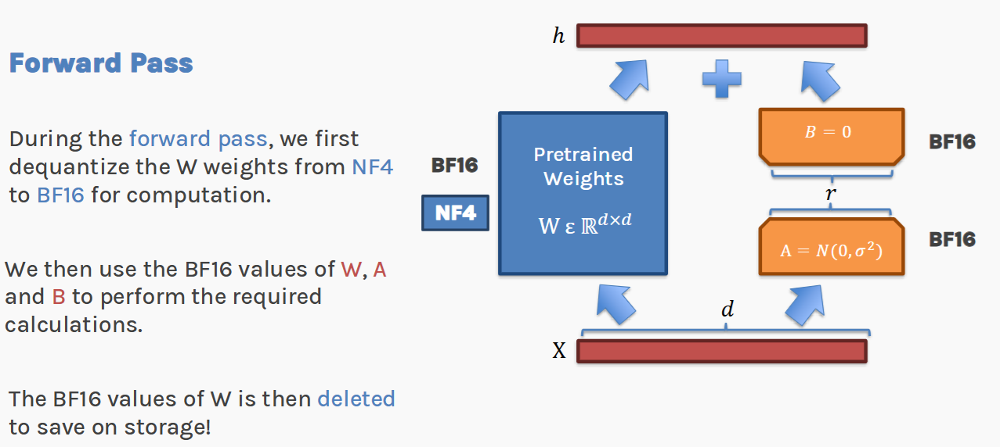
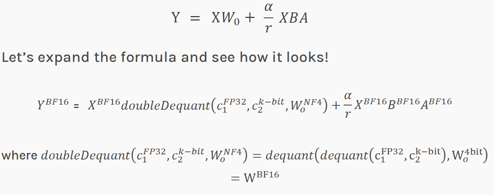
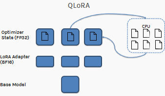

# Section F — Synthesis & Practice
### Slides 49–57 · Putting it all together, and the single-GPU answer

> **Objective:** assemble the four techniques into one training recipe, close
> the arithmetic loop that opened the session, and convert theory into a
> runnable experiment.

---

## F1. QLoRA: the ingredients assembled (slides 49–55)

```
                    ┌─────────────────────────────────┐
                    │           Q L o R A             │
                    └─────────────────────────────────┘
                                   │
        ┌──────────────┬───────────┴────────┬──────────────────┐
        │              │                    │                  │
   ┌────▼────┐   ┌─────▼──────┐    ┌────────▼───────┐  ┌──────▼──────┐
   │  LoRA   │   │    NF4     │    │     Double     │  │   Paged     │
   │ adapters│   │quantization│    │  quantization  │  │ optimizers  │
   └─────────┘   └────────────┘    └────────────────┘  └─────────────┘
    §B: fewer      §D: fewer         §D: cheaper         §E: survive
    trainable      bits per          metadata            memory
    parameters     frozen weight                         spikes
                                   + §E: gradient checkpointing
                                        for activations
```

### The forward pass, drawn (slide 52)



Read the three sentences on that slide in order — they are the algorithm:

1. *"During the forward pass, we first **dequantize** the W weights from NF4 to
   BF16 for computation."*
2. *"We then use the BF16 values of W, A and B to perform the required
   calculations."*
3. *"The BF16 values of W are then **deleted** to save on storage!"*

Step 3 is the one people forget, and it's the answer to the "doesn't
dequantization blow up memory?" question from Section D.

### The full equation (slide 55)



Start from the plain LoRA formula and annotate every tensor with its dtype:

```
Plain LoRA:
    Y  =  X W₀  +  (α/r) X B A

QLoRA, with precisions made explicit:
    Y^BF16 = X^BF16 · doubleDequant(c₁^FP32, c₂^k-bit, W₀^NF4)
             + (α/r) · X^BF16 · B^BF16 · A^BF16

    where  doubleDequant(c₁, c₂, W₀) = dequant(dequant(c₁, c₂), W₀^4bit) = W^BF16
```

**This single equation contains the entire session.** Trace it:

| Piece | Where it came from |
|---|---|
| `X W₀ + (α/r) X B A` | LoRA, [§B6](B-lora-theory.md) |
| `W₀^NF4` | 4-bit NormalFloat, [§D4](D-qlora-three-ingredients.md) |
| `c₁^FP32, c₂^k-bit` | the two levels of quantization constants, [§D10](D-qlora-three-ingredients.md) |
| `dequant(dequant(...))` | double quantization — literally a nested dequant |
| `A^BF16, B^BF16` | adapters stay in high precision because they're trainable |
| `Y^BF16` | everything computes in BF16 |

If you can write that equation from memory and explain each superscript, you can
answer any QLoRA question.

### The end-to-end forward pass in words

```
1.  W₀ sits in GPU memory as 4-bit NF4 codes + FP8 block constants
2.  A layer's turn arrives → dequantize THAT LAYER ONLY to BF16
3.  Compute  h = W₀x  +  (α/r)·B(Ax)        ← A, B stay in BF16 throughout
4.  Discard the dequantized W₀; the 4-bit version was never overwritten
5.  Backward: gradients flow through the frozen path but accumulate ONLY on A, B
6.  Optimizer step updates A, B; its states may be paged to CPU RAM
```

💡 **Learning Thought — the one-sentence definition**
> **QLoRA = train LoRA adapters in 16-bit through a base model that is stored in
> 4-bit and dequantized just-in-time, layer by layer.**
>
> Everything else — NF4, double quantization, paging, checkpointing — is
> engineering in service of that sentence. If you can say it cleanly and then
> unpack each clause, you have the session.

### The complete recipe, in production code

Everything above, as the script you would actually run:

```python
import torch
from transformers import (AutoModelForCausalLM, AutoTokenizer,
                          BitsAndBytesConfig, TrainingArguments)
from peft import LoraConfig, get_peft_model, prepare_model_for_kbit_training
from trl import SFTTrainer

MODEL = "meta-llama/Llama-2-13b-hf"

# ---- 1. QUANTIZATION (Sections C + D) --------------------------------------
bnb_config = BitsAndBytesConfig(
    load_in_4bit=True,                          # 16 bits -> 4 bits
    bnb_4bit_quant_type="nf4",                  # NormalFloat, not uniform INT4   §D4
    bnb_4bit_use_double_quant=True,             # quantize the constants          §D10
    bnb_4bit_compute_dtype=torch.bfloat16,      # dequantize to this for matmuls  §F1
)

model = AutoModelForCausalLM.from_pretrained(
    MODEL, quantization_config=bnb_config, device_map="auto")

# ---- 2. MEMORY ENGINEERING (Section E) -------------------------------------
model.config.use_cache = False                  # KV cache is incompatible w/ checkpointing
model = prepare_model_for_kbit_training(        # casts norms to FP32, enables input grads,
    model, use_gradient_checkpointing=True)     # turns on gradient checkpointing   §E2-E4

# ---- 3. LoRA ADAPTERS (Section B) ------------------------------------------
lora_config = LoraConfig(
    r=16,                                       # the rank knob                    §B7
    lora_alpha=32,                              # effective scale alpha/r = 2      §B6a
    lora_dropout=0.05,
    target_modules="all-linear",                # QLoRA paper's recommendation     §B8
    bias="none",
    task_type="CAUSAL_LM",
)
model = get_peft_model(model, lora_config)
model.print_trainable_parameters()
# trainable params: 26,214,400 || all params: 13,041,000,000 || trainable%: 0.2010

# ---- 4. TRAINING (Section E) -----------------------------------------------
args = TrainingArguments(
    output_dir="./qlora-out",
    per_device_train_batch_size=4,
    gradient_accumulation_steps=4,              # effective batch 16, small footprint
    gradient_checkpointing=True,                #                                  §E4
    optim="paged_adamw_8bit",                   # paged + 8-bit optimizer states   §E6
    learning_rate=2e-4,                         # 10x the full-FT LR -- see below
    bf16=True,
    logging_steps=10,
    num_train_epochs=3,
)

trainer = SFTTrainer(model=model, args=args, train_dataset=train_ds)
trainer.train()

# ---- 5. SAVE -- only the adapter, ~50 MB, not the 26 GB model ---------------
model.save_pretrained("./adapter-client-42")
```

Ten lines of config, and every one of them traces back to a slide.

⚠️ **Trap — from live Q&A**
> *"Can we fine-tune **any** model using QLoRA, since it works through external
> adapters without updating the frozen base?"*
>
> **Answer:** Not quite any. LoRA/QLoRA require **target layers supported by the
> PEFT implementation** — you need linear layers the library can wrap, and 4-bit
> kernels that support the architecture. The principle is general; the tooling
> coverage is not. Exotic architectures, custom fused kernels, and non-linear
> parameterizations may not be supported out of the box.

---

## F2. Can we fit an LLM on a single GPU? (slide 56) — **the closing calculation**



That diagram is the answer in picture form — note how small the base-model row
is compared to slide 19's, and that the optimizer states have an arrow pointing
off to the CPU.

The same per-parameter accounting from Section C, now with everything applied:

| Item | Bits / param | Changed by |
|---|---|---|
| Weight | **4** | ← NF4 quantization (was 16) |
| Weight gradients | ~0.4 | LoRA |
| Optimizer state | ~0.8 | LoRA |
| Adapter weights | ~0.4 | LoRA |
| **Total (slide)** | **~5.2 bits/param** | |

```
70 × 10⁹ params × 5.2 bits / 8  =  45.5 × 10⁹ bytes  ≈  46 GB
                                =  1 × data-centre GPU
```

**One GPU.** An 80 GB A100 or H100 fits a 70B fine-tune with room to spare.

*(Bookkeeping note: the four listed components sum to 5.6, not 5.2 — the deck
rounds down, presumably crediting double quantization. The conclusion is
unaffected: 5.6 bits gives 49 GB, still one GPU. The notebook's `RECIPES` dict
uses `optimizer=0.4` for QLoRA, which lands exactly on 5.2.)*

### The full journey — memorize this table

| Recipe | Bits/param | 70B footprint | GPUs | Enabled by |
|---|---|---|---|---|
| Full fine-tuning | 96 | **840 GB** | ~20 | — |
| LoRA | ~17.6 | **154 GB** | ~4 | Freeze W₀, train BA |
| **QLoRA** | **~5.2** | **46 GB** | **1** | + NF4, double quant, paging |

Reproduce it yourself with the notebook's function:

```python
RECIPES = {
    "Full fine-tuning": dict(weights=16, gradients=16,  optimizer=64,  adapters=0),
    "LoRA":             dict(weights=16, gradients=0.4, optimizer=0.8, adapters=0.4),
    "QLoRA":            dict(weights=4,  gradients=0.4, optimizer=0.4, adapters=0.4),
}

for name, rec in RECIPES.items():
    bits = sum(rec.values())
    gb   = 70e9 * bits / 8 / 1e9
    print(f"{name:<18} {bits:>5.1f} bits/param   {gb:>6.1f} GB   "
          f"{math.ceil(gb/80):>2} × 80GB GPU")

# Full fine-tuning    96.0 bits/param    840.0 GB   11 × 80GB GPU
# LoRA                17.6 bits/param    154.0 GB    2 × 80GB GPU
# QLoRA                5.2 bits/param     45.5 GB    1 × 80GB GPU
```

(The deck quotes 20/4/1 using a smaller "data-centre GPU" of ~48 GB; the shape
of the result is identical.)

**840 GB → 46 GB is an 18× reduction.** 20 GPUs → 1.

💡 **Learning Thought — where each factor came from**
> Decompose the 18×:
> - **5.5×** from LoRA (840 → 154): eliminating gradients and optimizer states
>   for the frozen 99.8%
> - **3.3×** from quantization (154 → 46): 16-bit weights → 4-bit weights
>
> And notice they're **multiplicative because they attack different terms**.
> LoRA attacks the training state; quantization attacks the weights. If they
> attacked the same term you'd get addition, not multiplication.
>
> That's the deepest lesson of the session: **stack techniques that address
> orthogonal bottlenecks.** It's why QLoRA is more than the sum of its parts.

---

## F3. Summary (slide 57) — the professor's own recap

1. **Intrinsic dimension** — the smaller dimension which may be used to solve the
   learning problem optimally
2. **LoRA** — a re-parameterization technique using the intrinsic-dimension idea
   to reduce the number of parameters to be updated
3. **QLoRA** — quantize the model to save space, via:
   - **NF4**-based representation of model parameters
   - **Gradient checkpointing**
   - **Paged optimization**

---

## F4. The demo notebook — a guided tour

`Copy_of_LoRA_and_QLoRA_Demo.ipynb` · 8 sections · **implements LoRA from
scratch, deliberately without `peft`**

| Notebook § | What it does | Maps to |
|---|---|---|
| 1 | Memory accounting as a runnable function | [§C1–C2](C-quantization-foundations.md) |
| 2 | `LoRALinear` from scratch | [§B5–B6](B-lora-theory.md) |
| 3 | Global config; `find_lora_targets()`; parameter budget vs rank | [§B8](B-lora-theory.md) |
| 4 | `BitsAndBytesConfig`; load same model FP16 vs NF4 and measure error | [§C, §D](D-qlora-three-ingredients.md) |
| 5 | Dataset: **text-to-SQL**; evaluation setup | — |
| 6 | Training pipeline | [§E](E-memory-engineering.md) |
| 7 | **Full FT vs LoRA vs QLoRA** — same model, same data, same steps | all |
| 8 | **Rank sweep** r ∈ {1, 4, 16, 64}; conclusions; references | [§B7](B-lora-theory.md) |

### The central design insight in the notebook

```python
class LoRALinear(nn.Module):
    """h = W0 @ x  +  (alpha / r) * B @ (A @ x)"""
```

From the notebook's own commentary:

> `base_layer` can be any linear layer, and we never inspect what it is. Pass an
> ordinary `nn.Linear` and this is **LoRA**. Pass a
> `bitsandbytes.nn.Linear4bit` — which is what `BitsAndBytesConfig` turns every
> linear layer into at load time — and the exact same class becomes **QLoRA**.

💡 **Learning Thought**
> That is the cleanest possible statement of the relationship between the two
> methods. **LoRA and QLoRA differ only in the dtype of the frozen base layer.**
> Not in the algorithm, not in the math, not in the training loop. One line of
> config.

### The controlled comparison (notebook §7)

```python
assert torch.cuda.is_available(), "Runtime > Change runtime type > T4 GPU, then re-run."

EXPERIMENTS = [
    RunConfig(name="Full fine-tuning", mode="full",  lr=2e-5, optimizer="adamw"),
    RunConfig(name="LoRA",             mode="lora",  lr=2e-4, optimizer="adamw"),
    RunConfig(name="QLoRA",            mode="qlora", lr=2e-4, optimizer="paged_adamw_8bit"),
]

RESULTS = {}
for cfg in EXPERIMENTS:
    RESULTS[cfg.name] = run_experiment(cfg, verbose=(cfg.mode == "qlora"))
```

Same model, same data, **same batches in the same order** — the notebook builds
one pair of DataLoaders shared by all three runs, so the only variable is the
method.

⚠️ **The learning rates differ deliberately — and this is a real lesson.**
Full fine-tuning uses `2e-5`; LoRA/QLoRA use `2e-4`, **10× higher**. Why?
Full FT moves every one of 410M weights a tiny amount. LoRA moves ~1M
parameters, and those few must travel much further to produce the same change in
behaviour. Copying the full-FT learning rate into a LoRA run is one of the most
common reasons people conclude "LoRA doesn't work."

### Setup notes

- **Model:** `EleutherAI/pythia-410m` (Apache 2.0) — small enough that *all
  three* methods (including full fine-tuning) actually run on a free T4
- **Task:** text-to-SQL — a 410M base has seen SQL but doesn't know it should
  answer *only* with a query:

  ```python
  PROMPT = ("### Task\nWrite a SQL query that answers the question, using only "
            "the given schema.\n\n### Schema\n{context}\n\n"
            "### Question\n{question}\n\n### SQL\n")
  IGNORE = -100

  def encode(ex, tok, max_len):
      """Tokenize prompt + answer, MASKING THE PROMPT OUT OF THE LOSS."""
      p = tok(build_prompt(ex), add_special_tokens=False)["input_ids"]
      a = tok(ex["answer"].strip() + tok.eos_token, add_special_tokens=False)["input_ids"]
      return {"input_ids": p + a, "labels": [IGNORE] * len(p) + a}
  ```

  Note the `labels = [IGNORE] * len(p) + a` line: loss is computed **only on the
  answer tokens**, never on the prompt. Getting this wrong teaches the model to
  generate schemas instead of queries — a classic instruction-tuning bug.
- **Requires:** Runtime → Change runtime type → **T4 GPU**

⚠️ **Known issue — from live Q&A** (you will hit this)
> *"Running QLoRA after LoRA produces: `AttributeError: 'LoRALinear' object has
> no attribute 'in_features'`. But QLoRA works in the later rank-sweep section."*
>
> **Cause:** stale runtime / **double wrapping** — a model already wrapped with
> `LoRALinear` gets wrapped again, and the wrapper doesn't expose
> `in_features`. It is not a GPU-type issue.
>
> **Fix:** Restart the runtime and **Run All** cells once, in order, so each
> experiment loads a fresh base model before LoRA injection.
>
> **Why it happens:** `LoRALinear.__init__` reads `base_layer.in_features`, but
> `LoRALinear` itself never defines that attribute. A one-line hardening fix:
> ```python
> self.in_features, self.out_features = d_in, d_out   # make wrapping idempotent
> ```

---

## F5. Reading the rank sweep — the practical payoff

```python
RANKS, SWEEP_STEPS, SWEEP_GEN = (1, 4, 16, 64), 120, 24

sweep = {}
for r in RANKS:
    cfg = RunConfig(name=f"QLoRA r={r}", mode="qlora",
                    lora_r=r, lora_alpha=2 * r,      # <-- alpha = 2r
                    lr=2e-4, max_steps=SWEEP_STEPS, optimizer="paged_adamw_8bit")
    sweep[r] = run_experiment(cfg, n_gen=SWEEP_GEN, eval_before=False, verbose=False)
```

Note `lora_alpha = 2 * r`, so the effective scale `α/r = 2` stays **fixed** while
r varies. Without that, you'd be sweeping rank *and* strength simultaneously and
couldn't attribute the result to either. **This is good experimental hygiene and
worth copying.**

**What to expect** (from the notebook's own guidance):

> Quality improves steeply from r=1 to about **r = 8–16**, then flattens: once
> the adapter has enough directions to express the update this task needs, extra
> rank adds parameters without adding skill. Meanwhile the **cost curve is almost
> flat** — peak memory barely moves.

```
quality                                    memory
  │           ╭──────────────              │
  │        ╭──╯                            │  ────────────────
  │      ╭─╯                               │
  │    ╭─╯                                 │
  │  ╭─╯                                   │
  └──┴──┴───┴────┴─────► r                 └──┴──┴───┴────┴──► r
     1  4   16   64                           1  4   16   64
```

💡 **Learning Thought — this plot *is* the intrinsic-dimension hypothesis, measured**
> The flattening point is an **empirical estimate of the intrinsic rank of this
> task's update**. Section B claimed ΔW has low intrinsic rank; the knee in this
> curve is where that claim becomes a number you can point at.
>
> And note the practical implication of the flat cost curve: since memory barely
> changes with r, **there is little reason to under-provision rank**. Pick the
> knee, or slightly above it. The risk of r too small (underfitting) is real; the
> risk of r too large is mostly wasted parameters, not wasted memory.

---

## 🎯 Consolidated Interview Bank

### Conceptual

**Q1. Explain QLoRA in 60 seconds.**

> QLoRA fine-tunes large language models on limited hardware by combining four
> things. LoRA freezes the pre-trained weights and learns a low-rank update
> `ΔW = BA`, which eliminates gradients and optimizer state for ~99.8% of
> parameters. On top of that, the frozen weights are stored in **NF4** — a
> 4-bit data type whose levels are normal-distribution quantiles, matched to how
> LLM weights are actually distributed — applied block-wise so outliers can't
> destroy precision. **Double quantization** compresses the resulting block
> constants, saving another 0.37 bits per parameter. **Paged optimizers** handle
> transient memory spikes by swapping optimizer state to CPU RAM. Together these
> take 70B fine-tuning from ~840 GB across 20 GPUs to ~46 GB on one.

**Q2. What's the difference between LoRA and QLoRA?**

> QLoRA = LoRA + the frozen base model stored in 4-bit NF4 (plus double
> quantization and paged optimizers). The adapter math, the training loop, and
> the trainable parameters are identical. In code it is literally the dtype of
> the base layer: wrap an `nn.Linear` and you have LoRA; wrap a
> `bitsandbytes.Linear4bit` and the same wrapper is QLoRA.

**Q3. What's the theoretical justification for LoRA?**

> Li et al. (2018) showed learning problems have an **intrinsic dimension** far
> smaller than the model's parameter count — BERT on MRPC has intrinsic
> dimension ~200 against 110M parameters. Hu et al. extended this: if solutions
> live on a low-dimensional manifold, the *update* that moves a pre-trained model
> to a fine-tuned one should have low intrinsic **rank**. LoRA imposes that as a
> hard constraint via `ΔW = BA`, and it holds empirically — you can verify it by
> taking the SVD of `W_finetuned − W_base` and seeing how few singular values
> carry 90% of the energy.

**Q4. Why is ΔW lower-rank than W?**

> W encodes everything learned from a trillion pre-training tokens — genuinely
> high-rank information. ΔW encodes a narrow behavioural shift: "answer in SQL,"
> "adopt compliance-hedged tone." There's no reason a narrow shift needs many
> independent directions. The compressibility lives in the delta, not the model.

### Mathematical

**Q5. LLaMA-13B, r=16, adapting Q/K/V/O in all 40 layers. Adapter size?**

> `r(d+k) = 16 × (5120+5120) = 163,840` per matrix; `× 4 matrices = 655,360` per
> layer; `× 40 layers = 26.2M` parameters; at FP16 that's `2 × 26.2M = 52.4 MB`,
> about **0.2%** of the base model.

**Q6. 70B model, QLoRA. Memory budget?**

> 4 bits weights + ~0.4 gradients + ~0.8 optimizer + ~0.4 adapters ≈ 5.2
> bits/param. `70e9 × 5.2 / 8 ≈ 46 GB`. Fits one 80 GB A100, leaving headroom
> for activations and batch.

**Q7. Why divide by r in `(α/r)BA`?**

> `(BA)ᵢⱼ` is a sum of r terms, so its expected magnitude grows with r (as √r
> under standard init). Without normalization a learning rate tuned at r=8 would
> be far too aggressive at r=64. Dividing by r makes the update scale
> approximately rank-invariant, so α becomes a single "LoRA strength" knob you
> tune once. It's a heuristic, not a theorem — and arguably over-corrects, which
> is why rsLoRA proposes √r instead.

### Systems

**Q8. Design a fine-tuning setup for a 70B model on 2× A100 80GB.**

> QLoRA with NF4 + double quantization (~35 GB of weights), LoRA r=16–32 on all
> linear layers, gradient checkpointing enabled, `paged_adamw_8bit`, BF16 compute
> dtype. That fits on one GPU with room for activations; use the second for a
> larger batch via DDP, or for concurrent evaluation. I'd start with a small
> effective batch plus gradient accumulation, measure **peak** memory, then grow
> the batch until I'm near the ceiling.

**Q9. Your fine-tuned model performs worse than base on general tasks. Diagnose.**

> Catastrophic forgetting. First suspect **α too high** — it's the deviation
> knob, so lower it. Then check: too many training steps on a narrow dataset;
> learning rate too high; adapters injected on too many modules; training data
> lacking any general-capability examples. Fixes in order: reduce α, reduce
> epochs/steps, mix in some general instruction data, lower LR. Reducing r is a
> blunter instrument and usually not the first move.

**Q10. Your LoRA run isn't learning at all. Debug it.**

> A checklist, cheapest first:
> 1. **Learning rate too low** — did you copy `2e-5` from a full-FT recipe? LoRA
>    typically needs `1e-4`–`3e-4`.
> 2. **`enable_input_require_grads()` missing** with gradient checkpointing +
>    frozen embeddings — autograd prunes the graph and the adapters get no
>    gradient. Silent, and very common.
> 3. **Both A and B initialized to zero** — gradients are identically zero
>    forever. Print `grad.norm()` on both after one step.
> 4. **`mark_only_lora_as_trainable` not called**, or called before injection.
>    Check `print_trainable_parameters()` shows ~0.2%, not 0% and not 100%.
> 5. **Loss masking wrong** — if labels aren't `-100` on the prompt, the model
>    optimizes the wrong objective.

**Q11. Would quantization fix my slow document-processing pipeline?**

> *(A real question from the live session — and the answer is a useful "no".)*
> If the pipeline extracts text from PDFs/PNGs and 100 documents take 30
> minutes, **fine-tuning and quantization are both the wrong tool** — the
> bottleneck is parsing/OCR, not LLM inference. Fix it with **parallel
> requests**, a **dedicated OCR engine**, **batching**, and sending only the
> extracted text to the LLM. Always profile before optimizing the part you find
> most interesting.

---

## 🧭 Where to go next

### Immediate practice (do these in order)

1. **Run the notebook end-to-end on a T4** — restart runtime, Run All, in order.
2. **Ablate double quantization**: set `bnb_4bit_use_double_quant=False`.
   Expected: **+0.37 bits/param, identical quality.**
3. **Ablate NF4**: set `bnb_4bit_quant_type="fp4"`. Expected: **slightly worse** —
   this is the direct evidence that distribution-matching earns its keep.
4. **Scale up**: `MODEL_ID = "TinyLlama/TinyLlama-1.1B-Chat-v1.0"`. Expected:
   **full fine-tuning OOMs; QLoRA does not.** This is the session's thesis,
   demonstrated on your own hardware.
5. **Break it on purpose**: set `lr=2e-5` on the LoRA run and watch it barely
   learn. Then set both A and B to zero init and watch it learn *nothing*.
   Deliberately reproducing failures is the fastest way to internalize §B6c.
6. **Re-run the rank sweep** on a harder task and find where *its* knee sits.

### Extra resources from the notebook

- PEFT-library-only fine-tuning: https://colab.research.google.com/drive/1Dnj1pbYL2k7ckZ3Xa1ktpOq42jcKB5Bt
- LoRA from scratch (Lightning AI): https://lightning.ai/lightning-ai/studios/code-lora-from-scratch
- Multi-tenant serving: https://github.com/predibase/lorax

### Canonical external references

| Resource | Why |
|---|---|
| [QLoRA paper](https://arxiv.org/abs/2305.14314) | §3 is Sections C–E of this session |
| [LoRA paper](https://arxiv.org/abs/2106.09685) | §7.2–7.3 answer "what rank?" empirically |
| [HF: 4-bit quantization & QLoRA](https://huggingface.co/blog/4bit-transformers-bitsandbytes) | The official implementation walkthrough |
| [Raschka, *Practical Tips for Finetuning LLMs Using LoRA*](https://magazine.sebastianraschka.com/p/practical-tips-for-finetuning-llms) | Hundreds of ablations on r, α, target modules |
| [PEFT documentation](https://huggingface.co/docs/peft/index) | The library reference |
| [TRL `SFTTrainer`](https://huggingface.co/docs/trl/sft_trainer) | The trainer used in the production recipe above |

### Beyond this session

| Topic | Why it follows |
|---|---|
| [**DoRA**](https://arxiv.org/abs/2402.09353) (Weight-Decomposed LoRA) | Splits ΔW into magnitude + direction; often beats LoRA at equal r |
| [**LoRA+**](https://arxiv.org/abs/2402.12354) | Different learning rates for A and B — a one-line change with real gains |
| [**AdaLoRA**](https://arxiv.org/abs/2303.10512) | Allocates rank adaptively across layers instead of a uniform r |
| [**rsLoRA**](https://arxiv.org/abs/2312.03732) | Argues the α/r scaling should be α/√r |
| [**GPTQ**](https://arxiv.org/abs/2210.17323) / [**AWQ**](https://arxiv.org/abs/2306.00978) | Post-training quantization for *inference*; contrast with NF4's training focus |
| [**FlashAttention**](https://arxiv.org/abs/2205.14135) | Same recompute-vs-store trade as gradient checkpointing, applied to attention |
| [**vLLM**](https://docs.vllm.ai/) / [**S-LoRA**](https://arxiv.org/abs/2311.03285) | Production multi-LoRA serving — Section A's architecture, industrialized |

---

## ✅ Final self-check — the whole session

1. Draw the concept map from PEFT down to QLoRA.
2. State the intrinsic-dimension hypothesis and the LoRA extension of it.
3. Write the LoRA forward pass and explain every symbol.
4. Write the **full QLoRA equation** from slide 55, with every dtype superscript.
5. Explain the initialization of A and B, and what breaks under alternatives.
6. Derive adapter size for any (d, k, L, M, r).
7. Explain why uniform quantization fails, and the two orthogonal fixes.
8. Reproduce the NF4 six-step pipeline on a small tensor.
9. Explain double quantization and quantify its saving.
10. Derive √n checkpoint spacing.
11. Write the 10-line production QLoRA config from memory.
12. Reproduce the 840 GB → 154 GB → 46 GB chain, stating which technique caused
    each drop and **why the two factors multiply rather than add**.

If you can do all twelve without notes, you know this session better than most
people who have shipped a QLoRA fine-tune.

⬅️ **Back to** [Index](00-INDEX.md)
