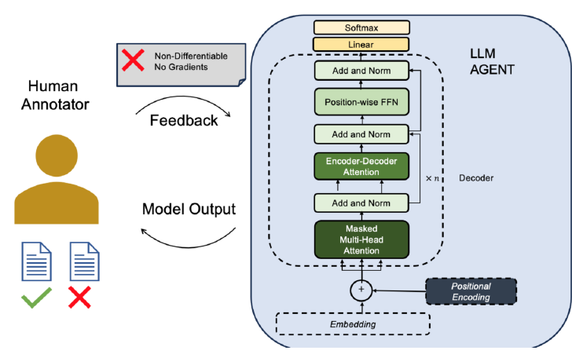
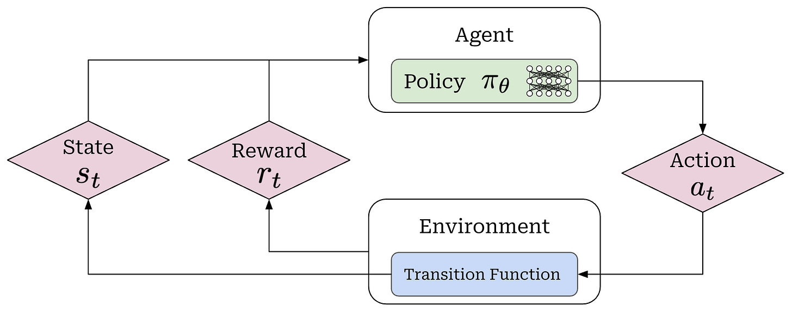

# §2 — Reinforcement Learning Foundations

> **Slides 9–15, 22** · Topics 6–11
> *Pure RL. No LLMs yet — that's §3. Get the vocabulary solid here and §3 becomes a translation exercise.*

---

## The one-line story of this section

> RL is the framework for learning **sequential decisions from a scalar reward signal** when you cannot supervise each individual decision. That description matches alignment exactly: nobody can tell you the "correct" token, but a human can tell you whether the finished response was good.

---

## Topic 6 — The LM as a Next-Token Predictor (slides 9–10)

A quick recap, but with a purpose: the deck is about to *re-describe* this familiar object in RL vocabulary.

### Slide 9 — The LM is a conditional distribution

```
P( _______ | "Kharagpur is a town in" )

   West       →  0.6
   Kerala     →  0.1
   Taj        →  0.002
   Australia  →  0.0001
```

Formally, a language model with parameters θ defines:

$$P_\theta(w_t \mid w_1, w_2, \ldots, w_{t-1})$$

— a probability distribution over the **entire vocabulary** (30k–200k tokens), conditioned on everything before.

### 🔬 Reproduce slide 9 exactly

Run this and you will see the actual probability distribution the slide is drawing.

```python
# pip install transformers torch
from transformers import AutoModelForCausalLM, AutoTokenizer
import torch

MODEL = "Qwen/Qwen2-0.5B"          # base model — a pure next-token predictor
tok = AutoTokenizer.from_pretrained(MODEL)
mdl = AutoModelForCausalLM.from_pretrained(MODEL, dtype=torch.float32)
mdl.eval()

prompt = "Kharagpur is a town in"
ids = tok(prompt, return_tensors="pt")

with torch.no_grad():
    logits = mdl(**ids).logits          # (batch, seq_len, vocab_size)

# The LAST position's logits predict the NEXT token
next_token_logits = logits[0, -1, :]                 # (vocab_size,)
probs = torch.softmax(next_token_logits, dim=-1)     # ← this IS π(a | s)

print(f"Vocabulary size (action space) : {probs.shape[0]:,}")
print(f"Probabilities sum to           : {probs.sum():.4f}\n")

top = torch.topk(probs, 10)
print(f"P( ___ | '{prompt}' )")
print("-" * 46)
for p, i in zip(top.values, top.indices):
    print(f"  {tok.decode(i):<20s} {p.item():.4f}")

# Probability of SPECIFIC candidate tokens (the slide's four)
print("\nSlide 9's candidates:")
for word in [" West", " Kerala", " Taj", " Australia"]:
    tid = tok.encode(word, add_special_tokens=False)[0]
    print(f"  {word:<12s} -> {probs[tid].item():.6f}")
```

> 💡 **`probs` is the policy.** Not "like" a policy — it *is* `π_θ(a|s)`, the exact object §3 will hand to the RL machinery. You just computed it. Note the action space size printed on line 1: ~152,000 for Qwen2. Compare with the mouse's 4 actions in Topic 8, and you have an intuition for why LLM-RL is hard.

### Slide 10 — Autoregressive generation

```
 Time=0   "Where is Kharagpur?"                              → LLM → "Kharagpur"
 Time=1   "Where is Kharagpur? Kharagpur"                     → LLM → "is"
 Time=2   "Where is Kharagpur? Kharagpur is"                  → LLM → "in"
 Time=3   "Where is Kharagpur? Kharagpur is in"               → LLM → "West"
 Time=4   "Where is Kharagpur? Kharagpur is in West"          → LLM → "Bengal"
```

### 🔬 Slide 10, as a manual generation loop

`model.generate()` hides the loop. Write it yourself once — this is *literally* the RL rollout you will sample in §5.

```python
prompt = "Where is Kharagpur?"
ids = tok(prompt, return_tensors="pt")["input_ids"]

print(f"{'t':>2} | {'STATE (context so far)':<52} | ACTION")
print("-" * 78)

for t in range(6):
    with torch.no_grad():
        logits = mdl(input_ids=ids).logits[0, -1, :]
    probs = torch.softmax(logits, dim=-1)

    # Stochastic policy: SAMPLE, don't argmax. (Exploration — see §3 Q4.)
    action = torch.multinomial(probs, num_samples=1)

    state_str = tok.decode(ids[0])
    print(f"{t:>2} | {state_str[-52:]:<52} | {tok.decode(action)!r}")

    # THE TRANSITION FUNCTION: s_{t+1} = s_t || a_t   (just concatenation)
    ids = torch.cat([ids, action.unsqueeze(0)], dim=1)

print("\nFinal trajectory:", tok.decode(ids[0]))
```

Three properties to notice, because each maps onto an RL concept in §3:

1. **The input grows.** At each step the context is the original prompt *plus everything generated so far*. → this will be the **state**.
2. **One token is emitted per step.** → this will be the **action**.
3. **The choice is stochastic.** The model outputs a *distribution*; sampling (temperature, top-p) picks one. → this will be the **policy**.

### 💡 Learning thought

> An LLM is *already* a sequential decision-maker. RLHF does not bolt RL onto a language model — it **recognises** that the language model was an RL agent all along, and starts training it as one. This reframing is the single most important cognitive move in the whole session.

### 🔗 Resources for Topic 6

- **[Andrej Karpathy — Let's build GPT from scratch](https://www.youtube.com/watch?v=kCc8FmEb1nY)** — if the autoregressive loop above isn't yet second nature, watch this first. Everything else depends on it.
- **[HuggingFace — How to generate text](https://huggingface.co/blog/how-to-generate)** — greedy / beam / sampling / top-k / top-p explained. Directly relevant: your decoding strategy *is* your exploration strategy during RL rollouts.
- **[The Illustrated GPT-2](https://jalammar.github.io/illustrated-gpt2/)** — Jay Alammar's visual walkthrough of causal masking and next-token prediction.

---

## Topic 7 — Why Reinforcement Learning? (slides 11–12)

Slide 12 shows this diagram, and it says the whole thing in one picture:



*Slide 12: a human annotator gives feedback on model output. The red box — **"Non-Differentiable, No Gradients"** — sits directly on the feedback arrow. That broken arrow is the entire reason RL enters the story.*

Read the picture carefully. The forward path (embedding → attention → linear → softmax) is fully differentiable — that's ordinary training. The **return path**, from the human's ✓/✗ judgement back into the weights, is not. **RL is the bridge across that gap.**

Slide 11 gives three reasons. Each deserves unpacking.

### Reason 1 — LLMs lack intrinsic understanding of nuanced human preferences and societal norms

Pretraining optimises *likelihood of internet text*. The internet contains brilliant answers, terrible answers, toxic answers, and confidently wrong answers — all with non-zero probability mass. Maximum likelihood has no mechanism for preferring one over another beyond frequency. **Frequency is not quality.**

### Reason 2 — Humans excel at evaluating and selecting model outputs

> *"Intuitively weigh complex factors like context, cultural nuances, and ethical implications — challenging for automated systems to grasp and incorporate."*

The asymmetry that makes the whole field work:

```
   GENERATING a great response   :  hard for humans, slow, expensive
   EVALUATING two responses      :  easy for humans, fast, cheap
```

RLHF is built on the *evaluation* side of that asymmetry. This is the same asymmetry that makes P vs NP interesting, and the same one behind "I can't write you a good poem but I know one when I see it."

### Reason 3 — Conventional loss functions are impractical

> *"Traditional loss function to train the language model to align with human preferences through conventional optimization techniques is impractical."*

Why supervised learning breaks down here — four independent reasons:

| Obstacle | Explanation |
|---|---|
| **No ground-truth label** | For "write me a poem about loss," what is *the* correct token sequence? There are millions of good ones. |
| **Quality is a property of the whole sequence** | A response can be bad because of its *ending*, its *tone*, or something it *omitted*. Per-token cross-entropy can't express that. |
| **The signal is non-differentiable** | Human judgement is a black box. You cannot backprop through a person. *(The red box in the slide-12 diagram above.)* |
| **The signal is sparse and delayed** | One scalar arrives *after* 500 tokens. Which token caused it? This is the **credit assignment problem** — RL's home turf. |

### 🔬 Watch the gradient break

You can demonstrate reason 3 in ten lines. This is worth running once — it makes "non-differentiable" concrete rather than a phrase you nod at.

```python
import torch

# A fake "model output" we want gradients for
logits = torch.randn(5, requires_grad=True)
probs  = torch.softmax(logits, dim=0)

# ── Case A: a DIFFERENTIABLE loss (ordinary supervised learning) ──
target = torch.tensor(2)
loss_a = -torch.log(probs[target])
loss_a.backward()
print("A) supervised loss  -> grad exists:", logits.grad is not None)
print("   grad:", logits.grad.numpy().round(3))

# ── Case B: the human judgement path ──
logits.grad = None
probs = torch.softmax(logits, dim=0)
chosen = torch.argmax(probs)                 # ⚠️ argmax: gradient dies here
human_score = 1.0 if chosen.item() == 2 else 0.0   # a HUMAN produced this number
loss_b = torch.tensor(human_score)           # a bare constant — no graph attached
print("\nB) human reward     -> requires_grad:", loss_b.requires_grad)
try:
    loss_b.backward()
except RuntimeError as e:
    print("   backward() FAILS:", str(e)[:70])
print("   grad:", logits.grad)               # None — nothing propagated

# ── Case C: the REINFORCE trick — what RL actually does (§4) ──
logits.grad = None
probs = torch.softmax(logits, dim=0)
action = torch.multinomial(probs, 1)         # SAMPLE instead of argmax
reward = 1.0 if action.item() == 2 else 0.0  # still a plain number from a human
surrogate = -torch.log(probs[action]) * reward   # weight log-prob BY the reward
surrogate.backward()
print("\nC) REINFORCE        -> grad exists:", logits.grad is not None)
print("   grad:", logits.grad.numpy().round(3))
print("\n   The reward never needed to be differentiable —")
print("   we differentiate log π and SCALE it by the reward.")
```

> 💡 **Case C is the entire policy-gradient idea, four sections early.** You do not differentiate the reward. You differentiate `log π(a|s)` — which *is* differentiable — and multiply by the reward as a plain scalar weight. When you reach the derivation in [§4](04-policy-gradient.md), you will already have run it.

### The comparison table to memorise

| | Supervised Learning | Reinforcement Learning |
|---|---|---|
| Signal | Correct label per example | Scalar reward, possibly delayed |
| Density | Every token labelled | Often one number per episode |
| Data source | Fixed dataset | **Generated by the model itself** |
| Objective | Minimise prediction error | Maximise expected cumulative reward |
| Handles "no single right answer"? | No | Yes |
| Handles credit assignment? | N/A | Yes — its central problem |

The row that matters most is **"data source"**: in RL the model produces its own training data. That is why RLHF can exceed the quality of your annotators, whereas SFT cannot.

### ⚠️ Class Q&A

**"Where do we actually need this kind of RL modelling? Where would I use it as an Agentic AI engineer?"**
> Use RL when an agent makes a **sequence of decisions** and the quality of the **final outcome** is measurable by a reward. Examples given: coding agents (did the test suite pass?), web/browser agents (was the task completed?), customer-support assistants (was the ticket resolved?). The common shape: *no per-step supervision, checkable end result.*

**"Is there a difference between RL in classical ML and the RL used in GenAI with thumbs up/down feedback?"**
> The core idea is identical — use outcome feedback to change future behaviour. What differs is (a) how the reward is obtained (a simulator/environment vs. human judgement), (b) episode length and structure, and (c) that in GenAI the "environment" is trivial (append the token) while the *reward* is the hard part. In classical RL the environment is hard and the reward is given.

### 💡 Learning thought

> RL is not chosen because it is elegant — it is chosen because **every alternative is unavailable.** You cannot label, cannot differentiate, cannot enumerate. RL is the framework that survives when you only have a scalar score on a finished attempt. Keep this in mind: RLHF's complexity in §5–§7 is a *cost*, and DPO in §10 is the discovery that for this particular problem, some of that cost was avoidable.

### 🔗 Resources for Topic 7

- **[OpenAI Spinning Up — Introduction to RL](https://spinningup.openai.com/en/latest/spinningup/rl_intro.html)** — the single best concise introduction to RL for people with an ML background. Parts 1–3 cover everything in this section, properly.
- **[Sutton & Barto, *Reinforcement Learning: An Introduction* (free PDF)](http://incompleteideas.net/book/RLbook2020.pdf)** — the textbook. Chapter 1 and 3 are the relevant ones here.
- **[HuggingFace Deep RL Course, Unit 1](https://huggingface.co/learn/deep-rl-course/unit1/introduction)** — free, hands-on, notebook-driven. If you want to *build* RL intuition rather than read about it, start here.

---

## Topic 8 — The RL Setup: The Mouse-and-Cheese Grid (slide 13)

The canonical toy problem. Every term here is used verbatim for LLMs in §3.


*Slide 13's grid world: the mouse (agent) navigates toward the cheese (+100), avoiding the cat and the trap (−1, terminal).*

```
     ┌─────┬─────┬─────┬─────┐
     │ 🐭  │     │     │     │      🐭  mouse   = AGENT
     ├─────┼─────┼─────┼─────┤      🐱  doll cat (reward −1)
     │     │ 🐱  │     │ 🪤  │      🪤  trap    (reward −1, episode ENDS)
     ├─────┼─────┼─────┼─────┤      🧀  cheese  (reward +100)
     │     │     │     │ 🧀  │
     └─────┴─────┴─────┴─────┘
```

### The six components (slide 13, verbatim)

| Component | In the grid world |
|---|---|
| **Agent** | The mouse |
| **State** | The position (x, y) of the mouse in the grid |
| **Action** | Move one of 4 directionally-connected cells. **Invalid move → stay put.** Every move produces a new state and a reward |
| **Reward model** | empty cell → `0` · doll cat → `−1` · mouse trap → `−1` **and episode ends, restart from initial position** · cheese → `+100` |
| **Policy** | How the agent selects the action to perform in a given state |
| **Transition model** | How the environment maps (state, action) → next state |

**Goal:** *"To select a policy that maximizes the expected return when the agent acts according to it."*

### 🔬 Build the grid world — the complete environment in 60 lines

Every term above becomes a line of code. Run this; it is the reference implementation for the whole section.

```python
import numpy as np

class MouseGrid:
    """Slide 13's grid world. 3 rows x 4 cols."""

    EMPTY, CAT, TRAP, CHEESE = 0, 1, 2, 3
    ACTIONS = {0: (-1, 0), 1: (1, 0), 2: (0, -1), 3: (0, 1)}   # U D L R
    ACTION_NAMES = {0: "UP", 1: "DOWN", 2: "LEFT", 3: "RIGHT"}

    def __init__(self):
        self.grid = np.array([
            [self.EMPTY,  self.EMPTY, self.EMPTY, self.EMPTY ],
            [self.EMPTY,  self.CAT,   self.EMPTY, self.TRAP  ],
            [self.EMPTY,  self.EMPTY, self.EMPTY, self.CHEESE],
        ])
        self.start = (0, 0)
        self.reset()

    # ---- the MDP interface -------------------------------------------
    def reset(self):
        self.pos = self.start                     # s_0
        return self.pos

    def step(self, action):
        """(s, a) -> (s', r, done).  THIS is the TRANSITION + REWARD MODEL."""
        dr, dc = self.ACTIONS[action]
        r, c = self.pos[0] + dr, self.pos[1] + dc

        # Invalid move -> stay put (slide 13: "If the move is invalid, the mouse stays there")
        if not (0 <= r < self.grid.shape[0] and 0 <= c < self.grid.shape[1]):
            r, c = self.pos

        self.pos = (r, c)                         # s_{t+1}  (DETERMINISTIC here)
        cell = self.grid[r, c]

        # THE REWARD MODEL — hand-written, exactly as slide 13 specifies.
        # ⚠️ Remember this: for LLMs, this function DOES NOT EXIST. See §8.
        if cell == self.CHEESE: return self.pos, +100.0, True
        if cell == self.TRAP:   return self.pos,   -1.0, True    # episode ENDS
        if cell == self.CAT:    return self.pos,   -1.0, False
        return self.pos, 0.0, False


def random_policy(state, n_actions=4):
    """π(a|s): uniform. The worst possible policy — our starting point."""
    return np.random.randint(n_actions)


def rollout(env, policy, max_steps=50):
    """Generate ONE TRAJECTORY  τ = (s0,a0,r0, s1,a1,r1, ...).  See Topic 10."""
    s = env.reset()
    tau = []
    for _ in range(max_steps):
        a = policy(s)
        s_next, r, done = env.step(a)
        tau.append((s, a, r))
        s = s_next
        if done:
            break
    return tau


# ---- run it -------------------------------------------------------------
np.random.seed(0)
env = MouseGrid()
tau = rollout(env, random_policy)

print("ONE TRAJECTORY under a random policy:")
print(f"{'t':>2} | {'state s_t':>10} | {'action a_t':>10} | {'reward r_t':>10}")
print("-" * 46)
for t, (s, a, r) in enumerate(tau):
    print(f"{t:>2} | {str(s):>10} | {MouseGrid.ACTION_NAMES[a]:>10} | {r:>10.1f}")

print(f"\nTrajectory length T = {len(tau)}")
print(f"Return R(tau) = sum of rewards = {sum(r for _,_,r in tau):.1f}")
```

**Try these experiments** — each one teaches a concept you will need:

```python
# 1) HIGH VARIANCE (Topic 19 / §4): same policy, wildly different returns
returns = [sum(r for _,_,r in rollout(env, random_policy)) for _ in range(200)]
print(f"Random policy over 200 episodes:")
print(f"  mean return = {np.mean(returns):7.2f}")
print(f"  std  return = {np.std(returns):7.2f}   <-- the variance problem, live")
print(f"  min / max   = {np.min(returns):.0f} / {np.max(returns):.0f}")

# 2) A BETTER POLICY beats a random one — this is what RL is searching for
def greedy_policy(state):
    """Bias toward DOWN and RIGHT (the cheese is at bottom-right)."""
    return np.random.choice([1, 3, 0, 2], p=[0.4, 0.4, 0.1, 0.1])

g = [sum(r for _,_,r in rollout(env, greedy_policy)) for _ in range(200)]
print(f"\nGreedy-ish policy mean return = {np.mean(g):.2f}"
      f"   (vs random {np.mean(returns):.2f})")
print("RL's job: FIND that better policy automatically, from rewards alone.")
```

### Unpacking each term properly

**State `s ∈ S`** — a complete description of the situation, sufficient to decide the next action. The **Markov property**: the next state depends only on the *current* state and action, not on the full history. This works here because the position (x,y) already summarises everything relevant — how you arrived doesn't matter.

**Action `a ∈ A`** — a choice available in a state. Here |A| = 4. For an LLM, |A| = |vocabulary| ≈ 50,000+ (you printed the exact number in Topic 6's code). This is a *staggering* difference and it drives many design choices later.

**Reward `R(s, a)`** — a **scalar**, delivered by the environment. Note it is *given*, not learned, in classical RL — you can see it hand-written in `step()` above. **In RLHF, that function does not exist and must be learned.** That single deviation from the standard setup generates §8 (the reward model) entirely.

**Policy `π(a | s)`** — the agent's behaviour. Two flavours:
- *Deterministic:* `a = π(s)`
- *Stochastic:* `π(a|s) = P(action = a | state = s)` ← **this is what an LLM is**

**Transition model `P(s' | s, a)`** — the environment's dynamics. Stochastic in general (wind blows the mouse sideways). **For LLMs it is deterministic** — appending a chosen token to the context gives exactly one next state. This has a real mathematical consequence, covered in §3, Topic 14.

**Episode** — one complete run from start to terminal state. Here: mouse starts → wanders → hits trap or cheese → done.

### 💡 Learning thought

> The reward design in this toy example is already teaching you about **reward hacking** (§6). The doll cat gives −1 — but suppose someone had set "distance to cheese decreases → +1". A clever agent might oscillate back and forth to farm the shaping reward forever, never eating the cheese. *Any* reward function is a proxy for what you actually want, and optimisers find the gap. Hold that thought until §6.
>
> **Try it:** add `if new_dist < old_dist: reward += 1` to `step()` and watch a policy learn to pace. It takes about five minutes and you will never forget what reward hacking means.

### ⚠️ Class Q&A

**"At what point does backpropagation and weight update happen in the mouse example?"**
> Not after every movement. The agent runs one or more **complete trajectories**, collects the rewards, computes the learning signal (returns / advantages), and *then* backpropagates and updates. This batching-by-trajectory is fundamental — you need the outcome before you can judge the actions that produced it. (You can see this in the `rollout()` function above: it returns the *whole* trajectory before anything is learned from it.)

**"How does the agent calculate the probabilities?"**
> Via the **policy network**: state → network → logits over all actions → softmax → probability distribution. Sampling from that distribution selects the action. Exactly what an LLM does over its vocabulary — you computed it in Topic 6's code.

**"Is the agent doing constrained optimisation?"**
> Loosely, yes — it seeks the action sequence maximising expected cumulative reward, subject to the environment's structural constraints (legal moves, dynamics). But it's not constrained optimisation in the Lagrangian sense; it's stochastic optimisation of an expectation. *(Interesting wrinkle: in RLHF it becomes* genuinely *constrained — the KL penalty in §6 is a soft constraint keeping the policy near a reference.)*

**"Is there a concept of backtracking, to find the best-rewarding path?"**
> In *some* setups, yes — planning/search methods (MCTS, beam search over reasoning traces) explore multiple paths. But standard policy-gradient RL, which is what this deck covers, does **not** backtrack. It samples trajectories forward and adjusts probabilities. Don't conflate the two.

### 🔗 Resources for Topic 8

- **[Gymnasium (formerly OpenAI Gym)](https://gymnasium.farama.org/)** — the standard RL environment API. The `reset()` / `step()` interface in the code above is deliberately Gym-shaped; once you know it, every RL codebase is readable.
- **[Spinning Up — Key Concepts in RL](https://spinningup.openai.com/en/latest/spinningup/rl_intro.html#key-concepts-and-terminology)** — the formal definitions of every term in the table above.
- **[DeepMind x UCL RL Lecture Series (David Silver)](https://www.youtube.com/playlist?list=PLqYmG7hTraZDVH599EItlEWsUOsJbAodm)** — Lectures 1–2 cover MDPs rigorously. The gold standard if you want the theory properly.
- **[Specification gaming: the flip side of AI ingenuity](https://deepmind.google/discover/blog/specification-gaming-the-flip-side-of-ai-ingenuity/)** — DeepMind's catalogue of real reward-hacking examples. Read now for fun, re-read in §6 for profit.

---

## Topic 9 — The Agent–Environment Interaction Loop (slide 14)

```
        ┌───────────────────────────────────────────────┐
        │                                               │
        │                  ┌─────────┐                  │
        │      state s_t   │         │   action a_t     │
        └─────────────────►│  AGENT  ├──────────────────┐
                           │         │                  │
                           └─────────┘                  │
                                ▲                       ▼
              reward r_t        │                 ┌──────────────┐
              state  s_{t+1}    └─────────────────┤ ENVIRONMENT  │
                                                  └──────────────┘

  1. Agent observes state       s_t
  2. Agent takes action         a_t  ~  π_θ(· | s_t)
  3. Environment returns        s_{t+1} ~ P(· | s_t, a_t)
  4. Environment returns reward r_t = R(s_t, a_t)
     → repeat
```

That four-step cycle is the *whole* of RL. Everything else — value functions, advantages, PPO clipping — is machinery for learning π from repeated turns of this loop.

**The critical asymmetry:** the agent controls **only step 2**. It cannot choose the state it lands in, nor the reward. All learning must therefore happen by changing `π`.

You already implemented this loop — it's the body of `rollout()` in Topic 8:

```python
s = env.reset()                     # ①  observe s_t
for _ in range(max_steps):
    a = policy(s)                   # ②  choose a_t ~ π(·|s_t)   ← ONLY controllable step
    s_next, r, done = env.step(a)   # ③④ environment returns s_{t+1} and r_t
    tau.append((s, a, r))
    s = s_next
    if done: break
```

---

## Topic 10 — Trajectory and Horizon (slide 15)



*Slide 15: a trajectory is the sequence of states and actions, running to a final time step T.*

### Definition

A **trajectory** (also *rollout* or *episode*) τ is the complete sequence produced by one run:

$$\tau = (s_0,\, a_0,\, r_0,\, s_1,\, a_1,\, r_1,\, \ldots,\, s_T,\, a_T,\, r_T)$$

where `T` is the **final time step** (the horizon).

### Finite vs. infinite horizon

> **Class Q&A: "What is finite and infinite horizon?"**

| | Finite horizon | Infinite horizon |
|---|---|---|
| Definition | Task ends after a bounded number of steps | No predetermined end |
| Grid example | Mouse reaches cheese or trap | Mouse wanders forever |
| **LLM example** | Generation stops at `EOS` or `max_new_tokens` | A continuously-running agent, e.g. a customer-support bot in an unbounded session |
| Return | Plain sum, `Σ r_t` | Requires discounting, `Σ γᵗ r_t`, to converge |

> **Follow-up Q&A: "If EOS is given, that's finite. Give an infinite-horizon LLM example."**
> A perpetually-running agent — a support assistant handling an unbounded stream of turns, or a monitoring agent that never terminates. In practice, **RLHF is almost always finite-horizon**: one prompt → one response → `EOS`. That simplification is why you'll often see γ = 1 in RLHF implementations.

### The discount factor γ

$$G_t = r_t + \gamma r_{t+1} + \gamma^2 r_{t+2} + \cdots = \sum_{k=0}^{\infty} \gamma^k r_{t+k}$$

with `γ ∈ [0, 1]`.

- **γ → 0**: myopic; only immediate reward matters.
- **γ → 1**: far-sighted; distant rewards count nearly as much as immediate ones.
- **γ < 1** guarantees the infinite sum converges (bounded rewards ⇒ bounded return).

### 🔬 Feel what γ does

```python
import numpy as np

# A trajectory with a big reward at the END (exactly the RLHF shape:
# everything is zero until the response is finished and scored).
rewards = [0, 0, 0, 0, 0, 0, 0, 0, 0, 100]

def returns_to_go(rewards, gamma):
    """G_t = sum_{t'>=t} gamma^(t'-t) * r_t'   (Topic 20 / §4 preview)."""
    G, running = np.zeros(len(rewards)), 0.0
    for t in reversed(range(len(rewards))):
        running = rewards[t] + gamma * running
        G[t] = running
    return G

print(f"{'gamma':>7} | G_0 (value of the START state)")
print("-" * 42)
for g in [0.0, 0.5, 0.9, 0.95, 0.99, 1.0]:
    print(f"{g:>7.2f} | {returns_to_go(rewards, g)[0]:8.2f}")

print("\ngamma=0.5 -> the start state is worth almost NOTHING:")
print("  the agent cannot 'see' a reward 9 steps away.")
print("gamma=1.0 -> full credit reaches step 0.")
print("\n=> For RLHF (terminal reward after ~500 tokens) gamma MUST be ~1,")
print("   otherwise the early tokens receive no learning signal at all.")

print("\nFull G_t vector at gamma=1.0 :", returns_to_go(rewards, 1.0))
print("Note: G_t = 100 for EVERY t. This degeneracy is exactly why")
print("reward-to-go alone buys nothing in RLHF (see §4 Topic 20),")
print("and why we need the VALUE FUNCTION baseline instead.")
```

> 💡 That last observation is worth pausing on. With a purely terminal reward and γ=1, `G_t` is *the same number for every timestep*. The `returns_to_go` vector is `[100, 100, ..., 100]`. Every token in the response gets an identical weight. **The value function (Topic 21) exists precisely to break that tie.**

**In RLHF, γ is typically 1 or ~0.99** — the episode is short and the reward arrives at the very end, so there is nothing to discount away.

### 💡 Learning thought

> The trajectory is the **unit of experience** in RL, exactly as the labelled example is the unit in supervised learning. Everything downstream — gradient estimates, advantage computations, PPO minibatches — operates on *sets of trajectories*. When you see `Σ over D trajectories` in §4, remember: that's "the batch."

---

## Topic 11 — The RL Objective: Return and Expected Return (slide 22)

### Step 1 — Cumulative reward over a trajectory

$$R(\tau) = \sum_{t=0}^{T} \gamma^{t} r_t$$

This is the **return** of *one* trajectory. It is a single number scoring the entire episode.

### Step 2 — Expected cumulative reward — the actual objective

Because the policy is stochastic and the environment may be too, the *same* policy produces different trajectories on different runs. So we optimise the **average**:

$$J(\theta) \;=\; \mathbb{E}_{\tau \sim \pi_\theta}\big[R(\tau)\big] \;=\; \sum_{\tau} P(\tau \mid \theta)\, R(\tau)$$

**The goal of RL:**

$$\theta^{\star} = \arg\max_{\theta} \; J(\theta)$$

### Why "expected" is doing so much work

Three consequences, each of which shapes §4:

1. **`τ ~ π_θ` — the distribution depends on the parameters we are optimising.** This is *not* the standard supervised setup, where the data distribution is fixed. Differentiating an expectation whose *distribution* depends on θ requires a special trick (the log-derivative / REINFORCE trick — §4, Topic 16).

2. **The sum is over *all possible trajectories*.** For an LLM with a 50k vocabulary generating 500 tokens, that's 50,000⁵⁰⁰ trajectories. **Computationally intractable** — slide 24's exact words. So we sample (Topic 17).

3. **We *maximise*.** Deep learning conventionally *minimises* a loss. RL performs **gradient ascent** — or equivalently, minimises `−J(θ)`. Watch signs carefully; a flipped sign is the most common RLHF implementation bug.

### 🔬 Estimate `J(θ)` by sampling — and watch the estimate stabilise

You cannot enumerate all trajectories. You *can* average over samples. This code shows both how well that works and how slowly it improves.

```python
import numpy as np
np.random.seed(0)
env = MouseGrid()

def estimate_J(policy, n_trajectories):
    """J(theta) ~= (1/D) * sum over D sampled trajectories of R(tau)."""
    return np.mean([sum(r for _, _, r in rollout(env, policy))
                    for _ in range(n_trajectories)])

print(f"{'D (samples)':>12} | {'J estimate':>11} | {'std of estimate':>16}")
print("-" * 46)
for D in [1, 5, 20, 100, 500, 2000]:
    # Repeat the whole estimate 30 times to see how much IT varies
    ests = [estimate_J(random_policy, D) for _ in range(30)]
    print(f"{D:>12} | {np.mean(ests):>11.2f} | {np.std(ests):>16.2f}")

print("\nThe ESTIMATE converges, but its spread shrinks only as 1/sqrt(D).")
print("=> 4x the samples to halve the noise. This is expensive, and it is")
print("   exactly why §4's variance-reduction tricks matter so much.")
```

### ⚠️ Class Q&A

**"I didn't understand the expected value (1+2+3+4+5+6)/6 for a fair die. Doesn't each value have probability 1/6?"**
> Yes — and that's exactly *why* it reduces to that fraction:
> $$\mathbb{E}[X] = 1\cdot\tfrac16 + 2\cdot\tfrac16 + \cdots + 6\cdot\tfrac16 = \tfrac{1+2+\cdots+6}{6} = 3.5$$
> The `/6` **is** the probability, factored out because the distribution is uniform. For a *loaded* die you could not factor it out — you'd need `Σ p_i · x_i`. Same structure as `J(θ) = Σ_τ P(τ|θ) · R(τ)`, where the probabilities are decidedly *not* uniform.

```python
# The die, in code — and why the uniform case is special
import numpy as np
faces = np.array([1, 2, 3, 4, 5, 6])

fair   = np.ones(6) / 6
loaded = np.array([0.5, 0.1, 0.1, 0.1, 0.1, 0.1])   # heavily favours 1

print("Fair die   E[X] =", (fair * faces).sum(),   "= (1+2+3+4+5+6)/6 =", faces.mean())
print("Loaded die E[X] =", (loaded * faces).sum(), "!= faces.mean() =", faces.mean())
print("\nYou can only factor out 1/6 when the distribution is UNIFORM.")
print("In RL, P(tau|theta) is never uniform -> you must weight each")
print("trajectory by its probability. Hence J(theta) = sum P(tau|theta) R(tau).")
```

**"What does 'computationally intractable' mean?"**
> Solvable in principle, impossible in practice — the required computation exceeds any feasible time or memory budget. Enumerating all LLM trajectories is intractable in exactly this sense: perfectly well-defined, utterly uncomputable.

```python
VOCAB, LENGTH = 152_000, 500          # Qwen2's real vocab; a modest response
print(f"Number of possible trajectories = {VOCAB}^{LENGTH}")
print(f"                               = 10^{LENGTH * np.log10(VOCAB):.0f}")
print(f"Atoms in the observable universe  ~ 10^80")
print("\nThis is what 'computationally intractable' means. Hence: SAMPLE.")
```

### 💡 Learning thought

> Write out `J(θ) = E_{τ~π_θ}[R(τ)]` and stare at the subscript. **The distribution we average over is itself the thing we're changing.** That single self-reference is the source of: the policy-gradient theorem, the high variance in Topic 19, the sample-inefficiency in §5, the importance-sampling ratio in PPO, and — indirectly — DPO's appeal. Every difficulty in this deck traces back to that subscript.

### 🔗 Resources for Topic 11

- **[Spinning Up — Intro to Policy Optimization](https://spinningup.openai.com/en/latest/spinningup/rl_intro3.html)** — takes `J(θ)` and derives the policy gradient. Read it immediately before §4; it is the same derivation from a second angle.
- **[Lilian Weng — Policy Gradient Algorithms](https://lilianweng.github.io/posts/2018-04-08-policy-gradient/)** — the single most useful reference page for §4–§5. Bookmark it.

---

## 📐 Notation reference — carry this into §3

| Symbol | Meaning |
|---|---|
| `s_t` | state at time t |
| `a_t` | action at time t |
| `r_t` | reward at time t |
| `τ` | trajectory `(s_0,a_0,r_0,…,s_T,a_T,r_T)` |
| `π_θ(a\|s)` | policy — probability of action a in state s, parameterised by θ |
| `P(s'\|s,a)` | transition model (environment dynamics) |
| `γ` | discount factor ∈ [0,1] |
| `R(τ)` | return of a trajectory = `Σ γᵗ r_t` |
| `J(θ)` | expected return = `E_{τ~π_θ}[R(τ)]` — **the objective** |
| `V^π(s)` | value function — expected return *from* state s (§4) |
| `Q^π(s,a)` | state-action value (§4) |
| `A^π(s,a)` | advantage = `Q − V` (§4) |

---

## 🎯 Interview Questions — §2

### Conceptual

**Q1. Define the six components of an MDP.**
> States S, Actions A, Transition dynamics P(s'|s,a), Reward function R(s,a), discount γ, and (for the agent) a policy π(a|s). The **Markov property** asserts the next state and reward depend only on the current state–action pair, not on prior history.

**Q2. Why is RL the right framework for LLM alignment rather than supervised learning?**
> Four reasons: (a) there is no unique correct output, so no cross-entropy target; (b) quality is a property of the whole sequence, not of individual tokens; (c) the quality signal (human judgement) is non-differentiable — you cannot backprop through a person; (d) the signal is sparse and delayed, creating a credit-assignment problem, which is RL's defining concern. Additionally, RL trains on *self-generated* data, which removes exposure bias and allows exceeding annotator quality.

**Q3. Difference between reward, return, and value?**
> **Reward** `r_t` — immediate scalar for one step. **Return** `G_t = Σ γᵏ r_{t+k}` — the cumulative (discounted) reward from t onward for *one realised* trajectory. **Value** `V^π(s) = E[G_t | s_t = s]` — the *expected* return from state s under policy π, averaged over all futures. Reward is a fact; return is a realisation; value is an expectation.

**Q4. Why does the objective use an *expectation*, and why is that hard to optimise?**
> Because the policy (and often the environment) is stochastic, the same θ yields different trajectories; we care about average performance. It's hard because the distribution being averaged over, `τ ~ π_θ`, depends on the very parameters we differentiate with respect to — so `∇_θ E_{τ~π_θ}[R(τ)]` cannot be moved inside the expectation naively. The log-derivative trick resolves this.

**Q5. Explain finite vs. infinite horizon and where γ comes in.**
> Finite: bounded episode length (LLM generation stopping at EOS/max-tokens). Infinite: no terminal state (a perpetually running agent). γ < 1 is *mathematically required* in the infinite case for the return series to converge; in the finite case it's an optional preference for near-term reward. RLHF is typically finite-horizon with γ ≈ 1 — and it must be ≈1, because a terminal reward discounted at γ=0.9 over 500 tokens would deliver essentially zero signal to the early tokens.

**Q6. On-policy vs. off-policy — define and say which one vanilla policy gradient is.**
> **On-policy**: the data used for the update must come from the current policy (vanilla policy gradient, REINFORCE — every parameter update invalidates the collected data). **Off-policy**: data from a *different* policy can be reused (Q-learning; and PPO's importance-sampling correction makes it *near*-on-policy, reusing old data for a few epochs). On-policy is stable but sample-inefficient — precisely the problem §5 attacks.

**Q7. What is the credit assignment problem?**
> When a single reward arrives after a long action sequence, determining *which* actions deserve credit or blame. In RLHF a preference score arrives after ~500 tokens; the algorithm must decide which token choices caused it. Reward-to-go, value functions, and advantage estimation (§4) are all machinery for solving it.

### Applied

**Q8. Formulate "training a browser agent to book a flight" as an MDP.**
> **State**: current page DOM/screenshot + task description + history of actions taken. **Action**: click(element), type(text), scroll, navigate, submit. **Transition**: the browser's response to the action — genuinely stochastic (network, dynamic content). **Reward**: sparse and terminal — +1 if the correct flight was booked at an acceptable price, 0 or negative otherwise; possibly shaped intermediate rewards for reaching checkout. **Horizon**: finite, capped at N steps. **Challenges**: extreme sparsity, huge action space, and a costly/irreversible environment.

**Q9. Why is a stochastic policy used rather than a deterministic one, for LLMs specifically?**
> (a) *Exploration* — a deterministic policy would emit the same response every time and never discover better phrasings; the gradient estimator needs sampling. (b) *Differentiability of the objective* — the policy gradient is defined over `∇ log π(a|s)`, which requires a distribution. (c) *Task-appropriateness* — language genuinely has many good answers; determinism collapses diversity. (d) Practically, the LLM's softmax output *is* a stochastic policy already.

**Q10. Your RL agent achieves a high reward but visibly does the wrong thing. Name the phenomenon and its general cause.**
> **Reward hacking / specification gaming.** The reward function is a *proxy* for the true objective, and any gap between proxy and intent will be exploited under sufficient optimisation pressure (Goodhart's law: "when a measure becomes a target, it ceases to be a good measure"). In RLHF this appears as sycophancy, verbosity, and format-gaming — addressed in §6.

**Q11. You have a budget of N environment interactions. How does the accuracy of your gradient estimate scale?**
> The Monte Carlo estimate's standard error scales as `1/√D` where D is the number of sampled trajectories — so quadrupling the sample count halves the noise. That's a poor return on compute, which is why variance *reduction* (baselines, advantages) rather than variance *averaging* (more samples) is where the real gains are.

### Rapid-fire

| Question | Answer |
|---|---|
| Agent, in the LLM case? | The language model itself |
| Is the LLM transition model stochastic? | **No** — deterministic (append the token) |
| Size of the LLM action space? | The vocabulary, ~50k–200k (152k for Qwen2) |
| Typical γ in RLHF? | 1 (or ~0.99) |
| Unit of experience in RL? | The trajectory |
| RL maximises or minimises? | **Maximises** `J(θ)` — gradient *ascent* |
| How does estimator noise scale? | `1/√D` |
| Why can't we backprop through human feedback? | It's non-differentiable — the red box on slide 12 |

---

## ✅ Section self-check

1. Name all six MDP components and give the LLM analogue for each *before* reading §3.
2. Why can't you just use cross-entropy to make a model helpful?
3. Distinguish reward vs. return vs. value in one sentence each.
4. Why does γ exist mathematically, and why must it be ≈1 in RLHF specifically?
5. What makes `E_{τ~π_θ}` harder to differentiate than an ordinary expectation?
6. Explain the generate-vs-evaluate asymmetry and why RLHF depends on it.
7. **Hands-on:** run the `MouseGrid` code. What is the std of the return under a random policy? Now add a distance-based shaping reward and watch the agent learn to pace instead of eat.

---

**Previous:** [§1 — The Alignment Problem](01-alignment-problem.md) · **Next:** [§3 — Casting an LLM as an RL Problem](03-llm-as-rl.md) · [Index](00-INDEX.md)
