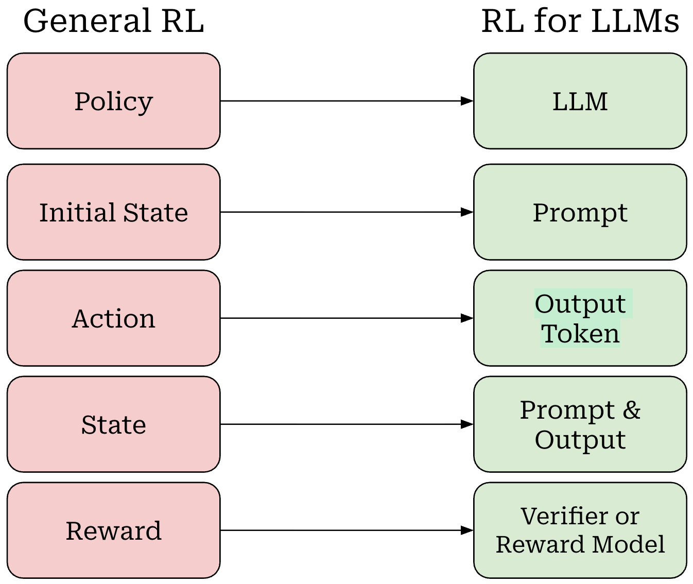

# §3 — Casting an LLM as an RL Problem

> **Slides 16–21** · Topics 12–15
> *The translation layer. §2 gave you RL vocabulary; this section maps every term onto an LLM.*

---

## The one-line story of this section

> **The LLM is simultaneously the agent AND the policy.** The prompt-so-far is the state, the next token is the action, the transition is trivial concatenation — and the *only* missing piece is the reward. That single hole is what §6–§8 spend their time filling.

---

## Topic 12 — The RL ↔ Language Model Mapping (slides 16–18)

Slide 18 gives the mapping as a single picture — commit this one to memory:



*Slide 18: every RL concept on the left has exactly one LLM counterpart on the right.*

### The mapping table (slide 16, verbatim)

| RL concept | Language-model instantiation |
|---|---|
| **Agent** | The language model itself |
| **State** | The prompt (input tokens) |
| **Action** | Which token to select as the next token |
| **Reward model** | *"Should be rewarded for generating a 'good response' and should not receive any reward for a 'bad response'"* |
| **Policy** | The language model itself, as it models the probability over the action space |

Slide 16 then ends with the question that drives the next twenty slides:

> ### **"What is the reward model?"**

Note that slide 18's diagram already hints at the answer with *"Verifier or Reward Model"* — foreshadowing both branches of modern practice: a **learned** reward model (this deck, §8) or a **programmatic verifier** (RLVR — unit tests, math checkers; the basis of reasoning-model training).

### Slide 17 — The loop, drawn for an LLM

```
      ┌──────────────────────────────────────────────────┐
      │                                                  │
      │   1. prompt        ┌─────────┐   2. new token    │
      └───────────────────►│   LLM   ├───────────────────┐
                           │ (agent  │                   │
                           │ =policy)│                   │
                           └─────────┘                   ▼
                                ▲              ┌─────────────────────┐
       3. new prompt            │              │    ENVIRONMENT      │
          (= prompt + token)    │              │  = string concat!   │
       4. Reward ??? ───────────┘              └─────────────────────┘
                    ▲
                    └── THE HOLE IN THE PICTURE
```

Compare with the mouse: the environment *supplied* the reward (cheese = +100 — you can see it hand-coded in §2's `step()` function). Here the environment is a `+` operator on strings. **It knows nothing about quality.** There is no reward. That is the entire problem.

### 🔬 The mapping, made executable

Every row of the table above becomes a line of code. Run this and the abstraction becomes concrete.

```python
# pip install transformers torch
from transformers import AutoModelForCausalLM, AutoTokenizer
import torch

MODEL = "Qwen/Qwen2-0.5B-Instruct"
tok = AutoTokenizer.from_pretrained(MODEL)
mdl = AutoModelForCausalLM.from_pretrained(MODEL, dtype=torch.float32)
mdl.eval()


class LLMAsMDP:
    """Slide 16's mapping table, as a Gym-style environment."""

    def __init__(self, model, tokenizer, prompt, max_new_tokens=30):
        self.model, self.tok = model, tokenizer
        # AGENT  = the model.   POLICY = the model.   Same object.
        self.prompt_ids = tokenizer(prompt, return_tensors="pt")["input_ids"]
        self.max_new_tokens = max_new_tokens
        self.reset()

    def reset(self):
        # STATE s_0 = the prompt
        self.state = self.prompt_ids.clone()
        self.n_generated = 0
        return self.state

    def policy(self, state, temperature=1.0):
        """pi_theta(a | s) — a distribution over the ENTIRE vocabulary."""
        with torch.no_grad():
            logits = self.model(input_ids=state).logits[0, -1, :]
        return torch.softmax(logits / temperature, dim=-1)

    def step(self, action):
        """
        THE TRANSITION FUNCTION.
        s_{t+1} = s_t || a_t   -- pure concatenation. DETERMINISTIC.
        P(s_{t+1} | s_t, a_t) = 1  always.
        """
        self.state = torch.cat([self.state, action.view(1, 1)], dim=1)
        self.n_generated += 1

        done = (action.item() == self.tok.eos_token_id
                or self.n_generated >= self.max_new_tokens)

        # THE REWARD.  Compare with MouseGrid.step() in §2, which returned
        # +100 for cheese. Here there is NOTHING to return.
        reward = 0.0                      # <-- THE HOLE. Filled in §8.
        return self.state, reward, done


env = LLMAsMDP(mdl, tok, "Where is Kolkata?", max_new_tokens=8)

print(f"{'t':>2} | {'ACTION a_t':<14} | {'pi(a_t|s_t)':>11} | STATE s_t (tail)")
print("-" * 82)

state = env.reset()
trajectory = []
for t in range(8):
    probs  = env.policy(state)                    # pi(.|s_t)
    action = torch.multinomial(probs, 1)[0]       # SAMPLE the action
    p      = probs[action].item()

    trajectory.append((state.clone(), action.item(), p))
    tail = tok.decode(state[0])[-42:]
    print(f"{t:>2} | {tok.decode(action)!r:<14} | {p:>11.4f} | ...{tail}")

    state, reward, done = env.step(action)
    if done:
        break

print(f"\nFull trajectory: {tok.decode(state[0])!r}")
print(f"Action space size |A| = {mdl.config.vocab_size:,}")
print(f"Reward received      = 0.0  <-- the environment cannot judge quality")
```

Compare this side by side with `MouseGrid` from §2. **Same interface, same loop.** Two differences:
1. `|A|` went from 4 to ~152,000.
2. `step()` returns a real reward in the grid world and `0.0` here.

### The three peculiarities of LLM-as-MDP

These distinguish RLHF from textbook RL and are frequent interview material:

**1. The agent and the policy are the same object.**
In the grid world, "mouse" (agent) and "the strategy the mouse follows" (policy) are conceptually separate — the policy is a table or a small network. In an LLM, the network *is* the policy: `π_θ(a|s) = softmax(LLM_θ(s))`. Updating the policy *is* updating the model.

**2. The transition function is deterministic.**
$$s_{t+1} = s_t \,\Vert\, a_t \qquad \Rightarrow \qquad P(s_{t+1} \mid s_t, a_t) = 1$$
Concatenation. No randomness. (Consequences in Topic 14.)

**3. The reward is extrinsic, learned, and terminal.**
- **Extrinsic**: it comes from human preference, not from the environment.
- **Learned**: a neural network approximates it (§8).
- **Terminal**: it scores the *finished response*, not each token.

### ⚠️ Class Q&A — the most-asked question of the session

**"Shouldn't the state be the prompt PLUS the LLM we're using, its number of parameters, KV cache, etc. — instead of just the prompt?"**

> **No.** The state is *"the information that can change during the trajectory and affects the next action"* — i.e. the prompt plus the tokens generated so far. The LLM's architecture and parameters are **not** part of the state; they are part of the **agent/policy**. Weights are fixed *within* an episode and change only between training updates.
>
> The KV cache is likewise not state in the MDP sense — it's a *computational optimisation* that caches a deterministic function of the tokens already in the context. It contains no information the token sequence doesn't already have.

### 🔬 Prove the KV cache is not state

Since the cache is a *deterministic function* of the tokens, using it or not must give identical results. Verify it:

```python
prompt = "Where is Kolkata? Kolkata is"
ids = tok(prompt, return_tensors="pt")["input_ids"]

# --- Path A: no cache, recompute the whole context every time ---
with torch.no_grad():
    logits_a = mdl(input_ids=ids).logits[0, -1, :]

# --- Path B: with KV cache, feeding one token at a time ---
with torch.no_grad():
    out = mdl(input_ids=ids[:, :-1], use_cache=True)
    out = mdl(input_ids=ids[:, -1:], past_key_values=out.past_key_values)
    logits_b = out.logits[0, -1, :]

print("Max |difference| between cached and uncached logits:",
      (logits_a - logits_b).abs().max().item())
print("=> ~0. The cache adds NO information; it only avoids recomputation.")
print("   Therefore it cannot be part of the state.")

# And the weights? They are FIXED throughout an episode:
print("\nAre the model parameters changing during generation?")
p0 = next(mdl.parameters()).clone()
_  = mdl.generate(**tok("test", return_tensors="pt"), max_new_tokens=5)
print("   parameters identical after generation:",
      torch.equal(p0, next(mdl.parameters())))
print("   => weights are the AGENT, not the STATE.")
```

**"What is a state in the RL-LLM case? Is it the weights of the LLM?"**
> Again no. **State = prompt + all tokens generated so far.** Weights = the policy's parameters θ.

> 💡 The clean way to remember it: **the state is what the agent *sees*; the parameters are what the agent *is*.**

**"How does the LLM know the reward at each token generated?"**
> It doesn't. The reward is typically given for the **whole response**. Algorithms then *distribute* that terminal signal across tokens — via reward-to-go, the value function, and advantage estimation (§4). This is credit assignment, and it's the reason §4 exists.

**"Are tokens getting higher probability based on rewards received in the past?"**
> Not by memory. The model doesn't store "this token earned +1." Training updates the **weights**; the updated weights change the probability of similar tokens in *similar contexts*. The learning is parametric and generalising, not a lookup table.

### 🔗 Resources for Topic 12

- **[Cameron Wolfe — PPO for LLMs: A Guide for Normal People](https://cameronrwolfe.substack.com/p/ppo-llm)** *(slide 57's own recommendation)* — the best single article on exactly this mapping. Read it after finishing §5.
- **[Nathan Lambert — The RLHF Book, Ch. 3 "Definitions"](https://rlhfbook.com/c/03-setup.html)** *(slide 57's recommendation)* — rigorous notation for the LLM-as-MDP formulation. The reference to settle any notation dispute.
- **[HuggingFace TRL — PPOTrainer source](https://github.com/huggingface/trl/blob/main/trl/trainer/ppo_trainer.py)** — where this mapping becomes production code. Skim `step()` and see all the terms above.

---

## Topic 13 — What Does RL Actually Learn? (slide 19)

> **Slide 19:** *"What does RL learn? — **Policy**. In case of LLM: Policy is 'What is the token generated given a prompt?'"*

### The point being made

RL does **not** learn:
- ❌ the reward function *(that's learned separately, by supervised learning on preference data — §8)*
- ❌ the environment dynamics *(model-free RL doesn't need them; and for LLMs they're trivial)*
- ❌ a mapping from input to a labelled output *(that's SFT)*

RL learns **the policy** — a probability distribution over actions given states.

### Why this framing matters

An SFT'd LLM already *is* a policy: `π(next token | context)`. RLHF does not create a policy from scratch; it **reshapes an existing one**.

```
   BEFORE alignment (π_SFT):
      P("Bang on! Great question..." | "Why is the sky blue?")  =  0.02
      P("Sunlight scatters in the atmosphere..." | same prompt) =  0.30

   AFTER alignment (π_θ):
      P("Bang on! Great question..." | ...)                     =  0.001  ↓
      P("Sunlight scatters in the atmosphere..." | ...)         =  0.55   ↑
```

The *support* of the distribution barely changes — the model could always produce both. What changes is the **probability mass**. This is why alignment is often described as *elicitation* rather than *teaching*: it surfaces behaviours the pretrained model already latently possesses.

### 🔬 Measure the reallocation directly

This is the most important experiment in this section. It compares a base model and its aligned sibling by scoring the **same two candidate responses** under both.

```python
from transformers import AutoModelForCausalLM, AutoTokenizer
import torch, torch.nn.functional as F

def sequence_logprob(model, tokenizer, prompt, response):
    """log pi(response | prompt) = sum over RESPONSE tokens of log pi(a_t | s_t)."""
    p_ids = tokenizer(prompt,   add_special_tokens=False)["input_ids"]
    r_ids = tokenizer(response, add_special_tokens=False)["input_ids"]
    ids = torch.tensor([p_ids + r_ids])

    with torch.no_grad():
        logits = model(input_ids=ids).logits[:, :-1, :]     # predict t+1 from t
    labels = ids[:, 1:]
    logp   = F.log_softmax(logits, dim=-1)
    tok_lp = logp.gather(-1, labels.unsqueeze(-1)).squeeze(-1)[0]

    # Mask: score ONLY the response tokens (this is §10's completion_mask)
    return tok_lp[len(p_ids) - 1:].sum().item()


PROMPT = "Why is the sky blue?"
SUBSTANTIVE = (" Sunlight is scattered by molecules in the atmosphere. "
               "Shorter blue wavelengths scatter more than longer red ones, "
               "so the sky appears blue.")
SYCOPHANTIC = (" Bang on! What a great question. Thank you so much for asking. "
               "This really demonstrates your sheer intellect.")

tok = AutoTokenizer.from_pretrained("Qwen/Qwen2-0.5B")

rows = []
for name, model_id in [("BASE   ", "Qwen/Qwen2-0.5B"),
                       ("ALIGNED", "Qwen/Qwen2-0.5B-Instruct")]:
    m = AutoModelForCausalLM.from_pretrained(model_id, dtype=torch.float32).eval()
    lp_good = sequence_logprob(m, tok, PROMPT, SUBSTANTIVE)
    lp_syco = sequence_logprob(m, tok, PROMPT, SYCOPHANTIC)
    rows.append((name, lp_good, lp_syco, lp_good - lp_syco))
    del m

print(f"{'model':<9} | {'log pi(good)':>13} | {'log pi(syco)':>13} | {'margin':>9}")
print("-" * 56)
for r in rows:
    print(f"{r[0]:<9} | {r[1]:>13.2f} | {r[2]:>13.2f} | {r[3]:>+9.2f}")

print("\nBoth models CAN produce both responses (neither logprob is -inf).")
print("Alignment shifted the RELATIVE mass -- it did not add a new capability.")
print("\nNote: log pi(good) - log pi(syco) is a MARGIN between two responses.")
print("Hold that thought: it is precisely what DPO optimises (§10).")
```

> 💡 **The last line matters.** You just computed a *margin between the log-probabilities of two responses under a policy*. Add a reference model and a β, and you have the DPO loss. Everything in §4–§9 is an alternative, much more elaborate, route to changing that same margin.

### 💡 Learning thought

> **Alignment reallocates probability mass; it does not add knowledge.** This explains a great deal of practical behaviour:
> - Why RLHF can't fix factual gaps (§1, Topic 2) — you can't up-weight a token sequence the model can't produce.
> - Why alignment is cheap relative to pretraining — you're nudging, not building.
> - Why aligned models can be "jailbroken" back to base behaviour — the base capability is still in there, just down-weighted.

### 🔗 Resources for Topic 13

- **[The Superficial Alignment Hypothesis (LIMA paper, Zhou et al. 2023)](https://arxiv.org/abs/2305.11206)** — argues that alignment mostly teaches *format and style*, not knowledge, and demonstrates it with only 1,000 examples. The strongest empirical support for "reallocation, not teaching."
- **[Lin et al., The Unlocking Spell on Base LLMs (URIAL, 2023)](https://arxiv.org/abs/2312.01552)** — shows how little of the token distribution actually changes during alignment. Excellent visualisations of exactly the shift you measured above.

---

## Topic 14 — Probability of a Trajectory Under a Policy (slide 20)

### The general formula

> **Slide 20:** *"What is the probability of a trajectory if the agent follows a policy π?"*

$$P(\tau \mid \theta) \;=\; \underbrace{\rho_0(s_0)}_{\text{prob of initial state}} \prod_{t=0}^{T} \underbrace{\pi_\theta(a_t \mid s_t)}_{\text{prob of action following policy}} \; \underbrace{P(s_{t+1} \mid s_t, a_t)}_{\text{prob of next state}}$$

Three factors, exactly as the slide labels them:
1. **`ρ₀(s₀)`** — probability of starting in state s₀ (for LLMs: probability of drawing this prompt from your dataset)
2. **`π_θ(a_t|s_t)`** — the agent's contribution; **the only θ-dependent term**
3. **`P(s_{t+1}|s_t,a_t)`** — the environment's contribution

### The LLM simplification — and why it matters

For an LLM, `s_{t+1} = s_t ‖ a_t` deterministically, so **`P(s_{t+1}|s_t,a_t) = 1` always**. The formula collapses:

$$P(\tau \mid \theta) = \rho_0(s_0) \prod_{t=0}^{T} \pi_\theta(a_t \mid s_t)$$

And since `ρ₀` doesn't depend on θ, taking logs:

$$\log P(\tau \mid \theta) = \underbrace{\log \rho_0(s_0)}_{\text{constant w.r.t. } \theta} + \sum_{t=0}^{T} \log \pi_\theta(a_t \mid s_t)$$

$$\boxed{\;\nabla_\theta \log P(\tau \mid \theta) = \sum_{t=0}^{T} \nabla_\theta \log \pi_\theta(a_t \mid s_t)\;}$$

**This boxed identity is the mechanical heart of the policy gradient (§4).** Everything the environment contributes vanishes under the gradient — which is *why* model-free RL is possible at all. You never need to know the dynamics.

### ⚠️ Class Q&A — a genuinely sharp question

**"Isn't `s_{t+1}` always fixed given `s_t` and `a_t`, since we just append? So the probability is always 1 — what does it even mean?"**

> **Exactly right, and it's a good observation.** For the LLM formulation, `P(s_{t+1}|s_t,a_t) = 1`. The transition term is degenerate and contributes nothing.
>
> The *important* probability is `π_θ(a_t|s_t)` — which token the model chooses. That's where all the stochasticity, and all the learning, lives. The general formula is written with the transition term because RL theory must cover stochastic environments (robots, games, markets); LLMs are simply a convenient special case where that term is 1.

### 🔬 Underflow — why everything is done in log space

For a 100-token response where each token has probability ~0.3:

$$P(\tau) \approx 0.3^{100} \approx 10^{-52}$$

Run this to see the failure and the fix:

```python
import torch

# A realistic 200-token response with per-token probabilities around 0.3
probs = torch.full((200,), 0.3)

# ---- Naive: multiply probabilities ----
p_naive = torch.prod(probs)
print(f"prod(probs)            = {p_naive.item()}")          # 0.0  -> UNDERFLOW

# In float32 the smallest positive normal number is ~1.18e-38
print(f"smallest float32       = {torch.finfo(torch.float32).tiny:.3e}")
print(f"true value             = 0.3^200 ~= 1e-105  -> unrepresentable\n")

# ---- Correct: sum log-probabilities ----
logp = torch.log(probs).sum()
print(f"sum(log(probs))        = {logp.item():.3f}   (a perfectly fine number)")
print(f"i.e. P(tau) = e^{logp.item():.1f}\n")

# ---- And a second stability issue: log(softmax(x)) vs log_softmax(x) ----
import torch.nn.functional as F
logits = torch.tensor([100.0, -100.0, 0.0])       # large magnitudes are common
print("log(softmax(logits)) =", torch.log(torch.softmax(logits, -1)))   # -inf
print("log_softmax(logits)  =", F.log_softmax(logits, -1))              # finite
print("\n=> ALWAYS use log_softmax / logsigmoid. You will see this again in §8 and §10.")
```

Two consequences, both practical:
1. **Always work in log space.** You'll see `log_softmax`, `logsigmoid`, and summed log-probs throughout every implementation — including the DPO notebook's `sequence_logprobs()`.
2. **Sums replace products.** `log P(τ) = Σ log π(a_t|s_t)` — numerically stable, and additive, which makes per-token masking (§10) straightforward.

### 💡 Learning thought

> The formula `P(τ|θ) = ρ₀ · Π π · Π P` looks intimidating until you notice that for LLMs **two of the three factors are constants**. Strip them and you're left with `Σ log π_θ(a_t|s_t)` — which is *literally the same quantity* you compute in ordinary language-model training. RLHF's gradient is the familiar log-likelihood gradient, **re-weighted by how good the outcome was.** That is the single most useful sentence for demystifying policy gradients.

---

## Topic 15 — Trajectories in Language Models (slide 21)

### The definition

> **Slide 21:** *"We want to fine-tune the language model so that it selects the next token in such a way as to maximize the reward it gets. What is a trajectory in a language model? **It is a series of prompts (states) and their next tokens (actions).**"*

### Worked example (the slide's own)

Prompt: **"Where is Kolkata?"**

| t | State `s_t` (the growing context) | Action `a_t` |
|---|---|---|
| 0 | `Where is Kolkata?` | `Kolkata` |
| 1 | `Where is Kolkata? Kolkata` | `is` |
| 2 | `Where is Kolkata? Kolkata is` | `in` |
| 3 | `Where is Kolkata? Kolkata is in` | `India` |
| 4 | `Where is Kolkata? Kolkata is in India` | `<EOS>` |

**Reward:** delivered once, at the end, on the complete response `"Kolkata is in India"`.

### The reward-sparsity picture

```
   t=0    t=1    t=2    t=3    t=4  ...  t=T
    │      │      │      │      │         │
    ▼      ▼      ▼      ▼      ▼         ▼
   r=0    r=0    r=0    r=0    r=0  ...  r = R  ◄── the ONLY real reward
                                              (from the reward model,
                                               scoring the full response)
```

Every intermediate reward is zero. One number at the end must be propagated back to every token decision. **This is the credit-assignment problem in its purest form**, and it motivates:
- **reward-to-go** (§4, Topic 20) — which rewards can a token possibly have influenced?
- **the value function** (§4, Topic 21) — what did we *expect* from this state?
- **the advantage** (§4, Topic 22) — was this token better than average?

*(In practice, RLHF implementations also add a per-token KL penalty from §6, which gives a small dense signal at every step — but the preference reward itself remains terminal.)*

### 🔬 Visualise the sparsity, and see why it breaks naive credit assignment

```python
import numpy as np

# One trajectory: 20 tokens, reward only at the end (the RLHF shape).
T = 20
rewards = np.zeros(T); rewards[-1] = 8.5      # reward-model score

tokens = ("Sunlight is scattered by molecules in the atmosphere , "
          "so shorter blue wavelengths dominate what we see . <EOS>").split()[:T]

def returns_to_go(rewards, gamma=1.0):
    G, run = np.zeros(len(rewards)), 0.0
    for t in reversed(range(len(rewards))):
        run = rewards[t] + gamma * run
        G[t] = run
    return G

G = returns_to_go(rewards, gamma=1.0)

print(f"{'t':>3} | {'token':<14} | {'r_t':>5} | {'G_t (reward-to-go)':>19}")
print("-" * 52)
for t in range(T):
    print(f"{t:>3} | {tokens[t]:<14} | {rewards[t]:>5.1f} | {G[t]:>19.2f}")

print("\n*** THE PROBLEM ***")
print("G_t is IDENTICAL (8.50) for every token. So under plain REINFORCE,")
print("the gradient weight is the same for 'Sunlight' (a great choice) and")
print("for 'so' (filler). Reward-to-go alone gives ZERO discrimination here.")

# Now add a value function baseline (a plausible learned V, §4 Topic 21)
V = np.array([5.0, 5.3, 5.9, 6.1, 6.4, 6.6, 6.9, 7.0, 7.1, 7.3,
              7.4, 7.5, 7.6, 7.8, 7.9, 8.0, 8.1, 8.2, 8.3, 8.4])
A = G - V                                     # ADVANTAGE

print("\n*** THE FIX (§4 Topic 22) ***")
print(f"{'t':>3} | {'token':<14} | {'V(s_t)':>7} | {'A_t = G_t - V(s_t)':>19}")
print("-" * 52)
for t in range(0, T, 3):
    print(f"{t:>3} | {tokens[t]:<14} | {V[t]:>7.2f} | {A[t]:>+19.2f}")
print("\nNow the weights DIFFER per token -> real credit assignment.")
print("Early tokens (low V, high A) get the most credit for the good outcome.")
```

> 💡 Run this once and §4's whole variance-reduction story becomes obvious in advance. The value function is not a mathematical nicety — it is **the only thing standing between you and a completely undifferentiated gradient**.

### Scale check — why this is expensive

| Quantity | Grid world | LLM |
|---|---|---|
| Action space | 4 | ~50,000–200,000 |
| Episode length | ~10 steps | ~500–2000 tokens |
| Trajectories to enumerate | manageable | `50000^500` — beyond astronomical |
| Reward signal | dense (every step) | **one scalar at the end** |
| Cost of one rollout | microseconds | a full LLM forward generation |

Every one of these differences makes RLHF harder than textbook RL, and each is addressed by a specific technique later in the deck.

### 💡 Learning thought

> Notice what the RL view *buys* you over SFT. In SFT, "India" is the correct token and everything else is wrong. In the RL view, **the token is judged by the quality of the response it participates in.** If "Kolkata is the capital of West Bengal, India" earns a higher reward than "India", then RL will push toward it — even though no annotator wrote that exact string. **RL optimises for outcomes; SFT optimises for imitation.** That's the whole reason RLHF can exceed the quality of the data it was trained on.

### 🔗 Resources for Topic 15

- **[Lightman et al., Let's Verify Step by Step (2023)](https://arxiv.org/abs/2305.20050)** — process vs. outcome supervision: what happens when you densify the reward by scoring intermediate steps. The direct answer to the sparsity problem above.
- **[Schulman — Approximating KL Divergence](http://joschu.net/blog/kl-approx.html)** — short and excellent; the estimators used for the per-token KL that partially densifies RLHF's reward (§6).

---

## 🗺️ The complete mapping — memorise this table

| RL term | LLM instantiation | Notes |
|---|---|---|
| Agent | The LLM | Same object as the policy |
| **State `s_t`** | Prompt + tokens generated so far | **Not** the weights, **not** the KV cache |
| **Action `a_t`** | The next token | Action space = vocabulary |
| **Policy `π_θ(a\|s)`** | `softmax(LLM_θ(s))` | The model *is* the policy |
| Transition `P(s'\|s,a)` | String concatenation | **Deterministic, = 1** |
| Reward `R` | Learned reward model score | **Terminal, extrinsic, learned** |
| Trajectory `τ` | (prompt, full response) | One rollout = one generated answer |
| Episode end | `EOS` or `max_new_tokens` | Finite horizon |
| `ρ₀(s₀)` | The prompt distribution | Your prompt dataset |
| Return `R(τ)` | Reward-model score of the response | Usually with γ = 1 |

---

## 🎯 Interview Questions — §3

### Conceptual

**Q1. Map every RL component onto an LLM.**
> Agent = the LLM. State = prompt + tokens generated so far. Action = the next token, from a ~50k-token action space. Policy = the LLM's softmax distribution, `π_θ(a|s)` — the model *is* the policy. Transition = deterministic concatenation, `P(s'|s,a) = 1`. Reward = a *learned* model scoring the completed response, delivered terminally. Trajectory = one (prompt, response) pair.

**Q2. Why are the LLM's weights not part of the state?**
> The state is what varies *within* an episode and determines the next action. Weights are fixed during a rollout and define the *policy*, not the situation. Including them would confuse the agent with its environment and break the MDP formulation — the state must be observable, episode-local information. (Same reason the KV cache isn't state: it's a cached deterministic function of tokens already in context, carrying no extra information — demonstrable by checking that cached and uncached logits are identical.)

**Q3. The LLM transition function is deterministic. What follows from that?**
> `P(s_{t+1}|s_t,a_t) = 1`, so the trajectory probability reduces to `ρ₀(s₀)·Π_t π_θ(a_t|s_t)`, and `∇_θ log P(τ|θ) = Σ_t ∇_θ log π_θ(a_t|s_t)`. All environment terms vanish under the gradient — the algorithm is fully model-free by construction. It also means all stochasticity in generation comes from the *sampling policy* (temperature, top-p), which is why those decoding parameters directly control exploration during rollouts.

**Q4. Where does the stochasticity come from if the environment is deterministic?**
> Entirely from the policy — sampling a token from the softmax distribution. Decoding hyperparameters (temperature, top-k, top-p) therefore *are* the exploration schedule. Greedy decoding during rollouts would collapse exploration and break policy-gradient learning.

**Q5. What exactly does RL learn in RLHF?**
> Only the **policy** — the conditional token distribution. It does not learn the reward function (trained separately by supervised learning on preference pairs) or the dynamics (trivial). Concretely, it *reallocates probability mass* over responses the model could already generate; it does not install new knowledge.

**Q6. Why work in log space?**
> Trajectory probability is a product of hundreds of sub-1 terms — `0.3^200` underflows float32 to exactly 0. Logs turn products into numerically stable sums, which is also what makes per-token masking and per-token advantage weighting straightforward. Separately, `log_softmax` must be used instead of `log(softmax(·))` because the latter returns `-inf` for large-magnitude logits. Every implementation uses these (see `sequence_logprobs()` in the DPO notebook).

**Q7. Explain the credit assignment problem in RLHF and name three mitigations.**
> A single terminal scalar must be attributed across ~500 token decisions with no per-token supervision. With γ=1 and a terminal-only reward, reward-to-go is *identical for every token*, giving zero discrimination. Mitigations: (1) **value function baseline** — subtract `V(s_t)`, which varies by position, to isolate each action's contribution; (2) **advantage estimation (GAE)** — combine bootstrapped value estimates across horizons; (3) **per-token KL penalty** (§6), which supplies a genuinely dense reward at every step. Process reward models that score intermediate steps are a fourth option.

### Applied

**Q8. In RLHF, is the reward given per token or per response? What are the implications?**
> Per **response** (terminal). Implications: extreme sparsity and hard credit assignment; a required value network to densify the signal; high gradient variance; and sensitivity to sequence length. Some setups use *process reward models* that score intermediate reasoning steps to densify the signal — that's the process-vs-outcome supervision distinction, important in reasoning-model training.

**Q9. Why can RLHF surpass the quality of its training data, while SFT cannot?**
> SFT maximises the likelihood of human-written references, so it is upper-bounded by annotator quality — it is imitation. RLHF trains on **the model's own generations**, scored by a reward model that only needs to *rank*. The model can discover a response no annotator wrote, have it scored highly, and reinforce it. Judging is easier than producing, so the ceiling is set by the *judge*, not the *writer*.

**Q10. During PPO rollouts, would you sample greedily or stochastically? Why?**
> **Stochastically.** Greedy decoding produces a single deterministic trajectory per prompt, eliminating exploration and making the policy-gradient estimator degenerate (no variation in `log π` to reweight). Typically temperature ≈ 1.0 during training rollouts to preserve entropy, even though deployment might use lower temperature. Entropy bonuses are sometimes added explicitly to prevent premature collapse.

**Q11. A colleague says "we should include the system prompt in the state." Right or wrong?**
> **Right** — the system prompt is part of the context that determines the next token, so it belongs in `s_t` exactly as the user prompt does. In the multi-turn/dialogue setting (§9), the state is the full conversation history including the system message. The distinction to hold is: anything in the *token context* is state; anything in the *weights* is policy.

### Rapid-fire

| Question | Answer |
|---|---|
| Is the LLM the agent or the policy? | **Both** |
| State = ? | prompt + tokens generated so far |
| Is the KV cache part of the state? | No — a computational cache (provably: identical logits either way) |
| `P(s'\|s,a)` for an LLM? | 1 (deterministic concatenation) |
| `∇_θ log P(τ\|θ)` = ? | `Σ_t ∇_θ log π_θ(a_t\|s_t)` |
| Reward timing? | Terminal — one scalar per response |
| Trajectory = ? | One (prompt, generated response) pair |
| `G_t` with terminal reward and γ=1? | Identical for every t — hence the need for `V(s)` |

---

## ✅ Section self-check

1. Reproduce the full RL↔LLM mapping table from memory.
2. Explain to a colleague why the model's parameters aren't the state — and how you'd *prove* the KV cache isn't either.
3. Derive `∇_θ log P(τ|θ) = Σ_t ∇_θ log π_θ(a_t|s_t)`, stating where determinism is used.
4. Draw the reward-sparsity timeline for a 500-token response, and say what `G_t` equals at every position.
5. Why does RLHF have a higher quality ceiling than SFT?
6. What does "alignment reallocates probability mass" mean, and what does it predict about jailbreaks?
7. **Hands-on:** run the base-vs-aligned log-probability comparison. Which model assigns higher relative probability to the sycophantic response, and by how much?

---

**Previous:** [§2 — RL Foundations](02-rl-foundations.md) · **Next:** [§4 — Policy Gradient & Variance Reduction](04-policy-gradient.md) · [Index](00-INDEX.md)
