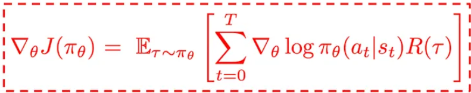
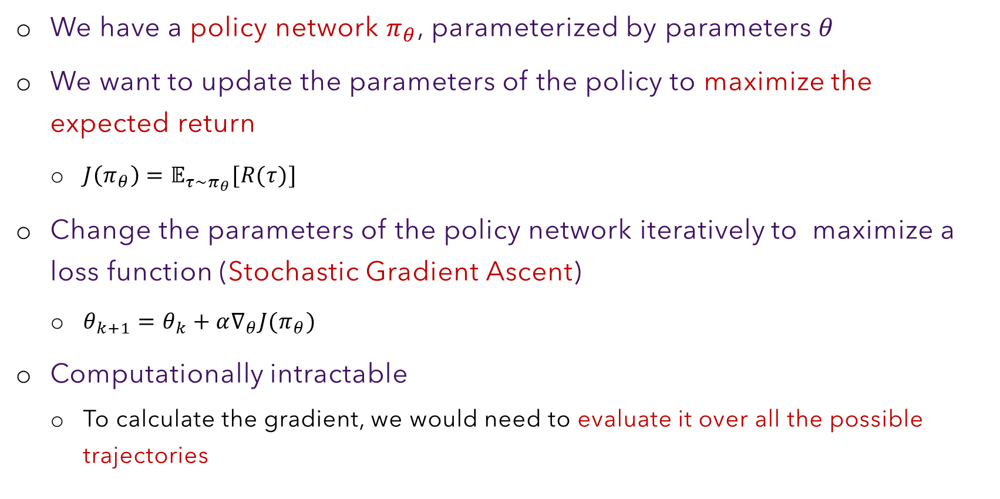

# §4 — Policy Gradient & Variance Reduction

> **Slides 23–31** · Topics 16–23
> *The mathematical core of the session. Densest section — budget the most time here.*

---

## The one-line story of this section

> We want `∇_θ E_{τ~π_θ}[R(τ)]`, but the distribution depends on θ. The **log-derivative trick** turns it into an expectation we can sample. Sampling makes it **unbiased but extremely noisy** — so three successive fixes (**reward-to-go → baseline → advantage**) shrink the variance without introducing bias.

```
   J(θ) = E[R(τ)]           ← can't differentiate directly
        ↓ log-derivative trick
   ∇J = E[ ∇log π · R(τ) ]  ← now an expectation... over ALL trajectories (intractable)
        ↓ Monte Carlo sampling
   ∇J ≈ (1/D) Σ ∇log π · R(τ)   ← REINFORCE. Unbiased ✅ but HIGH VARIANCE ❌
        ↓ fix 1: reward-to-go
        ↓ fix 2: subtract baseline V(s)
        ↓ fix 3: advantage A = Q − V
   ∇J ≈ (1/D) Σ ∇log π(a_t|s_t) · A(s_t,a_t)   ← what PPO actually uses
```

Print that ladder. Every slide 23–31 is one rung on it.

---

## Topic 16 — Policy Gradient Optimization (slides 23–24)

Slide 23 states the destination up front:



*Slide 23: the Policy Gradient Theorem. By the end of this topic you will have derived it.*

### The setup (slide 24, verbatim)

> - *We have a policy network `π_θ`, parameterized by parameters θ*
> - *We want to update the parameters of the policy to maximize the expected return*
> - *Change the parameters of the policy network iteratively to maximize a loss function (**Stochastic Gradient Ascent**)*
> - *Computationally intractable — to calculate the gradient, we would need to evaluate it over all the possible trajectories*



### The update rule

$$\theta_{k+1} = \theta_k + \alpha \, \nabla_\theta J(\theta)\Big|_{\theta_k}$$

Note the **`+`**. This is gradient **ascent** — we maximise. (Implementations minimise `−J`, which is why you'll see a leading minus sign in every RLHF loss you read. A sign error here silently trains the model to be *worse*; it is the classic RLHF bug.)

### The derivation you must be able to reproduce

This appears in interviews constantly. Six steps.

**Step 1 — Write the objective as an explicit sum:**
$$J(\theta) = \mathbb{E}_{\tau \sim \pi_\theta}[R(\tau)] = \sum_{\tau} P(\tau \mid \theta)\, R(\tau)$$

**Step 2 — Differentiate (`R(τ)` doesn't depend on θ):**
$$\nabla_\theta J(\theta) = \sum_{\tau} \nabla_\theta P(\tau \mid \theta)\, R(\tau)$$

> 🚧 **We're stuck here.** `∇P(τ|θ)` isn't an expectation — we can't estimate it by sampling from `π_θ`.

**Step 3 — The log-derivative trick.** Since `∇log f = ∇f / f`, we have `∇f = f · ∇log f`:
$$\nabla_\theta P(\tau \mid \theta) = P(\tau \mid \theta)\, \nabla_\theta \log P(\tau \mid \theta)$$

**Step 4 — Substitute back:**
$$\nabla_\theta J(\theta) = \sum_{\tau} P(\tau \mid \theta)\, \nabla_\theta \log P(\tau \mid \theta)\, R(\tau) = \mathbb{E}_{\tau \sim \pi_\theta}\Big[\nabla_\theta \log P(\tau \mid \theta)\, R(\tau)\Big]$$

> ✅ **Unstuck.** It's an expectation over trajectories drawn from the current policy — exactly what we can sample.

**Step 5 — Expand `log P(τ|θ)` using §3, Topic 14:**
$$\log P(\tau\mid\theta) = \log\rho_0(s_0) + \sum_t \log \pi_\theta(a_t\mid s_t) + \sum_t \log P(s_{t+1}\mid s_t,a_t)$$
The first and third terms are **independent of θ**, so they vanish under `∇_θ`:
$$\nabla_\theta \log P(\tau \mid \theta) = \sum_{t=0}^{T} \nabla_\theta \log \pi_\theta(a_t \mid s_t)$$

**Step 6 — The Policy Gradient Theorem:**

$$\boxed{\;\nabla_\theta J(\theta) = \mathbb{E}_{\tau \sim \pi_\theta}\left[\left(\sum_{t=0}^{T} \nabla_\theta \log \pi_\theta(a_t \mid s_t)\right) R(\tau)\right]\;}$$

### Reading the result in English

> **"Increase the log-probability of every action taken, in proportion to how good the trajectory turned out."**

- `R(τ)` large and positive → push `log π` **up** for every action in that trajectory
- `R(τ)` negative → push `log π` **down**
- `R(τ) = 0` → no update

**Notice what this is.** `∇log π(a_t|s_t)` is *exactly* the gradient of standard cross-entropy language-model training on token `a_t`. So:

> **Policy gradient = ordinary LM training on the model's own outputs, weighted by the reward.**

That sentence collapses most of the mystery. RLHF is "fine-tune on your own generations, but scale each example's gradient by how good it was."

### 🔬 Verify the log-derivative trick numerically

Don't take Step 3 on faith. It's checkable in ten lines.

```python
import torch

logits = torch.randn(5, requires_grad=True)

# --- LHS:  ∇P(x)  computed directly ---
probs = torch.softmax(logits, dim=0)
p_x = probs[2]
grad_p = torch.autograd.grad(p_x, logits, retain_graph=True)[0]

# --- RHS:  P(x) · ∇log P(x) ---
probs = torch.softmax(logits, dim=0)
logp_x = torch.log(probs[2])
grad_logp = torch.autograd.grad(logp_x, logits)[0]
rhs = probs[2].detach() * grad_logp

print("LHS  ∇P(x)          =", grad_p.numpy().round(6))
print("RHS  P(x)·∇log P(x) =", rhs.numpy().round(6))
print("identical:", torch.allclose(grad_p, rhs, atol=1e-6))
print("\nThat one identity is what makes the whole method possible.")
```

### 🔬 The policy gradient IS reweighted cross-entropy

This is the claim that demystifies everything. Verify it:

```python
import torch, torch.nn.functional as F

logits = torch.randn(1, 5, requires_grad=True)
action = torch.tensor([2])
REWARD = 3.7

# --- Path A: standard supervised cross-entropy on the chosen action ---
ce = F.cross_entropy(logits, action)
grad_ce = torch.autograd.grad(ce, logits, retain_graph=True)[0]

# --- Path B: the policy-gradient surrogate, -log π(a|s) · R ---
logp = F.log_softmax(logits, dim=-1)[0, action]
pg = -logp * REWARD
grad_pg = torch.autograd.grad(pg, logits)[0]

print("cross-entropy grad        :", grad_ce.numpy().round(4))
print("policy-gradient grad      :", grad_pg.numpy().round(4))
print("ratio (should be R = 3.7) :", (grad_pg / grad_ce).numpy().round(4))
print("\n=> The policy gradient is EXACTLY the cross-entropy gradient,")
print("   scaled by the reward. Nothing more exotic is happening.")
```

> 💡 **Keep that output in your head.** Every time RLHF feels mystical, remember: it is next-token training on self-generated text, with each example's gradient multiplied by a number.

### Why the environment vanished — and why it matters

Step 5 deleted the transition term. Consequence: **you never need to know the environment dynamics.** This is what makes the method *model-free*, and it's why it transfers to LLMs (where dynamics are trivial) and robots (where dynamics are unknown) alike.

### 💡 Learning thought

> The log-derivative trick is the whole ballgame, and it is one line: `∇f = f·∇log f`. It converts *"gradient of a probability"* (unsamplable) into *"probability times gradient of a log-probability"* (samplable). If you remember one piece of mathematics from this session, make it this. It recurs in variational inference, score-function estimators, and REINFORCE-style gradient estimators everywhere in ML.

### 🔗 Resources for Topic 16

- **[Spinning Up — Intro to Policy Optimization](https://spinningup.openai.com/en/latest/spinningup/rl_intro3.html)** — the same derivation, with every step spelled out and an "Extra Material" section proving the EGLP lemma. **Read this alongside the section above.**
- **[Lilian Weng — Policy Gradient Algorithms](https://lilianweng.github.io/posts/2018-04-08-policy-gradient/)** — the reference map of every variant (REINFORCE → A2C → TRPO → PPO → SAC). Bookmark it.
- **[Sutton et al., Policy Gradient Methods for RL with Function Approximation (2000)](https://proceedings.neurips.cc/paper/1999/file/464d828b85b0bed98e80ade0a5c43b0f-Paper.pdf)** — the original theorem.

---

## Topic 17 — Monte Carlo Approximation (slide 25)

> **Slide 25:** *"Approximate expectation with sample mean of D trajectories."*

The expectation is over `50000^500` trajectories. So we sample `D` of them and average:

$$\nabla_\theta J(\theta) \;\approx\; \hat{g} \;=\; \frac{1}{|D|}\sum_{\tau \in D} \sum_{t=0}^{T} \nabla_\theta \log \pi_\theta(a_t \mid s_t)\, R(\tau)$$

### Two properties, in tension

| Property | Status | Meaning |
|---|---|---|
| **Unbiased** | ✅ | `E[ĝ] = ∇J(θ)` exactly. With infinite samples it converges to the truth. |
| **High variance** | ❌ | `Var[ĝ]` is enormous. Any *finite* sample can point in a very wrong direction. |

Topic 19 onward is entirely about the second row.

### ⚠️ Class Q&A

**"How do we 'sample' these D trajectories? Is there a process?"**
> Yes, and it's mechanical: let the *current* policy run. At each state the policy gives a distribution over actions; sample one; append; repeat until terminal. For an LLM this is literally **generation with temperature sampling** — the loop you wrote in §2, Topic 6 and §3, Topic 12. Run it D times (different random seeds / temperature draws) and you have D trajectories, each with its own reward-model score.
>
> **This is why RLHF is expensive**: every gradient step requires generating hundreds of full responses.

**"With gradient sampling, how does it impact accuracy, since the result is already probabilistic?"**
> Sampling makes the estimate **noisier**, not **systematically wrong** — it remains unbiased. More samples ⇒ lower variance ⇒ more reliable steps. `Var ∝ 1/D`, so halving the noise requires 4× the samples. That's an expensive curve, which is why the variance-reduction tricks below matter so much: they buy accuracy without buying GPUs.

---

## Topic 18 — REINFORCE (slide 26)

The complete algorithm, as listed on the slide:

> 1. Create a neural network that defines a policy (takes as input the current state of the agent and outputs the probability over the action space)
> 2. Use the network to sample trajectories and their corresponding rewards
> 3. Use the sample to calculate the gradient
> 4. Run stochastic gradient ascent to update the parameters of the policy/network
> 5. Go back to 2

### 🔬 REINFORCE, complete and runnable

This is a **fully working** implementation on CartPole. It trains in under a minute on CPU. Run it — watching a policy learn from nothing but scalar rewards is worth more than any amount of reading.

```python
# pip install gymnasium torch numpy
import gymnasium as gym
import torch, torch.nn as nn
import numpy as np

torch.manual_seed(0); np.random.seed(0)


class PolicyNet(nn.Module):
    """Step 1: 'a neural network that defines a policy'.
       state -> logits over the action space -> softmax."""
    def __init__(self, obs_dim, n_actions, hidden=64):
        super().__init__()
        self.net = nn.Sequential(
            nn.Linear(obs_dim, hidden), nn.Tanh(),
            nn.Linear(hidden, n_actions),
        )
    def forward(self, s):
        return self.net(s)                       # logits

    def distribution(self, s):
        return torch.distributions.Categorical(logits=self.forward(s))


def collect_trajectory(env, policy):
    """Step 2: 'use the network to sample trajectories and their rewards'."""
    s, _ = env.reset()
    logps, rewards = [], []
    done = False
    while not done:
        s_t = torch.as_tensor(s, dtype=torch.float32)
        dist = policy.distribution(s_t)
        a = dist.sample()                        # a_t ~ pi(.|s_t)
        logps.append(dist.log_prob(a))           # log pi(a_t|s_t)  -- KEEP THE GRAPH
        s, r, term, trunc, _ = env.step(a.item())
        rewards.append(r)
        done = term or trunc
    return torch.stack(logps), rewards


def returns_to_go(rewards, gamma=0.99):
    """G_t = sum_{t'>=t} gamma^(t'-t) r_t'   -- Topic 20."""
    G, run = np.zeros(len(rewards)), 0.0
    for t in reversed(range(len(rewards))):
        run = rewards[t] + gamma * run
        G[t] = run
    return torch.as_tensor(G, dtype=torch.float32)


def train(use_reward_to_go=True, use_baseline=True,
          n_iters=150, batch_trajs=10, lr=1e-2):
    env = gym.make("CartPole-v1")
    policy = PolicyNet(env.observation_space.shape[0], env.action_space.n)
    opt = torch.optim.Adam(policy.parameters(), lr=lr)
    history = []

    for it in range(n_iters):
        batch_loss, ep_returns = [], []

        for _ in range(batch_trajs):             # sample D trajectories
            logps, rewards = collect_trajectory(env, policy)
            ep_returns.append(sum(rewards))

            if use_reward_to_go:
                weights = returns_to_go(rewards)             # G_t  (Topic 20)
            else:
                weights = torch.full((len(rewards),),        # R(tau) for ALL t
                                     float(sum(rewards)))

            if use_baseline:                                 # Topic 21
                weights = (weights - weights.mean()) / (weights.std() + 1e-8)

            # Step 3: the gradient estimate.
            # NEGATIVE because optimisers MINIMISE and we want ASCENT.
            batch_loss.append(-(logps * weights).sum())

        loss = torch.stack(batch_loss).mean()
        opt.zero_grad(); loss.backward(); opt.step()         # Step 4
        history.append(np.mean(ep_returns))                  # Step 5: repeat

        if it % 25 == 0:
            print(f"  iter {it:>3} | mean return {np.mean(ep_returns):7.1f}")

    env.close()
    return history


print("=== FULL REINFORCE (reward-to-go + baseline) ===")
h_full = train(use_reward_to_go=True,  use_baseline=True)

print("\n=== ABLATION: no reward-to-go, no baseline (vanilla) ===")
h_naive = train(use_reward_to_go=False, use_baseline=False)

print(f"\nFinal 20-iter average return:")
print(f"  with variance reduction : {np.mean(h_full[-20:]):7.1f}")
print(f"  without                 : {np.mean(h_naive[-20:]):7.1f}")
print("\nSame objective, same gradient IN EXPECTATION.")
print("The difference is entirely VARIANCE -- and it decides whether it learns.")
```

**Expected result:** the full version reliably reaches 300–500 return; the naive version limps along around 30–80. **Identical mathematics in expectation.** That gap is the entire justification for Topics 20–22.

**The line to stare at:** `-(logps * weights).sum()`. That is cross-entropy scaled by reward. Nothing more exotic is happening.

**The comment to stare at:** trajectories are collected fresh at every iteration. Because `ĝ` is an expectation over `τ ~ π_θ`, the moment θ changes, the old samples come from the wrong distribution. **One update per batch of rollouts.** That is the sample-inefficiency §5 attacks.

### REINFORCE's three weaknesses (the roadmap for the rest of the deck)

| Weakness | Fixed by | Where |
|---|---|---|
| High variance | reward-to-go, baseline, advantage | §4, Topics 20–22 |
| Sample inefficiency (one update per rollout batch) | importance sampling + clipping → PPO | §5 |
| No reward function for LLMs | learned reward model | §8 |

### 🔗 Resources for Topic 18

- **[Spinning Up — Simplest Policy Gradient (`vpg`)](https://spinningup.openai.com/en/latest/spinningup/rl_intro3.html#implementing-the-simplest-policy-gradient)** — a ~30-line reference implementation, very close to the code above. Diff it against yours.
- **[HuggingFace Deep RL Course, Unit 4: Policy Gradient](https://huggingface.co/learn/deep-rl-course/unit4/introduction)** — guided notebook implementing REINFORCE from scratch, with a Hub leaderboard.
- **[Williams, Simple statistical gradient-following algorithms (1992)](https://link.springer.com/article/10.1007/BF00992696)** — the original REINFORCE paper.

---

## Topic 19 — The Variance Problem (slide 27)

> **Slide 27:** *"We sample a set of trajectories → the gradient is approximated through a sample → the approximation is **unbiased** (on average, the approximated gradient will converge to the true gradient) → **but the gradient has high variance**."*

### Bias vs. variance, made concrete

```
   Low bias, LOW variance          Low bias, HIGH variance
   (what we want)                  (what REINFORCE gives)

        │  ●●●                          │ ●        ●
        │ ●●✚●●                         │    ●  ✚      ●
        │  ●●●                          │  ●      ●
        └────────                       └─────────────────
     ✚ = true gradient    ● = individual sample estimates

   Both average to ✚. But with a handful of samples,
   the right-hand one can send you almost anywhere.
```

### 🔬 Measure unbiasedness AND variance in the same experiment

This is the single most convincing demonstration in §4. It shows both properties of slide 27 at once, on a problem where the *true* gradient is computable in closed form.

```python
import torch, numpy as np

torch.manual_seed(0)

# A 1-step bandit: 4 actions with known rewards. Here we CAN compute
# the exact gradient, so we can measure bias and variance directly.
REWARDS = torch.tensor([0.0, 1.0, 5.0, 2.0])
logits  = torch.zeros(4, requires_grad=True)

# ---- TRUE gradient (analytic; only possible because the problem is tiny) ----
probs = torch.softmax(logits, dim=0)
J = (probs * REWARDS).sum()                    # J(theta) = E[R]
true_grad = torch.autograd.grad(J, logits)[0]
print("TRUE gradient:", true_grad.numpy().round(4), "\n")


def mc_estimate(D, use_baseline=False):
    """One Monte-Carlo estimate of the policy gradient from D samples."""
    probs = torch.softmax(logits.detach(), dim=0)
    acts  = torch.multinomial(probs, D, replacement=True)
    rews  = REWARDS[acts]

    if use_baseline:                            # Topic 21, previewed
        rews = rews - rews.mean()

    g = torch.zeros(4)
    for a, r in zip(acts, rews):
        p = torch.softmax(logits.detach(), dim=0)
        onehot = torch.zeros(4); onehot[a] = 1.0
        g += (onehot - p) * r                   # = grad of log pi(a) * r
    return g / D


print(f"{'D':>6} | {'bias (|mean-true|)':>19} | {'variance (trace)':>17}")
print("-" * 50)
for D in [1, 10, 100, 1000]:
    ests = torch.stack([mc_estimate(D) for _ in range(2000)])
    bias = (ests.mean(0) - true_grad).abs().sum().item()
    var  = ests.var(0).sum().item()
    print(f"{D:>6} | {bias:>19.4f} | {var:>17.4f}")

print("\n=> BIAS stays ~0 for every D          (slide 27: 'unbiased')")
print("=> VARIANCE is large and falls only as 1/D  (slide 27: 'high variance')\n")

# ---- Now add a baseline and re-measure ----
print("WITH A BASELINE (subtract the batch mean reward):")
print(f"{'D':>6} | {'bias':>10} | {'variance':>12} | {'reduction':>10}")
print("-" * 46)
for D in [10, 100, 1000]:
    plain = torch.stack([mc_estimate(D, False) for _ in range(2000)])
    based = torch.stack([mc_estimate(D, True)  for _ in range(2000)])
    b = (based.mean(0) - true_grad).abs().sum().item()
    v0, v1 = plain.var(0).sum().item(), based.var(0).sum().item()
    print(f"{D:>6} | {b:>10.4f} | {v1:>12.4f} | {v0/v1:>9.1f}x")

print("\n=> Baseline keeps bias ~0 while cutting variance several-fold.")
print("   FREE accuracy. That is Topic 21's entire claim, verified.")
```

### Why is the variance so brutal for LLMs? Four compounding causes

1. **Product of many stochastic terms.** `Σ_t ∇log π(a_t|s_t)` sums over hundreds of tokens, each independently sampled. Variance compounds with sequence length.

2. **The same scalar multiplies every action.** If `R(τ) = 8`, *every* token in that response gets its log-prob pushed up by a factor of 8 — including the bad tokens that happened to be there. Good tokens in a bad response get punished. This is credit assignment failing loudly.

3. **The action space is enormous.** ~50k possible tokens per step; a sample of D=64 trajectories explores a vanishing fraction of the space.

4. **Reward scale is arbitrary.** If all trajectories score between +90 and +100, they all get pushed up hard, and the *relative* differences — the only informative part — are drowned by the common offset. *(This observation directly motivates the baseline in Topic 21.)*

### 💡 Learning thought

> Variance reduction here is **not** an optimisation nicety — it is what makes the method work at all. With raw REINFORCE, LLM-scale RLHF simply does not converge in any practical budget. Slides 28–30 are three tricks that reduce variance while **provably preserving unbiasedness**. That combination — cheaper *and* still correct — is why they're universal.

---

## Topic 20 — Variance Fix #1: Reward-to-Go (slide 28)

> **Slide 28:** *"Future cannot influence the past. Removing terms in the expression may reduce variance. An action at time t can only possibly influence rewards that happen at or after time t."*

### The problem with the naive form

$$\nabla_\theta J = \mathbb{E}\left[\sum_{t=0}^{T} \nabla \log \pi_\theta(a_t\mid s_t) \cdot \underbrace{R(\tau)}_{\text{ALL rewards, including } t' < t}\right]$$

The action at `t = 50` is being credited with the reward earned at `t = 10`. That is **causally impossible**. Those terms contribute *zero expected value* (they're uncorrelated with the action) but they **do** contribute variance — pure noise.

### The fix

Replace the full-trajectory return with the **reward-to-go** (also *return-to-go*, `G_t`):

$$\boxed{\;\nabla_\theta J = \mathbb{E}\left[\sum_{t=0}^{T} \nabla_\theta \log \pi_\theta(a_t \mid s_t) \sum_{t'=t}^{T} \gamma^{t'-t} r_{t'}\right]\;}$$

The inner sum starts at `t'= t`, not `t'= 0`. Only rewards **at or after** the action.

```
   Naive R(τ):  each action credited with  ████████████████  (all rewards)
                                            ↑ this action

   Reward-to-go: each action credited with  ░░░░░░░████████  (only from here on)
                                            ↑ this action
```

### Why it's still unbiased

Formally, `E[∇log π(a_t|s_t) · r_{t'}] = 0` for `t' < t`, because past rewards are independent of the current action given the state. Dropping terms whose expectation is zero leaves the mean unchanged while removing their variance contribution. **Strictly better.**

### 🔬 Reward-to-go in code, and its degenerate case for LLMs

```python
import numpy as np

def returns_to_go(rewards, gamma=1.0):
    """The one function you will write in every RL codebase."""
    G, run = np.zeros(len(rewards)), 0.0
    for t in reversed(range(len(rewards))):     # BACKWARD pass
        run = rewards[t] + gamma * run
        G[t] = run
    return G

# --- Case A: a DENSE-reward task (CartPole: +1 every step) ---
dense = [1.0] * 10
print("Dense rewards  :", dense)
print("Reward-to-go   :", returns_to_go(dense, 0.99).round(2))
print("=> DIFFERENT weight per timestep. Real discrimination.\n")

# --- Case B: RLHF's shape (terminal reward only, gamma = 1) ---
terminal = [0.0] * 9 + [8.5]
print("RLHF rewards   :", terminal)
print("Reward-to-go   :", returns_to_go(terminal, 1.0).round(2))
print("=> IDENTICAL (8.5) for every timestep. ZERO discrimination.")
print("   Reward-to-go buys NOTHING in vanilla RLHF.\n")

# --- Case C: RLHF with a per-token KL penalty (§6) — the reward becomes dense ---
kl_pen = np.random.uniform(-0.05, -0.01, 10)
shaped = kl_pen.copy(); shaped[-1] += 8.5
print("With KL shaping:", shaped.round(3))
print("Reward-to-go   :", returns_to_go(shaped, 1.0).round(3))
print("=> Now it varies again. This is one reason the per-token KL penalty")
print("   in §6 is genuinely useful beyond preventing reward hacking.")
```

**Key takeaway:** in *vanilla* RLHF (terminal reward, γ=1), reward-to-go gives `G_t = R` for every t — it buys nothing on its own. Its value appears when the reward is densified, either by the per-token KL penalty (§6) or by a process reward model. **The next two fixes are the ones that carry the load for LLMs.**

### ⚠️ Class Q&A — a subtle and widely misunderstood point

**"How can my present action be unrelated to the past? What's the origin of my present action?"**

> Your present action **is** absolutely related to the past — `s_t` encodes the entire history. The claim is *not* that the past is irrelevant to your decision.
>
> The claim is the reverse direction: **a reward already collected at t=10 cannot be caused by a decision made at t=50.** So when *assigning credit* to the t=50 action, rewards from t<50 are irrelevant. Causality flows forward; credit flows backward from the point of action only.
>
> **Past → influences → present action. Present action → influences → future rewards only.**

*(The professor noted this confusion in the Q&A and added clarification to the slides — it's a known sticking point. Worth re-reading twice.)*

---

## Topic 21 — Variance Fix #2: Baseline & the Value Function (slide 29)

> **Slide 29:** *"[The baseline] can be dependent on the state → **Value (state) function `V^π(s)`** → represents the utility of the state if the policy π is followed."*

### The idea

Subtract a **baseline** `b(s_t)` from the reward term:

$$\nabla_\theta J = \mathbb{E}\left[\sum_t \nabla_\theta \log \pi_\theta(a_t\mid s_t)\,\big(G_t - b(s_t)\big)\right]$$

**This remains unbiased for any `b` that does not depend on the action `a_t`.** The proof is the "expected score is zero" identity:
$$\mathbb{E}_{a\sim\pi}\big[\nabla_\theta \log \pi_\theta(a\mid s)\big] = \nabla_\theta \sum_a \pi_\theta(a\mid s) = \nabla_\theta 1 = 0$$
so `E[∇log π · b(s)] = b(s)·0 = 0`. Subtracting it changes nothing in expectation — but it can dramatically change the variance.

### 🔬 Verify "the expected score is zero"

The whole unbiasedness argument rests on one identity. Check it:

```python
import torch

logits = torch.randn(6, requires_grad=True)
probs  = torch.softmax(logits, dim=0)

# E_{a~pi}[ grad log pi(a) ] = sum_a pi(a) * grad log pi(a)
expected_score = torch.zeros(6)
for a in range(6):
    lp = torch.log(torch.softmax(logits, 0)[a])
    g  = torch.autograd.grad(lp, logits, retain_graph=True)[0]
    expected_score += probs[a].detach() * g

print("E[grad log pi(a)] =", expected_score.numpy().round(8))
print("is it zero?       ", torch.allclose(expected_score, torch.zeros(6), atol=1e-6))
print("\n=> Therefore E[grad log pi * b(s)] = b(s) * 0 = 0")
print("   Any ACTION-INDEPENDENT baseline is free. This is the whole proof.")

# ⚠️ Counter-example: an ACTION-DEPENDENT baseline breaks it
bad = torch.tensor([1.0, 2.0, 3.0, 4.0, 5.0, 6.0])     # b depends on a!
biased = torch.zeros(6)
for a in range(6):
    lp = torch.log(torch.softmax(logits, 0)[a])
    g  = torch.autograd.grad(lp, logits, retain_graph=True)[0]
    biased += probs[a].detach() * g * bad[a]
print("\nWith an ACTION-dependent baseline:", biased.numpy().round(4))
print("NOT zero -> the estimator becomes BIASED. This is why b must be b(s), not b(s,a).")
```

### Why it helps — the intuition

Suppose in some state every action yields a return between +90 and +100.

- **Without baseline:** every action's log-prob is pushed up by ~95. All actions reinforced, including the mediocre ones. The *differences* — the only informative signal — are swamped.
- **With baseline `b(s) = 95`:** the returns become −5 … +5. Better-than-average actions get pushed **up**, worse-than-average get pushed **down**. Same expected gradient, far smaller magnitudes, far less noise.

```
   Returns:      90   93   95   97  100
   No baseline:   ↑↑   ↑↑   ↑↑   ↑↑   ↑↑     ← everything up, huge steps
   b = 95:        ↓    ↓    ·    ↑    ↑      ← informative, small steps
```

### The best baseline: the value function

$$V^{\pi}(s) = \mathbb{E}_{\tau \sim \pi}\big[G_t \mid s_t = s\big]$$

> *"Represents the utility of the state if the policy π is followed."*

In words: **"if I'm in state s and behave according to π, what return should I expect on average?"** That's precisely the "average performance" you want to compare an action against — so it's the natural (and near-variance-optimal) baseline.

For an LLM: `V(s)` = "given this prompt and the tokens generated so far, what reward-model score do I expect this response to end up with?" A hard prompt has a low `V`; an easy one has a high `V`. Subtracting `V` **normalises for prompt difficulty** — the model stops getting credit merely for being handed an easy question.

### ⚠️ Class Q&A

**"What does 'utility' mean here?"**
> How good/valuable a state is, measured by the **future reward you expect from it**. `V^π(s)` is the average utility of state s under policy π.

**"Can the variance-reduction machinery be considered a loss function?"**
> No. Reward-to-go, baselines, and advantage estimation are **estimator improvements** — they change how you *compute the gradient*, not what you're optimising. The objective `J(θ)` is identical before and after. (The value *network* has its own separate regression loss — see §7, Topic 33 — but that's a different thing from the policy objective.)

### 💡 Learning thought

> The professor's phrasing is worth keeping: *"the quality of the current state acts as the baseline."* You are not asking *"was this outcome good?"* — you are asking **"was this outcome better than what I had a right to expect from here?"** That is a fundamentally different, and far more informative, question. It is also just good judgement in general: evaluate decisions against their situation, not against an absolute standard.

---

## Topic 22 — Variance Fix #3: The Advantage Function (slide 30)

> **Slide 30:** *"State-Action (Q) function `Q^π(s,a)` — how much better is it to choose a particular action a in a state s over the average expectation we get by choosing randomly an action in the same state → **Advantage**."*

### The three value functions — know all three cold

| Function | Definition | Question it answers |
|---|---|---|
| `V^π(s)` | `E[G_t \| s_t = s]` | "How good is this **state**?" |
| `Q^π(s,a)` | `E[G_t \| s_t = s, a_t = a]` | "How good is this **action in this state**?" |
| `A^π(s,a)` | `Q^π(s,a) − V^π(s)` | "How much **better than average** is this action?" |

### The advantage function

$$\boxed{\;A^{\pi}(s_t, a_t) = Q^{\pi}(s_t, a_t) - V^{\pi}(s_t)\;}$$

Interpretation:
- `A > 0` → this action is **better** than the policy's average behaviour here → **increase** its probability
- `A < 0` → **worse** than average → **decrease** its probability
- `A ≈ 0` → typical → leave it alone

The final policy-gradient form used by PPO:

$$\boxed{\;\nabla_\theta J(\theta) = \mathbb{E}\left[\sum_t \nabla_\theta \log \pi_\theta(a_t\mid s_t)\; A^{\pi}(s_t,a_t)\right]\;}$$

### The Bellman relation (needed in §7)

$$Q^{\pi}(s_t,a_t) = r_t + \gamma\, V^{\pi}(s_{t+1})$$

so the one-step advantage estimate is:

$$A_t = r_t + \gamma V(s_{t+1}) - V(s_t)$$

— the **TD residual** `δ_t`. This is why you only need to train **one** network (`V`), not two: `Q` is recovered from `V` plus the observed reward. The professor makes this point directly on slide 37's discussion: *"the Q function is a combination of the reward and the value."*

### 🔬 GAE — the implementation you will meet in every RLHF codebase

**GAE (Generalized Advantage Estimation)** blends TD residuals across horizons with a parameter λ, trading bias against variance:

$$A_t^{\text{GAE}(\gamma,\lambda)} = \sum_{l=0}^{\infty} (\gamma\lambda)^l \delta_{t+l}, \qquad \delta_t = r_t + \gamma V(s_{t+1}) - V(s_t)$$

```python
import numpy as np

def compute_gae(rewards, values, gamma=1.0, lam=0.95, last_value=0.0):
    """
    Generalized Advantage Estimation (Schulman et al., 2015).
    This exact function appears in TRL's PPOTrainer and every PPO codebase.

    rewards : (T,) per-step rewards  (in RLHF: KL penalty each step + RM score at T)
    values  : (T,) V(s_t) from the value head
    returns : advantages (T,), value targets (T,)
    """
    T = len(rewards)
    advantages = np.zeros(T, dtype=np.float32)
    last_gae = 0.0
    for t in reversed(range(T)):
        next_value = values[t + 1] if t + 1 < T else last_value
        delta = rewards[t] + gamma * next_value - values[t]      # TD residual
        last_gae = delta + gamma * lam * last_gae                # accumulate
        advantages[t] = last_gae
    returns = advantages + values                                # value targets
    return advantages, returns


# --- RLHF-shaped example: terminal reward + small per-token KL penalty ---
T = 10
rewards = np.full(T, -0.02, dtype=np.float32)   # per-token KL penalty (§6)
rewards[-1] += 8.5                              # reward-model score at the end
values  = np.linspace(5.0, 8.4, T).astype(np.float32)   # learned V(s_t)

print(f"{'lambda':>7} | advantages (rounded)")
print("-" * 62)
for lam in [0.0, 0.5, 0.95, 1.0]:
    A, _ = compute_gae(rewards, values, gamma=1.0, lam=lam)
    print(f"{lam:>7.2f} | {np.round(A, 2)}")

print("\nlambda = 0.0  -> one-step TD. LOW variance, HIGH bias")
print("                 (trusts V completely; if V is wrong, A is wrong)")
print("lambda = 1.0  -> Monte Carlo. UNBIASED, HIGH variance")
print("lambda = 0.95 -> the standard compromise, used in nearly all RLHF")

# The critical property: advantages are normalised before use
A, _ = compute_gae(rewards, values, gamma=1.0, lam=0.95)
A_norm = (A - A.mean()) / (A.std() + 1e-8)
print(f"\nRaw advantages       : mean {A.mean():+.3f}, std {A.std():.3f}")
print(f"Normalised advantages: mean {A_norm.mean():+.3f}, std {A_norm.std():.3f}")
print("=> Normalisation decouples step size from the reward model's arbitrary scale.")
```

### ⚠️ Class Q&A

**"Is the advantage function similar to a z-score?"**
> Conceptually yes — both measure deviation from a baseline. But a z-score divides by the standard deviation `(x−μ)/σ`; the advantage only subtracts the mean `Q − V`. *Interesting practical footnote:* many RLHF implementations **do** additionally normalise advantages by their batch standard deviation (the last block of code above), at which point it becomes a genuine z-score. So the analogy is even better than it first appears.

### 🔗 Resources for Topic 22

- **[Schulman et al., High-Dimensional Continuous Control Using GAE (2015)](https://arxiv.org/abs/1506.02438)** — the GAE paper. §3 is the derivation of the function you just implemented.
- **[Spinning Up — Advantage Functions](https://spinningup.openai.com/en/latest/spinningup/rl_intro.html#advantage-functions)** — concise formal treatment of V, Q, A.
- **[The 37 Implementation Details of PPO](https://iclr-blog-track.github.io/2022/03/25/ppo-implementation-details/)** — item-by-item catalogue of the tricks (advantage normalisation, value clipping, etc.) that separate working PPO from broken PPO. **Essential reading before you implement anything.**

---

## Topic 23 — The Advantage Term in Language Models (slide 31)

> **Slide 31:** *"Choosing the next token, given a prompt (state) that in expectation results in 'better than average' rewards."*

### Concretely

```
   State s_t : "Why is the sky blue? The sky appears blue because"

   Candidate next tokens, with advantages:

      "sunlight"   A = +0.8   ← leads to a good physical explanation  → ↑↑
      "molecules"  A = +0.6   ← also a solid path                    → ↑
      "of"         A =  0.0   ← neutral filler                       → ·
      "you"        A = −0.5   ← drifts toward chit-chat              → ↓
      "obviously"  A = −0.9   ← condescending; low preference score  → ↓↓
```

The training signal per token is: **"relative to what this model usually does from this exact context, was this token a good or bad choice?"**

### Why advantage is indispensable for LLMs

Recall from Topic 20: with a terminal-only reward, `G_t = R` for every token, so raw REINFORCE gives *every token in a response the identical weight*. Advantage is what breaks that tie — because `V(s_t)` differs at each position, `A_t = R − V(s_t)` varies token by token. **The value function is what converts one terminal scalar into a per-token learning signal.** That is the entire reason RLHF needs a fourth network (§7).

### 💡 Learning thought

> Trace the ladder once more and notice what each rung bought:
> - `R(τ)` — *"the whole trajectory was good"* → same signal for every token, maximal noise
> - `G_t` — *"the future from here was good"* → causally sound, but degenerate under terminal rewards
> - `G_t − V(s_t)` — *"better than expected from here"* → normalises for prompt difficulty
> - `A(s_t,a_t)` — *"this specific token beat this model's own average"* → **per-token, difficulty-normalised, low-variance**
>
> Each step makes the question **more local and more relative**. That's the general recipe for taming variance in any RL problem.

---

## 📐 Formula summary — §4

| Concept | Formula |
|---|---|
| Objective | `J(θ) = E_{τ~π_θ}[R(τ)]` |
| Log-derivative trick | `∇f = f · ∇log f` |
| Policy Gradient Theorem | `∇J = E[ Σ_t ∇log π_θ(a_t\|s_t) · R(τ) ]` |
| Monte Carlo estimate | `ĝ = (1/\|D\|) Σ_τ Σ_t ∇log π · R(τ)` |
| Reward-to-go | `G_t = Σ_{t'≥t} γ^{t'-t} r_{t'}` |
| Value function | `V^π(s) = E[G_t \| s_t=s]` |
| Q function | `Q^π(s,a) = E[G_t \| s_t=s, a_t=a] = r_t + γV^π(s_{t+1})` |
| Advantage | `A^π(s,a) = Q^π(s,a) − V^π(s)` |
| TD residual | `δ_t = r_t + γV(s_{t+1}) − V(s_t)` |
| GAE | `A_t = Σ_l (γλ)^l δ_{t+l}` |
| **Final gradient** | **`∇J = E[ Σ_t ∇log π_θ(a_t\|s_t) · A_t ]`** |

---

## 🎯 Interview Questions — §4

### Conceptual

**Q1. Derive the policy gradient theorem.**
> `J(θ) = Σ_τ P(τ|θ)R(τ)`. Differentiate: `∇J = Σ_τ ∇P(τ|θ)R(τ)` — not an expectation, so unsamplable. Apply the log-derivative identity `∇P = P·∇log P` to get `∇J = Σ_τ P(τ|θ)·∇log P(τ|θ)·R(τ) = E_{τ~π_θ}[∇log P(τ|θ)·R(τ)]`. Expand `log P(τ|θ) = log ρ₀ + Σ log π_θ(a_t|s_t) + Σ log P(s'|s,a)`; the initial-state and transition terms are θ-independent and vanish. Result: `∇J = E[ Σ_t ∇log π_θ(a_t|s_t) · R(τ) ]`.

**Q2. Why is the log-derivative trick necessary?**
> Because the expectation is taken over a distribution that itself depends on θ. You cannot exchange `∇` and `E` naively. The trick rewrites `∇P` as `P·∇log P`, restoring the form `E_{τ~π_θ}[·]` so Monte Carlo sampling from the current policy gives an unbiased estimate. Without it, there is no sampling-based estimator at all.

**Q3. Is the REINFORCE gradient biased? Then what's wrong with it?**
> Unbiased — `E[ĝ] = ∇J`, verifiable numerically on a bandit problem. The problem is **variance**: it's a sum over many stochastic terms, a single scalar reward multiplies every action in the trajectory, the action space is huge, and reward offsets are arbitrary. Individual estimates can point far from the true gradient, so training is unstable and sample-hungry.

**Q4. Explain reward-to-go and prove it doesn't introduce bias.**
> Replace `R(τ)` with `G_t = Σ_{t'≥t} γ^{t'-t} r_{t'}`, dropping rewards earned before the action. Unbiased because `E[∇log π_θ(a_t|s_t) · r_{t'}] = 0` for `t' < t` — past rewards are independent of the current action given the state, and the expected score function is zero. Removing zero-mean terms preserves the mean while eliminating their variance. **Caveat for RLHF:** with a terminal-only reward and γ=1, `G_t = R` for all t, so reward-to-go alone buys nothing — the value baseline is what actually helps.

**Q5. Why can you subtract any state-dependent baseline without introducing bias?**
> Because `E_{a~π}[∇log π_θ(a|s)] = ∇_θ Σ_a π_θ(a|s) = ∇_θ 1 = 0`. Any `b(s)` not depending on `a` factors out of that expectation, so `E[∇log π · b(s)] = 0`. Crucially the baseline **must not depend on the action** — an action-dependent baseline breaks the argument and biases the estimator (demonstrable in three lines).

**Q6. Define V, Q, and A, and state their relationship.**
> `V^π(s)` = expected return from state s under π. `Q^π(s,a)` = expected return from taking a in s then following π. `A^π(s,a) = Q^π(s,a) − V^π(s)` = how much better this action is than the policy's average behaviour in that state. Bellman: `Q^π(s,a) = r + γV^π(s')`, so `A_t = r_t + γV(s_{t+1}) − V(s_t)` — the TD residual. This is why only `V` needs to be learned.

**Q7. Why does RLHF need a value network at all?**
> Because the preference reward is **terminal**. Without a baseline, every token in a response receives the identical weight `R`, giving no per-token discrimination. `V(s_t)` varies with position and context, so `A_t = R − V(s_t)` produces a distinct signal per token — converting one scalar into a dense, difficulty-normalised training signal.

**Q8. What is GAE and what does λ control?**
> Generalized Advantage Estimation: `A_t = Σ_l (γλ)^l δ_{t+l}` where `δ_t = r_t + γV(s_{t+1}) − V(s_t)`. λ interpolates the bias–variance trade-off: λ=0 gives the one-step TD estimate (low variance, high bias, relies heavily on `V`'s accuracy); λ=1 gives the Monte Carlo estimate (unbiased, high variance). Typical RLHF values: λ ≈ 0.95.

### Applied

**Q9. Your PPO run has wildly oscillating loss and the KL spikes. Which §4 knobs would you check?**
> (a) Are advantages **normalised** (mean 0, std 1) per batch? Un-normalised advantages make effective step size scale with arbitrary reward magnitude. (b) Is the **value network** trained well? A bad `V` makes advantages noisy or systematically wrong — check explained variance of the value predictions. (c) Is the **rollout batch** large enough? Variance scales as 1/D. (d) **γ and λ** — too high λ reinvites Monte Carlo variance. (e) Learning rate, and the clip range / KL coefficient (§5, §6).

**Q10. Why do implementations normalise advantages per batch?**
> To decouple the effective step size from the arbitrary scale of the reward model's outputs. A reward model emitting scores in [0,100] versus [0,1] would otherwise imply a 100× difference in gradient magnitude for identical *preferences*. Normalising to zero mean and unit variance makes the update depend only on the *relative ordering*, which is the only thing the reward model is actually trained to get right. It also converts the advantage into a true z-score.

**Q11. When is a terminal-only reward a problem, and what fixes it?**
> Long trajectories — hard credit assignment, high variance, slow learning. Fixes: value-function baselines and GAE (densify via bootstrapping); per-token KL penalties (a genuine dense reward, §6); **process reward models** that score intermediate steps rather than only the outcome; and reward shaping (with the caveat that shaping is a prime source of reward hacking).

**Q12. You ablate reward-to-go and the baseline from your CartPole REINFORCE and it stops learning. Explain — the maths says both are unbiased.**
> Unbiasedness is a statement about the *expectation over infinitely many samples*. In practice you take a step from a handful of trajectories, and the variance of that estimate determines whether the step points anywhere useful. Without variance reduction, individual gradient estimates are dominated by noise, so the optimiser performs a near-random walk. Correct-in-expectation is not the same as usable-in-practice — this is the single most important practical lesson of §4.

### Rapid-fire

| Question | Answer |
|---|---|
| Ascent or descent? | **Ascent** (implementations minimise `−J`) |
| Log-derivative identity? | `∇f = f·∇log f` |
| Is REINFORCE biased? | No — unbiased, high variance |
| Three variance reducers? | Reward-to-go, baseline, advantage |
| Best baseline? | `V^π(s)` |
| `A = ?` | `Q − V` |
| Why only train V, not Q? | Bellman: `Q = r + γV` |
| GAE λ = 0 vs 1? | 0 = TD (low var/high bias); 1 = MC (unbiased/high var) |
| Typical RLHF λ? | 0.95 |
| Can the baseline depend on the action? | **No** — that breaks unbiasedness |
| Policy gradient in one phrase? | Cross-entropy weighted by reward |

---

## ✅ Section self-check

1. Derive the policy gradient theorem on a blank page, no notes.
2. Explain why the transition-probability term disappears.
3. State the exact sense in which REINFORCE is "unbiased but high-variance" — then *measure* both on the bandit code.
4. Give the causal argument for reward-to-go, and explain why it buys nothing in vanilla RLHF.
5. Prove that a state-dependent baseline preserves unbiasedness, and show what breaks if it depends on the action.
6. Write `A` in terms of `Q` and `V`, and then in terms of `r` and `V` only.
7. Explain why the value network is what makes a terminal reward usable per-token.
8. **Hands-on:** run the REINFORCE ablation. What final return does each version reach, and what does the gap prove?

---

**Previous:** [§3 — Casting an LLM as an RL Problem](03-llm-as-rl.md) · **Next:** [§5 — From Policy Gradient to PPO](05-pg-to-ppo.md) · [Index](00-INDEX.md)
