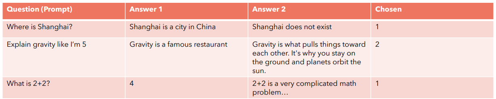
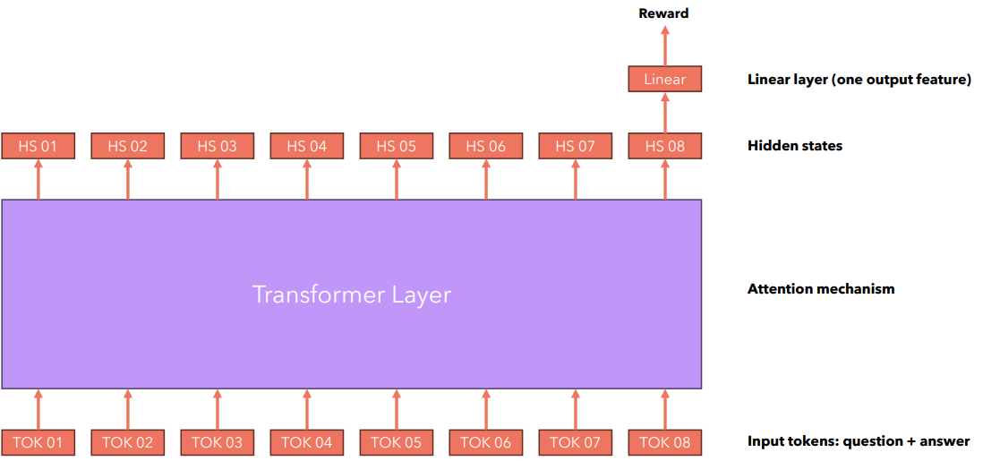
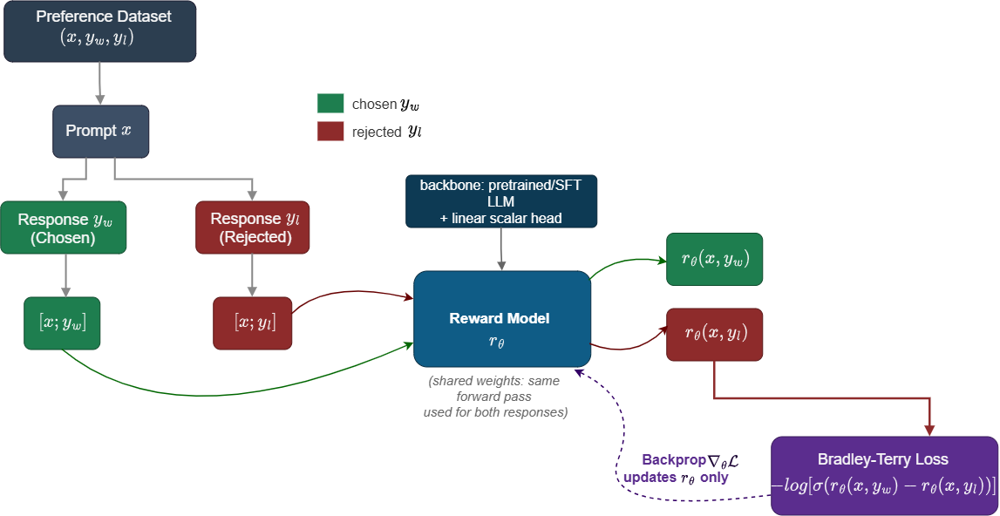

# §8 — Building the Reward Model

> **Slides 41–46** · Topics 35–39
> *Answers slide 16's question: "What is the reward model?" The Bradley-Terry loss here is the mathematical ancestor of the DPO loss in §10.*

---

## The one-line story of this section

> We can't assign absolute scores to responses — but humans can reliably say *which of two is better*. The **Bradley-Terry model** converts those pairwise choices into a latent scalar reward, trained with the loss `−log σ(r_w − r_l)`. That single expression is the bridge from "human preference" to "differentiable objective."

---

## Topic 35 — Why Absolute Scoring Fails (slide 41)


> **Slide 41:** *"It is not easy for us to create the reward model, as this would require a dataset of prompts and responses and a **universally accepted 'reward'** for each answer. **People are good at comparison.**"*

### The problem with absolute scores

Imagine asking annotators to rate responses 0–10:

| Failure | Detail |
|---|---|
| **No universal scale** | My 7 is your 5. There is no anchor. |
| **Drift within an annotator** | Your ratings after 200 items differ from your first 20. |
| **Compression** | Everything lands in 6–8; the tails are unused. |
| **Context dependence** | A "7" for a hard prompt vs. a "7" for a trivial one are incomparable. |
| **Cognitive cost** | Absolute judgement is slow and effortful. |
| **Non-decomposability** | Which of helpful/honest/harmless produced the 7? |

The professor's framing in the lecture: *"I do not have any mechanism of scoring… had we had that with us, we would have learnt a regression model, so we cannot do that."* — i.e. **if absolute scores existed, this would be a boring regression problem.** They don't, so it isn't.

### 🔬 Simulate annotator disagreement — why absolute scoring fails

```python
import numpy as np
np.random.seed(0)

N = 200
true_quality = np.random.uniform(0, 10, N)     # the latent "true" quality

# ── ABSOLUTE RATING: each annotator has their own scale offset and gain ──
def absolute_ratings(n_annotators=5):
    out = []
    for _ in range(n_annotators):
        offset = np.random.normal(0, 1.5)      # "I'm a harsh grader"
        gain   = np.random.uniform(0.6, 1.4)   # "I use a narrow range"
        noise  = np.random.normal(0, 0.8, N)
        out.append(np.clip(true_quality * gain + offset + noise, 0, 10))
    return np.array(out)

# ── PAIRWISE COMPARISON: same noise, but only the SIGN matters ──
def pairwise_agreement(n_annotators=5, n_pairs=500):
    i, j = np.random.randint(0, N, n_pairs), np.random.randint(0, N, n_pairs)
    votes = []
    for _ in range(n_annotators):
        noise_i = np.random.normal(0, 0.8, n_pairs)
        noise_j = np.random.normal(0, 0.8, n_pairs)
        votes.append((true_quality[i] + noise_i) > (true_quality[j] + noise_j))
    votes = np.array(votes)
    # fraction of pairs where ALL annotators agree
    return np.mean(votes.all(0) | (~votes).all(0)), i, j, votes

R = absolute_ratings()
print("=== ABSOLUTE RATINGS (0-10 scale) ===")
print(f"{'item':>6} | " + " | ".join(f"ann{k}" for k in range(5)) + " |  spread")
print("-" * 56)
for idx in range(5):
    scores = R[:, idx]
    print(f"{idx:>6} | " + " | ".join(f"{s:4.1f}" for s in scores) +
          f" |  {scores.max()-scores.min():5.1f}")
print(f"\nMean spread across annotators : {np.mean(R.max(0) - R.min(0)):.2f} points")
print(f"Mean pairwise correlation     : "
      f"{np.mean([np.corrcoef(R[a], R[b])[0,1] for a in range(5) for b in range(a+1,5)]):.3f}")

agree, i, j, votes = pairwise_agreement()
print(f"\n=== PAIRWISE COMPARISONS ===")
print(f"Unanimous agreement rate: {agree:.1%}")

# The key point: rank correlation survives even though the scales don't
from scipy.stats import spearmanr
print(f"\nSpearman RANK correlation between annotators: "
      f"{np.mean([spearmanr(R[a], R[b]).correlation for a in range(5) for b in range(a+1,5)]):.3f}")
print("\n=> Annotators DISAGREE on absolute numbers but AGREE on ORDER.")
print("   Bradley-Terry extracts exactly the part they agree on.")
```

### The comparison asymmetry (revisited from §2)

```
   "Rate this response 0–10"          →  humans are BAD, slow, inconsistent
   "Which of these two is better?"    →  humans are GOOD, fast, consistent
```

This is a well-established finding in psychometrics: **relative judgement is more reliable than absolute judgement.** It's the same reason chess uses Elo (pairwise game outcomes → a latent rating) rather than asking experts to score players out of 100 — and the mathematics turns out to be the same, too.

### 💡 Learning thought

> Every field that needs to rank things without an absolute scale converges on the same solution: **collect comparisons, fit a latent scalar.** Chess (Elo), sports rankings, A/B testing, psychophysics, and now LLM alignment. Bradley-Terry (1952) predates all the deep learning by seventy years. **The novelty in RLHF is not the statistics — it's that the latent score is produced by a transformer and is differentiable.**

### 🔗 Resources for Topic 35

- **[Bradley & Terry (1952), Rank Analysis of Incomplete Block Designs](https://www.jstor.org/stable/2334029)** — the original paper. Worth seeing how old the idea is.
- **[Elo rating system (Wikipedia)](https://en.wikipedia.org/wiki/Elo_rating_system)** — the same mathematics, applied to chess. If BT feels abstract, Elo makes it concrete.
- **[Chatbot Arena / LMArena](https://lmarena.ai/)** — Bradley-Terry running live on millions of human votes to rank LLMs. Their [methodology paper](https://arxiv.org/abs/2403.04132) is the best real-world case study of everything in this topic.

---

## Topic 36 — Preference Data (slide 42)

> **Slide 42:** *"Imagine if we could instead create a dataset of queries and answers and we could ask people to just select which one they prefer. This would be much easier!"*

Slide 42 shows exactly what the data looks like:



*Slide 42: prompt, two candidate answers, and a "Chosen" column. That is the entire data format.*

### The data format

$$\mathcal{D} = \{(x^{(i)},\, y_w^{(i)},\, y_l^{(i)})\}_{i=1}^{N}$$

| Symbol | Name | Meaning |
|---|---|---|
| `x` | prompt | The user query |
| `y_w` | **chosen** / winning | The response the annotator preferred |
| `y_l` | **rejected** / losing | The response they did not |

*(You'll see `y⁺/y⁻`, `y_w/y_l`, and `chosen/rejected` used interchangeably — same thing. The DPO notebook uses `chosen`/`rejected`.)*

### A concrete example

```json
{
  "prompt":   "My Python script throws KeyError: 'user_id'. Here's the code: ...",

  "chosen":   "The KeyError occurs on line 14 because `payload` doesn't always
               contain 'user_id' — it's absent when the webhook fires for
               anonymous events. Use `payload.get('user_id')` with a default,
               or guard with `if 'user_id' in payload:`. Here's the fix: ...",

  "rejected": "KeyErrors happen when a dictionary key doesn't exist. You should
               check your code carefully and make sure the key is present."
}
```

*(Note: this is slide 4's helpfulness example, now expressed as a training pair. The HHH specification has become data.)*

### 🔬 Explore a real preference dataset

```python
# pip install datasets
from datasets import load_dataset
import numpy as np

ds = load_dataset("trl-lib/ultrafeedback_binarized", split="train[:2000]")
print(ds, "\n")

ex = ds[0]
print("PROMPT  :", ex["chosen"][0]["content"][:200], "...\n")
print("CHOSEN  :", ex["chosen"][-1]["content"][:250], "...\n")
print("REJECTED:", ex["rejected"][-1]["content"][:250], "...\n")
print("Note: chosen and rejected share the SAME conversation prefix;")
print("only the final assistant turn differs.\n")

# ── Data quality audit -- run this on ANY preference set before training ──
c_len = np.array([len(e["chosen"][-1]["content"])   for e in ds])
r_len = np.array([len(e["rejected"][-1]["content"]) for e in ds])

print("=== DATA QUALITY AUDIT ===")
print(f"pairs                        : {len(ds)}")
print(f"mean chosen length (chars)   : {c_len.mean():.0f}")
print(f"mean rejected length (chars) : {r_len.mean():.0f}")
print(f"chosen longer in             : {(c_len > r_len).mean():.1%} of pairs")
print(f"  -> 'always pick longer' accuracy = {(c_len > r_len).mean():.1%}")
print(f"     ANY reward model must beat this to have learned quality.\n")

identical = sum(e["chosen"][-1]["content"].strip() ==
                e["rejected"][-1]["content"].strip() for e in ds)
print(f"identical pairs (pure noise) : {identical}")

# Near-duplicates carry almost no signal and should be filtered
from difflib import SequenceMatcher
sims = [SequenceMatcher(None, ds[i]["chosen"][-1]["content"][:400],
                        ds[i]["rejected"][-1]["content"][:400]).ratio()
        for i in range(200)]
print(f"near-duplicate (>0.9 similar): {np.mean(np.array(sims) > 0.9):.1%}")
print("\n=> Filter identical and near-identical pairs: they are label noise,")
print("   not signal, and they flatten your reward margins.")
```

### Where preference data comes from

| Source | Description | Trade-off |
|---|---|---|
| **Human annotation** | Experts/crowdworkers compare model outputs | Highest quality, most expensive |
| **Public datasets** | [Anthropic HH-RLHF](https://huggingface.co/datasets/Anthropic/hh-rlhf), [UltraFeedback](https://huggingface.co/datasets/openbmb/UltraFeedback), [SHP](https://huggingface.co/datasets/stanfordnlp/SHP), [Nectar](https://huggingface.co/datasets/berkeley-nest/Nectar) | Free, but may not match your domain |
| **RLAIF / Constitutional AI** | A strong LLM does the comparing, guided by written principles | Cheap and scalable; inherits the judge's biases |
| **Implicit product signals** | Thumbs up/down, regenerate clicks, copy events, conversation continuation | Free and on-policy; extremely noisy |
| **Best-of-N + judge** | Sample N, have a judge rank, take best vs. worst | Good for bootstrapping |

> **Class Q&A: "Where can we get this preference data?"**
> Human annotators comparing multiple responses; existing public preference datasets; and AI-generated feedback. For a real use case, the recommended recipe was: *"collect actual user queries, generate two or more candidate answers from your current model, and have trained annotators / domain experts pick the preferred one."*
>
> **The word doing the work there is "your current model."** Preferences collected from *your* model's generations are **on-policy** — they cover exactly the region where your reward model will be queried. Preferences from someone else's model create distribution mismatch and worse reward models.

### 🔬 Generate on-policy preference pairs

This is the recipe the TA described, implemented:

```python
from transformers import AutoModelForCausalLM, AutoTokenizer
import torch

MODEL = "Qwen/Qwen2-0.5B-Instruct"          # <- YOUR SFT model
tok = AutoTokenizer.from_pretrained(MODEL)
mdl = AutoModelForCausalLM.from_pretrained(MODEL, dtype=torch.float32).eval()
tok.pad_token = tok.eos_token

def sample_candidates(prompt, n=4, temperature=1.0, max_new_tokens=120):
    """Sample N candidates ON-POLICY -- from the model you are about to align."""
    text = tok.apply_chat_template([{"role": "user", "content": prompt}],
                                   tokenize=False, add_generation_prompt=True)
    ids = tok(text, return_tensors="pt")
    outs = mdl.generate(**ids, max_new_tokens=max_new_tokens,
                        do_sample=True, temperature=temperature, top_p=0.95,
                        num_return_sequences=n, pad_token_id=tok.eos_token_id)
    return [tok.decode(o[ids["input_ids"].shape[1]:], skip_special_tokens=True)
            for o in outs]


prompt = "My Python script throws KeyError: 'user_id'. What should I check?"
cands = sample_candidates(prompt, n=4)

print(f"PROMPT: {prompt}\n")
for i, c in enumerate(cands):
    print(f"--- CANDIDATE {i} ({len(c)} chars) ---")
    print(c[:220], "...\n")

print("NEXT STEP: a domain expert (or an LLM judge, for RLAIF) picks the best")
print("and the worst -> that becomes ONE (prompt, chosen, rejected) triple.")
print("\nWhy sample from YOUR model? Because the reward model will be queried")
print("on YOUR model's outputs during PPO. Off-policy pairs create a")
print("distribution mismatch and a reward model that is wrong where it matters.")


# ---- The pair-construction step ----
def make_pair(prompt, candidates, judge_fn):
    """judge_fn(prompt, response) -> score. Human, LLM judge, or heuristic."""
    scored = sorted(((judge_fn(prompt, c), c) for c in candidates), reverse=True)
    if scored[0][0] == scored[-1][0]:
        return None                          # TIE -> drop it, it is noise
    return {"prompt": prompt, "chosen": scored[0][1], "rejected": scored[-1][1]}
```

### Data quality checklist (production)

- [ ] **Multiple annotators per item**, with inter-annotator agreement (Cohen's/Fleiss' κ) tracked
- [ ] **Gold-standard trap items** to score annotator reliability
- [ ] **Tie option** available, and near-tie pairs filtered out (low margin = noise, not signal)
- [ ] **Length-balanced** pairs, or explicit length debiasing
- [ ] **On-policy generation** — pairs sampled from the model you're about to train
- [ ] **Failure-mode coverage** — deliberately include sycophancy-vs-honesty and concise-vs-verbose pairs
- [ ] **Written rubric** encoding your HHH trade-offs (this is your model's constitution — §1, Topic 3)

### ⚠️ Class Q&A

**"Human feedback can be biased, or a user could manipulate the model with wrong feedback. How is that addressed?"**
> Give the same item to multiple annotators and aggregate (mean/majority, with variance as a disagreement signal). Beyond that: gold-item screening, annotator reliability weighting, outlier detection, and — for implicit product signals — treating them as weak labels to be aggregated in bulk rather than trusted individually.

**"Can we train foundation models like GPT with preference examples?"**
> If you have the **weights**, yes — RLHF or DPO applies to any model you can backprop through. For closed models (GPT, Claude), you cannot; you're limited to whatever preference-tuning the provider exposes through their fine-tuning API, if any. This is a real architectural consideration when choosing between open and closed models for a product that needs behavioural customisation.

### 🔗 Resources for Topic 36

- **[Anthropic HH-RLHF](https://huggingface.co/datasets/Anthropic/hh-rlhf)** — the classic helpful/harmless preference dataset. Browse it in the dataset viewer.
- **[UltraFeedback](https://huggingface.co/datasets/openbmb/UltraFeedback)** / **[trl-lib/ultrafeedback_binarized](https://huggingface.co/datasets/trl-lib/ultrafeedback_binarized)** — the dataset used in the §10 notebook.
- **[Argilla](https://argilla.io/)** + **[distilabel](https://distilabel.argilla.io/)** — open-source tooling for building and cleaning preference datasets, including LLM-as-judge pipelines.
- **[Bai et al., Constitutional AI / RLAIF (2022)](https://arxiv.org/abs/2212.08073)** — the canonical AI-feedback approach.

---

## Topic 37 — Reward Model Architecture (slide 43)



*Slide 43: input tokens (question + answer) → transformer layer → hidden states → **a linear layer with one output feature** on the last hidden state → Reward.*

```
   Input:  x ⊕ y   (prompt concatenated with response)
              │
              ▼
   ┌────────────────────────────────────────┐
   │   Transformer backbone                 │   ← usually initialised from
   │   (typically the SFT model)            │      the SFT model
   └────────────────────────────────────────┘
              │
              ▼   hidden state of the LAST token
   ┌────────────────────────────────────────┐
   │   Linear head:  hidden_dim → 1         │   ← REPLACES the LM head
   └────────────────────────────────────────┘
              │
              ▼
        r_φ(x, y)  ∈ ℝ        a single scalar
```

### The design decisions and why

| Decision | Rationale |
|---|---|
| Initialise from the **SFT model** | It already understands the domain and the response format; you're only teaching it to *judge*, not to read |
| Replace LM head with a **scalar head** | You want one number, not a vocabulary distribution |
| Read the **last token's** hidden state | With causal masking, only the final position has attended to the entire response |
| Input is **`x ⊕ y`** | The score is conditional — the same response is good for one prompt and bad for another |

### 🔬 Build a reward model — and hit the classic padding bug

```python
import torch, torch.nn as nn
from transformers import AutoModel, AutoTokenizer

class RewardModel(nn.Module):
    """Slide 43, implemented."""
    def __init__(self, model_name):
        super().__init__()
        self.backbone = AutoModel.from_pretrained(model_name)
        h = self.backbone.config.hidden_size
        self.score = nn.Linear(h, 1, bias=False)     # "linear layer, one output"
        nn.init.normal_(self.score.weight, std=1 / (h + 1) ** 0.5)

    def forward(self, input_ids, attention_mask):
        hs = self.backbone(input_ids=input_ids,
                           attention_mask=attention_mask).last_hidden_state

        # ⚠️ THE CLASSIC BUG: with right-padding, the literal last index is <pad>.
        #    You MUST index the last NON-PAD token.
        last_non_pad = attention_mask.sum(dim=1) - 1                 # (B,)
        batch = torch.arange(hs.size(0), device=hs.device)
        pooled = hs[batch, last_non_pad]                             # (B, H)
        return self.score(pooled).squeeze(-1)                        # (B,)


tok = AutoTokenizer.from_pretrained("Qwen/Qwen2-0.5B-Instruct")
tok.pad_token = tok.eos_token
rm = RewardModel("Qwen/Qwen2-0.5B-Instruct")

texts = ["Q: Why is the sky blue? A: Sunlight scatters in the atmosphere, and "
         "shorter blue wavelengths scatter more than red ones.",
         "Q: Why is the sky blue? A: It is."]        # much shorter -> heavy padding
enc = tok(texts, return_tensors="pt", padding=True)

print("attention_mask:\n", enc["attention_mask"])
print("last non-pad index per row:", (enc["attention_mask"].sum(1) - 1).tolist())
print("literal last index        :", enc["input_ids"].shape[1] - 1)
print("=> For row 1 these DIFFER. Indexing [-1] would score PADDING.\n")

with torch.no_grad():
    scores = rm(enc["input_ids"], enc["attention_mask"])
print("rewards:", scores.numpy().round(4), "(untrained -> meaningless, as expected)")


# ---- Demonstrate the bug's effect ----
class BuggyRewardModel(RewardModel):
    def forward(self, input_ids, attention_mask):
        hs = self.backbone(input_ids=input_ids,
                           attention_mask=attention_mask).last_hidden_state
        return self.score(hs[:, -1]).squeeze(-1)      # ⚠️ always the literal last

buggy = BuggyRewardModel("Qwen/Qwen2-0.5B-Instruct")
buggy.load_state_dict(rm.state_dict())
with torch.no_grad():
    bad = buggy(enc["input_ids"], enc["attention_mask"])
print("\nbuggy rewards:", bad.numpy().round(4))
print("Row 0 matches (no padding); row 1 differs -- it scored a <pad> token.")
print("\nSYMPTOMS IN THE WILD: near-constant rewards, or rewards that change")
print("when you change the batch composition. Always check this first.")
```

> ⚠️ **Why the last token specifically:** causal attention means position `t` has only seen tokens `≤ t`. Only the final position's hidden state encodes the complete response. Pooling over all positions is possible but is standardly avoided — it dilutes the signal with representations of incomplete text.

### The output scale is arbitrary — and that's fine

The reward model is trained only on **differences** (`r_w − r_l`). Adding a constant `c` to every output leaves the loss unchanged. So:
- Raw reward values are **not interpretable** in absolute terms. `r = 3.2` means nothing on its own.
- Only **relative ordering** is meaningful.
- This is why PPO **normalises advantages** (§4) — to decouple step size from an arbitrary scale.
- It's also why you evaluate a reward model with **preference accuracy**, never with MSE against some "true" score.

```python
import torch, torch.nn.functional as F

r_w, r_l = torch.tensor(3.2), torch.tensor(1.7)
for c in [0.0, 100.0, -50.0]:
    loss = -F.logsigmoid((r_w + c) - (r_l + c))
    print(f"shift by {c:+7.1f}: r_w={r_w+c:8.1f}  r_l={r_l+c:8.1f}  loss={loss:.6f}")
print("\nIdentical loss for every shift => the absolute scale is UNIDENTIFIABLE.")
```

---

## Topic 38 — The Bradley-Terry Loss (slides 44–45)

Slide 45 shows the complete training picture:



*Slide 45: the preference dataset splits into `[x; y_w]` and `[x; y_l]`, both go through **the same reward model** (note: "shared weights: same forward pass used for both responses"), producing `r_θ(x,y_w)` and `r_θ(x,y_l)`, which feed the Bradley-Terry loss `−log[σ(r_θ(x,y_w) − r_θ(x,y_l))]`, whose gradient updates `r_θ` only.*

### The Bradley-Terry model (1952)

Given two items with latent strengths `r_w` and `r_l`, the probability that `w` is preferred is:

$$P(y_w \succ y_l \mid x) = \frac{\exp(r_\phi(x,y_w))}{\exp(r_\phi(x,y_w)) + \exp(r_\phi(x,y_l))} = \sigma\big(r_\phi(x,y_w) - r_\phi(x,y_l)\big)$$

where `σ(z) = 1/(1+e^{−z})` is the sigmoid. **The middle-to-right step is worth doing on paper once** — divide numerator and denominator by `exp(r_w)`:
$$\frac{1}{1 + \exp(r_l - r_w)} = \sigma(r_w - r_l)$$

### The loss

Maximum likelihood over the preference dataset gives the negative log-likelihood:

$$\boxed{\;\mathcal{L}_{RM}(\phi) = -\,\mathbb{E}_{(x,y_w,y_l)\sim\mathcal{D}}\Big[\log \sigma\big(r_\phi(x,y_w) - r_\phi(x,y_l)\big)\Big]\;}$$

*(Identical to the pre-read PDF's statement: `L(φ) = −log σ(r_φ(x,y_w) − r_φ(x,y_l))`.)*

### How slide 44 explains it

> - *σ will return a value > 0.5 → loss will be a small number*
> - *σ will return a value < 0.5 → loss will be a large number*
> - *"This loss forces the model to give high rewards to 'winning' responses and low rewards to 'losing' responses, because that's the only way for the model to minimize the loss."*

### 🔬 The loss surface, and the Bradley-Terry identity verified

```python
import torch, torch.nn.functional as F

# ── 1. Verify the algebraic identity ──
r_w, r_l = torch.tensor(2.5), torch.tensor(1.0)
ratio_form   = torch.exp(r_w) / (torch.exp(r_w) + torch.exp(r_l))
sigmoid_form = torch.sigmoid(r_w - r_l)
print(f"exp(r_w)/(exp(r_w)+exp(r_l)) = {ratio_form:.8f}")
print(f"sigma(r_w - r_l)             = {sigmoid_form:.8f}")
print(f"identical: {torch.allclose(ratio_form, sigmoid_form)}\n")

# ── 2. The loss table from slide 44 ──
print(f"{'r_w - r_l':>10} | {'sigma':>8} | {'-log sigma':>11} | interpretation")
print("-" * 66)
for d in [5, 2, 1, 0, -1, -5]:
    d_t = torch.tensor(float(d))
    s = torch.sigmoid(d_t).item()
    l = -F.logsigmoid(d_t).item()
    note = ("confidently correct" if d >= 2 else "correct" if d > 0 else
            "no preference (= ln 2)" if d == 0 else
            "WRONG" if d > -2 else "confidently WRONG")
    print(f"{d:>10} | {s:>8.4f} | {l:>11.4f} | {note}")

print(f"\nAt d=0 the loss is exactly ln(2) = {torch.log(torch.tensor(2.0)):.4f}")
print("Remember this number -- it reappears as the DPO initial loss in §10.\n")

# ── 3. NUMERICAL STABILITY: why F.logsigmoid, never log(sigmoid(x)) ──
print("=== NUMERICAL STABILITY ===")
for d in [-20.0, -50.0, -100.0]:
    d_t = torch.tensor(d)
    naive  = -torch.log(torch.sigmoid(d_t))
    stable = -F.logsigmoid(d_t)
    print(f"d={d:>7.1f} | -log(sigmoid(d)) = {naive.item():>10} "
          f"| -logsigmoid(d) = {stable.item():>8.2f}")
print("\nsigmoid(-100) underflows to 0.0 -> log(0) = inf -> NaN gradients.")
print("ALWAYS use F.logsigmoid. Same reason as log_softmax in §3.\n")

# ── 4. The gradient: automatic hard-example weighting ──
print("=== GRADIENT MAGNITUDE vs. CURRENT MARGIN ===")
print(f"{'margin d':>9} | {'|d loss / d r_w|':>17} | meaning")
print("-" * 56)
for d in [-3.0, -1.0, 0.0, 1.0, 3.0, 6.0]:
    rw = torch.tensor(d, requires_grad=True)
    rl = torch.tensor(0.0)
    loss = -F.logsigmoid(rw - rl)
    loss.backward()
    g = abs(rw.grad.item())
    note = "big update (model is WRONG)" if d < 0 else \
           "small update (already right)" if d > 2 else "moderate"
    print(f"{d:>9.1f} | {g:>17.4f} | {note}")
print("\nThe gradient is sigma(-(r_w - r_l)): LARGE when wrong, ~0 when")
print("already confidently right. FREE hard-example mining -- and exactly")
print("the same adaptive weighting DPO inherits (§10).")
```

### ⚠️ Class Q&A

**"Why is a negative sign used in the equation? What's its significance?"**
> We want the preferred response to receive the higher score, i.e. we want to **maximise** `log σ(r_w − r_l)`. But optimisers **minimise**. So we negate: minimising `−log σ(r_w − r_l)` is identical to maximising the log-likelihood of the observed human preferences. The negative sign is the standard maximum-likelihood → loss conversion; nothing deeper.

### Four properties worth knowing

1. **It's a pairwise logistic regression** on the reward *difference*. If you've done binary classification with `BCEWithLogits`, you already know this loss — the "logit" is `r_w − r_l`.
2. **Shift-invariant.** `r + c` for all responses leaves the loss unchanged → the absolute scale is unidentifiable (verified above). **This property is what makes DPO's `Z(x)` cancel in §10.**
3. **Ties are unmodelled.** Standard Bradley-Terry has no tie category; extensions (Rao-Kupper, Davidson) add one. Most pipelines simply drop ties.
4. **It assumes transitivity.** BT implies a total ordering by latent strength. Real human preferences can be *intransitive* (A>B, B>C, C>A) — a known limitation.

### 💡 Learning thought

> Hold `−log σ(r_w − r_l)` in your head and go look at the DPO loss in §10:
> $$\mathcal{L}_{DPO} = -\log\sigma\Big(\beta\log\tfrac{\pi_\theta(y_w|x)}{\pi_{\text{ref}}(y_w|x)} - \beta\log\tfrac{\pi_\theta(y_l|x)}{\pi_{\text{ref}}(y_l|x)}\Big)$$
> **It is the identical loss.** The only change is *what plays the role of `r`*. DPO's central insight is that the optimal policy of the KL-regularised objective (§6) implies a reward function expressible in terms of the policy itself — so you can substitute it straight into Bradley-Terry and skip building the reward model. If you understand this section deeply, §10 is a substitution, not a new idea.

### 🔗 Resources for Topic 38

- **[Christiano et al., Deep RL from Human Preferences (2017)](https://proceedings.neurips.cc/paper_files/paper/2017/file/d5e2c0adad503c91f91df240d0cd4e49-Paper.pdf)** *(slide 57's own recommendation)* — the paper that first applied Bradley-Terry reward learning to deep RL. §2.2 is the loss you just implemented.
- **[Nathan Lambert — RLHF Book, Ch. 7 "Reward Modeling"](https://rlhfbook.com/c/07-reward-models.html)** *(slide 57)* — the most complete modern treatment, including tie models and multi-objective variants.
- **[RewardBench](https://huggingface.co/spaces/allenai/reward-bench)** — a leaderboard evaluating reward models. Look at the actual accuracy numbers to calibrate your expectations.

---

## Topic 39 — The Reward Model in Code (slide 46)

### Slide 46, verbatim

```python
# ---- Forward passes (batched: 2 sequences in one call, still independent computations)
batch = tokenizer([x + y_w, x + y_l], padding=True, return_tensors="pt")
scores = reward_model(**batch)          # shape (2,) -> scalar reward per sequence
r_w, r_l = scores[0], scores[1]         # r_theta(x, y_w), r_theta(x, y_l)

# ---- Bradley-Terry loss ----
# L = -log( sigma( r_w - r_l ) )
loss = -F.logsigmoid(r_w - r_l)

# ---- Backprop: gradients flow through BOTH forward passes into shared theta ----
loss.backward()
optimizer.step()
optimizer.zero_grad()
```

### Line-by-line notes

**`tokenizer([x + y_w, x + y_l], ...)`** — both sequences batched into one call. The comment stresses *"still independent computations"*: batching is purely for GPU efficiency; the two sequences do not attend to each other.

**`scores = reward_model(**batch)`** — shape `(2,)`. One scalar per sequence, from the last non-pad token's hidden state through the scalar head.

**`loss = -F.logsigmoid(r_w - r_l)`** — use `logsigmoid`, **never** `-torch.log(torch.sigmoid(x))` (demonstrated above).

**`loss.backward()`** — the comment is the important part: *"gradients flow through BOTH forward passes into shared theta."* There is **one** reward model, `φ`, scoring both sequences — slide 45's diagram says the same thing with *"shared weights: same forward pass used for both responses."* The gradient pushes `r_w` up and `r_l` down simultaneously. It is not a siamese network with two sets of weights; it's one network applied twice.

### 🔬 Complete, runnable reward-model training

```python
# pip install transformers datasets torch
import torch, torch.nn as nn, torch.nn.functional as F
from torch.utils.data import Dataset, DataLoader
from transformers import AutoModel, AutoTokenizer
from datasets import load_dataset

MODEL, LR, EPOCHS, BATCH, MAXLEN = "Qwen/Qwen2-0.5B-Instruct", 1e-5, 1, 4, 256
DEVICE = "cuda" if torch.cuda.is_available() else "cpu"

tok = AutoTokenizer.from_pretrained(MODEL); tok.pad_token = tok.eos_token


class RewardModel(nn.Module):
    def __init__(self, name):
        super().__init__()
        self.backbone = AutoModel.from_pretrained(name)
        h = self.backbone.config.hidden_size
        self.score = nn.Linear(h, 1, bias=False)
        nn.init.normal_(self.score.weight, std=1 / (h + 1) ** 0.5)

    def forward(self, input_ids, attention_mask):
        hs = self.backbone(input_ids=input_ids,
                           attention_mask=attention_mask).last_hidden_state
        last = attention_mask.sum(1) - 1                       # last NON-PAD
        return self.score(hs[torch.arange(hs.size(0)), last]).squeeze(-1)


class PrefData(Dataset):
    def __init__(self, split, n):
        raw = load_dataset("trl-lib/ultrafeedback_binarized", split=split)
        self.items = []
        for i in range(n):
            e = raw[i]
            prompt = tok.apply_chat_template(e["chosen"][:-1], tokenize=False,
                                             add_generation_prompt=True)
            self.items.append((prompt,
                               e["chosen"][-1]["content"],
                               e["rejected"][-1]["content"]))
    def __len__(self):  return len(self.items)
    def __getitem__(self, i): return self.items[i]


def collate(batch):
    """Concatenate chosen and rejected into ONE batch of size 2B.
       One forward pass; split the scores afterwards."""
    prompts, chosen, rejected = zip(*batch)
    texts = [p + c for p, c in zip(prompts, chosen)] + \
            [p + r for p, r in zip(prompts, rejected)]
    enc = tok(texts, return_tensors="pt", padding=True,
              truncation=True, max_length=MAXLEN)
    return enc["input_ids"], enc["attention_mask"], len(batch)


rm  = RewardModel(MODEL).to(DEVICE)
opt = torch.optim.AdamW(rm.parameters(), lr=LR)

train_dl = DataLoader(PrefData("train", 400), batch_size=BATCH,
                      shuffle=True, collate_fn=collate)
eval_dl  = DataLoader(PrefData("test",  100), batch_size=BATCH,
                      shuffle=False, collate_fn=collate)


@torch.no_grad()
def evaluate(dl):
    """The ONLY metric that matters: preference accuracy on held-out pairs."""
    rm.eval(); correct = total = 0; margins = []
    for ids, mask, B in dl:
        s = rm(ids.to(DEVICE), mask.to(DEVICE))
        r_w, r_l = s[:B], s[B:]
        correct += (r_w > r_l).sum().item(); total += B
        margins += (r_w - r_l).tolist()
    return correct / total, sum(margins) / len(margins)


acc, marg = evaluate(eval_dl)
print(f"BEFORE training: accuracy {acc:.1%}  mean margin {marg:+.3f}"
      f"   (random = 50%)\n")

rm.train()
for step, (ids, mask, B) in enumerate(train_dl):
    s = rm(ids.to(DEVICE), mask.to(DEVICE))       # ONE forward pass, 2B sequences
    r_w, r_l = s[:B], s[B:]

    loss = -F.logsigmoid(r_w - r_l).mean()        # BRADLEY-TERRY

    loss.backward()
    torch.nn.utils.clip_grad_norm_(rm.parameters(), 1.0)
    opt.step(); opt.zero_grad()

    if step % 20 == 0:
        acc_batch = (r_w > r_l).float().mean().item()
        print(f"step {step:>3} | loss {loss.item():.4f} "
              f"| batch acc {acc_batch:.0%} | margin {(r_w-r_l).mean():+.3f}")

acc, marg = evaluate(eval_dl)
print(f"\nAFTER training : accuracy {acc:.1%}  mean margin {marg:+.3f}")
print("Typical for a real reward model: 65-75%. Human-human agreement is ~70-80%,")
print("so this is close to the LABEL NOISE CEILING, not a sign of a weak model.")
```

### The production version — TRL's `RewardTrainer`

```python
# pip install trl
from trl import RewardTrainer, RewardConfig
from transformers import AutoModelForSequenceClassification, AutoTokenizer
from datasets import load_dataset

model = AutoModelForSequenceClassification.from_pretrained(
    "Qwen/Qwen2-0.5B-Instruct", num_labels=1)      # num_labels=1 -> scalar head
tok = AutoTokenizer.from_pretrained("Qwen/Qwen2-0.5B-Instruct")
tok.pad_token = tok.eos_token
model.config.pad_token_id = tok.pad_token_id       # ⚠️ required, or last-token indexing breaks

trainer = RewardTrainer(
    model=model,
    args=RewardConfig(output_dir="./rm", per_device_train_batch_size=4,
                      learning_rate=1e-5, num_train_epochs=1,
                      max_length=512, center_rewards_coefficient=0.01),
    train_dataset=load_dataset("trl-lib/ultrafeedback_binarized", split="train[:2000]"),
    processing_class=tok,
)
trainer.train()
```

> 💡 `center_rewards_coefficient` adds a small `(r_w + r_l)²` penalty. Since the loss is shift-invariant, the scale can drift arbitrarily during training; this pins it near zero. A nice illustration of the shift-invariance property having a real engineering consequence.

### Evaluating a reward model

| Metric | What it measures |
|---|---|
| **Preference accuracy** | % of held-out pairs where `r_w > r_l`. The headline number. Typical: 65–75%. |
| **Reward margin** | Mean `r_w − r_l`. Larger = more confident separation. |
| **Calibration** | Does `σ(r_w − r_l)` match the empirical human agreement rate? |
| **Length correlation** | `corr(r, len(y))` — a high value is a length-bias alarm (§6) |
| **Out-of-distribution behaviour** | Score responses far from the training distribution; wild scores predict hackability |

### 🔬 Audit your reward model for length bias

```python
import numpy as np, torch

@torch.no_grad()
def length_bias_audit(rm, tok, dl, device):
    rm.eval(); rewards, lengths = [], []
    for ids, mask, B in dl:
        s = rm(ids.to(device), mask.to(device))
        rewards += s.tolist()
        lengths += mask.sum(1).tolist()
    r, l = np.array(rewards), np.array(lengths)
    corr = np.corrcoef(r, l)[0, 1]
    print(f"corr(reward, length) = {corr:+.3f}")
    if abs(corr) > 0.3:
        print("⚠️  STRONG LENGTH BIAS. Your RM partly counts tokens.")
        print("    Expect PPO/DPO to produce a verbose model (§6).")
    return corr


@torch.no_grad()
def padding_probe(rm, tok, device):
    """Does the RM prefer a padded version of the SAME answer? It should not."""
    base = "Q: Why is the sky blue? A: Sunlight scatters in the atmosphere."
    variants = {
        "base":              base,
        "+ filler":          base + " I hope this helps! Let me know if you have "
                                    "any other questions. Happy to elaborate further.",
        "+ flattery":        "Great question! " + base,
        "+ both":            "Great question! " + base + " I hope this helps!",
    }
    print(f"\n{'variant':<14} | {'reward':>8}")
    print("-" * 26)
    for name, text in variants.items():
        enc = tok(text, return_tensors="pt").to(device)
        print(f"{name:<14} | {rm(enc['input_ids'], enc['attention_mask']).item():>8.4f}")
    print("\nIf 'base' is NOT the highest, your reward model rewards padding")
    print("and flattery -- and PPO will maximise exactly that (§6).")
```

> 💡 **65–75% accuracy sounds low, and that's the point.** Human annotators agree with each other only ~70–80% of the time on this task. The reward model is approaching the noise ceiling of the labels themselves. **This inherent noisiness is exactly why the KL constraint (§6) is mandatory** — you cannot optimise hard against a judge that is right three times in four.

### 🔗 Resources for Topic 39

- **[TRL RewardTrainer docs](https://huggingface.co/docs/trl/reward_trainer)** — the production API, including the expected dataset format.
- **[RewardBench (Lambert et al., 2024)](https://arxiv.org/abs/2403.13787)** — a systematic evaluation of reward models, with the accuracy numbers to calibrate against.
- **[Coste et al., Reward Model Ensembles Help Mitigate Overoptimization (2023)](https://arxiv.org/abs/2310.02743)** — the ensemble-with-pessimism defence mentioned in §6, quantified.

---

## 📐 Formula summary — §8

| Concept | Formula |
|---|---|
| Preference data | `D = {(x, y_w, y_l)}` |
| Bradley-Terry | `P(y_w ≻ y_l) = σ(r_φ(x,y_w) − r_φ(x,y_l))` |
| **Reward-model loss** | **`L = −E[log σ(r_φ(x,y_w) − r_φ(x,y_l))]`** |
| Sigmoid | `σ(z) = 1/(1+e^{−z})` |
| Loss at zero margin | `ln 2 ≈ 0.6931` |
| Gradient magnitude | `σ(−(r_w − r_l))` — large when wrong |
| Stable code | `loss = -F.logsigmoid(r_w - r_l)` |

---

## 🎯 Interview Questions — §8

### Conceptual

**Q1. Why do we use pairwise comparisons rather than absolute ratings?**
> Humans lack a shared absolute scale, drift over a session, compress ratings into a narrow band, and find absolute judgement slow and effortful — demonstrable by simulating annotators with different offsets and gains: their absolute correlations are poor while their *rank* correlations remain high. Comparisons are fast, scale-free, and implicitly resolve HHH trade-offs per-instance. Bradley-Terry then recovers a latent scalar from those comparisons — the same construction as Elo in chess.

**Q2. Derive the Bradley-Terry loss.**
> BT models `P(y_w ≻ y_l) = exp(r_w)/(exp(r_w) + exp(r_l))`. Dividing through by `exp(r_w)` gives `1/(1 + exp(r_l − r_w)) = σ(r_w − r_l)`. Maximum likelihood over the dataset maximises `Σ log σ(r_w − r_l)`; negating for minimisation gives `L = −E[log σ(r_φ(x,y_w) − r_φ(x,y_l))]`.

**Q3. Describe the reward model's architecture and why each choice is made.**
> A transformer backbone (initialised from the SFT model, so it already understands the domain) with the LM head **replaced** by a linear `hidden_dim → 1` head. Input is the concatenation `x ⊕ y`, because the score is conditional on the prompt. The scalar is read from the **last non-pad token's** hidden state, since causal masking means only that position has attended to the full response.

**Q4. Why are reward-model outputs not interpretable in absolute terms?**
> The loss depends only on the difference `r_w − r_l`, so adding any constant to every output leaves it unchanged — the scale is shift-invariant and unidentifiable (verifiable in three lines). Consequently only relative ordering is meaningful, evaluation uses preference accuracy rather than MSE, and PPO normalises advantages to decouple step size from an arbitrary reward scale. TRL adds a `center_rewards_coefficient` penalty precisely because the scale would otherwise drift.

**Q5. Why `F.logsigmoid` instead of `torch.log(torch.sigmoid(x))`?**
> Numerical stability. For large negative `x`, `sigmoid(x)` underflows to exactly 0 in floating point, and `log(0) = −inf`, producing NaN gradients (reproducible at `x = −100`). `logsigmoid` uses a stable formulation (`−softplus(−x)`) that stays finite across the full range. The same applies to `log_softmax` vs `log(softmax(·))`.

**Q6. What accuracy should a good reward model achieve, and why isn't it higher?**
> Typically 65–75% on held-out preference pairs. It isn't higher because **human annotators only agree with each other ~70–80% of the time** — the labels themselves are noisy, so the model is near the label noise ceiling. This is the fundamental reason a KL constraint is mandatory: you cannot safely apply heavy optimisation pressure against a judge that is right three times in four.

**Q7. What assumptions does Bradley-Terry make, and where do they break?**
> It assumes (a) a **latent scalar strength** fully explains preferences, (b) **transitivity** (A≻B, B≻C ⇒ A≻C), and (c) **no ties**. Real preferences can be intransitive, genuinely multi-dimensional (a response may be more helpful but less safe, with no consistent scalar ordering), and often tied. Mitigations: drop or model ties explicitly (Rao-Kupper/Davidson), use multi-objective reward models with per-attribute heads, or use preference models that don't assume a total order.

**Q8. Explain the connection between the Bradley-Terry loss and the DPO loss.**
> They are **the same functional form** — `−log σ(Δ)` — differing only in what `Δ` is. In reward modelling, `Δ = r_φ(x,y_w) − r_φ(x,y_l)` with an explicitly parameterised reward model. In DPO, `Δ = β[log(π_θ(y_w|x)/π_ref(y_w|x)) − log(π_θ(y_l|x)/π_ref(y_l|x))]`, using the *implicit* reward that the KL-regularised optimum defines in terms of the policy itself. DPO substitutes that implicit reward into Bradley-Terry, so the reward model never needs to be built. The shift-invariance of BT is precisely what makes DPO's intractable `Z(x)` term cancel.

**Q9. Describe the Bradley-Terry gradient. What property does it have?**
> `∂L/∂r_w = −σ(−(r_w − r_l))`. The magnitude is near 1 when the model currently ranks the pair *wrongly*, and near 0 when it already ranks it confidently right. This is **automatic hard-example mining** — the loss self-weights toward pairs it gets wrong, with no curriculum or sampling logic. DPO inherits exactly this property.

### Applied

**Q10. You're building preference data for a customer-support model. Design the pipeline.**
> **Prompts**: sample real production queries, stratified by intent and difficulty. **Candidates**: generate 2+ responses **from your current SFT model** at temperature ~1.0 — on-policy is critical so the RM is trained where it will be queried. **Annotation**: domain experts, written rubric encoding your policy trade-offs, 3 annotators per item, κ tracked, gold trap items, tie option available. **Filtering**: drop ties, near-duplicates, and low-margin pairs; balance for length; deliberately include failure-mode pairs (concise-correct vs. verbose-flattering; honest-abstention vs. confident-fabrication). **Splits**: hold out a test set for preference accuracy. **Refresh**: re-collect on-policy pairs periodically as the model changes.

**Q11. Your reward model has 72% preference accuracy but PPO produces verbose sycophantic outputs. What's wrong and what do you do?**
> The reward model is *accurate on the distribution it was trained on* but has exploitable blind spots off-distribution — 72% is also close to the label noise ceiling, so there's headroom for the optimiser to exploit. **Diagnose:** compute `corr(reward, response_length)` on held-out data; run the padding probe (score `base` vs `base + filler` vs `"Great question! " + base`) — if base isn't highest, the RM rewards padding and flattery directly. **Fix:** length-debias the data and add explicit concise-vs-verbose and honest-vs-flattering pairs; raise β / tighten the KL budget; use a reward-model **ensemble with pessimistic (min) aggregation**; retrain the RM on fresh on-policy generations (iterated RLHF).

**Q12. Why do we read the last token's hidden state, and what's the classic bug?**
> Causal masking means only the final position has attended to the entire sequence; earlier positions represent incomplete responses. **The bug:** with right-padding in a batch, the literal last index is a `<pad>` token, so you score padding instead of the response. You must index the last **non-pad** position: `attention_mask.sum(dim=1) - 1`. Symptoms: near-constant rewards, or rewards that change when batch composition changes. In TRL you must also set `model.config.pad_token_id`.

**Q13. Would you use RLAIF (AI feedback) instead of human labels? Trade-offs?**
> **Pros:** orders of magnitude cheaper and faster, perfectly consistent, easily scaled to cover failure modes, and enables rapid iteration. **Cons:** inherits the judge model's biases wholesale (including its own length and style biases), caps behaviour at the judge's ceiling on judgement quality, and risks a feedback loop if judge and policy share a lineage. **Practice:** hybrid — AI feedback for bulk coverage, human labels for a high-quality core and for validation, with human evaluation as the final arbiter. Constitutional AI is the canonical version: written principles guide the AI judge, making the value specification explicit and auditable.

### Rapid-fire

| Question | Answer |
|---|---|
| Year Bradley-Terry was published? | 1952 |
| Data format? | `(x, y_w, y_l)` — prompt, chosen, rejected |
| Reward-model loss? | `−log σ(r_w − r_l)` |
| Head dimension? | `hidden → 1` |
| Which token's hidden state? | Last **non-pad** token |
| Is the reward scale meaningful? | **No** — shift-invariant |
| Evaluation metric? | Preference accuracy on held-out pairs |
| Typical accuracy? | 65–75% |
| Human–human agreement? | ~70–80% |
| Stable log-sigmoid in PyTorch? | `F.logsigmoid` |
| Forward passes per training pair? | 2 |
| Loss at zero margin? | `ln 2 ≈ 0.6931` |
| Gradient property? | Auto hard-example mining |
| Same loss appears where else? | **DPO** (§10) |

---

## ✅ Section self-check

1. Give three reasons absolute rating fails and one reason comparison works.
2. Derive `σ(r_w − r_l)` from the Bradley-Terry ratio form.
3. Explain the sign of the loss and why it's negated.
4. Why is a reward of 3.2 meaningless on its own — and what engineering consequence does that have?
5. Explain the last-non-pad-token indexing bug and how to fix it.
6. Why is 70% preference accuracy near-optimal rather than poor?
7. Write the reward-model loss and the DPO loss side by side and name the single difference.
8. **Hands-on:** train the reward model on 400 pairs. What accuracy do you reach, and what is `corr(reward, length)`?

---

**Previous:** [§7 — The Four Models in RLHF](07-four-models-rlhf.md) · **Next:** [§9 — Systems in the Wild](09-instructgpt-chatgpt.md) · [Index](00-INDEX.md)
