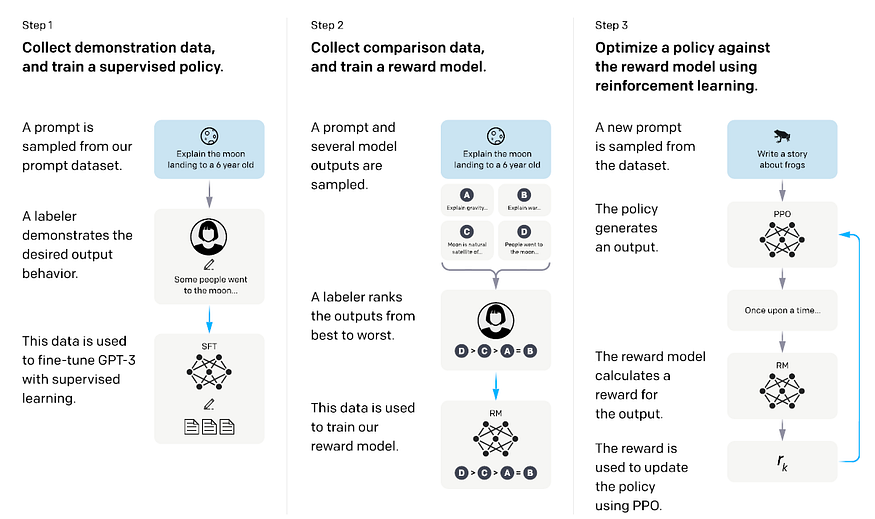
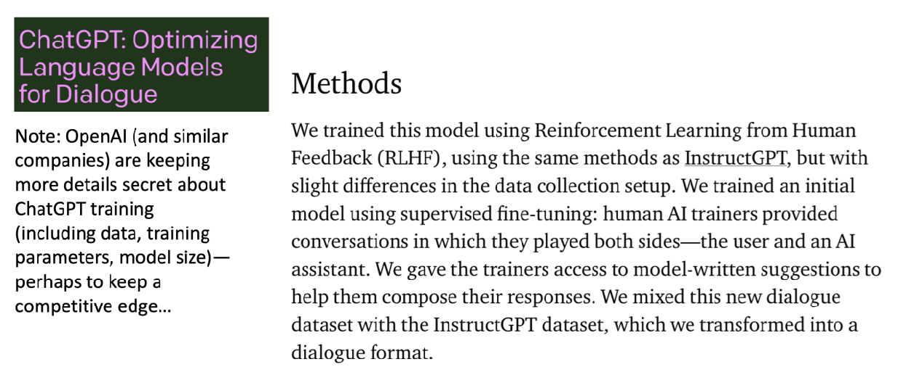

# §9 — Systems in the Wild: InstructGPT & ChatGPT

> **Slides 49–50** · Topics 40–41
> *Short section. Everything from §1–§8 assembled into the pipeline that produced ChatGPT.*

---

## The one-line story of this section

> InstructGPT (2022) is the paper that made RLHF famous. Its **three-step diagram** is the canonical picture of the entire pipeline — and it's simply §1's SFT, §8's reward model, and §5–§7's PPO, drawn in order.

---

## Topic 40 — InstructGPT (slide 49)

**Paper:** Ouyang et al., *"Training language models to follow instructions with human feedback"*, OpenAI, 2022.

Slide 49 reproduces the paper's Figure 2 — the most-reproduced diagram in the whole alignment literature:



*Slide 49 (= InstructGPT Figure 2). Step 1: a labeler writes the desired output; fine-tune with supervised learning. Step 2: sample several outputs, a labeler ranks them D > C > A > B, train the reward model. Step 3: sample a new prompt, the policy generates, the RM scores it, PPO updates the policy using `r_k`.*

### The three-step pipeline, annotated with this study pack

```
╔═════════════════════════════════════════════════════════════════════════╗
║  STEP 1 — SUPERVISED FINE-TUNING (SFT)                    [→ §1, T5]    ║
╠═════════════════════════════════════════════════════════════════════════╣
║   • Sample a prompt from the prompt dataset                             ║
║     "Explain the moon landing to a 6-year-old"                          ║
║   • A human LABELER writes the desired output                           ║
║     "Some people went to the moon..."                                   ║
║   • Fine-tune GPT-3 on these (prompt, response) pairs with              ║
║     cross-entropy                                                       ║
║                                                                         ║
║   OUTPUT:  π_SFT   ── becomes the initialisation for EVERYTHING:        ║
║                       the policy, the reference, and the reward model   ║
║   DATA:    ~13k prompts                                                 ║
╚═════════════════════════════════════════════════════════════════════════╝
                                    ▼
╔═════════════════════════════════════════════════════════════════════════╗
║  STEP 2 — TRAIN A REWARD MODEL                            [→ §8]        ║
╠═════════════════════════════════════════════════════════════════════════╣
║   • Sample a prompt and generate SEVERAL outputs (K = 4–9) from π_SFT   ║
║       A: "Explain gravity..."   B: "Explain war..."                     ║
║       C: "Moon is natural..."   D: "People went to..."                  ║
║   • A labeler RANKS the outputs best → worst   (D > C > A > B)          ║
║   • Train r_φ with the Bradley-Terry loss on all C(K,2) pairs           ║
║       L = −log σ(r_φ(x,y_w) − r_φ(x,y_l))                               ║
║                                                                         ║
║   OUTPUT:  r_φ — a differentiable, queryable proxy for human preference ║
║   DATA:    ~33k prompts                                                 ║
╚═════════════════════════════════════════════════════════════════════════╝
                                    ▼
╔═════════════════════════════════════════════════════════════════════════╗
║  STEP 3 — OPTIMISE THE POLICY WITH PPO                    [→ §4–§7]     ║
╠═════════════════════════════════════════════════════════════════════════╣
║   • Sample a NEW prompt (not seen in steps 1–2)                         ║
║     "Write a story about frogs"                                         ║
║   • The policy π_θ generates a response                                 ║
║   • r_φ scores it  →  r_k                                               ║
║   • KL penalty vs π_ref keeps the policy anchored          [→ §6]       ║
║   • PPO updates π_θ using clipped surrogate + advantages   [→ §4,§5]    ║
║                                                                         ║
║   OUTPUT:  π_θ — the aligned model. THE DELIVERABLE.                    ║
║   DATA:    ~31k prompts (no new human labels needed here!)              ║
╚═════════════════════════════════════════════════════════════════════════╝
```

### 🔑 The critical observation about Step 3

**Step 3 requires no new human labels.** The reward model *is* the human, distilled. That is precisely why building `r_φ` was worth the trouble: a fixed set of ~33k human rankings is amortised across an unlimited number of policy-gradient steps on unlimited prompts.

This also explains the whole architecture of RLHF in one sentence:

> **The reward model exists to make human judgement *queryable at training speed*.**

And it immediately raises the question DPO answers: *if the preference data is fixed anyway, do we need the intermediate model at all?*

### 🔬 Ranking K outputs → all pairwise comparisons

Step 2's diagram shows a labeler producing `D > C > A > B` — a *ranking*, not a pair. Here's how a ranking of K becomes `C(K,2)` training pairs, which is what actually multiplies your annotation budget.

```python
from itertools import combinations
import math

def ranking_to_pairs(prompt, ranked_responses):
    """
    InstructGPT Step 2: a labeler ranks K outputs best->worst.
    Every ordered pair becomes one Bradley-Terry training example.

    IMPORTANT (from the paper): all C(K,2) pairs from one prompt must go in
    the SAME minibatch. Otherwise each response is used K-1 times across
    different batches and the reward model overfits badly.
    """
    pairs = []
    for i, j in combinations(range(len(ranked_responses)), 2):
        pairs.append({"prompt": prompt,
                      "chosen":   ranked_responses[i],   # ranked higher
                      "rejected": ranked_responses[j]})
    return pairs


prompt = "Explain the moon landing to a 6 year old"
ranked = [
    "People went to the moon in a big rocket and walked on it!",   # D (best)
    "The moon is a natural satellite of Earth.",                   # C
    "Explain gravity to a 6 year old.",                            # A
    "Explain the theory of relativity to a 6 year old.",           # B (worst)
]

pairs = ranking_to_pairs(prompt, ranked)
print(f"K = {len(ranked)} ranked outputs -> {len(pairs)} preference pairs\n")
for p in pairs:
    print(f"  chosen : {p['chosen'][:48]}")
    print(f"  reject : {p['rejected'][:48]}\n")

print(f"{'K':>3} | {'pairs C(K,2)':>13} | {'pairs per labeler-minute*':>26}")
print("-" * 50)
for K in [2, 4, 6, 9]:
    n = math.comb(K, 2)
    print(f"{K:>3} | {n:>13} | {n / (0.5 * K):>26.1f}")
print("\n* assuming ~30s of labeler time per response read")
print("=> Ranking 9 outputs yields 36 pairs for the cost of reading 9 responses.")
print("   This is why InstructGPT used K=9 rather than simple pairwise labelling.")
```

### 🔬 The whole pipeline in TRL

You will never build all three stages by hand in production. This is the shape of the real thing:

```python
"""
InstructGPT's three steps, in TRL. Each stage is ~10 lines.
Run order matters: SFT -> RM -> PPO.
"""
from datasets import load_dataset
from transformers import (AutoModelForCausalLM, AutoTokenizer,
                          AutoModelForSequenceClassification)
from trl import (SFTTrainer, SFTConfig,
                 RewardTrainer, RewardConfig,
                 PPOTrainer, PPOConfig,
                 AutoModelForCausalLMWithValueHead)

BASE = "Qwen/Qwen2-0.5B"
tok = AutoTokenizer.from_pretrained(BASE); tok.pad_token = tok.eos_token

# ══ STEP 1: SFT  (§1 Topic 5) ════════════════════════════════════════════
#   Data: (prompt, ideal_response) written by labelers
#   Loss: cross-entropy on the response tokens
SFTTrainer(
    model=BASE,
    args=SFTConfig(output_dir="./step1_sft", num_train_epochs=1,
                   learning_rate=2e-5, max_length=1024),
    train_dataset=load_dataset("trl-lib/Capybara", split="train[:2000]"),
    processing_class=tok,
).train()
# OUTPUT: ./step1_sft  -> becomes policy init, pi_ref, AND the RM init


# ══ STEP 2: REWARD MODEL  (§8) ═══════════════════════════════════════════
#   Data: (prompt, chosen, rejected)
#   Loss: Bradley-Terry, -log sigma(r_w - r_l)
rm = AutoModelForSequenceClassification.from_pretrained("./step1_sft", num_labels=1)
rm.config.pad_token_id = tok.pad_token_id            # ⚠️ last-token indexing
RewardTrainer(
    model=rm,
    args=RewardConfig(output_dir="./step2_rm", num_train_epochs=1,
                      learning_rate=1e-5, max_length=512),
    train_dataset=load_dataset("trl-lib/ultrafeedback_binarized",
                               split="train[:2000]"),
    processing_class=tok,
).train()
# OUTPUT: ./step2_rm  -> a differentiable proxy for human judgement


# ══ STEP 3: PPO  (§4-§7) ═════════════════════════════════════════════════
#   Data: prompts ONLY -- NO NEW HUMAN LABELS
policy = AutoModelForCausalLMWithValueHead.from_pretrained("./step1_sft")  # + value head
ref    = AutoModelForCausalLM.from_pretrained("./step1_sft")               # frozen (§6)
reward = AutoModelForSequenceClassification.from_pretrained("./step2_rm")  # frozen (§8)

PPOTrainer(
    args=PPOConfig(output_dir="./step3_ppo", learning_rate=1e-6,
                   batch_size=32, mini_batch_size=4, num_ppo_epochs=4,
                   cliprange=0.2, kl_coef=0.05, gamma=1.0, lam=0.95),
    processing_class=tok,
    model=policy, ref_model=ref, reward_model=reward,
    train_dataset=prompt_only_dataset,
).train()
# OUTPUT: ./step3_ppo  -> THE ALIGNED MODEL. Ship this.
```

> ⚠️ TRL's APIs move quickly. Check the [SFTTrainer](https://huggingface.co/docs/trl/sft_trainer), [RewardTrainer](https://huggingface.co/docs/trl/reward_trainer), and [PPOTrainer](https://huggingface.co/docs/trl/ppo_trainer) docs for the current argument names before running.

### The headline result — and why it stunned the field

> **A 1.3B-parameter InstructGPT model was preferred by human evaluators over the 175B-parameter GPT-3.**

**A ~100× smaller model won on human preference.**

Read carefully what that does and doesn't mean:
- ❌ It does **not** mean 1.3B knows more than 175B. It doesn't.
- ✅ It means **alignment contributed more to perceived quality than a 100× parameter increase.**

The base model had the capability all along; it just wasn't reliably *directed* at the user's actual request. Alignment redirected it.

### Other findings from the paper

| Finding | Significance |
|---|---|
| Improved truthfulness (TruthfulQA) | Alignment reduces confident fabrication |
| Reduced toxicity when prompted to be respectful | Harmlessness is trainable |
| **"Alignment tax"** — small regressions on some NLP benchmarks | Alignment isn't free; mitigated by mixing pretraining gradients into PPO (PPO-ptx) |
| Generalises to held-out labelers | Not just overfitting to the specific annotators |
| Generalises to non-English and to code | The learned preferences transfer beyond the training distribution |

### 🔬 Measuring — and mitigating — the alignment tax

```python
"""
The alignment tax: preference win-rate goes UP while capability benchmarks
go DOWN. Track both, always, and select the checkpoint on a COMBINED metric.
"""
import numpy as np

# Simulated checkpoint evaluations across a PPO run
checkpoints = [
    # step, preference win-rate vs SFT, capability score (MMLU/GSM8K/HumanEval avg)
    (   0, 0.500, 0.620),
    ( 200, 0.612, 0.618),
    ( 400, 0.688, 0.609),
    ( 600, 0.731, 0.591),      # <- capability starting to slide
    ( 800, 0.754, 0.562),
    (1000, 0.761, 0.521),      # <- clear alignment tax
]

print(f"{'step':>5} | {'win-rate':>9} | {'capability':>11} | {'tax':>7} | {'combined':>9}")
print("-" * 54)
base_cap = checkpoints[0][1 + 1]
best_step, best_combined = None, -np.inf
for step, wr, cap in checkpoints:
    tax = base_cap - cap
    combined = wr - 1.0 * tax                # weight the tax to your risk appetite
    if combined > best_combined:
        best_combined, best_step = combined, step
    print(f"{step:>5} | {wr:>9.3f} | {cap:>11.3f} | {tax:>7.3f} | {combined:>9.3f}")

print(f"\nBest checkpoint by WIN-RATE alone : step 1000  (tax {base_cap-0.521:.3f})")
print(f"Best checkpoint by COMBINED metric: step {best_step}")
print("\nShipping on win-rate alone would cost you 10 points of capability.")
print("\nMITIGATIONS:")
print("  1. PPO-ptx  -- mix pretraining/SFT gradients into the PPO update")
print("  2. Tighter KL budget (raise beta)  -- §6")
print("  3. Early stopping on the COMBINED metric")
print("  4. LoRA -- base weights preserved; adapter scale is tunable at inference")


# --- PPO-ptx: the actual mitigation from the paper ---
def ppo_ptx_loss(ppo_loss, pretrain_logits, pretrain_labels, gamma_ptx=27.8):
    """
    InstructGPT's fix (their gamma = 27.8). Add a pretraining LM loss term
    so the policy is pulled back toward the pretraining distribution.
    """
    import torch.nn.functional as F
    ptx = F.cross_entropy(pretrain_logits.view(-1, pretrain_logits.size(-1)),
                          pretrain_labels.view(-1))
    return ppo_loss + gamma_ptx * ptx
```

> 💡 **The alignment tax is the empirical shadow of §6's KL trade-off.** Pulling the policy toward preferred behaviour necessarily pulls it away from the pretrained distribution — and some of that distribution was carrying benchmark performance. It is the same phenomenon, measured on a different axis.

### 💡 Learning thought

> Map the three steps onto your sections and the whole course clicks into place:
>
> | InstructGPT step | Section | What it produces |
> |---|---|---|
> | 1. SFT | §1, Topic 5 | `π_SFT` → seeds policy, reference, and reward model |
> | 2. Reward model | §8 | `r_φ` — differentiable human judgement |
> | 3. PPO | §4, §5, §6, §7 | `π_θ` — the aligned model |
>
> **Every single slide from 9 to 48 is machinery inside one of these three boxes.** If you can draw this diagram from memory and annotate each arrow with the relevant loss function, you have the session.

### 🔗 Resources for Topic 40

- **[Ouyang et al., InstructGPT (2022)](https://arxiv.org/abs/2203.02155)** — the paper. Figure 2 is slide 49; §3 has the full pipeline; §4.1 has the 1.3B-vs-175B result; Appendix C documents the labeler instructions (genuinely worth reading — it's a real annotation rubric).
- **[OpenAI's InstructGPT blog post](https://openai.com/index/instruction-following/)** — the readable summary, with the original figure.
- **[HuggingFace — Illustrating RLHF](https://huggingface.co/blog/rlhf)** — the same pipeline redrawn with more detail on step 3.
- **[The Alignment Handbook](https://github.com/huggingface/alignment-handbook)** — runnable SFT → DPO recipes (the Zephyr recipe). The closest thing to "InstructGPT you can actually execute."

---

## Topic 41 — ChatGPT: Instruction Fine-tuning + RLHF for Dialog (slide 50)

> **Slide 50 title:** *"ChatGPT: Instruction Fine-tuning + RLHF for Dialog Agents"*



*Slide 50 quotes OpenAI's ChatGPT blog directly: "We trained this model using Reinforcement Learning from Human Feedback (RLHF), using **the same methods as InstructGPT**, but with slight differences in the data collection setup… human AI trainers provided conversations in which they **played both sides — the user and an AI assistant**." The slide's own annotation notes that OpenAI keeps details (data, training parameters, model size) secret.*

ChatGPT is InstructGPT's pipeline adapted from **single-turn instruction following** to **multi-turn dialogue**.

### What changed for the dialogue setting

| Aspect | InstructGPT | ChatGPT |
|---|---|---|
| Interaction | Single instruction → single response | **Multi-turn conversation** |
| Data collection | Labelers write ideal responses | **Human AI-trainers play both sides** — user *and* assistant |
| The RL "state" | prompt + generated tokens | **entire conversation history** + generated tokens |
| Reward unit | One response | One assistant turn, in conversational context |
| Extra behaviours | — | Follow-up questions, admitting mistakes, rejecting inappropriate requests, challenging false premises |

### What this means for the MDP formulation

Recall §3: `state = prompt + tokens generated so far`. For dialogue this generalises to:

$$s_t = \underbrace{[\text{system} \Vert u_1 \Vert a_1 \Vert u_2 \Vert a_2 \Vert \cdots \Vert u_n]}_{\text{conversation history}} \Vert \underbrace{a_{n,1:t-1}}_{\text{tokens of the current reply so far}}$$

Everything else in the formulation is **unchanged** — action is still the next token, transition is still concatenation, reward is still terminal on the assistant turn. The MDP framing absorbs multi-turn dialogue with no modification to the mathematics.

### 🔬 Multi-turn state construction and turn masking

The one genuinely fiddly part of dialogue alignment is the **loss mask**: you must train on assistant turns only, never on the user's words.

```python
from transformers import AutoTokenizer
import torch

tok = AutoTokenizer.from_pretrained("Qwen/Qwen2-0.5B-Instruct")

conversation = [
    {"role": "system",    "content": "You are a helpful customer-support agent."},
    {"role": "user",      "content": "My order hasn't arrived."},
    {"role": "assistant", "content": "I'm sorry to hear that. Could you share your order number?"},
    {"role": "user",      "content": "It's ORD-4471."},
    {"role": "assistant", "content": "Thanks. ORD-4471 shipped Tuesday and is due tomorrow."},
]

full = tok.apply_chat_template(conversation, tokenize=False)
print("=== FULL CONVERSATION (chat template applied) ===")
print(full)

# ── Build the assistant-turn mask incrementally ──
ids, mask = [], []
for i, turn in enumerate(conversation):
    prefix_before = tok.apply_chat_template(conversation[:i], tokenize=True) if i else []
    prefix_after  = tok.apply_chat_template(conversation[:i+1], tokenize=True)
    new_tokens = prefix_after[len(prefix_before):]
    ids  += new_tokens
    mask += [1 if turn["role"] == "assistant" else 0] * len(new_tokens)

print(f"\ntotal tokens        : {len(ids)}")
print(f"assistant tokens    : {sum(mask)}  <- the ONLY ones with a loss")
print(f"system+user tokens  : {len(mask) - sum(mask)}  <- masked out\n")

print(f"{'role':<10} | {'tokens':>7} | trained on?")
print("-" * 38)
i = 0
for t_i, turn in enumerate(conversation):
    pb = tok.apply_chat_template(conversation[:t_i], tokenize=True) if t_i else []
    pa = tok.apply_chat_template(conversation[:t_i+1], tokenize=True)
    n = len(pa) - len(pb)
    print(f"{turn['role']:<10} | {n:>7} | {'YES' if turn['role']=='assistant' else 'no (masked)'}")

# ── The RL state for generating the FINAL assistant turn ──
state = tok.apply_chat_template(conversation[:-1], tokenize=False,
                                add_generation_prompt=True)
print(f"\n=== RL STATE s_0 for the last assistant turn ===")
print(state[-300:])
print("\n=> This is §3's 'prompt + tokens so far', with the FULL HISTORY as prompt.")
print("   Nothing in the MDP formulation changes.")
```

> ⚠️ **Two subtleties in multi-turn preference data:**
> 1. The `chosen` and `rejected` completions must share the *identical* conversation prefix — only the final assistant turn differs. (You saw exactly this in §8's UltraFeedback exploration and will see it again in §10's `to_triple()`.)
> 2. `apply_chat_template` is **not optional**. Score the response in the exact format the model was instruction-tuned on, or your log-probabilities are measuring the wrong distribution.

*(One further wrinkle worth naming: the *user's* next message is genuinely stochastic and outside the model's control — so at the level of a full conversation, the environment stops being deterministic. Most RLHF training sidesteps this by optimising one assistant turn at a time against a fixed history.)*

### 💡 Learning thought

> ChatGPT's launch is often narrated as a modelling breakthrough. It wasn't. The base model (GPT-3.5) was largely a known quantity. **What changed was the alignment and the interface.** The lesson for practitioners is direct: *for products built on LLMs, alignment and interaction design usually move the perceived-quality needle more than a bigger base model.* InstructGPT's 1.3B-beats-175B result is the quantitative version of the same claim.

### 🔗 Resources for Topic 41

- **[OpenAI — Introducing ChatGPT](https://openai.com/index/chatgpt/)** — the blog post quoted on slide 50.
- **[HuggingFace — Chat templates](https://huggingface.co/docs/transformers/chat_templating)** — the `apply_chat_template` mechanics used above. Getting this wrong is one of the most common silent bugs in alignment work.
- **[Anthropic — Constitutional AI](https://arxiv.org/abs/2212.08073)** — the main alternative to human-labelled dialogue preference data.
- **[Zephyr: Direct Distillation of LM Alignment (2023)](https://arxiv.org/abs/2310.16944)** — an open, fully reproducible dialogue-alignment pipeline (SFT + DPO). The practical successor to this section.

---

## 📊 The complete RLHF pipeline — one diagram

```
   ┌──────────────────┐
   │  PRETRAINED LM   │   (GPT-3, Llama, Qwen…)
   └────────┬─────────┘
            │  cross-entropy on (instruction, response)          [STEP 1]
            ▼
   ┌──────────────────┐
   │   SFT MODEL      │──────────┬──────────┬───────────────┐
   │     π_SFT        │          │          │               │
   └────────┬─────────┘          │          │               │
            │                    ▼          ▼               ▼
            │            ┌───────────┐  ┌────────┐   ┌────────────┐
            │            │  POLICY   │  │  REF   │   │   REWARD   │
            │            │   π_θ     │  │ π_ref  │   │  MODEL r_φ │
            │            │ (trained) │  │(frozen)│   │ + scalar   │
            │            └─────┬─────┘  └───┬────┘   │   head     │
            │                  │            │        └──────┬─────┘
            │                  │            │      [STEP 2] │
            │                  │            │        trained on
            │                  │            │      preference pairs
            │                  │            │      −log σ(r_w − r_l)
            │                  ▼            ▼               ▼
            │        ┌──────────────────────────────────────────┐
            │        │       PPO TRAINING LOOP      [STEP 3]    │
            │        │  r̃_t = r_φ − β(log π_θ − log π_ref)      │
            │        │  A_t  = GAE(r̃, V_ψ)                      │
            │        │  L    = min(r_t A_t, clip(r_t)A_t)       │
            │        └──────────────────┬───────────────────────┘
            │                           ▼
            │                  ┌──────────────────┐
            └─────────────────►│  ALIGNED MODEL   │  ★ SHIP THIS ★
                               │       π_θ        │
                               └──────────────────┘
```

---

## 🎯 Interview Questions — §9

### Conceptual

**Q1. Describe InstructGPT's three-step pipeline.**
> **Step 1 — SFT:** labelers write ideal responses to sampled prompts; fine-tune the pretrained model with cross-entropy. Produces `π_SFT`, which initialises the policy, the reference, and the reward model. **Step 2 — Reward modelling:** sample K responses per prompt from `π_SFT`, have a labeler rank them, train `r_φ` on all `C(K,2)` pairwise comparisons with the Bradley-Terry loss. **Step 3 — PPO:** the policy generates responses to new prompts, `r_φ` scores them, a KL penalty against `π_ref` prevents drift, and PPO updates the policy. Step 3 requires no new human labels.

**Q2. Why is it significant that Step 3 needs no new human labels?**
> It's the entire justification for building a reward model. A fixed set of ~33k human rankings is amortised across unlimited policy-gradient steps on unlimited prompts — human judgement becomes *queryable at training speed*. Without it, you'd need a human in the loop for every gradient step, which is impossible. It also frames DPO's question precisely: if the preference dataset is fixed anyway, is the intermediate model necessary?

**Q3. Why did InstructGPT collect rankings of K outputs rather than simple pairwise labels?**
> A ranking of K yields `C(K,2)` preference pairs for the cost of reading K responses — with K=9 that's 36 pairs from one labelling session, a large multiplier on annotation budget. The paper also notes an important implementation detail: all pairs from one prompt must be placed in the **same minibatch**, otherwise each response appears in K−1 separate forward passes across batches and the reward model overfits.

**Q4. What was InstructGPT's headline result and what does it actually show?**
> Human evaluators preferred a **1.3B InstructGPT** over the **175B GPT-3** — a ~100× smaller model winning on preference. It does *not* show the small model is more knowledgeable; it shows that alignment contributed more to perceived quality than a 100× parameter increase. The capability was already in the base model; alignment directed it at what users actually asked for.

**Q5. What is the alignment tax?**
> The observation that preference optimisation can cause small regressions on standard NLP capability benchmarks even as human preference improves. It's the empirical face of the §6 trade-off: pulling the policy toward preferred behaviour pulls it away from the pretrained distribution, some of which was carrying benchmark performance. OpenAI mitigated it with **PPO-ptx**, mixing pretraining gradients into the PPO updates (γ = 27.8 in the paper).

**Q6. How does ChatGPT's pipeline differ from InstructGPT's?**
> Same three steps, adapted to dialogue. Data collection used human AI-trainers **playing both user and assistant** to produce multi-turn demonstrations; reward-model rankings were over alternative completions **conditioned on conversation history**. The MDP state generalises from "prompt + generated tokens" to "full conversation history + generated tokens" — the mathematics is unchanged.

**Q7. Why does the multi-turn setting not require new RL machinery?**
> Because the MDP formulation is agnostic to what the state contains. State = whatever context determines the next token, whether that's one prompt or twenty turns of history. Action, transition, and reward semantics are identical. *(The one genuine wrinkle: across full conversations the user's next message is stochastic and outside the model's control, so the environment is no longer deterministic. Training sidesteps this by optimising one assistant turn against a fixed history.)*

### Applied

**Q8. Your team has a strong base model and limited budget. Where do you invest: a bigger base model or alignment?**
> Alignment, almost always — and InstructGPT's 1.3B-over-175B result is the citation. For most product surfaces, perceived quality is dominated by instruction-following, tone, refusal behaviour, and format adherence, all of which are alignment properties, not scale properties. Scale up only when you have evidence the failures are *capability* failures (the model genuinely can't do the reasoning or lacks the knowledge) rather than *direction* failures. Cheap diagnostic: if careful prompting or few-shot examples fix it, it's an alignment problem, not a scale problem.

**Q9. How would you detect and mitigate an alignment tax in your own pipeline?**
> **Detect:** hold a fixed capability benchmark suite (reasoning, code, knowledge QA) and evaluate at *every checkpoint* alongside preference win-rate. A widening gap — preference up, capability down — is the tax; select checkpoints on a *combined* metric, not on win-rate alone. **Mitigate:** PPO-ptx (mix pretraining/SFT gradients into the update); tighten the KL budget; early-stop on the combined metric; use LoRA so base weights are preserved and adapter scale is tunable at inference; include capability-preserving preference pairs where the more technically correct answer is chosen.

**Q10. Why is `π_SFT` used to initialise three of the four models?**
> Because it already encodes the domain, format, and instruction-following behaviour, so each downstream model only needs to learn its *specific* additional skill: the policy learns preference-directed generation, the reward model learns to judge, the reference just freezes. Starting the reward model from a random or generic init would waste capacity relearning language understanding. It also means the KL anchor and the reward model share a distribution with the policy at step 0 — exactly the regime where the reward model's scores are trustworthy (§6).

**Q11. You're building a multi-turn support assistant. What's the most common silent bug in the data pipeline?**
> Two, both silent: (a) **not masking the loss to assistant turns only** — training the model to generate the user's messages, which corrupts the objective without ever erroring; (b) **not applying the chat template** — scoring responses in a format the model was never instruction-tuned on, so every log-probability is measured under the wrong conditional distribution. Both produce a plausible-looking training curve and a worse model. Always print your tokenised sequence and its loss mask before the first run.

### Rapid-fire

| Question | Answer |
|---|---|
| InstructGPT paper year / lab? | 2022, OpenAI (Ouyang et al.) |
| Number of steps? | 3 |
| Step 3 needs new human labels? | **No** |
| Headline result? | 1.3B InstructGPT preferred over 175B GPT-3 |
| Loss in step 2? | Bradley-Terry, `−log σ(r_w − r_l)` |
| Algorithm in step 3? | PPO |
| K responses ranked → how many pairs? | `C(K,2)`; K=9 → 36 |
| What is the alignment tax? | Capability regression from preference optimisation |
| Mitigation for it? | PPO-ptx (mix in pretraining gradients), γ = 27.8 |
| ChatGPT's data-collection trick? | Trainers played **both** user and assistant |
| What initialises policy/ref/RM? | `π_SFT` |
| Multi-turn loss mask? | Assistant turns only |

---

## ✅ Section self-check

1. Draw the three-step InstructGPT diagram from memory and label the loss in each box.
2. Explain why Step 3 needs no human labels, and what that buys.
3. Compute how many preference pairs a ranking of K=6 produces, and state the batching caveat.
4. State the 1.3B-vs-175B result and what it does *not* prove.
5. Define the alignment tax and name two mitigations.
6. Write the dialogue state `s_t` for ChatGPT and say what changes in the MDP.
7. **Hands-on:** run the multi-turn masking code. What fraction of tokens carry a loss, and what breaks if you mask nothing?

---

**Previous:** [§8 — Building the Reward Model](08-reward-model.md) · **Next:** [§10 — Direct Preference Optimization](10-dpo.md) · [Index](00-INDEX.md)
