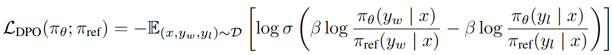
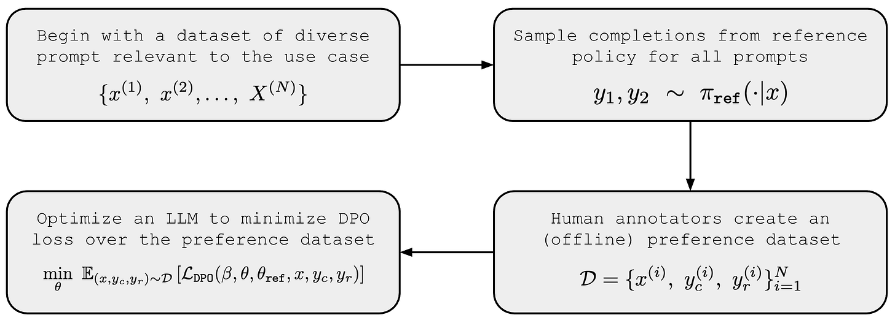
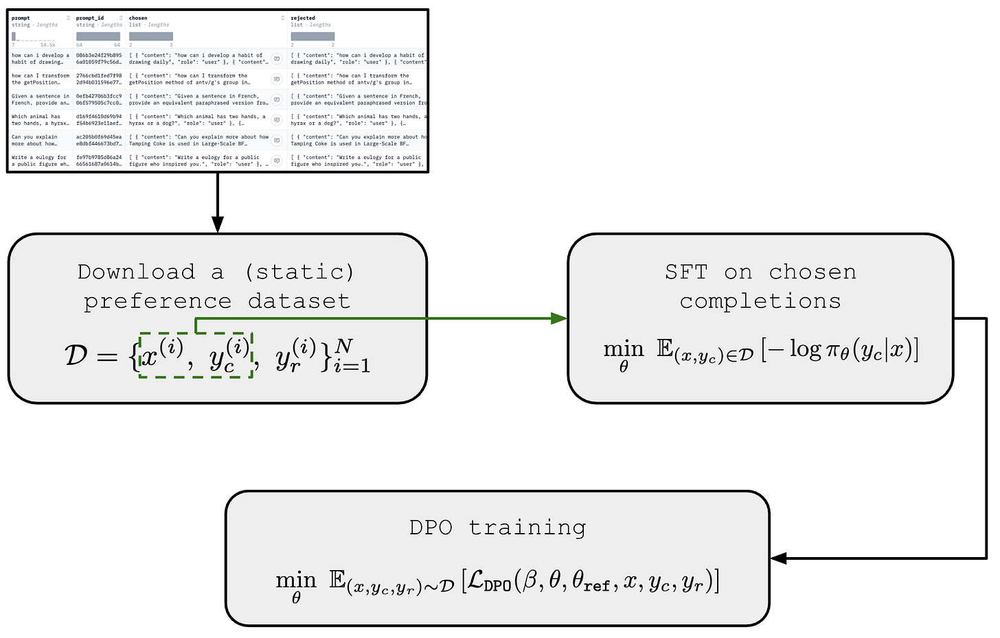

# §10 — Direct Preference Optimization (DPO)

> **Slides 52–56 + the hands-on notebook** · Topics 42–46
> *The payoff. Everything in §4–§8 gets deleted, and the result is better-behaved.*

---

## The one-line story of this section

> Solve the KL-regularised RLHF objective (§6) **in closed form**. The optimal policy implies a reward function expressible entirely in terms of `π_θ` and `π_ref`. Substitute that into the Bradley-Terry loss (§8) and the reward model **cancels out** — leaving a plain supervised loss on preference pairs. **Four models become two. RL becomes classification.**

---

## Topic 42 — The Problems with PPO (slide 52)

### The slide's list, verbatim

> - Fit a reward model to a dataset of human preferences
> - RL to optimize a language model policy to produce responses assigned high reward
> - Addressing reward hacking not to drift excessively far from the original model
> - **An indirect method to train many models**
>   - *Policy (LM), Reward model, value function, reference model*
> - **RL in general is difficult to train**
>   - *Unstable training*
>
> ### **"Can we think of a direct method for alignment training?"**

### The five specific pain points

| # | Problem | Where it came from |
|---|---|---|
| 1 | **Four models in memory** | §7 — ~200 GB for a 7B model |
| 2 | **Indirect** — preferences → reward model → RL → policy | Two layers of approximation, each adding error |
| 3 | **Unstable** — PPO has ~8 interacting hyperparameters | §5 (ε, K, LR) and §6 (β) |
| 4 | **Online generation dominates cost** | §5, Topic 24 — 20–100× the gradient step |
| 5 | **Reward hacking is structural** | §6 — the RM is a proxy with exploitable gaps |

> The professor's framing: *"…it involves maintaining 4 models. And think about it — your large language models are 30 billion, 40 billion, 100 billion parameters, and you are maintaining [four of them]…"*

### The key question

> **If the preference dataset is fixed, why do we need to compile it into a reward model first?**

The reward model exists to make human judgement queryable during *online* RL (§9, Topic 40). But if we never generate online — if we just train on the fixed preference pairs — that entire justification evaporates. That intuition is what DPO makes rigorous.

---

## Topic 43 — The DPO Idea (slide 53)

### The two workflows, side by side

```
   ┌───────────────────── RL WORKFLOW (RLHF/PPO) ─────────────────────┐
   │                                                                  │
   │   Preference Data  ──►  REWARD MODEL  ──►  RL (PPO)  ──►  Policy │
   │                             r_φ            + value               │
   │                                            + reference           │
   │                                                                  │
   │   4 models · online generation · unstable                        │
   └──────────────────────────────────────────────────────────────────┘

   ┌────────────── RL-FREE TRAINING WORKFLOW (DPO) ───────────────────┐
   │                                                                  │
   │   Preference Data  ─────────► DPO ─────────►  Policy Model       │
   │                                                                  │
   │   2 models · offline · stable supervised training                │
   └──────────────────────────────────────────────────────────────────┘
```

**Paper:** Rafailov et al., *"Direct Preference Optimization: Your Language Model is Secretly a Reward Model"*, NeurIPS 2023. That subtitle is the whole thesis.

---

## Topic 44 — The DPO Loss and the Derivation (slide 54)

Slide 54 states the loss:



*Slide 54: `L_DPO(π_θ; π_ref) = −E_{(x,y_w,y_l)~D}[ log σ( β log(π_θ(y_w|x)/π_ref(y_w|x)) − β log(π_θ(y_l|x)/π_ref(y_l|x)) ) ]`*

### The derivation — three steps

You will be asked for this. It's short.

#### Step 1 — Solve the KL-regularised objective in closed form

From §6, the RLHF objective is:

$$\max_{\pi_\theta}\; \mathbb{E}_{x\sim\mathcal{D},\,y\sim\pi_\theta}\big[r(x,y)\big] \;-\; \beta\,D_{KL}\big(\pi_\theta(y|x)\,\Vert\,\pi_{\text{ref}}(y|x)\big)$$

This is a **standard KL-constrained reward maximisation**, and it has a known analytic solution:

$$\boxed{\;\pi^{*}(y \mid x) = \frac{1}{Z(x)}\,\pi_{\text{ref}}(y \mid x)\,\exp\!\left(\frac{1}{\beta} r(x,y)\right)\;}$$

where `Z(x) = Σ_y π_ref(y|x)·exp(r(x,y)/β)` is the partition function.

*Reading it:* the optimal policy is the reference distribution **exponentially reweighted by reward**. High-reward responses get up-weighted; low-reward down-weighted; β controls how aggressively.

> This is not a DPO invention — it's the classic solution to the KL-regularised control problem. DPO's contribution is what comes next.

#### Step 2 — Invert it to express the reward in terms of the policy

Take logs and rearrange for `r`:

$$\boxed{\;r(x,y) = \beta \log \frac{\pi^{*}(y \mid x)}{\pi_{\text{ref}}(y \mid x)} + \beta \log Z(x)\;}$$

**This is the pivot of the entire paper.** Any reward function has a corresponding optimal policy — and conversely, **any policy implicitly defines a reward function.**

> *"Your language model is secretly a reward model."*

#### Step 3 — Substitute into Bradley-Terry, and watch `Z(x)` cancel

Recall §8: `P(y_w ≻ y_l | x) = σ(r(x,y_w) − r(x,y_l))`. Substituting the expression from Step 2:

$$r(x,y_w) - r(x,y_l) = \beta\log\frac{\pi_\theta(y_w|x)}{\pi_{\text{ref}}(y_w|x)} + \beta\log Z(x) - \beta\log\frac{\pi_\theta(y_l|x)}{\pi_{\text{ref}}(y_l|x)} - \beta\log Z(x)$$

**`β log Z(x)` appears in both terms with opposite signs — it cancels exactly.**

> 🎯 **This cancellation is the whole trick.** `Z(x)` requires summing over *every possible response* — utterly intractable. Bradley-Terry only ever uses reward **differences**, and `Z(x)` depends only on `x`, not on `y`. So it vanishes. **Because we work with comparisons instead of absolute scores, the intractable term disappears.** (Notice this is the same shift-invariance property from §8, Topic 37 — now doing real work.)

### 🔬 Verify the closed-form optimum and the cancellation numerically

Don't take the derivation on faith. On a small discrete space, you can check every step.

```python
import numpy as np
from scipy.optimize import minimize

np.random.seed(0)

# A tiny response space: 5 possible responses to one prompt
N = 5
pi_ref = np.array([0.30, 0.25, 0.20, 0.15, 0.10])     # the SFT model
r      = np.array([1.0,  3.0,  0.5,  2.0,  4.0])      # true reward
BETA   = 0.5

# ── STEP 1: verify the CLOSED-FORM optimum by brute-force optimisation ──
def negative_objective(logits):
    pi = np.exp(logits - logits.max()); pi /= pi.sum()
    reward_term = (pi * r).sum()
    kl_term = (pi * np.log(pi / pi_ref)).sum()
    return -(reward_term - BETA * kl_term)            # negate to minimise

res = minimize(negative_objective, np.zeros(N), method="BFGS")
pi_numeric = np.exp(res.x - res.x.max()); pi_numeric /= pi_numeric.sum()

# The analytic solution from Step 1
unnorm = pi_ref * np.exp(r / BETA)
Z = unnorm.sum()
pi_analytic = unnorm / Z

print("STEP 1 -- closed-form optimum")
print(f"  numerically optimised : {pi_numeric.round(5)}")
print(f"  analytic  pi_ref*exp(r/beta)/Z : {pi_analytic.round(5)}")
print(f"  match: {np.allclose(pi_numeric, pi_analytic, atol=1e-4)}")
print(f"  Z(x) = {Z:.4f}  <- requires summing over ALL responses: INTRACTABLE\n")

# ── STEP 2: recover the reward from the policy ──
r_recovered = BETA * np.log(pi_analytic / pi_ref) + BETA * np.log(Z)
print("STEP 2 -- invert to get the implied reward")
print(f"  true reward      : {r.round(4)}")
print(f"  recovered reward : {r_recovered.round(4)}")
print(f"  match: {np.allclose(r, r_recovered)}")
print("  => 'Your language model is secretly a reward model.'\n")

# ── STEP 3: the DIFFERENCE is Z-free ──
print("STEP 3 -- Z(x) cancels in the DIFFERENCE")
w, l = 4, 2                                            # a preference pair
true_diff = r[w] - r[l]
implicit  = BETA * np.log(pi_analytic / pi_ref)        # NOTE: no Z term at all
implicit_diff = implicit[w] - implicit[l]
print(f"  true      r(y_w) - r(y_l) = {true_diff:.6f}")
print(f"  IMPLICIT (Z-free) diff    = {implicit_diff:.6f}")
print(f"  match: {np.isclose(true_diff, implicit_diff)}")
print("\n  The absolute rewards need Z. The DIFFERENCE does not.")
print("  Bradley-Terry only ever uses differences -> Z never has to be computed.")
print("  THAT is why DPO works.")
```

### The DPO loss

$$\boxed{\;\mathcal{L}_{DPO}(\theta) = -\,\mathbb{E}_{(x,y_w,y_l)\sim\mathcal{D}}\left[\log\sigma\left(\beta\log\frac{\pi_\theta(y_w|x)}{\pi_{\text{ref}}(y_w|x)} - \beta\log\frac{\pi_\theta(y_l|x)}{\pi_{\text{ref}}(y_l|x)}\right)\right]\;}$$

### Side-by-side with the reward-model loss

```
   REWARD MODEL (§8):
       L = −log σ(  r_φ(x,y_w)  −  r_φ(x,y_l)  )
                    └──────────┘   └──────────┘
                     explicit RM     explicit RM

   DPO (§10):
       L = −log σ(  β log(π_θ(y_w|x)/π_ref(y_w|x))  −  β log(π_θ(y_l|x)/π_ref(y_l|x))  )
                    └──────────────────────────────┘   └──────────────────────────────┘
                          IMPLICIT reward                     IMPLICIT reward
```

**Identical loss function. Different definition of `r`.** That's it.

### The implicit reward

$$\hat{r}_\theta(x,y) = \beta \log \frac{\pi_\theta(y \mid x)}{\pi_{\text{ref}}(y \mid x)}$$

Interpretation: **"how much more likely does the tuned policy make this response, compared to the SFT model?"** Raise a response's relative likelihood and you have raised its implicit reward.

> 💡 Look back at §6, Topic 28 — the cheap per-token KL estimator was `log π_θ − log π_ref`. **The same quantity.** DPO didn't discover a new object; it recognised that the KL term already *was* the reward, up to a scale factor.

### The gradient — why it does the right thing

$$\nabla_\theta \mathcal{L}_{DPO} = -\beta\,\mathbb{E}\Big[\underbrace{\sigma\big(\hat{r}_\theta(x,y_l) - \hat{r}_\theta(x,y_w)\big)}_{\text{weight: how WRONG the model currently is}}\Big(\underbrace{\nabla_\theta\log\pi_\theta(y_w|x)}_{\text{push chosen UP}} - \underbrace{\nabla_\theta\log\pi_\theta(y_l|x)}_{\text{push rejected DOWN}}\Big)\Big]$$

### 🔬 Verify the adaptive weighting

```python
import torch, torch.nn.functional as F

def dpo_loss(pol_c, pol_r, ref_c, ref_r, beta=0.1):
    return -F.logsigmoid(beta * ((pol_c - ref_c) - (pol_r - ref_r)))

print(f"{'margin':>8} | {'loss':>8} | {'|grad wrt pol_c|':>17} | state")
print("-" * 60)
for m in [-3.0, -1.0, 0.0, 1.0, 3.0, 6.0]:
    pol_c = torch.tensor(m, requires_grad=True)     # implicit reward gap
    loss = dpo_loss(pol_c, torch.tensor(0.0), torch.tensor(0.0), torch.tensor(0.0),
                    beta=1.0)
    loss.backward()
    g = abs(pol_c.grad.item())
    state = ("model prefers REJECTED -> big correction" if m < 0 else
             "ln 2 -- no preference yet" if m == 0 else
             "already right -> tiny update" if m > 2 else "learning")
    print(f"{m:>8.1f} | {loss.item():>8.4f} | {g:>17.4f} | {state}")

print("\nThe sigma() prefactor gives FREE hard-example mining:")
print("  large gradient when the model is WRONG, ~0 when confidently right.")
print("This is the same property as the Bradley-Terry gradient in §8 --")
print("and it is what replaces PPO's advantage weighting, in closed form.")
```

Three things to notice:

1. **It's just log-likelihood gradients**, one positive and one negative — increase `y_w`, decrease `y_l`.
2. **The weight is adaptive** (verified above). **Automatic hard-example mining, for free.**
3. **This is exactly what the advantage weight did in policy gradient** — but computed in closed form instead of estimated with a value network. That's the value model (§7) being deleted.

### β in DPO

| β | Effect |
|---|---|
| **Small (0.01)** | Weak reference anchoring → aggressive preference fitting → risk of drift and degeneration |
| **0.1** | Standard default (and the notebook's value) |
| **Large (0.5+)** | Strong anchoring → stays near `π_ref` → conservative, may barely move |

β plays the *same* role as the KL coefficient in §6 — it is literally the same β from the KL-regularised objective, surviving the derivation intact.

### The `ln 2` reference point

At initialisation, `π_θ = π_ref` exactly, so both implicit rewards are 0, the margin is 0, and:

$$\mathcal{L}_{DPO} = -\log\sigma(0) = -\log(0.5) = \ln 2 \approx 0.6931$$

**`ln 2 = 0.6931` is your "no learning yet" baseline.** Loss below it means the policy has separated from the reference in the right direction; loss above it means it's moving the *wrong* way. The notebook uses this as its diagnostic — and it's the first thing to check on any DPO run.

### 🔗 Resources for Topic 44

- **[Rafailov et al., Direct Preference Optimization (NeurIPS 2023)](https://arxiv.org/abs/2305.18290)** — the paper. **Appendix A.1 is the full derivation of Step 1** (the closed-form optimum); A.3 derives the gradient. Read those two appendices; they are three pages and they are the whole idea.
- **[Cameron Wolfe — Direct Preference Optimization](https://cameronrwolfe.substack.com/p/direct-preference-optimization)** *(slide 57's own recommendation)* — the derivation, explained slowly and well.
- **[Nathan Lambert — RLHF Book, Ch. 9 "Direct Alignment Algorithms"](https://rlhfbook.com/c/12-direct-alignment.html)** *(slide 57)* — DPO plus the whole variant family in one place.

---

## Topic 45 — DPO Workflow and the Full Picture (slides 55–56)

Slide 55 gives the data-collection workflow:



*Slide 55: start with prompts relevant to the use case → **sample completions from the reference policy** `y₁, y₂ ~ π_ref(·|x)` → human annotators create an **offline** preference dataset `D = {(x, y_c, y_r)}` → minimise the DPO loss over it.*

> ⚠️ **Note the second box.** The completions are sampled from `π_ref` — i.e. **on-policy with respect to the model you are about to train**. This is exactly the point made in §8, Topic 36. DPO is often called "off-policy," and it is *relative to the policy as it evolves during training* — but the dataset should still be generated from your starting model, not someone else's.

Slide 56 shows the end-to-end picture including the SFT stage:



*Slide 56: download (or build) a static preference dataset `D = {(x, y_c, y_r)}` → **SFT on the chosen completions** `min_θ E[−log π_θ(y_c|x)]` → **DPO training** `min_θ E[L_DPO(β, θ, θ_ref, x, y_c, y_r)]`. Note the dashed green arrow: the SFT stage uses only `(x, y_c)`, discarding the rejected responses; DPO then uses all three.*

> 💡 **Slide 56 makes an important practical point that is easy to miss:** you can run SFT on the *chosen* completions of the very same preference dataset, then DPO on the full triples. This "SFT-then-DPO on one dataset" recipe is exactly what the [Zephyr](https://arxiv.org/abs/2310.16944) pipeline does, and it matters because DPO's `π_ref` must be in-distribution with the preference data — if you DPO from a reference that never saw this data, the log-ratios start off badly calibrated.

### The training loop

```
   ┌───────────────────────────────────────────────────────────────────────┐
   │  INPUT:  a fixed preference dataset  D = {(x, y_w, y_l)}              │
   │          (NO online generation, NO reward model, NO value model)      │
   └────────────────────────────────┬──────────────────────────────────────┘
                                    ▼
   ┌───────────────────────────────────────────────────────────────────────┐
   │  For each batch:                                                      │
   │                                                                       │
   │    ┌── POLICY π_θ  (trainable) ──┐      ┌── REFERENCE π_ref (frozen)─┐│
   │    │  log π_θ(y_w | x)           │      │  log π_ref(y_w | x)        ││
   │    │  log π_θ(y_l | x)           │      │  log π_ref(y_l | x)        ││
   │    └─────────────────────────────┘      └────────────────────────────┘│
   │                     └───────────┬───────────────┘                     │
   │                                 ▼                                     │
   │        margin = β[(logπ_θ(y_w) − logπ_ref(y_w))                       │
   │                 − (logπ_θ(y_l) − logπ_ref(y_l))]                      │
   │                                 ▼                                     │
   │                    loss = −log σ(margin)                              │
   │                                 ▼                                     │
   │                    backprop into π_θ only                             │
   └───────────────────────────────────────────────────────────────────────┘
                                    ▼
                        ┌────────────────────────┐
                        │  ALIGNED POLICY π_θ    │  ★ SHIP THIS ★
                        └────────────────────────┘
```

**Four forward passes per batch:** policy on chosen, policy on rejected, reference on chosen, reference on rejected. The last two are under `no_grad`.

### The full comparison — RLHF vs. DPO

| Dimension | RLHF (PPO) | DPO |
|---|---|---|
| Models in memory | **4** (policy, ref, reward, value) | **2** (policy, ref) |
| Models trained | 2 | **1** |
| Reward model | Explicit, separately trained | **Implicit** — none built |
| Online generation | ✅ Required, dominates cost | ❌ **Not needed** |
| Data | Regenerated every step | **Fixed dataset, reusable** |
| Loss type | RL surrogate, clipped | **Supervised classification** |
| Stability | Fiddly; ~8 hyperparameters | Stable; essentially β and LR |
| Memory (7B) | ~196 GB | ~98 GB (far less with LoRA) |
| Exploration | ✅ Can discover new behaviours | ❌ Limited to the dataset's support |
| Reward reusable? | ✅ (best-of-N, eval, filtering) | ❌ Nothing to reuse |
| Iterative improvement | Natural | Requires re-collecting data |

### ⚠️ When to prefer which — the honest answer

From the class Q&A:

**"If DPO is better than RLHF/PPO, is anyone even using RLHF?"**
> **Yes.** DPO is simpler and often easier to train, **but it is not universally better.** DPO is especially attractive when you already have a good preference dataset.

**"Where do we prefer RLHF over DPO?"**
> - **When you don't have preference pairs** but *can* define or train a reward signal.
> - **When you need active exploration** — the model must discover behaviours not represented in any existing dataset. DPO can only reweight what's already in the data's support; PPO generates and gets scored, so it can find genuinely new outputs.
> - **When the reward signal is programmatic and verifiable** — unit tests passing, a math answer checking out, a game being won. This is **RLVR**, and it's why frontier reasoning models are trained with PPO/GRPO, not DPO.
> - **When you want a reusable reward model** for best-of-N sampling, inference-time filtering, or evaluation.
> - **For iterative online improvement**, where the policy and the judge co-evolve.

### DPO's known weaknesses

| Weakness | Explanation |
|---|---|
| **Off-policy as training proceeds** | The pairs were sampled once; as `π_θ` drifts, the data no longer reflects its distribution. |
| **Can decrease `π(y_w)` in absolute terms** | The loss only constrains the *difference*. It can push both chosen and rejected probability down, as long as rejected falls faster. |
| **No exploration** | Cannot discover responses outside the data's support. |
| **Sensitive to noisy pairs** | Without a reward model averaging over many comparisons, a mislabelled pair directly opposes the gradient. |
| **Verbosity/length bias persists** | It's a *data* property, not an algorithm property — and `log π(y|x)` is a **sum** over tokens, so longer completions have larger magnitudes. |

### 🔬 Demonstrate DPO's most counterintuitive failure

```python
import torch, torch.nn.functional as F

def dpo_loss(pol_c, pol_r, ref_c, ref_r, beta=0.1):
    return -F.logsigmoid(beta * ((pol_c - ref_c) - (pol_r - ref_r)))

ref_c, ref_r = torch.tensor(-20.0), torch.tensor(-25.0)   # frozen reference

print(f"{'scenario':<34} | {'log pi(y_w)':>12} | {'log pi(y_l)':>12} | {'loss':>7}")
print("-" * 76)

scenarios = [
    ("start (policy == ref)",            -20.0, -25.0),
    ("HEALTHY: chosen up, rejected down", -18.0, -28.0),
    ("PATHOLOGY: BOTH fall",              -24.0, -40.0),
    ("PATHOLOGY: severe",                 -35.0, -60.0),
]
for name, pc, pr in scenarios:
    l = dpo_loss(torch.tensor(pc), torch.tensor(pr), ref_c, ref_r)
    print(f"{name:<34} | {pc:>12.1f} | {pr:>12.1f} | {l.item():>7.4f}")

print("\nRows 3 and 4 have LOWER loss than row 2 -- DPO considers them BETTER.")
print("But log pi(y_w) fell from -20 to -35: the model became far LESS likely")
print("to produce the CHOSEN response. Absolute quality degraded while the")
print("MARGIN widened. This is a documented, real DPO failure mode.")
print("\n=> ALWAYS log `reward_chosen` in ABSOLUTE terms, not just the margin.")
print("   If reward_chosen is falling, you are degrading the model.")
print("\nFIXES: raise beta; lower LR; add an SFT/NLL auxiliary term on y_w")
print("       (this is what RPO / 'DPO + SFT' variants do); or use IPO.")
```

### The DPO variant family

All of them patch one of the weaknesses above:

| Variant | What it fixes | Paper |
|---|---|---|
| **IPO** | Bounds the objective; prevents overfitting on near-deterministic preferences | [Azar et al. 2023](https://arxiv.org/abs/2310.12036) |
| **KTO** | Learns from **single** thumbs-up/down labels — no pairs needed | [Ethayarajh et al. 2024](https://arxiv.org/abs/2402.01306) |
| **ORPO** | Removes `π_ref` **entirely**; one-stage, one-model | [Hong et al. 2024](https://arxiv.org/abs/2403.07691) |
| **SimPO** | Reference-free **and** length-normalised | [Meng et al. 2024](https://arxiv.org/abs/2405.14734) |
| **cDPO / rDPO** | Models label noise explicitly | [Chowdhury et al. 2024](https://arxiv.org/abs/2403.00409) |
| **Iterative/Online DPO** | Re-generates pairs each round, restoring on-policy data | [Xu et al. 2023](https://arxiv.org/abs/2312.16682) |

All are implemented in TRL — `DPOConfig(loss_type="ipo" | "sigmoid" | ...)`.

### 💡 Learning thought

> The professor's framing of the loss is worth keeping: *"this part is pulling you closer to / keeping you closer to the reference model, which was modelling that KL divergence. And this part is measuring how the winning or losing output is doing with respect to the reference model."*
>
> **The KL constraint didn't get removed — it got absorbed into the loss.** In PPO, "maximise reward" and "stay near the reference" are two separate mechanisms fighting each other through a hyperparameter. In DPO they're a single expression. That's not merely fewer models; it's a *cleaner formulation of the same objective*, and it's why DPO is so much less fiddly to tune.

---

## Topic 46 — Hands-On: The DPO Notebook

**File:** `5c3c0cde-...-LLM-Alignment-Demo-08-08-26.ipynb`
**Objective (cell 1):** *"Understand Direct Preference Optimization (DPO) — Dataset formats & Implementation"*

### Configuration (Step 1)

```python
MODEL_ID   = "Qwen/Qwen2-0.5B-Instruct"
BETA       = 0.1        # the β from the DPO loss / KL objective
LR         = 5e-7       # VERY low — see note below
EPOCHS     = 2
BATCH_SIZE = 32
MAX_LEN    = 128
N_TRAIN, N_VAL, N_TEST = 500, 100, 100
DEVICE     = "cuda" if torch.cuda.is_available() else "cpu"
```

> ⚠️ **`LR = 5e-7` is not a typo.** DPO learning rates are 100–1000× lower than SFT's (typically 1e-4 – 1e-5). The policy starts from an already-good SFT model, and you are making a *small behavioural adjustment*, not teaching a new task. Too high an LR and the policy tears away from `π_ref`, degenerating output — the DPO analogue of KL blow-up. **This is the single most common DPO mistake.**

### Step 2 — DPO loss intuition (the micro-example)

```python
def dpo_loss_scalar(pol_c, pol_r, ref_c, ref_r, beta=0.1):
    reward_chosen   = beta * (pol_c - ref_c)      # implicit reward of chosen
    reward_rejected = beta * (pol_r - ref_r)      # implicit reward of rejected
    margin = reward_chosen - reward_rejected
    return -F.logsigmoid(torch.tensor(margin)).mean()

print("--- micro-example ---")
# (1) At init, policy == reference, so every reward is 0 -> margin 0 -> ln 2.
print("init (policy==ref):", dpo_loss_scalar(-2, -3, -2, -3),
      "  <- must equal ln2 =", round(math.log(2), 6))
# (2) Policy prefers chosen MORE than reference does -> loss drops below ln2.
print("policy favors chosen:", dpo_loss_scalar(0, -5, -2, -3), " (< ln2, good)")
# (3) Policy prefers REJECTED -> loss rises above ln2 (model being punished).
print("policy favors rejected:", dpo_loss_scalar(-3, -1, -2, -3), " (> ln2, bad)")
```

The three test cases, and what each teaches:

| Case | Call | Result | Meaning |
|---|---|---|---|
| **1. Init** | `(-2, -3, -2, -3)` | `= ln 2 = 0.6931` | policy == reference ⇒ both rewards 0 ⇒ margin 0. **The baseline.** |
| **2. Learning** | `(0, -5, -2, -3)` | `< ln 2` ✅ | policy raised chosen (−2→0) and lowered rejected (−3→−5) |
| **3. Wrong way** | `(-3, -1, -2, -3)` | `> ln 2` ❌ | policy raised *rejected* and lowered chosen — being punished |

> 💡 **Run these three numbers by hand before touching the training loop.** Case 1 in particular — recognising `0.6931` on sight as "nothing has happened yet" makes every subsequent DPO run instantly readable.

### Step 3 — Data preparation

**Dataset:** `trl-lib/ultrafeedback_binarized` — a standard public preference dataset.

```python
def to_triple(ex):
    prompt_msgs   = ex["chosen"][:-1]                 # all turns except the final assistant reply
    prompt_text   = tokenizer.apply_chat_template(prompt_msgs, tokenize=False,
                                                  add_generation_prompt=True)
    chosen_text   = ex["chosen"][-1]["content"]
    rejected_text = ex["rejected"][-1]["content"]
    return {"prompt": prompt_text, "chosen": chosen_text, "rejected": rejected_text}
```

Note: the chosen and rejected entries share the *same* conversation prefix; only the final assistant turn differs. `apply_chat_template` is essential — the model must see the exact format it was instruction-tuned on (§9, Topic 41).

**The completion mask — the most important detail in the notebook:**

```python
def tokenize_pair(prompt, completion):
    p_ids = tokenizer(prompt,     add_special_tokens=False)["input_ids"]
    c_ids = tokenizer(completion, add_special_tokens=False)["input_ids"] + [tokenizer.eos_token_id]
    ids  = (p_ids + c_ids)[:MAX_LEN]
    mask = ([0] * len(p_ids) + [1] * len(c_ids))[:MAX_LEN]   # 1 = completion token
    return ids, mask
```

```
   ids :  [ prompt tokens ................ ][ completion tokens ....... ]
   mask:  [ 0  0  0  0  0  0  0  0  0  0  ][ 1  1  1  1  1  1  1  1  1 ]
                    ↑                                    ↑
          NOT scored — identical in both              SCORED
          chosen and rejected, so it would            this is what
          contribute an identical constant            differs
```

**Why it matters:** `log π(y|x)` must be the log-probability of the **completion given the prompt**, not of the whole sequence. **Getting the mask wrong is the #1 DPO implementation bug.**

### 🔬 See exactly what the mask does

```python
import torch, torch.nn.functional as F
from transformers import AutoModelForCausalLM, AutoTokenizer

MODEL_ID = "Qwen/Qwen2-0.5B-Instruct"
tokenizer = AutoTokenizer.from_pretrained(MODEL_ID)
model = AutoModelForCausalLM.from_pretrained(MODEL_ID, dtype=torch.float32).eval()
MAX_LEN = 128

def tokenize_pair(prompt, completion):
    p_ids = tokenizer(prompt,     add_special_tokens=False)["input_ids"]
    c_ids = tokenizer(completion, add_special_tokens=False)["input_ids"] + [tokenizer.eos_token_id]
    ids  = (p_ids + c_ids)[:MAX_LEN]
    mask = ([0]*len(p_ids) + [1]*len(c_ids))[:MAX_LEN]
    return ids, mask

prompt = tokenizer.apply_chat_template(
    [{"role": "user", "content": "Why is the sky blue?"}],
    tokenize=False, add_generation_prompt=True)
completion = "Sunlight scatters in the atmosphere; blue scatters most."

ids, mask = tokenize_pair(prompt, completion)
print(f"{'idx':>4} | {'token':<16} | {'comp_mask':>9} | part")
print("-" * 52)
for i, (t, m) in enumerate(zip(ids, mask)):
    if i < 6 or i > len(ids) - 12:
        print(f"{i:>4} | {tokenizer.decode([t])!r:<16} | {m:>9} | "
              f"{'COMPLETION' if m else 'prompt'}")
    elif i == 6:
        print(f"{'...':>4} | {'...':<16} | {'...':>9} | ...")

print(f"\ntotal tokens: {len(ids)}, completion tokens: {sum(mask)}")

# What happens if you forget the mask?
ids_t  = torch.tensor([ids]); mask_t = torch.tensor([mask])
attn   = torch.ones_like(ids_t)

with torch.no_grad():
    logits = model(input_ids=ids_t, attention_mask=attn).logits[:, :-1, :]
labels = ids_t[:, 1:]
logp   = F.log_softmax(logits, -1).gather(-1, labels.unsqueeze(-1)).squeeze(-1)

correct = (logp * mask_t[:, 1:].float()).sum().item()
wrong   = logp.sum().item()
print(f"\nCORRECT log pi(y|x)  (masked)   : {correct:9.2f}")
print(f"WRONG   (whole sequence)         : {wrong:9.2f}")
print(f"prompt contribution              : {wrong - correct:9.2f}")
print("\nThe prompt term is IDENTICAL for chosen and rejected, so it cancels")
print("in the margin -- but it inflates magnitudes ~3x here, wrecks numerical")
print("conditioning, and makes gradients scale with PROMPT length.")
```

Each sample carries six tensors:

```
   Sample
   ├── Chosen
   │     ├── input_ids
   │     ├── attention_mask      ← padding mask (which positions are real)
   │     └── completion_mask     ← which positions are the COMPLETION
   └── Rejected
         ├── input_ids
         ├── attention_mask
         └── completion_mask
```

> ⚠️ **Two different masks, easily confused.** `attention_mask` = "is this a real token or padding?" `completion_mask` = "is this part of the answer we're scoring?" Both are needed and they are not the same thing.

### Step 4 — Two models

```python
policy = AutoModelForCausalLM.from_pretrained(MODEL_ID, dtype=torch.float32).to(DEVICE)
ref    = AutoModelForCausalLM.from_pretrained(MODEL_ID, dtype=torch.float32).to(DEVICE)
ref.eval()   # frozen reference
```

**Two models, not four.** Identical weights at t=0 — which is exactly why the initial loss is `ln 2`.

### Step 5 — The core functions

```python
def sequence_logprobs(model, input_ids, attn, comp_mask):
    # Predict the next token at every position in the sequence.
    logits = model(input_ids=input_ids, attention_mask=attn).logits[:, :-1, :]   # (1)
    # Shift input_ids to obtain the target (ground-truth) tokens.
    labels = input_ids[:, 1:]                                                    # (2)
    # Shift the completion mask to match the target tokens.
    mask   = comp_mask[:, 1:].float()                                            # (3)
    # Convert logits into log probabilities.
    logp   = F.log_softmax(logits, dim=-1)                                       # (4)
    # Select the log probability assigned to each correct target token.
    tok    = logp.gather(-1, labels.unsqueeze(-1)).squeeze(-1)                   # (5)
    # Sum the log probabilities of only the completion tokens.
    return (tok * mask).sum(dim=-1)                                              # (6)
```

| Line | What it does | Why |
|---|---|---|
| (1) | Drop the **last** logit | Position `t` predicts token `t+1`; the final position has no target |
| (2) | Shift `input_ids` left by one | These are the targets — standard causal-LM alignment |
| (3) | Shift the completion mask to match | Must align with the shifted targets |
| (4) | `log_softmax`, not `log(softmax(·))` | Numerical stability (§3, §8) |
| (5) | `gather` the log-prob of the **actual** token | We want `log π(a_t)` for the observed token |
| (6) | Mask and **sum** over completion tokens | `log π(y|x) = Σ_t log π(a_t|s_t)` — §3's identity, in code |

> 💡 **Line (6) is `Σ log π(a_t|s_t)` — the exact expression derived in §3, Topic 14.** Trace it: `P(τ) = Π π(a_t|s_t)` → take logs → sum. The theory and the code are the same object.
>
> Note the **sum**, not mean — so `log π(y|x)` scales with completion length. This is precisely the mechanism behind DPO's length bias, and precisely what SimPO fixes by length-normalising.

```python
def dpo_step(chosen, rejected):
    (ci, ca, cm), (ri, ra, rm) = chosen, rejected
    # policy log-probs (grad flows)
    pol_c = sequence_logprobs(policy, ci, ca, cm)
    pol_r = sequence_logprobs(policy, ri, ra, rm)
    # reference log-probs (no grad)
    with torch.no_grad():
        ref_c = sequence_logprobs(ref, ci, ca, cm)
        ref_r = sequence_logprobs(ref, ri, ra, rm)

    reward_chosen   = BETA * (pol_c - ref_c)
    reward_rejected = BETA * (pol_r - ref_r)
    margin = reward_chosen - reward_rejected
    loss   = -F.logsigmoid(margin).mean()

    return loss, reward_chosen.mean(), reward_rejected.mean()
```

**This function is the entire DPO algorithm.** Twelve lines. Compare against a PPO implementation (rollout buffers, GAE, clipping, value loss, KL shaping, four models) and the appeal is self-evident.

> **Class Q&A: "What is `@torch.no_grad()` doing?"**
> It tells PyTorch not to build the autograd graph or store gradients inside that block — used for the reference model and for evaluation, where nothing is being trained. It saves memory and compute. Here it's also *semantically required*: `ref` must never receive an update.

### 🔬 Speed-up: precompute the reference log-probs once

The reference never changes, so its forward passes can be computed **once for the entire dataset** and cached. This removes 2 of the 4 forward passes per step — a genuine ~40% speedup, exactly, with no approximation.

```python
@torch.no_grad()
def precompute_reference_logprobs(ref_model, loader, device):
    """pi_ref is FROZEN -> its outputs are constants. Compute them once."""
    ref_model.eval()
    cache = []
    for chosen, rejected in loader:
        (ci, ca, cm) = tuple(t.to(device) for t in chosen)
        (ri, ra, rm) = tuple(t.to(device) for t in rejected)
        cache.append((sequence_logprobs(ref_model, ci, ca, cm).cpu(),
                      sequence_logprobs(ref_model, ri, ra, rm).cpu()))
    return cache


def dpo_step_cached(chosen, rejected, ref_c, ref_r, beta=0.1):
    """Only TWO forward passes now -- both through the policy."""
    (ci, ca, cm), (ri, ra, rm) = chosen, rejected
    pol_c = sequence_logprobs(policy, ci, ca, cm)
    pol_r = sequence_logprobs(policy, ri, ra, rm)
    margin = beta * ((pol_c - ref_c) - (pol_r - ref_r))
    loss = -F.logsigmoid(margin).mean()
    return loss, (beta * (pol_c - ref_c)).mean(), (beta * (pol_r - ref_r)).mean()

# ref_cache = precompute_reference_logprobs(ref, train_loader, DEVICE)
# then: for (ch, rj), (rc, rr) in zip(train_loader, ref_cache): ...
#
# ⚠️ Requires shuffle=False (or caching by index) so the cache stays aligned.
```

Combined with the **LoRA reference trick** from §7 (`ref_model=None` + `disable_adapter()`), you can go from *four forward passes and two models* to *two forward passes and one set of base weights*.

### Steps 6–9 — Training, evaluation, comparison

- **Step 6:** training loop with early stopping (`PATIENCE = 2`), tracking `train_loss`, `val_loss`, `step_loss`, `step_r_chosen`, `step_r_rejected`.
- **Step 7:** curves — loss over time, and the two implicit rewards.
- **Step 8:** `final_test_eval()` — reports test loss against `ln 2` and the mean reward margin.
- **Step 9:** `compare_models()` — before-vs-after on held-out samples.

The notebook's evaluation is worth reproducing here because its printout is the template for reading any DPO run:

```python
@torch.no_grad()
def final_test_eval(loader):
    policy.eval()
    tot_loss, tot_margin, n, total = 0.0, 0.0, 0, 0
    for ch, rj in loader:
        ch = tuple(t.to(DEVICE) for t in ch)
        rj = tuple(t.to(DEVICE) for t in rj)
        (ci, ca, cm), (ri, ra, rm) = ch, rj
        pol_c = sequence_logprobs(policy, ci, ca, cm)
        pol_r = sequence_logprobs(policy, ri, ra, rm)
        ref_c = sequence_logprobs(ref, ci, ca, cm)
        ref_r = sequence_logprobs(ref, ri, ra, rm)

        margin = BETA * ((pol_c - ref_c) - (pol_r - ref_r))
        tot_loss   += (-F.logsigmoid(margin)).mean().item(); n += 1
        tot_margin += margin.sum().item(); total += margin.size(0)

    print("\n================  FINAL TEST EVALUATION  ================")
    print(f"Test DPO loss        : {tot_loss / n:.4f}   (ln 2 = 0.6931)")
    print(f"Mean reward margin   : {tot_margin / total:+.4f}   "
          f"(>0 means policy prefers chosen over rejected)")
    if tot_loss / n < math.log(2):
        print("Loss below ln 2 -> DPO improved preference over the reference.")
    else:
        print("Loss at/above ln 2 -> policy has not separated from the reference yet.")
```

### 🔬 An enhanced metric set — add preference accuracy

The notebook reports loss and margin. **Add accuracy**: it's the most interpretable number and it maps directly onto the reward-model metric from §8.

```python
@torch.no_grad()
def full_eval(policy, ref, loader, beta=0.1, device="cpu"):
    policy.eval()
    tot_loss, margins, correct, n_pairs, n_batches = 0.0, [], 0, 0, 0
    r_chosen, r_rejected = [], []
    for ch, rj in loader:
        ch = tuple(t.to(device) for t in ch); rj = tuple(t.to(device) for t in rj)
        (ci, ca, cm), (ri, ra, rm) = ch, rj
        pol_c = sequence_logprobs(policy, ci, ca, cm)
        pol_r = sequence_logprobs(policy, ri, ra, rm)
        ref_c = sequence_logprobs(ref,    ci, ca, cm)
        ref_r = sequence_logprobs(ref,    ri, ra, rm)

        rc, rr = beta * (pol_c - ref_c), beta * (pol_r - ref_r)
        margin = rc - rr

        tot_loss += (-F.logsigmoid(margin)).mean().item(); n_batches += 1
        margins += margin.tolist()
        correct += (margin > 0).sum().item(); n_pairs += margin.numel()
        r_chosen += rc.tolist(); r_rejected += rr.tolist()

    import numpy as np
    return {
        "loss":            tot_loss / n_batches,
        "accuracy":        correct / n_pairs,          # <- ADD THIS
        "mean_margin":     float(np.mean(margins)),
        "reward_chosen":   float(np.mean(r_chosen)),   # <- AND THIS (absolute!)
        "reward_rejected": float(np.mean(r_rejected)),
    }


def report(m):
    import math
    print(f"loss            : {m['loss']:.4f}   (ln 2 = {math.log(2):.4f})")
    print(f"accuracy        : {m['accuracy']:.1%}  (50% = no learning)")
    print(f"mean margin     : {m['mean_margin']:+.4f}  (>0 is good)")
    print(f"reward_chosen   : {m['reward_chosen']:+.4f}  <- must be RISING")
    print(f"reward_rejected : {m['reward_rejected']:+.4f}  <- should be falling")
    if m["reward_chosen"] < 0:
        print("\n⚠️  reward_chosen is NEGATIVE: the policy made the CHOSEN response")
        print("    LESS likely than the reference did. The margin improved only")
        print("    because rejected fell faster. Raise beta or lower the LR.")
```

### What a healthy DPO run looks like

```
   LOSS                            IMPLICIT REWARDS
   0.70 ┤●                          +0.4 ┤        ╭──── reward_chosen
        │ ╰●                             │    ╭───╯
   0.65 ┤   ╰●─╮                    0.0 ─┼●───────────────
        │       ╰●──╮                    │  ╰──╮
   0.60 ┤            ╰●───              −0.4 ┤     ╰────── reward_rejected
        └─────────────────►                  └─────────────────►
              steps                                steps

   ✅ loss starts at ln2 = 0.6931 and DECREASES
   ✅ reward_chosen rises, reward_rejected falls  → the MARGIN widens
   ⚠️ if BOTH fall (rejected faster), the model is degrading absolute
      quality while still "winning" on margin — the pathology above
```

### A DPO debugging checklist

| Symptom | Likely cause |
|---|---|
| Loss stuck exactly at 0.6931 | Policy isn't updating — LR too low, frozen params, or optimizer not stepping |
| Loss explodes / output degenerates | LR too high, or β too low — the policy tore away from `π_ref` |
| Loss drops but generations get worse | Both log-probs falling; check `reward_chosen` is actually **rising** |
| Loss is NaN | Used `log(sigmoid(x))` instead of `logsigmoid`; or bad padding indexing |
| Margin ≈ 0 on test but good on train | Overfitting — reduce epochs, raise β, or get more data |
| Outputs got much longer | Length bias — `sequence_logprobs` **sums**; consider SimPO |
| Accuracy ≈ 50% after training | Check the completion mask; check chat template; check LR ≠ 0 |

### In production: use TRL

The notebook's final cell points at `https://huggingface.co/docs/trl/dpo_trainer`.

```python
# pip install trl peft transformers datasets
from trl import DPOTrainer, DPOConfig
from transformers import AutoModelForCausalLM, AutoTokenizer
from datasets import load_dataset
from peft import LoraConfig

MODEL = "Qwen/Qwen2-0.5B-Instruct"
tok = AutoTokenizer.from_pretrained(MODEL); tok.pad_token = tok.eos_token
policy = AutoModelForCausalLM.from_pretrained(MODEL)

trainer = DPOTrainer(
    model=policy,
    ref_model=None,                 # None + PEFT ⇒ reference = adapters disabled (§7, FREE)
    args=DPOConfig(
        output_dir="./dpo",
        beta=0.1,                   # the SAME beta as §6's KL coefficient
        learning_rate=5e-7,         # ~1000x below SFT
        num_train_epochs=1,
        per_device_train_batch_size=4,
        gradient_accumulation_steps=8,
        max_length=1024,
        max_prompt_length=512,
        loss_type="sigmoid",        # "ipo" | "kto_pair" | "robust" | ...
        precompute_ref_log_probs=True,   # the caching trick above, built in
        logging_steps=10,
        eval_strategy="steps", eval_steps=100,
    ),
    train_dataset=load_dataset("trl-lib/ultrafeedback_binarized", split="train[:2000]"),
    eval_dataset=load_dataset("trl-lib/ultrafeedback_binarized", split="test[:200]"),
    processing_class=tok,
    peft_config=LoraConfig(r=16, lora_alpha=32,
                           target_modules=["q_proj","k_proj","v_proj","o_proj"],
                           task_type="CAUSAL_LM"),
)
trainer.train()

# TRL logs exactly the metrics discussed above:
#   rewards/chosen, rewards/rejected, rewards/accuracies, rewards/margins
```

> 💡 **`rewards/accuracies` is TRL's name for the preference accuracy** computed in `full_eval` above, and **`rewards/chosen` is the absolute implicit reward** you must watch for the degradation pathology. Both are logged by default — read them, not just the loss.

Write the loop once by hand to understand it; use TRL in production for the masking, padding, LoRA integration, and distributed-training details that are easy to get subtly wrong.

### 🔗 Resources for Topic 46

- **[TRL DPOTrainer docs](https://huggingface.co/docs/trl/dpo_trainer)** — the notebook's own final reference. Covers dataset format, all `loss_type` variants, and the logged metrics.
- **[The Alignment Handbook](https://github.com/huggingface/alignment-handbook)** — full, runnable SFT→DPO configs (the Zephyr recipe). The best "here is what production actually looks like."
- **[Zephyr-7B paper](https://arxiv.org/abs/2310.16944)** — the model that made DPO mainstream; the recipe on slide 56 is essentially theirs.
- **[Maxime Labonne — Fine-tune with DPO](https://huggingface.co/blog/mlabonne/orpo-llama-3)** — practical end-to-end walkthroughs with real hyperparameters.
- **[trl-lib/ultrafeedback_binarized](https://huggingface.co/datasets/trl-lib/ultrafeedback_binarized)** — the notebook's dataset, browsable in the viewer.

---

## 📐 Formula summary — §10

| Concept | Formula |
|---|---|
| KL-regularised objective | `max E[r(x,y)] − β·D_KL(π_θ‖π_ref)` |
| Optimal policy (closed form) | `π*(y\|x) = (1/Z(x))·π_ref(y\|x)·exp(r(x,y)/β)` |
| Implied reward | `r(x,y) = β·log(π*(y\|x)/π_ref(y\|x)) + β·log Z(x)` |
| **Implicit reward (DPO)** | **`r̂_θ(x,y) = β·log(π_θ(y\|x)/π_ref(y\|x))`** |
| **DPO loss** | **`L = −E[log σ(β log(π_θ(y_w)/π_ref(y_w)) − β log(π_θ(y_l)/π_ref(y_l)))]`** |
| Sequence log-prob | `log π(y\|x) = Σ_{t∈completion} log π(a_t\|s_t)` |
| Initial loss | `ln 2 ≈ 0.6931` |

---

## 🎯 Interview Questions — §10

### Conceptual

**Q1. Derive the DPO loss.**
> Start from the KL-regularised RLHF objective `max_π E[r] − β·D_KL(π‖π_ref)`. Its closed-form optimum is `π*(y|x) = π_ref(y|x)·exp(r(x,y)/β)/Z(x)`. Invert for the reward: `r(x,y) = β·log(π*(y|x)/π_ref(y|x)) + β·log Z(x)`. Substitute into the Bradley-Terry model `P(y_w≻y_l) = σ(r(x,y_w) − r(x,y_l))`; the `β log Z(x)` terms cancel because they depend only on `x`. Taking the negative log-likelihood gives `L_DPO = −E[log σ(β log(π_θ(y_w|x)/π_ref(y_w|x)) − β log(π_θ(y_l|x)/π_ref(y_l|x)))]`.

**Q2. Why does the partition function `Z(x)` cancel, and why does that matter so much?**
> `Z(x) = Σ_y π_ref(y|x)exp(r(x,y)/β)` sums over every possible response — completely intractable for language. It cancels because Bradley-Terry uses only the *difference* of two rewards for the **same prompt**, and `Z(x)` depends on `x` alone, appearing identically in both terms. This is what makes the whole method computable: working with comparisons instead of absolute scores eliminates the intractable normalisation. It's the same shift-invariance property that made the reward model's absolute scale unidentifiable in §8.

**Q3. What is DPO's "implicit reward"?**
> `r̂_θ(x,y) = β·log(π_θ(y|x)/π_ref(y|x))` — how much more likely the tuned policy makes a response relative to the reference. The paper's title says it: *"your language model is secretly a reward model."* No reward model is trained; the policy's log-ratio against the reference *is* the reward, up to the prompt-dependent constant that cancels. It is also, notably, the same quantity as §6's per-token KL estimator.

**Q4. RLHF has 4 models, DPO has 2. Which two are removed and why is each removable?**
> The **reward model** is removed because the policy's implicit reward replaces it — the derivation shows any policy defines a reward. The **value model** is removed because it existed only to compute advantage baselines for policy gradient; with no RL loop, there are no advantages to baseline. Retained: the **policy** (trained) and the **reference** (frozen, needed for the log-ratio).

**Q5. Why is the initial DPO loss exactly `ln 2`?**
> At initialisation `π_θ = π_ref`, so both implicit rewards are `β·log(1) = 0`, the margin is 0, and `L = −log σ(0) = −log 0.5 = ln 2 ≈ 0.6931`. It's the "no learning yet" baseline: loss below it means the policy has separated from the reference in the right direction; above it means the wrong direction.

**Q6. Explain the DPO gradient and its adaptive weighting.**
> `∇L = −β·E[σ(r̂(y_l) − r̂(y_w))·(∇log π_θ(y_w|x) − ∇log π_θ(y_l|x))]`. The parenthesised part is two log-likelihood gradients — push chosen up, push rejected down. The sigmoid prefactor is the weight: near 1 when the model currently prefers the *rejected* response (large corrective update) and near 0 when it already strongly prefers the chosen one (small update). This is automatic hard-example mining, and it plays the role the advantage weight played in policy gradient — but in closed form, with no value network.

**Q7. When would you choose PPO over DPO?**
> (a) You have **no preference pairs** but *can* define a reward — especially a **programmatic, verifiable** one (unit tests, math checkers, game outcomes) → RLVR with PPO/GRPO. (b) You need **exploration** to discover behaviours absent from any dataset; DPO can only reweight what's in the data's support. (c) You want a **reusable reward model** for best-of-N sampling, inference-time filtering, or evaluation. (d) You want **iterative online improvement** with policy and judge co-evolving. Otherwise, with a good preference dataset in hand, DPO is simpler, cheaper, and more stable.

**Q8. What are DPO's known failure modes?**
> **Increasingly off-policy** — the pairs are sampled once, and as `π_θ` drifts the data stops reflecting its distribution. **Absolute-likelihood decrease** — the loss constrains only the difference, so `π(y_w)` can *fall* provided `π(y_l)` falls faster; verifiable by constructing two scenarios with the same margin but different absolute log-probs and seeing DPO prefer the degraded one. **No exploration.** **Noise sensitivity** — with no reward model averaging over many comparisons, a mislabelled pair directly opposes the gradient. **Length bias** — `log π(y|x)` is a *sum* over completion tokens, so longer completions have larger magnitudes.

**Q9. Name three DPO variants and what each fixes.**
> **IPO** — bounds the objective to prevent overfitting when preferences are near-deterministic. **KTO** — learns from single thumbs-up/down labels rather than pairs, matching real product telemetry. **ORPO** — removes the reference model entirely by folding an odds-ratio penalty into the SFT loss, making it single-stage and single-model. (Also **SimPO**: reference-free and length-normalised; **cDPO**: models label noise explicitly.) All are available via `DPOConfig(loss_type=...)` in TRL.

### Implementation

**Q10. Why is the DPO learning rate ~5e-7 rather than 1e-5?**
> The policy starts from an already-competent SFT model and you're making a small behavioural adjustment, not learning a task. A high LR drives `π_θ` far from `π_ref`, which is exactly the drift the β-anchoring exists to prevent — the result is degenerate or repetitive output while the loss appears to be improving. It's the DPO analogue of KL blow-up in PPO, and it is the most common DPO mistake.

**Q11. What is the completion mask, and what breaks without it?**
> A per-token 0/1 mask marking which positions are the *completion* rather than the *prompt*. `log π(y|x)` must sum only over completion tokens. Without it you sum over prompt tokens too — which contribute an identical value to both chosen and rejected (they share the prompt), so it cancels in the margin *mathematically*, but it inflates the magnitudes badly (~3× in a typical example), wrecks numerical conditioning, and makes gradients dominated by prompt length. It's distinct from the `attention_mask`, which marks real tokens versus padding.

**Q12. Walk through `sequence_logprobs`.**
> Forward pass → drop the last logit (position `t` predicts token `t+1`, so the final position has no target) → shift `input_ids` left by one to form the targets → shift the completion mask to match → `log_softmax` for stability → `gather` the log-probability of each *actual* target token → multiply by the mask and **sum** over the sequence. The result is `log π(y|x) = Σ_{t ∈ completion} log π(a_t|s_t)` — the trajectory log-probability identity from §3 written in PyTorch. Note it's a sum, not a mean, which is where length bias enters.

**Q13. How many forward passes per DPO training step, and can you reduce them?**
> **Four**: policy-on-chosen, policy-on-rejected, reference-on-chosen, reference-on-rejected. The reference two run under `no_grad`. **Reductions:** (a) **precompute and cache the reference log-probs once** for the whole dataset — exact, not an approximation, since `π_ref` is frozen; removes two passes per step permanently (TRL: `precompute_ref_log_probs=True`); (b) with **LoRA**, set `ref_model=None` so the reference is the base weights with adapters disabled, eliminating the second model from memory; (c) concatenate chosen and rejected into a single batched forward pass to halve kernel-launch overhead.

**Q14. Your DPO loss is decreasing nicely but generation quality got worse. Diagnose.**
> Check whether `reward_chosen` (TRL logs it as `rewards/chosen`) is actually **rising** or merely falling more slowly than `rewards/rejected`. The loss only requires the margin to widen, so both absolute log-probs can decrease — the model degrades everything but degrades the rejected responses faster. **Fixes:** raise β (stronger reference anchoring); lower the LR; monitor `log π_θ(y_w|x)` in absolute terms as a first-class metric; add an SFT/NLL auxiliary term on the chosen responses (RPO / DPO+SFT variants); or switch to IPO, which bounds the objective.

**Q15. Which metrics do you log for a DPO run, and what does each tell you?**
> **loss** vs. `ln 2 = 0.6931` (below = learning in the right direction). **accuracy** = fraction of pairs with positive margin (50% = nothing learned; TRL's `rewards/accuracies`). **mean margin** (should grow). **`rewards/chosen`** — the absolute implicit reward on chosen; must be *rising*, not just beating rejected. **`rewards/rejected`** — should fall. **mean response length** — catches length inflation. Plus a held-out generation eval, since none of the above measures actual output quality.

### Rapid-fire

| Question | Answer |
|---|---|
| DPO paper year/venue? | Rafailov et al., NeurIPS 2023 |
| Paper's subtitle? | *"Your Language Model is Secretly a Reward Model"* |
| Models in memory? | **2** — policy + reference |
| Models trained? | **1** — the policy |
| Which two disappear? | Reward model and value model |
| What cancels in the derivation? | The partition function `Z(x)` |
| Implicit reward? | `β·log(π_θ(y\|x)/π_ref(y\|x))` |
| Initial loss value? | `ln 2 ≈ 0.6931` |
| Typical β? | 0.1 |
| Typical LR? | 5e-7 (≈1000× below SFT) |
| Forward passes per step? | 4 (→2 with ref caching) |
| Loss family? | Same as Bradley-Terry: `−log σ(Δ)` |
| Healthy test signal? | loss `< ln 2`, accuracy `> 50%`, `rewards/chosen` rising |
| Variant with no reference model? | ORPO (also SimPO) |
| Variant for thumbs-up/down data? | KTO |
| TRL flag for the caching trick? | `precompute_ref_log_probs=True` |

---

## ✅ Section self-check

1. Derive the DPO loss from the KL-regularised objective in three steps.
2. Explain in one sentence why `Z(x)` cancels and why that's essential — then verify it numerically.
3. Write the implicit reward and connect it to §6's KL estimator.
4. Explain why the initial loss is 0.6931 and what a value of 0.75 would mean.
5. State the adaptive-weighting property of the DPO gradient and where you saw it in §8.
6. Give three situations where you'd still choose PPO.
7. Explain the completion mask and the sum-vs-mean length-bias connection.
8. Construct two scenarios with the same DPO margin where one is a degraded model. What must you log to tell them apart?
9. **Hands-on:** run the notebook. What is your final test loss vs. `ln 2`, and is `reward_chosen` positive?

---

**Previous:** [§9 — Systems in the Wild](09-instructgpt-chatgpt.md) · [Index](00-INDEX.md)
