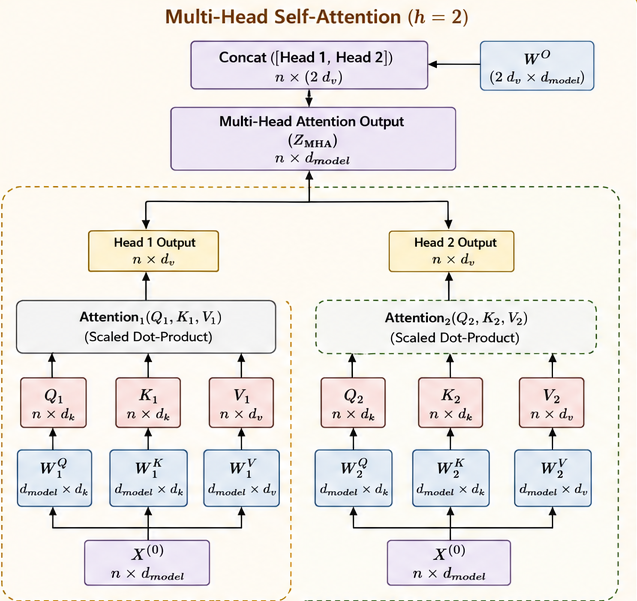

# Section 1 — Foundations & Framing

**Source:** Slides 2–6 · Transcript 00:16–00:30
**Topics:** 1–5 (session goals, three pathways, what gets fine-tuned, training stages, worked example)

---

## 1.1 What this session is actually about

The instructor framed this as a *consolidation* session — the last of Module 3. Two halves:

1. **Revision half** — put every fine-tuning concept into a *single comparison framework*, then spend real time on the "non-trivial" pieces (LoRA math, QLoRA quantization, DPO loss).
2. **Hands-on half** — take a *small* language model end-to-end: PEFT → DPO → guardrails (content filtering + PII) → red-team testing.

> 💡 **Learning thought.** Notice the shape: *make the model better* (SFT) → *make it behave* (DPO) → *stop it anyway* (guardrails) → *try to break it* (red-team). That's the production maturity ladder. A model that is only fine-tuned is not a shipped system.

---

## 1.2 Three pathways to get things done with an LLM

You have a task. The base model does it badly. There are exactly three levers.

| Lever | What you change | What you do **not** change | Iteration | Cost |
|---|---|---|---|---|
| **Prompt Engineering** | The instructions | Weights, data | Seconds | ~Free |
| **RAG** | Context supplied at runtime | Weights, behaviour | Minutes | Retrieval infra |
| **Fine-tuning** | The weights themselves | Runtime freshness | Hours–days | GPU $$ |

### A concrete scenario to anchor all three

> **Situation:** You run support for a fintech app. Users ask about their transactions, your refund policy (which changes quarterly), and you need every reply to end with a structured `{"intent": ..., "escalate": true/false}` block for your routing system.

Watch how each lever handles a different part of that:

| Sub-problem | Right lever | Why |
|---|---|---|
| "What's the refund window?" | **RAG** | Policy changes quarterly. Bake it into weights and you retrain every quarter. |
| "Where's my ₹4,200 transfer?" | **Tools/API** (not any of the three!) | It's live user data — retrieve it, don't train on it. |
| Always emit the JSON block | **Fine-tuning** | A *format* requirement, needed on 100% of responses. Prompting gets you ~90%; fine-tuning gets you ~99.5%. |
| Warm, apologetic tone | **Fine-tuning** | Style is a weight-level property. |

> 💡 **Learning thought.** Real systems use **all** of these at once. The interview-quality answer is never "use fine-tuning" — it's "decompose the requirement, then route each piece to the cheapest lever that solves it."

### Prompt Engineering

You interact in natural language, look at the response, decide if you're happy, revise, repeat. **Model frozen; data frozen; only your instruction moves.**

```python
# Lever 1: change the instruction only.
from anthropic import Anthropic
client = Anthropic()

SYSTEM = """You are a support agent for a fintech app.
Always reply in a warm tone, then emit a JSON block:
{"intent": "<one of: refund|status|other>", "escalate": <true|false>}"""

resp = client.messages.create(
    model="claude-sonnet-4-5",
    max_tokens=512,
    system=SYSTEM,                       # ← the only thing you tune
    messages=[{"role": "user", "content": "I want my money back!"}],
)
print(resp.content[0].text)
```

- **Best for:** quick prototyping, standard tasks, zero setup.
- **Ceiling:** you are *steering* latent capability, not *creating* it.

### RAG

Model still frozen. Attach an external document store; retrieve top-K chunks at query time and inject them into context.

```python
# Lever 2: change the CONTEXT, not the model.
from sentence_transformers import SentenceTransformer
import numpy as np

encoder = SentenceTransformer("all-MiniLM-L6-v2")

policy_docs = [
    "Refunds are processed within 5-7 business days to the original card.",
    "Items must be returned within 30 days in original condition.",
    "Gift cards and digital downloads are final sale, no refunds.",
]
doc_vecs = encoder.encode(policy_docs, normalize_embeddings=True)

def retrieve(query, k=2):
    qv = encoder.encode([query], normalize_embeddings=True)[0]
    scores = doc_vecs @ qv                     # cosine sim (vectors normalized)
    return [policy_docs[i] for i in np.argsort(-scores)[:k]]

question = "Can I get a refund on a gift card?"
context = "\n".join(retrieve(question))
prompt = f"Use ONLY this policy context:\n{context}\n\nQuestion: {question}"
# → the model now answers from the retrieved text, and updating
#   policy_docs changes behaviour instantly with zero retraining.
```

- **Best for:** dynamic, massive, or proprietary knowledge bases.
- **Key property:** knowledge lives **outside** the weights.

### Fine-tuning

You rewrite the parameters. Covered in depth in Sections 2–5; the one-line version:

```python
# Lever 3: change the WEIGHTS. (Full pipeline in Section 4 & 7.)
from trl import SFTTrainer, SFTConfig
trainer = SFTTrainer(model=model, train_dataset=my_pairs, args=SFTConfig(...))
trainer.train()      # ← the model itself is now different
```

- **Best for:** deep customization, strict output formatting, domain terminology at a foundational level.
- **Key property:** knowledge and behaviour **baked into weights** at training time.

### The decision heuristic

```
Is the gap KNOWLEDGE (facts the model lacks, and they change)?   → RAG
Is the gap BEHAVIOUR (tone, format, style, reasoning pattern)?   → Fine-tuning
Is the gap LIVE DATA (user-specific, real-time)?                  → Tools / API
Neither — it just needs clearer instructions?                     → Prompting
```

**From the session Q&A:**
> *"Is fine-tuning generally done when we use existing HF models for agents?"* → **No.** Start with prompting, tools, RAG and orchestration. Fine-tuning is considered only when base-model behaviour or task performance is insufficient.

That is the professional default: fine-tuning is a *last* resort, not a first move.

> 💡 **Learning thought.** The dermatology example on slide 6 works either way — the Q&A explicitly conceded RAG would also work there. Fine-tuning wins only because we want *style and terminology* consistent, not just facts available.

### 📚 Go deeper
- [OpenAI — When to use fine-tuning vs RAG](https://platform.openai.com/docs/guides/fine-tuning#when-to-use-fine-tuning) — the canonical decision guidance
- [Anthropic — Prompt engineering overview](https://docs.claude.com/en/docs/build-with-claude/prompt-engineering/overview) — exhaust this lever first
- [RAG vs Fine-tuning vs Both (Balaguer et al., 2024)](https://arxiv.org/abs/2401.08406) — a controlled agricultural-domain comparison; the honest empirical answer is "both"
- [Anthropic — Contextual Retrieval](https://www.anthropic.com/news/contextual-retrieval) — how to make the RAG lever much stronger before reaching for fine-tuning

---

## 1.3 What do we actually fine-tune? (Slide 4)


*Slide 4 — the decoder stack. Every box with weights is a fine-tuning target.*

```
Prompt / previously generated tokens
        ↓
Token + Position Embeddings                    ← W_emb
        ↓
   ┌──────────────────────────┐
   │ Multi-Head Self-Attention│  ← W_q, W_k, W_v, W_o
   │ Add & Layer Norm         │  ← γ, β
   │ Position-wise FFN        │  ← W_up, W_gate, W_down
   │ Add & Layer Norm         │  ← γ, β
   └──────────────────────────┘  × N layers
        ↓
Linear projection + Softmax                    ← W_lm_head
        ↓
P(next token) → "mat"  (fed back in, repeat)
```

**Fine-tuning = changing the numbers inside those matrices.** Nothing else. As the instructor put it, a deep learning model "is nothing but a collection of matrices."

### See it for yourself

```python
from transformers import AutoModelForCausalLM
import torch

model = AutoModelForCausalLM.from_pretrained(
    "Qwen/Qwen2.5-0.5B-Instruct", dtype=torch.bfloat16
)

# Every named 2-D parameter is a matrix fine-tuning could move.
for name, p in model.named_parameters():
    if p.dim() == 2 and "layers.0." in name:
        print(f"{name:55s} {tuple(p.shape)}  {p.numel():>10,}")
```

```
model.layers.0.self_attn.q_proj.weight        (896, 896)        802,816
model.layers.0.self_attn.k_proj.weight        (128, 896)        114,688
model.layers.0.self_attn.v_proj.weight        (128, 896)        114,688
model.layers.0.self_attn.o_proj.weight        (896, 896)        802,816
model.layers.0.mlp.gate_proj.weight          (4864, 896)      4,358,144
model.layers.0.mlp.up_proj.weight            (4864, 896)      4,358,144
model.layers.0.mlp.down_proj.weight          (896, 4864)      4,358,144
```

> 💡 **Learning thought.** Run this once and the abstraction becomes concrete. Two things jump out that pay off later:
> **(1)** The MLP matrices (`gate/up/down_proj`) are ~5× larger than the attention ones. When Section 4 says `target_modules="all-linear"` beats attention-only LoRA, this is why — most of the model's capacity is in the MLP.
> **(2)** `k_proj` and `v_proj` are (128, 896), not (896, 896). That's **grouped-query attention** — K and V are shared across query heads to shrink the KV cache.

### Two consequences that matter enormously later

1. **LoRA targets exactly these matrices.** `target_modules="all-linear"` attaches adapters to every box above.
2. **You never backpropagate into tokens.** From the Q&A: *"We never backpropagate into token IDs because they are discrete integers, not parameters. The gradient flows through the embedding vectors and the network weights."*

```python
# Why "backpropagating into a token" is meaningless:
input_ids = tokenizer("hello").input_ids     # [23, 4919] — integers, no gradient
emb = model.get_input_embeddings()           # nn.Embedding(151936, 896)
vecs = emb(torch.tensor(input_ids))          # THESE are float tensors with grad
print(vecs.dtype, emb.weight.requires_grad)  # torch.bfloat16 True
# Token IDs index a lookup table. The TABLE has gradients; the INDEX cannot.
```

> 💡 **Learning thought.** Hold this picture: an LLM's "knowledge" and "behaviour" are both just *the geometry of a few hundred matrices*. Every technique in this session — LoRA, quantization, DPO — answers *"how do I move those matrices cheaply and in the right direction?"*

### 📚 Go deeper
- [The Illustrated Transformer — Jay Alammar](https://jalammar.github.io/illustrated-transformer/) — still the best visual explanation
- [3Blue1Brown — Transformers, visually explained](https://www.youtube.com/watch?v=wjZofJX0v4M) — outstanding intuition for attention
- [Let's build GPT — Karpathy](https://www.youtube.com/watch?v=kCc8FmEb1nY) — build one from scratch in 2 hours; nothing else makes "it's just matrices" as visceral
- [Transformer Explainer (interactive)](https://poloclub.github.io/transformer-explainer/) — watch tensors flow through a live GPT-2

---

## 1.4 LLM training stages (Slide 5)

```
┌──────────────┐   ┌──────────────┐   ┌──────────────────┐
│ Pre-training │ → │ Fine-tuning  │ → │ Safety/Alignment │
└──────────────┘   └──────────────┘   └──────────────────┘
  raw web-scale      task/domain         human preference
  self-supervised    supervised          RLHF / DPO
  next-token pred.   input→output pairs  chosen vs rejected
```

| Stage | Data | Objective | Scale | Who |
|---|---|---|---|---|
| Pre-training | Trillions of unlabeled tokens | Next-token prediction | $10M–$100M+ | Frontier labs |
| Fine-tuning | Hundreds–millions of pairs | Cross-entropy on target | $10–$10k | **You** |
| Alignment | Thousands of preference pairs | Preference loss | $100–$100k | **You** (sometimes) |

### The same loss, three different data shapes

```python
import torch.nn.functional as F

# STAGE 1 — Pre-training: predict the next token of raw text.
#   text = "The cat sat on the mat"
loss = F.cross_entropy(logits[:, :-1].flatten(0, 1), input_ids[:, 1:].flatten())

# STAGE 2 — SFT: same loss, but MASKED to the response tokens only.
labels = input_ids.clone()
labels[:, :prompt_len] = -100          # -100 = "ignore" in PyTorch CE
loss = F.cross_entropy(logits[:, :-1].flatten(0, 1), labels[:, 1:].flatten())

# STAGE 3 — Alignment (DPO): NOT cross-entropy. A *relative* preference loss.
#   (full derivation in Section 6)
loss = -F.logsigmoid(beta * (chosen_logratio - rejected_logratio)).mean()
```

> 💡 **Learning thought.** Stages 1 and 2 use *literally the same loss function* — only the data and the mask differ. Stage 3 is where the objective genuinely changes shape, from "reproduce this target" to "prefer this over that." That discontinuity is the whole subject of Section 6.

---

## 1.5 Worked example: the dermatology model (Slide 6)

Same input to both models:
> "Skin irritation, redness, itching"

| | Output |
|---|---|
| **Base LLM** | "Probably acne. Recommendation: visit cardiologist / dermatologist." |
| **Fine-tuned LLM** | "You have a mix of non-inflammatory and inflammatory acne. Recommendation: dermatologist." |

**What actually changed — three things at once:**

| # | Change | Could RAG do it? |
|---|---|---|
| 1 | **Vocabulary** — uses the clinical taxonomy naturally | ✅ Yes |
| 2 | **Confidence calibration** — stops hedging across irrelevant specialties | ❌ No |
| 3 | **Output shape** — diagnosis then recommendation, every time | ⚠️ Unreliably |

> 💡 **Learning thought.** #1 could have come from RAG; #2 and #3 could not. **Style, calibration, and format are weight-level properties.** This is the cleanest argument for fine-tuning you'll ever need in an interview — and note that the *failure* being fixed isn't wrongness (the base answer isn't false), it's unhelpfulness. Hold that thought; it returns as the core motivation for alignment in Section 6.

**From the Q&A:**
> *"We could have used RAG as well?"* → Yes, RAG could also be used if the goal were to retrieve dermatology knowledge at query time. Fine-tuning is preferable when we want the model itself to consistently learn domain-specific terminology, response style, and behaviour.

### ⚠️ A caveat worth stating
This example is medical, and in production a system like this needs clinical validation, regulatory review, and a human in the loop. The slide uses it because the *contrast* is vivid — treat it as a pedagogical illustration of style transfer, not a template for a deployable medical product.

---

## 🎯 Interview Questions — Section 1

### Q1. When would you choose fine-tuning over RAG, and vice versa?
**Answer.** RAG when the gap is *knowledge* that is large, proprietary, or changes often — knowledge lives outside the weights, so updating documents updates behaviour instantly with no retraining. Fine-tuning when the gap is *behaviour*: tone, output format, domain terminology, reasoning style, or refusal patterns — these are properties of the weights and can't be reliably prompted or retrieved into existence. In practice they compose: fine-tune for format, RAG for facts.

### Q2. Your model must always emit JSON conforming to a strict schema. RAG or fine-tuning?
**Answer.** Fine-tuning, or better, constrained decoding. RAG is the wrong tool entirely — it injects *content*, not *structure*. Retrieving 50 examples of correct JSON into context is a weak, token-expensive proxy for a behaviour you can bake into weights once with a few hundred SFT examples. If you need a hard guarantee rather than a high probability, use grammar-constrained decoding (Outlines, llama.cpp GBNF) or a provider's structured-output mode, which makes malformed JSON impossible rather than merely unlikely.

### Q3. A colleague says "our agent gives bad answers, let's fine-tune the HF model." How do you respond?
**Answer.** Push back and diagnose first. The default order is prompting → tools → RAG → orchestration → *then* fine-tuning. Fine-tuning costs GPU time, creates a versioned artifact you must store and serve, freezes knowledge at training time, and risks catastrophic forgetting. It's justified only once you've shown the base model's *behaviour* is insufficient and prompting can't close the gap. I'd also ask what "bad" means — build an eval set first, because without one you can't tell whether fine-tuning helped.

### Q4. Does fine-tuning change the tokenizer?
**Answer.** Normally no — you fine-tune weights; tokenizer and vocabulary stay fixed. Extending the vocabulary (new domain symbols, a new language) is a separate, more invasive operation requiring you to resize the embedding matrix and LM head, and it generally needs far more training data to make the new embeddings useful, since they start randomly initialized while every other embedding has seen trillions of tokens.

### Q5. Which parameters does fine-tuning actually touch?
**Answer.** The weight matrices inside the transformer — attention projections (W_q, W_k, W_v, W_o), the feed-forward matrices, layer-norm parameters, embeddings, and the LM head — depending on what you unfreeze. It never touches token IDs, which are discrete integers; gradients flow through embedding *vectors*, not IDs. Notably the MLP matrices hold most of the parameters, which is why targeting only attention layers with LoRA often underperforms.

### Q6. How is knowledge freshness handled differently by RAG vs fine-tuning?
**Answer.** RAG: knowledge is external and versioned like data — update the index, done, latency in minutes. Fine-tuning: knowledge is internal and versioned like a model artifact — re-run training, re-evaluate, re-deploy, measured in hours or days. This asymmetry is usually the deciding factor for anything with a changing fact base. It also affects auditability: with RAG you can cite the retrieved source, whereas a fine-tuned model gives you no provenance for what it emits.

---

## ✅ Self-check

1. Name the one property fine-tuning changes that RAG structurally *cannot*.
2. Draw the three training stages and label the loss function at each.
3. In the dermatology example, which of the three improvements could RAG have delivered?
4. Why is it meaningless to "backpropagate into a token"?
5. Run the `named_parameters()` snippet on any model. Which matrices are largest, and what does that imply for LoRA targeting?

---

**Next:** [Section 2 — Fine-tuning Taxonomy & SFT](02-finetuning-taxonomy-and-sft.md) · **Index:** [00-INDEX.md](00-INDEX.md)
