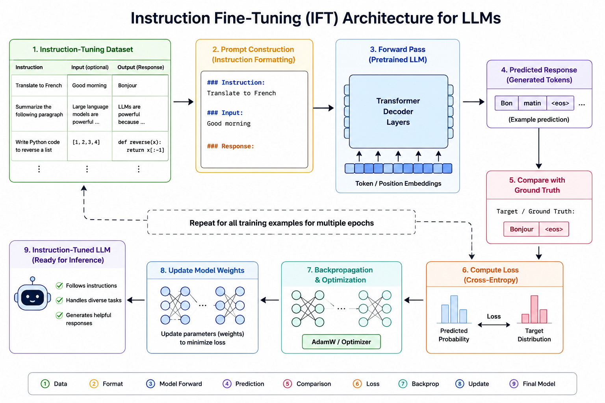
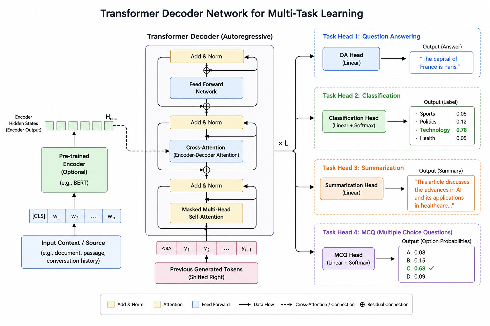

# Section 2 — Fine-tuning Taxonomy & Supervised Fine-Tuning

**Source:** Slides 7–16 · Transcript 00:25–00:39
**Topics:** 6–12 (taxonomy, unsupervised FT, SFT, alignment overview, data formats, instruction tuning, multi-task tuning)

---

## 2.1 The two-axis taxonomy (Slides 7–8)

This is the "single framework" the instructor promised. Fine-tuning is classified along **two independent axes**, and confusing them is the most common conceptual error in this whole module.

### Axis A — Task / style adaptation (*what are you teaching?*)

```
                 ┌── Unsupervised fine-tuning     (raw domain text)
Fine-tuning ─────┼── Supervised fine-tuning       (input→output pairs)
                 └── Safety/Alignment fine-tuning (preference pairs)
```

### Axis B — Parameter update strategy (*how many weights move?*)

```
                 ┌── Full fine-tuning              (all parameters)
Fine-tuning ─────┤
                 └── Parameter-Efficient (PEFT)    (a tiny subset / added params)
```

### The two axes as a grid — fill this in from memory

|  | **Full FT** | **PEFT (LoRA/QLoRA)** |
|---|---|---|
| **Unsupervised** | Continued pre-training, e.g. BloombergGPT-style domain adaptation | QLoRA continued pre-training on internal wikis |
| **Supervised** | Classic full SFT (InstructGPT stage 1) | **LoRA SFT** ← *the notebook, Section 7* |
| **Alignment** | Full DPO / PPO (frontier-lab scale) | **PEFT DPO** ← *the notebook, Section 7* |

> 💡 **Learning thought — highest-value idea in this section.** The two axes are **orthogonal**; you pick one from each. Practise decomposing technique names into their two coordinates:
> - "LoRA SFT" → Supervised × PEFT
> - "QLoRA DPO" → Alignment × PEFT
> - "DAPT" (domain-adaptive pre-training) → Unsupervised × Full
>
> Interviewers use this to test whether you understand the field's structure or have just memorised acronyms.

Note also how Axis A maps onto the training-stage diagram from Section 1: unsupervised FT *continues pre-training*, SFT *is* the fine-tuning stage, alignment *is* the safety stage. Same three boxes, different viewing angle.

---

## 2.2 Unsupervised fine-tuning (Slide 9)

Also called **continued pre-training** or **domain-adaptive pre-training (DAPT)**.

**Definition:** further training on raw, *unlabeled* domain text using the **same self-supervised objective as pre-training** — next-token prediction (or masked-token prediction for encoder models).

Three properties the slide emphasises:

1. **Same objective, new data.** No annotations needed; only the corpus changed.
2. **Absorbs domain knowledge & style.** Vocabulary, jargon, formats, and facts get baked into the weights.
3. **Cheapest data to gather.** Internal wikis, filings, papers, tickets — abundant, and you already own it.

### The code

```python
from transformers import AutoModelForCausalLM, AutoTokenizer, \
                         DataCollatorForLanguageModeling, Trainer, TrainingArguments
from datasets import Dataset

tok = AutoTokenizer.from_pretrained("Qwen/Qwen2.5-0.5B")
model = AutoModelForCausalLM.from_pretrained("Qwen/Qwen2.5-0.5B")

# RAW domain text. No labels. No instruction/response structure. Just prose.
corpus = [
    "The patient presented with erythematous papules and comedones on the malar region...",
    "Topical retinoids remain first-line therapy for non-inflammatory acne vulgaris...",
    # ... thousands more lines from your clinical corpus
]

ds = Dataset.from_dict({"text": corpus}).map(
    lambda b: tok(b["text"], truncation=True, max_length=512),
    batched=True, remove_columns=["text"],
)

trainer = Trainer(
    model=model,
    args=TrainingArguments(output_dir="./dapt", num_train_epochs=1,
                           per_device_train_batch_size=4, learning_rate=5e-5),
    train_dataset=ds,
    # mlm=False → causal LM: labels are just the inputs shifted by one.
    data_collator=DataCollatorForLanguageModeling(tok, mlm=False),
)
trainer.train()
```

**The whole trick is `mlm=False`:** the collator sets `labels = input_ids`, and the model internally shifts by one position. There is no separate label column because **the text is its own supervision.**

### When to use it — and the diagnostic

Use it when the domain language is genuinely alien to the base model (legal filings, clinical notes, chip netlists, a low-resource language). You're shifting the model's *prior* before teaching it any task.

```python
import torch

def perplexity(model, tok, text):
    """Low PPL = model finds this text predictable. High PPL = alien domain."""
    ids = tok(text, return_tensors="pt").input_ids
    with torch.no_grad():
        loss = model(ids, labels=ids).loss
    return torch.exp(loss).item()

clinical = "Erythematous papules with comedonal involvement of the malar region."
general  = "The weather today is quite nice and I am going for a walk."

print(f"clinical PPL: {perplexity(model, tok, clinical):.1f}")   # e.g. 42.7
print(f"general  PPL: {perplexity(model, tok, general):.1f}")    # e.g.  9.3
```

> 💡 **Learning thought — a practical diagnostic most people skip.** If clinical PPL is 4–5× general PPL, the model can't *read* your domain, and no amount of input→output pairs will fix that. Do continued pre-training first, then measure again. Typical pipeline: `base → unsupervised FT on domain corpus → SFT on task pairs → alignment`.

**From the Q&A:**
> *"How costly is unsupervised fine-tuning? Do we need a GPU?"* → No labels needed, but compute is the same as training. Small models can be experimented with on CPU; 7B+ practically requires a GPU. Full fine-tuning may need multiple high-memory GPUs (weights + gradients + optimizer states + activations). PEFT drastically reduces this.

### 📚 Go deeper
- [Don't Stop Pretraining (Gururangan et al., 2020)](https://arxiv.org/abs/2004.10964) — the paper that established DAPT/TAPT; still the clearest evidence it works
- [HF — Causal language modeling guide](https://huggingface.co/docs/transformers/tasks/language_modeling)
- [BloombergGPT (2023)](https://arxiv.org/abs/2303.17564) — domain pre-training at full scale, and an honest account of when it's worth it

---

## 2.3 Supervised fine-tuning — SFT (Slides 10, 12)

**Definition (slide 12):** taking a pretrained LM and teaching it a specific task by training on **input–output pairs created by humans**.

Two properties the slide stresses:
1. **Learns from demonstrations.** Humans (or a stronger model) write the targets; the model imitates them *token by token*.
2. **Teaches behaviour and format.** Instruction following, tone, structure (JSON, bullets), and task skills all come from SFT.

**Historical anchor:** human-written demonstrations powered the SFT stage of [**InstructGPT**](https://arxiv.org/abs/2203.02155) — the step that turned GPT-3 from a text-completer into something that follows instructions.

### The mechanics, precisely

For a pair (x, y):

```
loss = − Σ_t  log P_θ( y_t | x , y_<t )
```

Maximise the likelihood of the human answer, one token at a time, conditioned on the prompt and the previously *correct* tokens (teacher forcing).

### The masking, made concrete

**The loss is masked to response tokens only.** Here is exactly what that means:

```python
prompt   = "Translate to French: I love machine learning."
response = "J'aime l'apprentissage automatique."

p_ids = tok(prompt,   add_special_tokens=False).input_ids     # 9 tokens
r_ids = tok(response, add_special_tokens=False).input_ids     # 11 tokens

input_ids = p_ids + r_ids
labels    = [-100] * len(p_ids) + r_ids     # -100 = ignored by F.cross_entropy

# input_ids: [Trans, late, ..., learning, ., J, aime, ..., automatique, .]
# labels:    [-100, -100, ..., -100,    -100, J, aime, ..., automatique, .]
#             └──── no loss here ────┘  └──── loss computed here ────┘
```

> 💡 **Learning thought.** You want the model to learn *P(response | prompt)*, not *P(prompt)*. Including prompt tokens spends capacity teaching the model to generate instructions it will never need to generate, and dilutes the gradient on the part you care about. On small datasets this measurably degrades results. TRL's `SFTTrainer` handles it automatically when your dataset uses `prompt`/`completion` columns — but if you hand-roll a training loop, **you must do this yourself**, and forgetting it is a classic silent bug.

> 💡 **Learning thought — the limitation that creates Section 6.** SFT is *imitation learning*. It can only teach behaviours present in your demonstrations, and it has no notion of "better" — every target is equally correct. That single limitation is the entire reason alignment exists.

### 📚 Go deeper
- [TRL — SFTTrainer docs](https://huggingface.co/docs/trl/sft_trainer) — the exact API used in the notebook
- [InstructGPT paper](https://arxiv.org/abs/2203.02155) — read §3.1; it's the origin of the modern SFT→RM→PPO pipeline
- [LIMA: Less Is More for Alignment](https://arxiv.org/abs/2305.11206) — 1,000 curated examples beat far larger noisy sets. Essential for calibrating "how much data?"

---

## 2.4 SFT training data format (Slide 13)

The classic three-field instruction format:

```json
{
  "instruction": "Translate the following sentence to French.",
  "input":       "I love machine learning.",
  "output":      "J'aime l'apprentissage automatique."
}
```
```json
{
  "instruction": "Summarize the following article.",
  "input":       "Large language models are pretrained on massive datasets...",
  "output":      "LLMs are pretrained on large datasets before being specialized."
}
```

| Field | Role |
|---|---|
| `instruction` | *What to do* (the task) → usually system message or leading user text |
| `input` | *What to do it to* (the operand) → optional, may be empty |
| `output` | The gold response → **the only part the loss is computed on** |

### How this becomes tokens: the chat template

Modern instruct models never see raw JSON. The fields are rendered through the model's **chat template**:

```python
from transformers import AutoTokenizer
tok = AutoTokenizer.from_pretrained("Qwen/Qwen2.5-0.5B-Instruct")

record = {
    "instruction": "Translate the following sentence to French.",
    "input":       "I love machine learning.",
    "output":      "J'aime l'apprentissage automatique.",
}

messages = [
    {"role": "system", "content": "You are a helpful assistant."},
    {"role": "user",   "content": f"{record['instruction']}\n{record['input']}"},
    {"role": "assistant", "content": record["output"]},
]
print(tok.apply_chat_template(messages, tokenize=False))
```

```
<|im_start|>system
You are a helpful assistant.<|im_end|>
<|im_start|>user
Translate the following sentence to French.
I love machine learning.<|im_end|>
<|im_start|>assistant
J'aime l'apprentissage automatique.<|im_end|>
```

**Different models, different templates — this is the point:**

```python
for name in ["Qwen/Qwen2.5-0.5B-Instruct",
             "meta-llama/Llama-3.2-1B-Instruct",
             "mistralai/Mistral-7B-Instruct-v0.3"]:
    t = AutoTokenizer.from_pretrained(name)
    print(name)
    print(t.apply_chat_template([{"role":"user","content":"Hi"}], tokenize=False))
    print("-" * 60)
```

```
Qwen     →  <|im_start|>user\nHi<|im_end|>\n
Llama-3  →  <|begin_of_text|><|start_header_id|>user<|end_header_id|>\n\nHi<|eot_id|>
Mistral  →  <s>[INST] Hi [/INST]
```

> 💡 **Learning thought — the #1 production footgun.** Use the *same* template at training and inference. A mismatch is the single most common cause of "my fine-tune got worse," and it **fails silently** — you get a model that seems untrained rather than an error. Never hand-roll the format string; always call `tokenizer.apply_chat_template()`. At inference add `add_generation_prompt=True` so the model knows it's *its* turn to speak.

**From the Q&A:**
> *"If I put the system instruction inside the user prompt instead, will output differ?"* → It can produce the same output but isn't guaranteed. A system instruction sits higher in the instruction hierarchy and is treated as a different role. When instructions conflict or role information matters, behaviour diverges.

### How much data?

From the Q&A — worth quoting, because interviewers ask constantly:
> There is a relationship between model size and data requirements, but **no fixed formula**. It depends primarily on task complexity, diversity, and quality. For a *behaviour or formatting change*, **hundreds to a few thousand** high-quality examples may be enough. Teaching a *new domain or capability* requires much more.

**Rule of thumb:** start small, measure, then scale. 500 excellent examples beat 50,000 mediocre ones — [LIMA](https://arxiv.org/abs/2305.11206) demonstrated this convincingly.

### 📚 Go deeper
- [HF — Chat templating guide](https://huggingface.co/docs/transformers/chat_templating) — read this before your first fine-tune
- [Alpaca dataset](https://huggingface.co/datasets/tatsu-lab/alpaca) — the canonical instruction/input/output format, 52k examples to browse
- [Argilla — data curation for LLMs](https://docs.argilla.io/) — tooling for the part that actually determines your results

---

## 2.5 Instruction fine-tuning (Slide 14)


*Slide 14 — instruction tuning: many task types, one instruction-shaped interface.*

**Instruction tuning is SFT where the demonstrations deliberately span many *instruction types*,** so the model learns the general skill of "read an instruction, comply with it" rather than one narrow task.

The distinction from plain SFT is *intent and data composition*, not mechanism:

| | Plain SFT | Instruction tuning |
|---|---|---|
| Data | One task, many examples | Many tasks, phrased as instructions |
| Goal | Master that task | Generalise to *unseen* instructions |
| Result | Task specialist | Instruction-following generalist |

This step produced FLAN, InstructGPT, and every `-Instruct` checkpoint you download. When the notebook loads `Qwen2.5-0.5B-Instruct`, it's loading a model already instruction-tuned — which is why it responds sensibly to a system prompt out of the box.

```python
# Instruction-tuning data: same SCHEMA, deliberately diverse TASKS.
instruction_data = [
  {"instruction": "Translate to French.",        "input": "Good morning.",       "output": "Bonjour."},
  {"instruction": "Classify the sentiment.",     "input": "This is terrible.",   "output": "Negative"},
  {"instruction": "Extract all dates.",          "input": "Met her on Jan 5.",   "output": "Jan 5"},
  {"instruction": "Write a haiku about rain.",   "input": "",                    "output": "Soft rain on the roof..."},
  {"instruction": "Fix the Python bug.",         "input": "def f(x) return x",   "output": "def f(x): return x"},
]
# The model never sees "summarize" during training — but afterwards it can,
# because it learned the META-SKILL of parsing and obeying an instruction.
```

> 💡 **Learning thought.** The magic is *cross-task generalisation*: training on translation + sentiment + extraction makes the model better at a task it never saw. The mechanism is learning to parse an instruction, which transfers. **Practical implication: phrase your SFT data as instructions even for a single-task fine-tune** — you inherit the base model's instruction-following prior instead of fighting it.

### 📚 Go deeper
- [FLAN — Finetuned Language Models Are Zero-Shot Learners](https://arxiv.org/abs/2109.01652) — the paper that established the effect
- [Self-Instruct](https://arxiv.org/abs/2212.10560) — how to bootstrap instruction data from a model, the technique behind Alpaca
- [Scaling Instruction-Finetuned LMs (FLAN-T5)](https://arxiv.org/abs/2210.11416) — how the effect scales with task count

---

## 2.6 Multi-task fine-tuning (Slides 15–16)


*Slide 16 — one model, one training set, four task behaviours.*

**Definition:** a single model fine-tuned on multiple related tasks *simultaneously* — tasks interleaved in one dataset.

The slide's example:

| Input | Task | Output |
|---|---|---|
| "I love this movie." | Sentiment | Positive |
| "Who discovered gravity?" | QA | Isaac Newton |
| *Long article* | Summarization | *Short summary* |
| "Google is in California." | NER | Google (Organization), California (Location) |

All four rows sit in **one** dataset; the model learns all four behaviours into one set of weights.

### Why do it
- **One artifact to serve.** Four tasks, one deployment, one GPU.
- **Positive transfer.** Related tasks share representations.
- **Reduced catastrophic forgetting.** Training on A alone degrades B; training on both preserves both.

### Why it's hard — and the balancing code

- **Task interference / negative transfer.** Unrelated tasks fight for capacity.
- **Data imbalance.** 100k summarization rows + 500 NER rows → the model effectively ignores NER.
- **Evaluation complexity.** A single aggregate number hides per-task regressions.

```python
from datasets import concatenate_datasets
import numpy as np

# ❌ NAIVE: concatenation lets the biggest task dominate.
# combined = concatenate_datasets([summ_ds, ner_ds, qa_ds])

# ✅ TEMPERATURE SAMPLING: flatten the distribution before mixing.
def temperature_mix(datasets, T=2.0, total=20_000):
    sizes = np.array([len(d) for d in datasets], dtype=float)
    p = (sizes / sizes.sum()) ** (1 / T)        # T=1 → proportional
    p = p / p.sum()                             # T→∞ → uniform
    return concatenate_datasets([
        d.shuffle(seed=0).select(range(min(len(d), int(n))))
        for d, n in zip(datasets, p * total)
    ]).shuffle(seed=0)

mixed = temperature_mix([summ_ds, ner_ds, qa_ds], T=2.0)
```

> 💡 **Learning thought.** `T=1` samples proportionally (big tasks dominate); `T→∞` samples uniformly (tiny tasks get over-weighted and overfit). `T=2` is the common compromise, used in mT5 and many multilingual setups. **And always evaluate per task, never in aggregate** — a 5-point average gain can hide one task collapsing entirely.

### On task heads — encoder vs decoder

Several Q&A entries circled this, and it separates two worlds:

| | Encoder-style (BERT) | Decoder-style (modern LLMs) |
|---|---|---|
| Pretraining | Masked LM | Next-token prediction |
| New task | **Attach a task head** (classification/regression layer) | Change the prompt + data |
| Multiple tasks | Multiple heads | **One** LM head; tasks are text |

```python
# Encoder world: an actual new head, randomly initialized.
from transformers import AutoModelForSequenceClassification
m = AutoModelForSequenceClassification.from_pretrained("bert-base-uncased", num_labels=3)
print(m.classifier)          # Linear(in_features=768, out_features=3) ← THE HEAD

# Decoder world: no new head. Sentiment IS text generation.
#   prompt: "Classify the sentiment: 'I love this'\nAnswer:"
#   target: " Positive"
```

**From the Q&A:**
> *"What does adding a head mean?"* → Attaching a small task-specific output layer (classification/regression) on top of the pretrained model.
> *"Is this how multimodal LLMs are trained — multiple heads per task?"* → Not necessarily. Multimodal LLMs usually use separate modality *encoders/projectors* to convert image/audio into representations the LLM can consume, then generate through the **same shared LM head**.
> *"If a suitable head already exists?"* → Reuse and fine-tune it rather than adding another.

### 📚 Go deeper
- [Multitask Prompted Training (T0)](https://arxiv.org/abs/2110.08207) — multi-task generalisation done rigorously
- [PEFT — multi-adapter serving](https://huggingface.co/docs/peft/developer_guides/mixed_models) — the alternative to multi-task training when tasks are independent
- [Exploring the Limits of Transfer Learning (T5)](https://arxiv.org/abs/1910.10683) — §3.5 on multi-task mixing strategies

---

## 2.7 Safety / Alignment fine-tuning — overview (Slide 11)

Full treatment in [Section 6](06-alignment-rlhf-ppo-dpo.md). Slide 11 lists the three families:

1. **Human feedback: learn a reward, then optimize (RLHF).** Humans rank answers → a *reward model* learns the ranking → **PPO** steers the policy.
2. **Direct Preference Optimization (DPO).** Trains straight on (chosen, rejected) pairs. No reward model, no RL loop.
3. **Revision / Constitutional-style.** The model critiques and revises its *own* outputs against written principles.

**From the Q&A — the cleanest bridge in the session:**
> *"Is SFT similar to preference tuning, differing only in data and loss?"* → **Essentially yes, at a high level.** Both update the model from training examples. But SFT provides an *explicit target response* and uses cross-entropy to reproduce it. Preference tuning provides *relative* preferences (chosen vs rejected) and optimizes the model to prefer the chosen behaviour.

```python
# The data shapes, side by side:
sft_row = {"prompt": "Explain photosynthesis simply.",
           "completion": "Plants use sunlight to turn water and CO2 into food."}

dpo_row = {"prompt": "Explain photosynthesis simply.",
           "chosen":   "Plants use sunlight to turn water and CO2 into food.",
           "rejected": "Photosynthesis involves complex biochemical reactions in chloroplasts..."}
#            ↑ SFT says "say THIS."  DPO says "prefer THIS over THAT."
#              absolute target          relative target
```

> 💡 **Learning thought.** SFT: *"say this."* Alignment: *"prefer this over that."* Absolute vs relative target. Everything in Section 6 is downstream of that one distinction.

### 📚 Go deeper
- [Constitutional AI (Anthropic, 2022)](https://arxiv.org/abs/2212.08073) — the third family: self-critique against written principles
- [Anthropic — Claude's Constitution](https://www.anthropic.com/news/claudes-constitution) — what those principles actually look like in practice

---

## 🎯 Interview Questions — Section 2

### Q1. Explain the difference between unsupervised, supervised, and alignment fine-tuning.
**Answer.** They differ in data and objective. *Unsupervised* uses raw unlabeled domain text with the pre-training objective (next-token prediction) — it teaches domain language and facts. *Supervised* uses human-written input→output pairs with cross-entropy on the target — it teaches task behaviour and format. *Alignment* uses preference pairs (chosen, rejected) with a preference loss — it teaches which of several acceptable answers humans actually want. They're typically applied in that order, and each is a different point on the "task adaptation" axis of the taxonomy.

### Q2. Are LoRA and SFT alternatives to each other?
**Answer.** No — category error. They sit on different axes. SFT describes *what you're teaching* (supervised, from demonstrations). LoRA describes *how you update parameters* (a low-rank PEFT method). "LoRA SFT" is the normal combination: supervised objective, parameter-efficient update. The proper alternatives to SFT are unsupervised or alignment fine-tuning; the proper alternatives to LoRA are full fine-tuning, prefix tuning, or soft prompting.

### Q3. How much data do you need for SFT?
**Answer.** No fixed formula. For behaviour or formatting changes, hundreds to a few thousand high-quality examples often suffice; for genuinely new domain capability, substantially more. Quality, diversity and consistency dominate raw volume — LIMA showed 1,000 curated examples beating much larger noisy sets. Practically: build an eval set *first*, start with a few hundred examples, and scale data only when evals show you're data-limited rather than, say, template-mismatched.

### Q4. What is catastrophic forgetting and how do you mitigate it?
**Answer.** Fine-tuning hard on a narrow task degrades general capability, because gradient updates overwrite representations supporting other behaviours. Mitigations: PEFT (freezing base weights caps the drift); lower learning rates and fewer epochs; mixing general-purpose or replay data into the training set; multi-task rather than sequential single-task training; and KL-regularisation to a reference model — which is exactly what PPO and DPO do. Detection matters too: keep a general-capability eval (e.g. a small MMLU slice) alongside your task eval so you *see* the regression.

### Q5. Why mask the loss to completion tokens only during SFT?
**Answer.** Because you want the model to learn *P(response | prompt)*, not *P(prompt)*. Including prompt tokens spends capacity teaching the model to generate instructions it'll never need to generate, and dilutes the gradient on the part you care about. Concretely you set prompt-position labels to −100 so PyTorch's cross-entropy ignores them. TRL handles this automatically for prompt/completion datasets, but it's a classic silent bug in hand-rolled training loops — the model trains, the loss falls, and results are quietly worse.

### Q6. What breaks if train and inference chat templates differ?
**Answer.** The model was trained to condition on a specific token pattern — role markers like `<|im_start|>assistant`. At inference with a different template it sees an out-of-distribution prefix and the learned behaviour doesn't reliably trigger. Symptoms: the fine-tune "didn't take," the model rambles, or it emits training-format artifacts. It fails silently rather than erroring, which is what makes it dangerous. Always render both sides through `tokenizer.apply_chat_template()`, with `add_generation_prompt=True` at inference.

### Q7. When is multi-task fine-tuning a bad idea?
**Answer.** When tasks are unrelated enough to cause negative transfer, when dataset sizes are wildly imbalanced and you can't reweight properly, or when tasks have conflicting output conventions. It also complicates evaluation and makes regressions harder to attribute. If tasks are genuinely independent, separate LoRA adapters over a shared frozen base give you the deployment consolidation you wanted — one base model in memory, hot-swappable adapters — without any interference.

### Q8. What's the difference between instruction tuning and multi-task fine-tuning?
**Answer.** Mechanically they overlap heavily — both train one model on many tasks at once. The difference is intent and framing: multi-task tuning targets a known fixed set of tasks you'll serve; instruction tuning phrases everything as natural-language instructions specifically so the model generalises to *unseen* instructions at test time. Instruction tuning is multi-task tuning with generalisation as the goal and instructions as the unifying interface.

---

## ✅ Self-check

1. Place "QLoRA DPO" on both taxonomy axes.
2. Your SFT results are poor and your domain is heavy jargon. What's the diagnostic, and the fix?
3. Write the `labels` array for a prompt of 5 tokens and a response of 3 tokens.
4. Why does SFT structurally *require* alignment as a follow-up?
5. In a decoder-only LLM, how do you "add a task head"? (Trick question — explain.)

---

**Previous:** [Section 1](01-foundations-and-framing.md) · **Next:** [Section 3 — PEFT](03-peft-why-and-which.md) · **Index:** [00-INDEX.md](00-INDEX.md)
