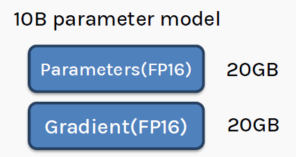
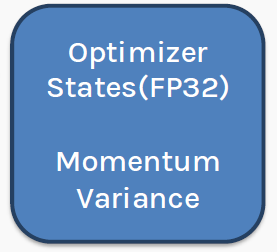
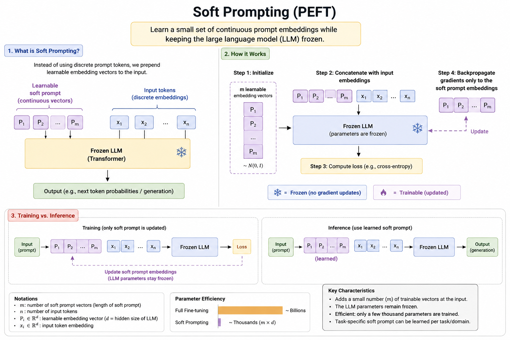
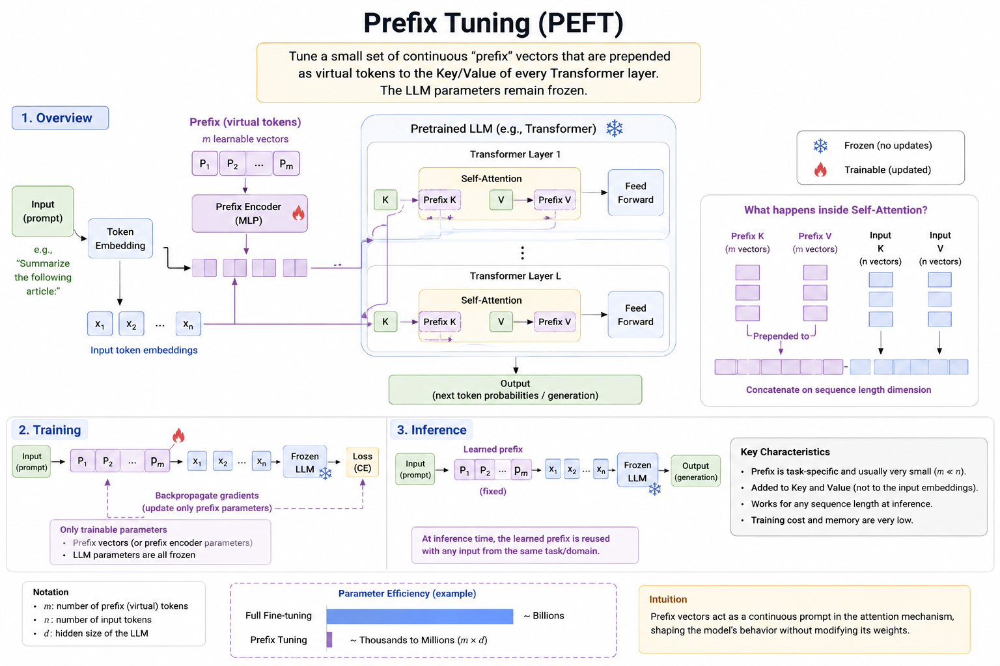

# Section 3 — PEFT: Why It Exists, and Which Method

**Source:** Slides 17–20 · Transcript 00:39–00:46
**Topics:** 13–16 (full-FT memory wall, PEFT taxonomy, soft prompting, prefix tuning)

---

## 3.1 The memory wall — why PEFT had to be invented (Slide 17)

<p align="center">
 
</p>

*Slide 17 — the dominant cost is **Optimizer States (FP32): Momentum + Variance**.*

This slide is the *motivation for everything that follows*. Work the arithmetic yourself; it comes up constantly.

**Setup:** a 10-billion parameter model, weights in FP16 (2 bytes/param).

### The four things that must live in GPU memory during training

| Component | What it is | Bytes/param | For 10B |
|---|---|---|---|
| **Weights** | The model itself | 2 (FP16) | 20 GB |
| **Gradients** | ∂L/∂W, one per weight | 2 (FP16) | 20 GB |
| **Optimizer — momentum (m)** | Adam's 1st moment | 4 (FP32) | 40 GB |
| **Optimizer — variance (v)** | Adam's 2nd moment | 4 (FP32) | 40 GB |
| | | | **≈ 120 GB** |

Slide 17 quotes **120 GB**; slide 30 later quotes **160 GB** for full FT including an FP32 master copy of the weights. Both are right — they differ on mixed-precision bookkeeping assumptions.

### Where the 8 bytes actually come from

```python
# Adam keeps TWO extra tensors per parameter. This is not an abstraction —
# you can print them straight out of PyTorch's optimizer state.
import torch

w = torch.nn.Parameter(torch.randn(1000, 1000))     # 1M params
opt = torch.optim.AdamW([w], lr=1e-4)

w.grad = torch.randn_like(w)
opt.step()

state = opt.state[w]
print(state.keys())                                  # dict_keys(['step','exp_avg','exp_avg_sq'])
print(state["exp_avg"].shape,    state["exp_avg"].dtype)     # (1000,1000) float32  ← momentum
print(state["exp_avg_sq"].shape, state["exp_avg_sq"].dtype)  # (1000,1000) float32  ← variance

total = sum(t.numel() * t.element_size()
            for t in [w.data, w.grad, state["exp_avg"], state["exp_avg_sq"]])
print(f"{total/1e6:.1f} MB for 1M params = {total/w.numel():.0f} bytes/param")
# → 16.0 MB for 1M params = 16 bytes/param   (all-FP32 case)
```

### A calculator you can reuse

```python
def training_memory_gb(n_params_b, mode="full", trainable_frac=0.005):
    """Rough GPU memory for training, in GB. Excludes activations."""
    n = n_params_b * 1e9
    if mode == "full":
        return n * (2 + 2 + 4 + 4) / 1e9                 # w + grad + m + v
    if mode == "lora":
        return (n * 2 + n * trainable_frac * (2+2+4+4)) / 1e9   # frozen FP16 base
    if mode == "qlora":
        return (n * 0.5 + n * trainable_frac * (2+2+4+4)) / 1e9 # frozen NF4 base

for b in [7, 13, 70]:
    print(f"{b:>3}B  full={training_memory_gb(b,'full'):>6.1f} GB   "
          f"lora={training_memory_gb(b,'lora'):>5.1f} GB   "
          f"qlora={training_memory_gb(b,'qlora'):>5.1f} GB")
```

```
  7B  full= 84.0 GB   lora= 14.4 GB   qlora=  3.9 GB
 13B  full=156.0 GB   lora= 26.8 GB   qlora=  7.3 GB
 70B  full=840.0 GB   lora=144.2 GB   qlora= 39.2 GB
```

**And that's before activations** — every forward pass stores intermediates for backprop, scaling with `batch × seq_len × hidden × layers`. On long contexts this can rival the weights.

### The punchline

> A 10B model — *small* by modern standards — needs **120–160 GB** just for optimizer bookkeeping. An A100 or H100 has 80 GB. You need multiple high-end GPUs to fine-tune a model you can *run inference on* with one consumer card.

> 💡 **Learning thought — the key asymmetry.** Inference needs ~2 bytes/param. Training needs ~12–16 bytes/param. That **6–8× gap** is entirely optimizer states and gradients, and it created the entire PEFT field. **If you remember one number: Adam costs 8 bytes per parameter (m + v in FP32).** Every PEFT method attacks that number — if only 0.5% of parameters are trainable, you only pay it on 0.5%.

### 📚 Go deeper
- [ZeRO: Memory Optimizations Toward Training Trillion Parameter Models](https://arxiv.org/abs/1910.02054) — §3 has the definitive memory breakdown; the other major approach (shard state across GPUs instead of shrinking it)
- [HF — Model memory anatomy](https://huggingface.co/docs/transformers/model_memory_anatomy) — excellent practical walkthrough
- [EleutherAI — Transformer Math 101](https://blog.eleuther.ai/transformer-math/) — the reference for these calculations
- [Adam paper (Kingma & Ba)](https://arxiv.org/abs/1412.6980) — where m and v come from

---

## 3.2 The PEFT taxonomy (Slide 18)

```
                    Parameter Efficient Fine-tuning (PEFT)
                                     │
        ┌────────────────────────────┼────────────────────────────┐
        │                            │                            │
  Soft prompting              Prefix Tuning              Reparameterization
  (add vectors at             (add vectors into           (decompose the weight
   the input only)             every layer's K/V)          UPDATE into low rank)
                                                                  │
                                                              LoRA, QLoRA
```

The instructor was explicit about the weighting:
> *"I will quickly touch upon soft prompting and prefix tuning, but I will spend some time on reparameterization, which is often the de facto choice for modern LLMs."*

**All three share one property: the base LLM is completely frozen.** They differ in *where* they inject new trainable parameters.

| Family | Where new params go | Params added | Inference cost |
|---|---|---|---|
| Soft prompting | Input embeddings only | ~thousands (m × d) | Extra tokens in context |
| Prefix tuning | K/V of every attention layer | thousands–millions | Extra K/V per layer |
| Reparameterization (LoRA) | Alongside every weight matrix | 0.1–2% of model | **Zero** (merged) |

> 💡 **Learning thought.** That last column is why LoRA won. Soft prompting and prefix tuning permanently consume context/attention budget at inference. LoRA's update **merges back into W**, so the deployed model has identical shape and latency. Expect LoRA-family questions in interviews, not prefix-tuning ones.

---

## 3.3 Soft Prompting (Slide 19)


*Slide 19 — learn continuous prompt embeddings; the LLM stays frozen. Note panel 3: gradients update only the soft prompt.*

**One-line definition:** learn a small set of *continuous prompt embeddings* while keeping the LLM frozen.

### The idea

Instead of searching for the right *discrete* prompt tokens ("You are a helpful expert..."), you **prepend m learnable embedding vectors** at the embedding layer. These correspond to no real word — they're arbitrary points in embedding space that gradient descent optimises.

```
Learnable soft prompt        Input tokens
(continuous vectors)         (discrete embeddings)
┌──┬──┬───┬──┐               ┌──┬──┬───┬──┐
│P1│P2│...│Pm│               │x1│x2│...│xn│
└──┴──┴───┴──┘               └──┴──┴───┴──┘
      └──────────┬──────────────────┘
                 ▼
        ┌──────────────────┐
        │  Frozen LLM  ❄️  │
        └──────────────────┘
                 ▼
        next-token probabilities
```

### The four steps (from the slide)
1. **Initialize** m learnable vectors P_i ∈ ℝ^d, typically ~ N(0, I).
2. **Concatenate** with the input embeddings.
3. **Compute loss** (cross-entropy against the gold output).
4. **Backpropagate gradients only to the soft-prompt embeddings.**

### Implemented from scratch — 20 lines

```python
import torch, torch.nn as nn

class SoftPromptModel(nn.Module):
    def __init__(self, base_model, n_tokens=20):
        super().__init__()
        self.model = base_model
        for p in self.model.parameters():
            p.requires_grad = False              # ❄️ freeze EVERYTHING

        d = base_model.config.hidden_size
        # THE ONLY TRAINABLE PARAMETERS: m × d numbers.
        self.soft_prompt = nn.Parameter(torch.randn(n_tokens, d) * 0.02)
        self.n_tokens = n_tokens

    def forward(self, input_ids, labels=None):
        B = input_ids.size(0)
        inp_emb = self.model.get_input_embeddings()(input_ids)      # (B, n, d)
        soft    = self.soft_prompt.unsqueeze(0).expand(B, -1, -1)   # (B, m, d)
        emb     = torch.cat([soft, inp_emb], dim=1)                 # (B, m+n, d)

        if labels is not None:   # pad labels so the soft prompt contributes no loss
            pad = torch.full((B, self.n_tokens), -100, device=labels.device)
            labels = torch.cat([pad, labels], dim=1)

        return self.model(inputs_embeds=emb, labels=labels)

# Parameter count check:
sp = SoftPromptModel(model, n_tokens=20)
tr = sum(p.numel() for p in sp.parameters() if p.requires_grad)
tot = sum(p.numel() for p in sp.parameters())
print(f"trainable {tr:,} / {tot:,} = {100*tr/tot:.4f}%")
# → trainable 17,920 / 494,050,688 = 0.0036%
```

**Trainable parameters = m × d.** For m=20, d=896: **17,920** parameters instead of 494 million.

### With the PEFT library

```python
from peft import PromptTuningConfig, PromptTuningInit, get_peft_model

cfg = PromptTuningConfig(
    task_type="CAUSAL_LM",
    prompt_tuning_init=PromptTuningInit.TEXT,        # ← init from real words
    prompt_tuning_init_text="Classify the sentiment of this review:",
    num_virtual_tokens=20,
    tokenizer_name_or_path="Qwen/Qwen2.5-0.5B-Instruct",
)
peft_model = get_peft_model(model, cfg)
peft_model.print_trainable_parameters()
# trainable params: 17,920 || all params: 494,050,688 || trainable%: 0.0036
```

> 💡 **Learning thought.** `PromptTuningInit.TEXT` initializes the soft prompt from the embeddings of a real sentence instead of random noise. This matters a great deal — random init is a big part of why soft prompting is unstable. **Starting from a sensible discrete prompt and letting gradients refine it is strictly better**, and it's a nice illustration that soft prompting is "prompt engineering by gradient descent."

The instructor's framing:
> *"You're supplying vectors P1…Pm of some dimension. These vectors are initially unknown to you. Your hope is that if you add them to your input, the quality of responses would be better. So all you have to do is learn these vectors — a vector is just an unknown quantity, like parameters in your model."*

**Known weakness:** soft prompting is notoriously **unstable at small model scales** and sensitive to initialization. It becomes competitive mainly at 10B+ parameters. That's a large part of why LoRA dominates.

### 📚 Go deeper
- [The Power of Scale for Parameter-Efficient Prompt Tuning (Lester et al., 2021)](https://arxiv.org/abs/2104.08691) — the original; Figure 1 shows the scale dependence clearly
- [PEFT — Prompt tuning guide](https://huggingface.co/docs/peft/task_guides/clm-prompt-tuning)
- [P-Tuning v2](https://arxiv.org/abs/2110.07602) — fixes much of the small-scale instability

---

## 3.4 Prefix Tuning (Slide 20)


*Slide 20 — prefixes are prepended to the **Key and Value** of every layer. Note the "What happens inside Self-Attention?" panel: concatenation on the sequence-length dimension.*

**One-line definition:** tune continuous "prefix" vectors prepended as virtual tokens to the **Key and Value of *every* Transformer layer**. The LLM stays frozen.

### The critical difference from soft prompting

The instructor stressed it:
> *"In the previous case we were only adding these virtual tokens at the very beginning, at the input level. But in this case we are adding these vectors everywhere — in all self-attention layers."*

```
Soft prompting:   inject at layer 0 (input embeddings) only
                  ↓ influence must propagate up through the network

Prefix tuning:    inject at EVERY layer's attention K and V
                  ↓ direct control at every depth
```

### Mechanically

```python
# Standard attention at layer ℓ:
#   K = x @ W_k            # (n, d_head)
#   V = x @ W_v            # (n, d_head)
#   attn = softmax(Q @ K.T / sqrt(d)) @ V

# Prefix tuning at layer ℓ:
K = torch.cat([prefix_K[l], x @ W_k], dim=0)     # (m + n, d_head)
V = torch.cat([prefix_V[l], x @ W_v], dim=0)     # (m + n, d_head)
# Q is UNCHANGED — still (n, d_head), one query per real token.
attn = torch.softmax(Q @ K.T / d**0.5, dim=-1) @ V
#   ↑ every real query can now attend over m extra learned "memory slots"
```

**Note the placement precisely:** added to **Key and Value**, *not* input embeddings and *not* Query. A favourite detail question — and the reason is structural: queries come from tokens you're producing output for, and a prefix has no output position, so a prefix query would have nothing to contribute.

### With the PEFT library

```python
from peft import PrefixTuningConfig, get_peft_model

cfg = PrefixTuningConfig(
    task_type="CAUSAL_LM",
    num_virtual_tokens=20,
    prefix_projection=True,     # ← use the MLP reparameterization (stability)
)
peft_model = get_peft_model(model, cfg)
peft_model.print_trainable_parameters()
# trainable params: 860,160 || all params: 494,893,   || trainable%: 0.17
#   ≈ m × d × L × 2  (20 × 896 × 24 × 2)  — ~48× more than soft prompting
```

### The prefix encoder

The slide shows a **Prefix Encoder (MLP)** — a reparameterization trick from the paper. Directly optimizing prefix vectors is unstable, so you optimize a smaller matrix and pass it through an MLP. After training the MLP is discarded and only the resulting prefix values are kept. That's what `prefix_projection=True` enables.

### Key characteristics (from the slide)
- Prefix is task-specific and usually very small (m ≪ n).
- Added to Key and Value, not input embeddings.
- Works for any sequence length at inference.
- Training cost and memory are very low.
- Trainable params ≈ **m × d × L × 2**.

**Intuition (from the slide):** prefix vectors act as a continuous prompt *inside the attention mechanism*, shaping behaviour without modifying weights.

> 💡 **Learning thought.** Compare *expressive reach*: soft prompting must push influence up through N layers, competing with everything else in the residual stream. Prefix tuning has a direct line into every layer. More parameters, more control, more stability — the classic PEFT trade-off. **Every PEFT method sits on this line: how deep into the network may I reach, and what does that cost?**

### 📚 Go deeper
- [Prefix-Tuning (Li & Liang, 2021)](https://arxiv.org/abs/2101.00190) — the original; §4 explains the MLP reparameterization and why naive optimization fails
- [Towards a Unified View of PEFT (He et al., 2022)](https://arxiv.org/abs/2110.04366) — shows prefix tuning, adapters and LoRA are all instances of one framework. Excellent for consolidating this section.
- [PEFT — Prefix tuning guide](https://huggingface.co/docs/peft/package_reference/prefix_tuning)

---

## 3.5 Comparison table — commit this to memory

| | Soft Prompting | Prefix Tuning | LoRA (Section 4) |
|---|---|---|---|
| **Injection point** | Input embeddings | K & V of every layer | Alongside every weight matrix |
| **Trainable params** | m × d | m × d × L × 2 | 2 × r × d per matrix |
| **Typical count (0.5B model)** | ~18k | ~860k | ~8–17M |
| **Base model** | Frozen ❄️ | Frozen ❄️ | Frozen ❄️ |
| **Merges into W?** | ❌ | ❌ | ✅ **Yes** |
| **Inference overhead** | Extra context tokens | Extra K/V per layer | **None** |
| **Stability at small scale** | Poor | Moderate | Good |
| **Interpretable?** | No | No | Somewhat (ΔW inspectable) |
| **Usage today** | Rare | Rare | **De facto standard** |

### Run the comparison yourself

```python
from peft import (LoraConfig, PromptTuningConfig, PrefixTuningConfig,
                  get_peft_model)
from transformers import AutoModelForCausalLM

def count(cfg, name):
    m = AutoModelForCausalLM.from_pretrained("Qwen/Qwen2.5-0.5B-Instruct")
    m = get_peft_model(m, cfg)
    tr = sum(p.numel() for p in m.parameters() if p.requires_grad)
    tot = sum(p.numel() for p in m.parameters())
    print(f"{name:16s} {tr:>12,}  ({100*tr/tot:.4f}%)")

count(PromptTuningConfig(task_type="CAUSAL_LM", num_virtual_tokens=20), "Soft prompting")
count(PrefixTuningConfig(task_type="CAUSAL_LM", num_virtual_tokens=20), "Prefix tuning")
count(LoraConfig(task_type="CAUSAL_LM", r=16, target_modules="all-linear"), "LoRA r=16")
```

```
Soft prompting         17,920  (0.0036%)
Prefix tuning         860,160  (0.1738%)
LoRA r=16          17,432,576  (3.4200%)
```

> 💡 **Learning thought.** LoRA uses ~1000× more trainable parameters than soft prompting and still counts as "parameter-efficient" — because the baseline is 494 million. **PEFT is not a race to the fewest parameters; it's about finding the cheapest update that actually works.** Soft prompting wins on parameter count and loses on results, which is exactly why nobody uses it.

---

## 🎯 Interview Questions — Section 3

### Q1. Why does full fine-tuning need so much more memory than inference?
**Answer.** Inference needs only weights (~2 bytes/param in FP16). Training additionally needs gradients (one per weight) and optimizer state — Adam keeps first and second moments, typically FP32, which is 8 bytes/param on its own. Add a possible FP32 master copy and the activations cached for backprop and you land around 12–16 bytes/param. For a 10B model that's ~120–160 GB versus ~20 GB for inference — a 6–8× gap dominated by the optimizer.

### Q2. Walk me through the memory budget for fine-tuning a 7B model.
**Answer.** Full FT in mixed precision: weights 14 GB, gradients 14 GB, Adam m and v 28 GB each in FP32 = 56 GB, so ~84 GB plus activations — two 80 GB GPUs minimum, realistically more. With LoRA at r=16 you freeze the base: 14 GB of frozen weights plus optimizer state on ~0.5% of parameters, roughly 15–20 GB — a single 24 GB card. With QLoRA the frozen base drops to ~3.5 GB in NF4, bringing you under 10 GB, which is why QLoRA fine-tunes run on free Colab.

### Q3. Contrast soft prompting and prefix tuning.
**Answer.** Both freeze the LLM and learn continuous vectors. Soft prompting prepends m learnable embeddings at the *input layer only* — m×d parameters, and its influence must propagate up through the network. Prefix tuning prepends learned virtual tokens to the *Key and Value of every attention layer* — roughly m×d×L×2 parameters, with direct control at every depth. Prefix tuning is more expressive and more stable; soft prompting is cheaper but notoriously unstable below ~10B parameters, which is why it's rarely used in practice.

### Q4. Why did LoRA displace prompt-based PEFT methods?
**Answer.** Three reasons. (1) **Zero inference overhead** — the low-rank update merges back into base weights, so the served model has identical shape and latency; prompt/prefix methods permanently consume context or attention budget. (2) **Stability** — LoRA trains reliably across scales, whereas soft prompting is initialization-sensitive and weak on small models. (3) **Expressiveness where it matters** — LoRA modifies the weight matrices themselves rather than only the activations flowing through them.

### Q5. In prefix tuning, why are prefixes added to K and V but not Q?
**Answer.** Queries come from actual tokens you want output for — a prefix has no output position, so a prefix query would have nothing to contribute. Keys and Values define *what can be attended to*; adding prefixes there gives every real query additional learned content to attend over, which is exactly the intended mechanism — the prefix acts as learned memory shaping each layer's attention.

### Q6. Does PEFT eliminate the need for a big GPU?
**Answer.** It reduces *trainable-state* memory dramatically but not the frozen base weights, which still sit in memory. A 70B model in FP16 is 140 GB of frozen weights — LoRA alone doesn't fix that. That's exactly the gap QLoRA closes by storing the frozen base in 4-bit (~35 GB). So PEFT attacks optimizer/gradient memory; quantization attacks weight memory; gradient checkpointing attacks activations. You usually need all three.

### Q7. Can you use multiple PEFT adapters at once?
**Answer.** Yes, and it's a major operational advantage. Because adapters are small and separable you can host one frozen base and swap or compose task-specific adapters at request time — the standard multi-tenant pattern, and vLLM supports multi-LoRA batching so requests for different adapters can share a batch. Far cheaper than deploying N fully fine-tuned copies, and a strong alternative to multi-task fine-tuning when tasks are independent.

---

## ✅ Self-check

1. Run the memory calculator for a 13B model in all three modes.
2. What is the one architectural property making LoRA deployable at zero inference cost?
3. Where exactly are prefix vectors injected — name the tensors.
4. Why is soft prompting unreliable on a 0.5B model, and what one config change helps most?
5. LoRA trains 1000× more parameters than soft prompting. Why is it still "parameter-efficient"?

---

**Previous:** [Section 2](02-finetuning-taxonomy-and-sft.md) · **Next:** [Section 4 — LoRA](04-lora.md) · **Index:** [00-INDEX.md](00-INDEX.md)
