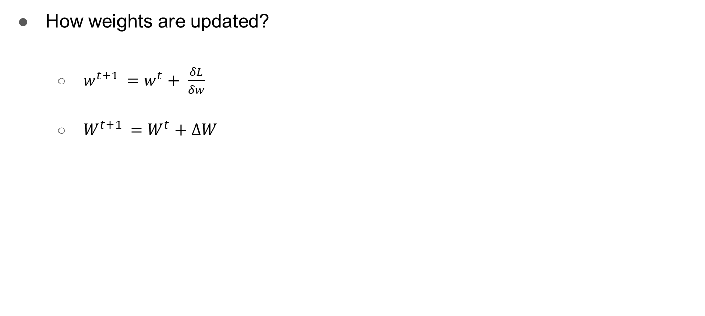
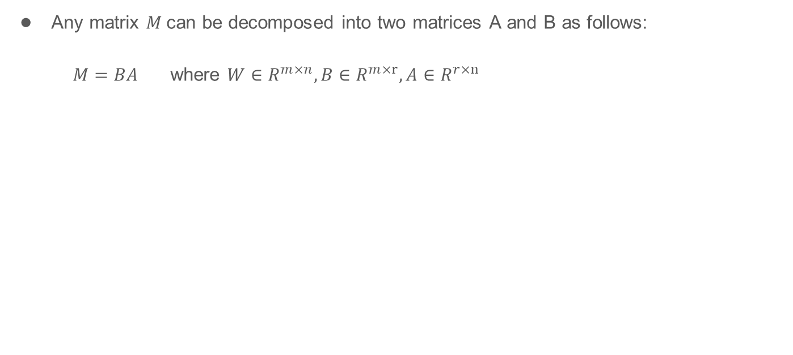
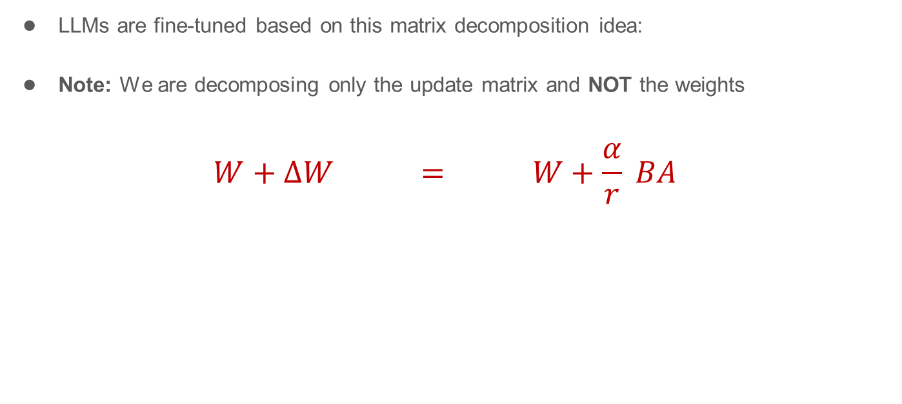

# Section 4 — LoRA (Low-Rank Adaptation)

**Source:** Slides 21–30 · Transcript 00:46–00:55
**Topics:** 17–21 (reparameterization PEFT, gradient descent recap, low-rank decomposition, rank, initialization, gradient flow, merging, remaining memory issues)

> The technical heart of the first half. The instructor spent the most time here and called it "often the de facto choice for modern LLMs."

---

## 4.1 Prerequisite: how weights are updated (Slide 22)


*Slide 22 — the two lines the entire method pivots on.*

Ordinary gradient descent:

```
w_new  =  w_old  −  η · ∂L/∂w
```

The instructor's plain-language version:
> *"The gradient tells you whether you have to increase or decrease. If by increasing a parameter you notice the loss is decreasing, that's a good thing — so you increase it."*

Now rewrite it in the form that makes LoRA obvious — this is literally the second line on the slide:

```
W_new  =  W_old  +  ΔW          where  ΔW = −η · ∂L/∂W
```

**This is the pivot of the entire method.** Fine-tuning is not "learning a new W." Fine-tuning is **learning ΔW** — the *change*. W_old is given; the only unknown is the delta.

```python
# Make ΔW concrete: fine-tune anything, then subtract.
import torch
from transformers import AutoModelForCausalLM

base = AutoModelForCausalLM.from_pretrained("Qwen/Qwen2.5-0.5B-Instruct")
tuned = AutoModelForCausalLM.from_pretrained("./my-finetuned-model")

W_base  = base.model.layers[0].self_attn.q_proj.weight.data
W_tuned = tuned.model.layers[0].self_attn.q_proj.weight.data
delta_W = W_tuned - W_base                      # ← THE object LoRA models

print(f"W shape        : {tuple(W_base.shape)}")
print(f"‖W‖            : {W_base.norm():.2f}")
print(f"‖ΔW‖           : {delta_W.norm():.2f}")
print(f"relative change: {100*delta_W.norm()/W_base.norm():.2f}%")
# Typical output: relative change ~0.5–3%.  Fine-tuning barely moves the weights.
```

> 💡 **Learning thought — the conceptual leap.** Everyone knows W_new = W_old + ΔW. LoRA's insight is to *stop treating ΔW as a byproduct and start treating it as the object you parameterise*. Once ΔW is the thing you're modelling, you're free to model it however you like — including in a far smaller space than W lives in. That reframing is worth more than the math that follows.

---

## 4.2 LoRA's key idea (Slide 23)

Four bullets, in order:

1. **Freeze the original model parameters.** W is never touched.
2. **During fine-tuning, introduce a pair of low-rank matrices.**
3. **Only these matrices are updated.**
4. **They are merged back during inference.**

---

## 4.3 The linear algebra (Slides 24–26)


*Slide 24 — M = BA, where B ∈ ℝ^(m×r), A ∈ ℝ^(r×n).*

### The decomposition

```
W  ≈  B · A
```
where, if W is d × k: **B** is d × r, **A** is r × k, and **r ≪ min(d, k)**.

The instructor's worked example (slide 25):

> A 5 × 5 matrix has **25 parameters**. Decompose at **rank 1**: B is 5×1 (5 params), A is 1×5 (5 params) → **10 parameters**.
> At **rank 2**: B is 5×2 (10), A is 2×5 (10) → **20 parameters** — still fewer than 25.

**Parameter count:** `r × (d + k)` instead of `d × k`.

```python
def lora_params(d, k, r):
    full = d * k
    lora = r * (d + k)
    return full, lora, 100 * lora / full

for r in [1, 2, 4, 8, 16, 32, 64]:
    full, low, pct = lora_params(4096, 4096, r)
    print(f"r={r:>3}  LoRA={low:>10,}  vs full={full:,}  ({pct:5.2f}%)")
```

```
r=  1  LoRA=     8,192  vs full=16,777,216  ( 0.05%)
r=  2  LoRA=    16,384  vs full=16,777,216  ( 0.10%)
r=  4  LoRA=    32,768  vs full=16,777,216  ( 0.20%)
r=  8  LoRA=    65,536  vs full=16,777,216  ( 0.39%)
r= 16  LoRA=   131,072  vs full=16,777,216  ( 0.78%)
r= 32  LoRA=   262,144  vs full=16,777,216  ( 1.56%)
r= 64  LoRA=   524,288  vs full=16,777,216  ( 3.12%)
```

### ⚠️ The single most important caveat (Slide 26)


*Slide 26 — note the bolded warning, and the α/r scaling.*

> **"Note: We are decomposing only the UPDATE matrix, and NOT the weights."**

```
✅ CORRECT:    W_new = W + ΔW  =  W + B·A       (W stays full-rank, untouched)
❌ WRONG:      W    ≈ B·A                        (this would destroy the model)
```

You are **not** compressing the pretrained model. W keeps every bit of its full-rank capacity. You only assert that the *change required to adapt it* is low-rank.

### Verify the claim empirically

```python
# Is ΔW actually low-rank? Check its singular value spectrum.
import torch

U, S, Vh = torch.linalg.svd(delta_W.float())     # delta_W from §4.1
energy = torch.cumsum(S**2, 0) / (S**2).sum()

for r in [1, 4, 8, 16, 32, 64, 128]:
    print(f"rank {r:>4}: captures {100*energy[r-1]:.1f}% of ΔW's energy")

# And compare against the WEIGHTS themselves:
_, S_w, _ = torch.linalg.svd(W_base.float())
energy_w = torch.cumsum(S_w**2, 0) / (S_w**2).sum()
print(f"\nrank 16 captures {100*energy[15]:.1f}% of ΔW  "
      f"but only {100*energy_w[15]:.1f}% of W")
```

Typical result: rank 16 captures **most** of ΔW's energy but only a small fraction of W's.

> 💡 **Learning thought — why is the assumption reasonable?** The paper's hypothesis is that pretrained models are heavily over-parameterised and task adaptation has low "intrinsic dimension." **Interviewers love "why is the update low-rank when the weights aren't?" The answer: the weights encode *everything the model knows*; the update encodes *one narrow behavioural shift*. Vastly less information, so vastly lower rank.** The SVD snippet above is how you'd *demonstrate* that rather than assert it.

### The actual LoRA formula (Slide 26)

```
W_new  =  W  +  (α / r) · B · A
           ↑         ↑
        frozen    trainable + scaled
```

**Why α/r?** So changing r doesn't force you to retune the learning rate. Double r and B·A's magnitude roughly doubles; dividing by r compensates. Common practice: **α = 2r** (the notebook uses r=16, α=32).

### Choosing rank

From the transcript:
> *"If the rank is small, the approximation is poor. If the rank is high, the approximation is better — but then you have more parameters. Generally we do it by experimentation — treat it as a hyperparameter."*

| Rank r | Use case |
|---|---|
| 4–8 | Style/tone/format changes; small datasets |
| 16–32 | The common default; most task adaptation |
| 64–128 | Large datasets, teaching substantially new capability |
| 256+ | Approaching full FT cost; reconsider |

**From the Q&A:**
> *"What is rank?"* → Rank r is the size of the low-rank update, where ΔW = A·B instead of updating full W. Smaller rank = fewer trainable parameters and less memory; larger rank = more capacity. Example: W is 1000×1000 = 1,000,000 parameters. With r=2, A is 1000×2 and B is 2×1000 → only ~4,000 parameters train.
> *"How many low-rank matrices are required?"* → **Two** — A and B.

### 📚 Go deeper
- [LoRA: Low-Rank Adaptation of LLMs (Hu et al., 2021)](https://arxiv.org/abs/2106.09685) — the original. §7.2 measures the intrinsic rank empirically; read it after this section.
- [Intrinsic Dimensionality Explains Fine-Tuning Effectiveness](https://arxiv.org/abs/2012.13255) — the theoretical predecessor that motivated LoRA
- [LoRA Insights — Sebastian Raschka](https://lightning.ai/pages/community/lora-insights/) — extensive practical ablations on r, α, and target modules. The single most useful practitioner resource here.
- [3Blue1Brown — SVD / change of basis](https://www.youtube.com/watch?v=PFDu9oVAE-g) — if "rank" feels abstract, fix that first

---

## 4.4 Initialization (Slides 27–28)

```
A  ~  Normal(0, σ²)        random Gaussian
B  =  0                    zero matrix
```

### Why this exact asymmetry?

At step 0: `ΔW = B·A = 0·A = 0`, so `W_new = W`.

**The adapted model starts numerically identical to the pretrained model.** No random perturbation, no output corruption. Training departs from pretrained behaviour smoothly.

### Why not zero-init both?

```python
# Gradients of a product: each depends on the OTHER factor.
#   h = W x + B A x
#   ∂L/∂A = Bᵀ · (∂L/∂h) · xᵀ      → zero if B = 0
#   ∂L/∂B = (∂L/∂h) · (A x)ᵀ       → zero if A = 0

import torch
A = torch.zeros(2, 4, requires_grad=True)
B = torch.zeros(4, 2, requires_grad=True)
x = torch.randn(4)
(B @ A @ x).sum().backward()
print(A.grad.abs().sum(), B.grad.abs().sum())   # tensor(0.) tensor(0.)  ← DEAD

A = torch.randn(2, 4, requires_grad=True) * 0.02
B = torch.zeros(4, 2, requires_grad=True)
A.retain_grad(); B.retain_grad()
(B @ A @ x).sum().backward()
print(A.grad.abs().sum(), B.grad.abs().sum())   # tensor(0.) tensor(1.9)  ← B learns
# B moves off zero on step 1 → A's gradient becomes non-zero on step 2. Alive.
```

> 💡 **Learning thought.** A beautiful piece of engineering and a classic interview question. The constraint is: *"product must be zero, but gradients must not be."* Zero-init both → dead. Random-init both → the model is damaged at step 0 and must recover. Zero-init exactly one → product is zero, gradient flows through the other. **Understand *why*, not just *which one*.**

---

## 4.5 The forward and backward pass (Slides 28–29)

### Forward

```
          x
          │
    ┌─────┴─────┐
    │           │
    ▼           ▼
┌───────┐   ┌───────┐
│   W   │   │   A   │   A = Normal(0, σ)
│ ❄️     │   └───┬───┘
│frozen │       ▼
│       │   ┌───────┐
│       │   │   B   │   B = 0
└───┬───┘   └───┬───┘
    │           │
    └─────┬─────┘
          ▼    (+)
          h  =  Wx + (α/r)·BAx
```

### LoRA from scratch — the whole method in 25 lines

```python
import torch, torch.nn as nn, math

class LoRALinear(nn.Module):
    """Wraps a frozen nn.Linear with a trainable low-rank update."""
    def __init__(self, base: nn.Linear, r=16, alpha=32, dropout=0.05):
        super().__init__()
        self.base = base
        for p in self.base.parameters():
            p.requires_grad = False                      # ❄️ freeze W

        d_in, d_out = base.in_features, base.out_features
        self.A = nn.Parameter(torch.empty(r, d_in))      # r × k
        self.B = nn.Parameter(torch.zeros(d_out, r))     # d × r  ← ZERO
        nn.init.kaiming_uniform_(self.A, a=math.sqrt(5)) # ← random
        self.scaling = alpha / r
        self.dropout = nn.Dropout(dropout)

    def forward(self, x):
        #        frozen path              trainable path
        return self.base(x) + self.dropout(x) @ self.A.T @ self.B.T * self.scaling

    @torch.no_grad()
    def merge(self):
        """Fold B·A into W. After this the module is a plain Linear."""
        self.base.weight += (self.B @ self.A) * self.scaling
        return self.base

# Sanity check: at init, the LoRA layer is EXACTLY the base layer.
base = nn.Linear(128, 256)
lora = LoRALinear(base, r=8)
x = torch.randn(4, 128)
print(torch.allclose(base(x), lora(x)))          # True  ← because B = 0
print(f"trainable: {sum(p.numel() for p in lora.parameters() if p.requires_grad):,}")
print(f"frozen   : {sum(p.numel() for p in lora.parameters() if not p.requires_grad):,}")
# trainable: 3,072
# frozen   : 33,024
```

### Backward (Slide 29)

> **"During back propagation, gradients only pass through the adapters."**

Precisely: gradients *flow through* W (they must, to reach earlier layers) but **no gradient is accumulated for W, and no optimizer state is allocated for W.**

```python
# Prove it:
loss = lora(x).sum()
loss.backward()
print("W.grad      :", lora.base.weight.grad)        # None  ← no gradient stored
print("A.grad norm :", lora.A.grad.norm().item())    # 12.4
print("B.grad norm :", lora.B.grad.norm().item())    # 8.7

opt = torch.optim.AdamW([p for p in lora.parameters() if p.requires_grad])
opt.step()
print("optimizer state entries:", len(opt.state))    # 2  ← only A and B, not W
```

> 💡 **Learning thought — the precise reason LoRA saves memory.** It is *not* that you compute fewer gradients through the network — you still backpropagate through the whole model. It's that you **store optimizer state for 0.5% of parameters instead of 100%.** From Section 3: Adam costs 8 bytes/param. Applying that to 130k instead of 16.7M per matrix is the entire trick.
>
> **From the Q&A:** *"LoRA saves memory because it freezes the original weights and learns only a low-rank update represented by two small matrices. Therefore we don't need gradients and optimizer states for billions of base-model parameters. The base weights still occupy memory, but the trainable state becomes dramatically smaller."*
> And, when asked for plain vanilla: *"It keeps the original model unchanged and trains only a small set of extra parameters instead of updating the whole model."*

---

## 4.6 Merging at inference

```
W_merged  =  W  +  (α/r) · B · A
```

Compute once, store W_merged, discard A and B. The result is a **plain model of identical architecture and size** — same latency, same serving code.

```python
sft_model = sft_trainer.model.merge_and_unload()     # ← the notebook's one-liner
```

```python
# What merge_and_unload() does, and proof it's lossless:
from peft import PeftModel
import torch

peft_model = PeftModel.from_pretrained(base_model, "./my-adapter")
x = tokenizer("Where is my order?", return_tensors="pt")

with torch.no_grad():
    before = peft_model(**x).logits

merged = peft_model.merge_and_unload()               # W ← W + (α/r)·B·A
with torch.no_grad():
    after = merged(**x).logits

print(type(merged).__name__)                         # Qwen2ForCausalLM (plain!)
print("max diff:", (before - after).abs().max().item())   # ~1e-3 (bf16 rounding)
```

**Two deployment modes, both valid:**

| Mode | How | Best for |
|---|---|---|
| **Merged** | Fold B·A into W permanently | Single-task serving; simplest, fastest |
| **Unmerged (adapter swap)** | Keep W frozen, hot-swap adapters | Multi-tenant: many tasks, one base model |

```python
# Multi-tenant serving: ONE base model, MANY adapters.
model = PeftModel.from_pretrained(base, "./adapters/support",  adapter_name="support")
model.load_adapter("./adapters/billing", adapter_name="billing")
model.load_adapter("./adapters/legal",   adapter_name="legal")

model.set_adapter("billing")      # route this request to the billing adapter
out = model.generate(**inputs)
model.set_adapter("legal")        # next request, different behaviour, same weights
```

**From the Q&A:**
> *"How do we store fine-tuned weights in industry projects?"* → The updated weights (or LoRA adapters) are saved and **versioned in a model registry/storage**, then loaded once into the serving system and reused for inference.

> 💡 **Learning thought.** Adapter-swap mode is genuinely underrated. A 7B base is 14 GB; a rank-16 adapter is ~30 MB. You can serve **hundreds** of task-specific models from one GPU. This is how multi-tenant LLM platforms work, and it's the right answer to "how would you serve 50 customer-specific models?"

### 📚 Go deeper
- [PEFT — LoRA conceptual guide](https://huggingface.co/docs/peft/conceptual_guides/lora)
- [S-LoRA: Serving Thousands of Concurrent LoRA Adapters](https://arxiv.org/abs/2311.03285) — the serving-side research
- [vLLM — multi-LoRA serving](https://docs.vllm.ai/en/latest/features/lora.html) — production implementation you can actually deploy

---

## 4.7 LoRA is not enough (Slide 30)

For a **10-billion parameter model**:

| | # params | Optimizer state | Base model state | Adapter state | **Memory** |
|---|---|---|---|---|---|
| **Full parameter** | 10 B | FP32 | FP16 | N/A | **160 GB** |
| **LoRA** | 10 B | FP32 | FP16 | FP16 | **40 GB** |

A **4× reduction** — dramatic. And yet:

> *"Still you get 40 GB of GPU memory. And modern language models have hundreds of billions of parameters. So it's still pretty big."*

### Where does the remaining 40 GB go?

Overwhelmingly into **the frozen base weights**: 10B × 2 bytes = **20 GB**, plus activations and the small adapter state.

**The structural insight:** LoRA optimised the *trainable* state to near-nothing but did **nothing** about the frozen weights — which now dominate. You've hit a different wall.

```
Full FT bottleneck:   optimizer states     →  solved by LoRA
LoRA bottleneck:      frozen base weights  →  solved by QLoRA (quantization)
```

> 💡 **Learning thought.** A perfect example of how systems optimisation actually proceeds: remove the dominant cost, and a previously-invisible cost becomes dominant. **QLoRA is not a better LoRA — it is LoRA plus an orthogonal fix for the *new* bottleneck LoRA exposed.** Understanding full FT → LoRA → QLoRA as a chain of *bottleneck shifts* is worth far more than memorising three techniques.

---

## 4.8 LoRA in practice — the notebook configuration

```python
from peft import LoraConfig

lora_config = LoraConfig(
    r=16,                          # rank of the B·A correction
    lora_alpha=32,                 # scaling (2 × r here)
    lora_dropout=0.05,
    target_modules="all-linear",   # attach to every linear layer
    bias="none",
    task_type="CAUSAL_LM",
)
```

| Param | Value | Why |
|---|---|---|
| `r` | 16 | Standard default; good capacity/cost balance |
| `lora_alpha` | 32 | α = 2r, so α/r = 2 — decouples rank from effective LR |
| `lora_dropout` | 0.05 | Dropout on the **adapter path only**; regularises small-data runs |
| `target_modules` | `"all-linear"` | Robust across architectures — no need to know if it's `q_proj` or `query` |
| `bias` | `"none"` | Don't train biases; marginal benefit, extra state |
| `task_type` | `CAUSAL_LM` | Tells PEFT the head/loss shape |

```python
sft_args = SFTConfig(
    num_train_epochs=3,
    per_device_train_batch_size=2,
    gradient_accumulation_steps=4,     # effective batch = 8
    learning_rate=2e-4,                # LoRA tolerates higher LRs than full FT
    max_length=512,
    bf16=True,
)
```

> 💡 **Learning thought — two details worth internalising.**
> **(1) `learning_rate=2e-4` is 10–100× higher than full FT's 1e-5–5e-5.** Why? You're training a small number of *freshly-initialized* parameters from scratch, not nudging billions of delicately pretrained ones. The frozen base can't be damaged by a large LR. A real interview question.
> **(2) `gradient_accumulation_steps=4` with batch 2** gives an effective batch of 8 without the memory of 8. Standard whenever GPU-constrained.

### Verify the saving

```python
trainable = sum(p.numel() for p in sft_trainer.model.parameters() if p.requires_grad)
total     = sum(p.numel() for p in sft_trainer.model.parameters())
print(f"Trainable params : {trainable/1e6:.2f}M")
print(f"Total params     : {total/1e6:.2f}M")
print(f"Fraction trained : {100*trainable/total:.2f}%")
```

**Always run this.** It's your proof the adapters attached. If it prints 100%, your `peft_config` didn't take effect.

### Which modules to target?

The original paper targeted only `q_proj` and `v_proj`. Later practice showed targeting *all* linear layers (including the MLP) usually works better for the same parameter budget — recall from Section 1 that MLP matrices hold ~5× more parameters than attention ones.

```python
# Inspect what actually got adapted:
print(sft_trainer.model.targeted_module_names)
# ['q_proj','k_proj','v_proj','o_proj','gate_proj','up_proj','down_proj']

# Attention-only (the original paper's choice), for comparison:
LoraConfig(r=16, lora_alpha=32, target_modules=["q_proj", "v_proj"], task_type="CAUSAL_LM")
```

---

## 🎯 Interview Questions — Section 4

### Q1. Explain LoRA in one minute.
**Answer.** Fine-tuning learns an update ΔW to each weight matrix. LoRA's hypothesis is that this update has low intrinsic rank, so instead of learning a full d×k matrix you learn two thin matrices B (d×r) and A (r×k) with r ≪ d, and set ΔW = (α/r)·B·A. The pretrained W is frozen; only A and B train. Because gradients and optimizer state are allocated only for A and B, training memory drops enormously. At inference you fold B·A into W, so there's zero added latency.

### Q2. Why is B initialized to zero and A randomly?
**Answer.** So ΔW = B·A = 0 at step 0 — the adapted model is numerically identical to the pretrained model at the start, with no perturbation to recover from. You can't zero *both*, because each factor's gradient depends on the other (∂L/∂A ∝ Bᵀ, ∂L/∂B ∝ Aᵀ), so both gradients would be zero and nothing would learn. Exactly one must be non-zero to break symmetry; convention is A ~ N(0,σ²), B = 0.

### Q3. Does LoRA decompose the model weights?
**Answer.** No — the most common misconception. LoRA decomposes only the *update* ΔW. The pretrained W stays full-rank and untouched. Decomposing W itself would be model compression and would destroy capability, since pretrained weights encode everything the model knows and are genuinely high-rank. The *update* encodes one narrow behavioural shift, which empirically is low-rank — you can verify this with an SVD of ΔW.

### Q4. What do r and alpha do, and how do you choose them?
**Answer.** r is the rank — it sets the update's capacity and the parameter count, r×(d+k) per matrix. α is a scaling constant; the update is scaled by α/r. That form means changing r doesn't require retuning the learning rate, since B·A's magnitude scales roughly with r. Common practice is α = 2r. For r: 4–8 for style/format changes, 16–32 as a general default, 64+ for teaching substantial new capability on large data. Tune r empirically against a held-out eval, not by intuition.

### Q5. Why can LoRA use a much higher learning rate than full fine-tuning?
**Answer.** The trainable parameters are freshly initialized and few, not delicately pretrained. Full FT at 2e-4 would blow up pretrained representations and cause catastrophic forgetting; LoRA can't, because base weights are frozen — the worst case is a badly-learned adapter, with base capability structurally protected. Typical LoRA LRs are 1e-4 to 5e-4 versus 1e-5 to 5e-5 for full FT.

### Q6. Where exactly does the memory saving come from? Be precise.
**Answer.** Not from computing fewer gradients — you still backpropagate through the entire network to reach earlier layers. The saving is that gradient tensors and optimizer state (Adam's m and v, 8 bytes/param in FP32) are allocated only for adapter parameters, ~0.1–2% of the model. The frozen base weights still occupy full memory, which is exactly why LoRA plateaus around 40 GB for a 10B model and why QLoRA is needed on top.

### Q7. What are LoRA's limitations?
**Answer.** (a) Frozen base weights still dominate memory, so very large models remain out of reach without quantization. (b) Low rank genuinely limits capacity — for teaching substantial new *knowledge* (as opposed to behaviour) LoRA can underperform full fine-tuning. (c) Results are sensitive to target modules and r. (d) Merged adapters can't be composed arbitrarily; stacking causes interference. (e) It doesn't reduce activation memory at all, so long-context training is still expensive.

### Q8. How would you serve 50 customer-specific fine-tuned models on one GPU?
**Answer.** Train 50 LoRA adapters over one shared base and *don't* merge them. Keep base weights resident once (14 GB for a 7B model) and load adapters — ~30 MB each at r=16 — on demand, routing each request to its adapter. Serving stacks like vLLM support multi-LoRA batching so requests for different adapters can share a batch. Fully merging 50 models would need 50 × 14 GB.

### Q9. Can LoRA cause catastrophic forgetting?
**Answer.** Much less than full fine-tuning, because base weights are frozen and the update is rank-constrained, putting a hard ceiling on drift. But not zero: high rank, high LR, and many epochs on narrow data can still push the merged model away from general capability. Mitigations are the usual ones — lower r, fewer epochs, mixing general data in — plus keeping a general-capability eval running alongside your task eval so you detect it.

---

## ✅ Self-check

1. Write the LoRA forward equation from memory, including scaling.
2. For a 4096×4096 matrix at r=8, how many parameters does LoRA train? What fraction?
3. Run the zero-init gradient snippet. Explain the output in one sentence.
4. LoRA reduced 160 GB → 40 GB. What is the 40 GB *made of*, and what technique attacks it?
5. Implement `LoRALinear` from memory and assert `allclose(base(x), lora(x))` at init.

---

**Previous:** [Section 3](03-peft-why-and-which.md) · **Next:** [Section 5 — QLoRA](05-qlora.md) · **Index:** [00-INDEX.md](00-INDEX.md)
