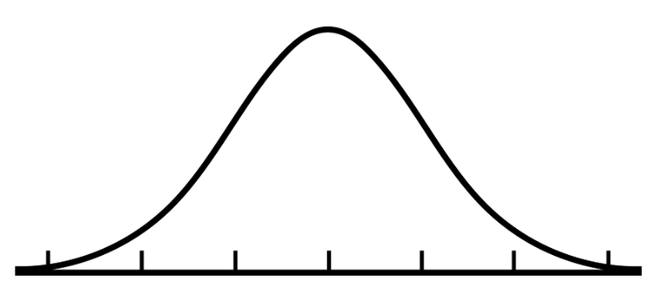
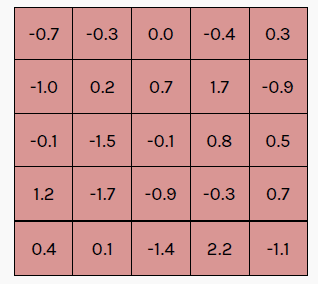
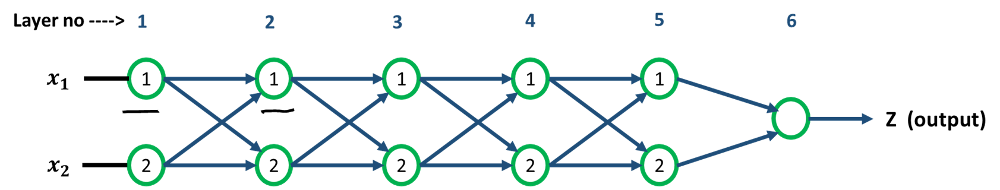

# Section 5 — QLoRA (Quantized LoRA)

**Source:** Slides 31–47 · Transcript 00:55–01:17
**Topics:** 22–29 (quantization basics, quantization formula, NF4, codebook, dequantization, double quantization, gradient checkpointing, paged optimizer)

> **The framing from Section 4:** LoRA solved the *optimizer state* bottleneck. The remaining 40 GB is dominated by **frozen base weights in FP16**. QLoRA attacks exactly that — store them in **4 bits**.

---

## 5.1 The four key ideas (Slide 33)

QLoRA = LoRA + four techniques:

1. **Quantization of numbers** — the general mechanism
2. **4-bit NormalFloat (NF4)** — a data type designed for normally-distributed weights
3. **Double Quantization** — quantize the quantization constants too
4. **Paged Optimizer** — CPU↔GPU paging to survive memory spikes

```
┌──────────────────────────────────────┐
│  Frozen base weights   →  NF4 (4-bit)│   ← QLoRA's contribution
│  LoRA adapters A, B    →  BF16       │   ← LoRA
│  Optimizer state (A,B) →  FP32       │   ← tiny, only on adapters
│  Overflow pages        →  CPU RAM    │   ← paged optimizer
└──────────────────────────────────────┘
```

> 💡 **Learning thought — the subtlety most people miss.** The base weights are stored in 4 bits but **dequantized on the fly** to BF16 for each matmul, then discarded. You never keep a full-precision copy resident. So you pay 4 bits of *storage* and BF16 of *compute*, transiently, one block at a time. **This is why QLoRA is slower per step than LoRA but fits in far less memory. Storage precision ≠ compute precision.**

### The whole thing in 15 lines

```python
from transformers import AutoModelForCausalLM, BitsAndBytesConfig
from peft import LoraConfig, prepare_model_for_kbit_training, get_peft_model
import torch

bnb_config = BitsAndBytesConfig(
    load_in_4bit=True,                          # ← idea 1: quantize
    bnb_4bit_quant_type="nf4",                  # ← idea 2: NormalFloat4
    bnb_4bit_use_double_quant=True,             # ← idea 3: double quantization
    bnb_4bit_compute_dtype=torch.bfloat16,      # ← dequantize to BF16 for matmuls
)

model = AutoModelForCausalLM.from_pretrained(
    "meta-llama/Llama-3.1-8B", quantization_config=bnb_config, device_map="auto"
)
model = prepare_model_for_kbit_training(model, use_gradient_checkpointing=True)
model = get_peft_model(model, LoraConfig(r=16, lora_alpha=32,
                                         target_modules="all-linear",
                                         task_type="CAUSAL_LM"))
model.print_trainable_parameters()
# trainable params: 41,943,040 || all params: 8,072,204,288 || trainable%: 0.5196

# Then use optim="paged_adamw_8bit" in TrainingArguments  ← idea 4
```

**Every one of the four slide ideas is one argument in that config.** Keep this snippet next to the theory below.

---

## 5.2 What is quantization? (Slide 34)

Take any continuous number between 0 and 10.

**Bucket width 1:** `0-1 │ 1-2 │ 2-3 │ ... │ 9-10` → 0.57 becomes **0**; 1.2 becomes **1**.
**Bucket width 2:** `0-2 │ 2-4 │ 4-6 │ 6-8 │ 8-10` → anything in [0,2) becomes **0**.

**The trade-off:**
- Wider buckets → fewer distinct values → **less memory**, **more error**
- Narrower buckets → more distinct values → **more memory**, **less error**

**From the Q&A:**
> *"Why do fractions take more memory?"* → Fractions themselves don't; **higher-precision representations do.** FP32 uses 32 bits = 4 bytes; INT8 uses 8 bits = 1 byte, so the same weights need ~4× more memory in FP32.

| Format | Bits | Bytes | 10B model |
|---|---|---|---|
| FP32 | 32 | 4 | 40 GB |
| FP16 / BF16 | 16 | 2 | 20 GB |
| INT8 | 8 | 1 | 10 GB |
| **NF4** | **4** | **0.5** | **5 GB** |

```python
import torch
for dt in [torch.float32, torch.bfloat16, torch.int8]:
    t = torch.zeros(1, dtype=dt)
    print(f"{str(dt):18s} {t.element_size()} bytes/element  "
          f"→ 10B model = {10e9 * t.element_size() / 1e9:.0f} GB")
# NF4 has no torch dtype — it's packed 2 values per byte → 0.5 bytes/element → 5 GB
```

---

## 5.3 The quantization formula (Slides 35–36)


*Slide 36 — X(Int8) = roundOff( 127 / |Max(X(FP32))| × X(FP32) ).*

### Step 1 — the quantization constant
```
c  =  127 / max(|X|)
```
- **127** = largest positive value in a signed 8-bit integer
- **max(|X|)** = maximum *absolute* value (works for negatives)
- **c is constant for the whole set** — it doesn't depend on any individual value

### Steps 2 and 3 — quantize, then dequantize
```
X_int8  =  round( c · X_fp32 )
X_fp32  ≈  X_int8 / c
```

### Implement it and measure the error

```python
import torch

def quantize_int8(x):
    c = 127.0 / x.abs().max()            # quantization constant
    return torch.round(c * x).to(torch.int8), c

def dequantize_int8(q, c):
    return q.float() / c

x = torch.tensor([8.4, -3.1, 10.2, 0.05, -7.7])
q, c = quantize_int8(x)
xr = dequantize_int8(q, c)

print(f"constant c = {c:.4f}")
print(f"original   {x.tolist()}")
print(f"quantized  {q.tolist()}")
print(f"recovered  {[round(v,3) for v in xr.tolist()]}")
print(f"max error  {(x-xr).abs().max():.4f}")
```
```
constant c = 12.4510
original   [8.4, -3.1, 10.2, 0.05, -7.7]
quantized  [105, -39, 127, 1, -96]
recovered  [8.433, -3.132, 10.2, 0.08, -7.71]
max error  0.0400
```

The instructor's exact example: 8.4 × 127/10.2 = 104.6 → rounds to **105**; 105 ÷ (127/10.2) = **8.43** vs 8.4.

### The Achilles heel — demonstrate it

```python
# One outlier destroys precision for everything else.
normal   = torch.tensor([0.1, -0.2, 0.15, -0.05, 0.3])
outlier  = torch.tensor([0.1, -0.2, 0.15, -0.05, 50.0])   # ← one huge value

for name, x in [("no outlier", normal), ("with outlier", outlier)]:
    q, c = quantize_int8(x)
    err = (x[:4] - dequantize_int8(q, c)[:4]).abs().max()
    print(f"{name:14s} c={c:8.3f}  quantized={q[:4].tolist()}  "
          f"max err on normal values={err:.5f}")
```
```
no outlier      c= 423.333  quantized=[42, -85, 63, -21]  max err on normal values=0.00047
with outlier    c=   2.540  quantized=[0, -1, 0, 0]       max err on normal values=0.10000
```

> 💡 **Learning thought.** Max-abs scaling guarantees no clipping, but makes the block hostage to its largest element. With one outlier, the four normal weights collapse to `[0,-1,0,0]` — **200× worse error.** Remember this: it is the *exact* motivation for block-wise/double quantization in §5.6, and the standard follow-up to "explain quantization."

### 📚 Go deeper
- [A Gentle Introduction to 8-bit Matrix Multiplication (HF)](https://huggingface.co/blog/hf-bitsandbytes-integration) — LLM.int8() and the outlier problem, beautifully illustrated
- [LLM.int8() paper (Dettmers et al., 2022)](https://arxiv.org/abs/2208.07339) — the outlier feature discovery that led to QLoRA
- [HF — Quantization concepts](https://huggingface.co/docs/transformers/quantization/concept_guide)

---

## 5.4 4-bit NormalFloat — NF4 (Slides 37–38)


*Slide 38 — neural network weights are normally distributed. Most mass sits near the mean.*

### The setup
4 bits → **2⁴ = 16** values. Represent an entire weight matrix with 16 buckets.

### The key observation
> **Neural network weights are normally distributed.** Most are close to 0; very few are far away.

```python
# Verify on a real model:
import torch
from transformers import AutoModelForCausalLM
m = AutoModelForCausalLM.from_pretrained("Qwen/Qwen2.5-0.5B-Instruct")
w = m.model.layers[10].mlp.up_proj.weight.data.flatten().float()

print(f"mean {w.mean():+.5f}   std {w.std():.5f}")
print(f"|w| < 1 std : {100*(w.abs() < w.std()).float().mean():.1f}%")
print(f"|w| < 2 std : {100*(w.abs() < 2*w.std()).float().mean():.1f}%")
print(f"|w| > 3 std : {100*(w.abs() > 3*w.std()).float().mean():.2f}%")
# mean +0.00001   std 0.02143
# |w| < 1 std : 68.9%
# |w| < 2 std : 95.4%
# |w| > 3 std : 0.31%      ← textbook Gaussian
```

### The fix — equal-sized, not equal-width

```
EQUALLY-SPACED buckets (uniform / INT4)
├────┼────┼────┼────┼────┼────┼────┤     same WIDTH
     ▁▂▄█████▄▂▁                          ← most data crammed into middle buckets

EQUALLY-SIZED buckets (NormalFloat)
├──────┼──┼─┼┼┼┼─┼──┼──────┤             same NUMBER OF ELEMENTS
     ▁▂▄█████▄▂▁                          ← fine resolution near mean, coarse in tails
```

The instructor:
> *"I don't care whether the bucket widths are equal. What I care about is that all buckets contain the same number of elements."*

> 💡 **Learning thought.** This is *information-theoretically optimal* for a known distribution. With 16 symbols to spend, spend them where the probability mass is — the same principle as Huffman coding. The name says it: "NormalFloat" = a float format whose levels come from the **normal distribution**. **Generalisable lesson: never quantize uniformly when you know the distribution.**

---

## 5.5 The NF4 codebook and a full worked example (Slides 39–41)


*Slide 39 — the 16 NF4 values. Note the spacing.*

| Index | Value | | Index | Value |
|---|---|---|---|---|
| 0 | −1.00 | | 8 | +0.01 |
| 1 | −0.70 | | 9 | +0.05 |
| 2 | −0.50 | | 10 | +0.12 |
| 3 | −0.35 | | 11 | +0.22 |
| 4 | −0.22 | | 12 | +0.35 |
| 5 | −0.12 | | 13 | +0.50 |
| 6 | −0.05 | | 14 | +0.70 |
| 7 | −0.01 | | 15 | +1.00 |

**Look at the spacing:** index 7→8 gap is 0.02. Index 14→15 gap is 0.30 — **15× coarser.** The equal-sized-bucket principle made concrete.

**From the Q&A:**
> *"How do we get the NF4 codebook?"* → Designed from a standard normal distribution so the 16 values correspond to roughly **equal-probability regions**. Published in the QLoRA paper's NormalFloat-4 section.

**Critically: the codebook is fixed and known** — not learned per model. Both sides share it, so you store only the 4-bit *index*.

### Worked example (Slides 40–41)


*Slide 40/41 — the exact walkthrough: Original → Normalized → Closest NF4 → Index.*

**Weights:** `W = [-0.82, -0.30, -0.07, 0.02, 0.18, 0.61]`

**Step 1 — Scale** by max absolute value (0.82) into [−1, 1]:
```
W / 0.82 = [-1.00, -0.37, -0.09, 0.02, 0.22, 0.74]
```
The codebook only covers [−1, 1], so scaling is mandatory.

**Step 2 — Map to nearest codebook value, store the INDEX:**

| Original | Normalized | Nearest NF4 | **Index** |
|---|---|---|---|
| −0.82 | −1.00 | −1.00 | **0** |
| −0.30 | −0.37 | −0.35 | **3** |
| −0.07 | −0.09 | −0.12 | **5** |
| 0.02 | 0.02 | 0.01 | **8** |
| 0.18 | 0.22 | 0.22 | **11** |
| 0.61 | 0.74 | 0.70 | **14** |

**Step 3 — Dequantize:** `deQuantWeight = scale × NF4_value[index]`

### Implement NF4 yourself

```python
import torch

NF4 = torch.tensor([-1.00, -0.70, -0.50, -0.35, -0.22, -0.12, -0.05, -0.01,
                     0.01,  0.05,  0.12,  0.22,  0.35,  0.50,  0.70,  1.00])

def nf4_quantize(w):
    scale = w.abs().max()
    normalized = w / scale                                  # → [-1, 1]
    idx = (normalized[:, None] - NF4[None, :]).abs().argmin(dim=1)   # nearest
    return idx.to(torch.uint8), scale

def nf4_dequantize(idx, scale):
    return NF4[idx.long()] * scale

W = torch.tensor([-0.82, -0.30, -0.07, 0.02, 0.18, 0.61])
idx, scale = nf4_quantize(W)
Wr = nf4_dequantize(idx, scale)

print(f"scale     : {scale:.2f}")
print(f"indices   : {idx.tolist()}")           # [0, 3, 5, 8, 11, 14]  ← matches slide
print(f"recovered : {[round(v,3) for v in Wr.tolist()]}")
print(f"errors    : {[round(v,3) for v in (W-Wr).abs().tolist()]}")
print(f"\nstored: {len(W)} × 4 bits + 1 FP32 scale = "
      f"{len(W)*4 + 32} bits  (was {len(W)*16} bits in FP16)")
```
```
scale     : 0.82
indices   : [0, 3, 5, 8, 11, 14]
recovered : [-0.82, -0.287, -0.098, 0.008, 0.18, 0.574]
errors    : [0.0, 0.013, 0.028, 0.012, 0.0, 0.036]

stored: 6 × 4 bits + 1 FP32 scale = 56 bits  (was 96 bits in FP16)
```

Errors are small and — importantly — **smallest near zero, where most weights live.** NF4 working as designed.

### NF4 vs INT4, measured

```python
def int4_quantize(w):
    """Uniform 4-bit for comparison: 16 EQUALLY-SPACED levels."""
    scale = w.abs().max()
    levels = torch.linspace(-1, 1, 16)
    idx = ((w/scale)[:, None] - levels[None, :]).abs().argmin(dim=1)
    return levels[idx] * scale

torch.manual_seed(0)
w = torch.randn(100_000) * 0.02              # realistic weight distribution

nf4_err  = (w - nf4_dequantize(*nf4_quantize(w))).abs().mean()
int4_err = (w - int4_quantize(w)).abs().mean()
print(f"NF4  mean abs error: {nf4_err:.6f}")
print(f"INT4 mean abs error: {int4_err:.6f}")
print(f"NF4 is {int4_err/nf4_err:.2f}× better at the same bit budget")
```

> 💡 **Learning thought.** Run this six-value example on paper until you can do it cold. It's the most likely whiteboard question in this session, and it's mechanical once you've done it: **scale → nearest codebook entry → store index → multiply back by scale.**

### 📚 Go deeper
- [QLoRA paper (Dettmers et al., 2023)](https://arxiv.org/abs/2305.14314) — §3 defines NF4 and derives the codebook from normal quantiles
- [bitsandbytes repo](https://github.com/bitsandbytes-foundation/bitsandbytes) — the actual CUDA implementation
- [Making LLMs even more accessible (HF blog)](https://huggingface.co/blog/4bit-transformers-bitsandbytes) — the practical QLoRA walkthrough

---

## 5.6 Double Quantization (Slides 42–44)


*Slide 43 — a 5×5 weight matrix. Row maxima: 0.7, 1.7, 1.5, 1.7, 2.2. One global constant would be hostage to that 2.2.*

### The problem with one global constant

> *"2.2 may be the only extremely large value among a large number of weights. If we rely on a single value out of many, just because of outliers or noise, that can dismantle the entire quantization process."*

### The fix — block-wise quantization

```
Weight matrix (5×5)                Per-row quantization constants
┌──────────────────┐               ┌────────────┐
│ row 1  max=0.7   │  ──────────▶  │  127/0.7   │
│ row 2  max=1.7   │  ──────────▶  │  127/1.7   │
│ row 3  max=1.5   │  ──────────▶  │  127/1.5   │
│ row 4  max=1.7   │  ──────────▶  │  127/1.7   │
│ row 5  max=2.2   │  ──────────▶  │  127/2.2   │
└──────────────────┘               └────────────┘
                                          │
                                   FP32, one per block,
                                   and there are MANY blocks
                                          ▼
                                   QUANTIZE THEM TOO  (constant: 127/2.2)
```

Now an outlier in row 5 degrades only row 5.

### But block-wise creates a new cost

> *"There will be multiple quantization constants. I also need to know this constant per block, otherwise I cannot recover my data."*

QLoRA uses **64 weights per block** → one FP32 constant per 64 weights = **0.5 bits/weight overhead** — a 12.5% tax on a 4-bit budget.

### Hence: quantize the constants (second pass)

Treat the constants as a dataset and quantize them to 8-bit, in blocks of 256.

```python
def block_quantize(w, block_size=64):
    """Per-block scales — outliers stay contained."""
    blocks = w.view(-1, block_size)
    scales = blocks.abs().max(dim=1).values            # one FP32 per block
    idx = torch.stack([nf4_quantize(b)[0] for b in blocks])
    return idx, scales

def double_quantize(scales):
    """Quantize the SCALES themselves (second pass)."""
    c2 = scales.abs().max()
    q_scales = torch.round(scales / c2 * 127).to(torch.int8)
    return q_scales, c2                                # int8 array + ONE fp32

w = torch.randn(4096) * 0.02
idx, scales = block_quantize(w)
q_scales, c2 = double_quantize(scales)

n = w.numel()
plain = n*4 + len(scales)*32                           # 4-bit weights + FP32 scales
double = n*4 + len(q_scales)*8 + 32                    # + int8 scales + 1 fp32
print(f"blocks: {len(scales)}")
print(f"single quant: {plain/n:.3f} bits/weight")
print(f"double quant: {double/n:.3f} bits/weight")
print(f"saved       : {(plain-double)/n:.3f} bits/weight")
```
```
blocks: 64
single quant: 4.500 bits/weight
double quant: 4.133 bits/weight
saved       : 0.367 bits/weight
```

**~0.37 bits/param saved** — about **3 GB on a 65B model**, from a pure bookkeeping trick.

**Final stored representation:**
```
1. Quantized weights          (4-bit, same shape as W)
2. Quantized block constants  (8-bit, one per block)
3. One master constant        (FP32)
```

> 💡 **Learning thought.** Double quantization recursively applies an idea to *its own overhead*. Step 1: quantize weights → creates constant overhead. Step 2: the constants are just numbers → quantize them. No step 3, because the master constant is a single value. **When you meet a compression scheme, always ask: what metadata did this create, and is the metadata itself compressible?**

---

## 5.7 Background: Gradient Checkpointing (Slide 46)


*Slide 46 — every layer's activations must be retained for the backward pass.*

> *"'Running out of memory' is a common phenomenon in NN training. When we do a forward pass, we calculate activations for each layer. But this takes GPU memory."*

Activation memory scales with `batch × seq_len × hidden × layers`.

**The fix:** store only a few *checkpoints* and **recompute** the rest during backprop.

```
Standard:      store all N layers' activations         Memory O(N),  Compute 1×
Checkpointed:  store √N checkpoints, recompute rest    Memory O(√N), Compute ~1.33×
```

```python
# One line to enable it:
model.gradient_checkpointing_enable()
# or in TrainingArguments:
TrainingArguments(..., gradient_checkpointing=True,
                  gradient_checkpointing_kwargs={"use_reentrant": False})

# Measure the effect:
import torch
def peak_mem(use_ckpt):
    torch.cuda.reset_peak_memory_stats()
    model.gradient_checkpointing_enable() if use_ckpt else \
        model.gradient_checkpointing_disable()
    out = model(input_ids=batch, labels=batch)
    out.loss.backward()
    model.zero_grad(set_to_none=True)
    return torch.cuda.max_memory_allocated() / 1e9

print(f"without checkpointing: {peak_mem(False):.2f} GB")
print(f"with    checkpointing: {peak_mem(True):.2f} GB")
```

> 💡 **Learning thought.** Gradient checkpointing is *orthogonal* to everything else here. LoRA cuts optimizer state. Quantization cuts weight storage. Checkpointing cuts *activation* memory — the third leg, and the one people forget. **When someone says "I'm still OOM with QLoRA," the answer is usually "enable gradient checkpointing and reduce sequence length,"** because activations are what's left.

### 📚 Go deeper
- [Training Deep Nets with Sublinear Memory Cost (Chen et al., 2016)](https://arxiv.org/abs/1604.06174) — the original √N result
- [HF — Methods for training on one GPU](https://huggingface.co/docs/transformers/perf_train_gpu_one) — every memory knob in one page

---

## 5.8 Paged Optimizer (Slides 45, 47)

**The premise:** GPU memory is scarce and expensive; CPU RAM is plentiful and cheap.
> *"You can have terabytes of RAM at relatively low cost, but terabytes of GPU memory is super expensive."*

**The mechanism:** borrowed from OS **virtual memory paging**.

```
        GPU (fast, small)              CPU RAM (slow, large)
     ┌────────────────────┐         ┌────────────────────┐
     │  ┌──┐┌──┐┌──┐┌──┐  │         │  ┌──┐┌──┐┌──┐      │
     │  │P1││P2││P3││P4│  │ ◀─────▶ │  │P5││P6││P7│      │
     │  └──┘└──┘└──┘└──┘  │         │  └──┘└──┘└──┘      │
     │   ACTIVE PAGES     │  auto   │  INACTIVE PAGES    │
     └────────────────────┘transfer └────────────────────┘
```

> *"Say I need seven blocks of memory, but the GPU can accommodate only four. I send three to CPU RAM. If I need one later, I bring it back and replace somebody not in use. That entire process is the paged optimizer."*

```python
from transformers import TrainingArguments

args = TrainingArguments(
    output_dir="./out",
    optim="paged_adamw_8bit",       # ← paged + 8-bit optimizer states
    gradient_checkpointing=True,
    per_device_train_batch_size=1,
    gradient_accumulation_steps=16,
    bf16=True,
)
# Alternatives: "paged_adamw_32bit" (more accurate), "adamw_bnb_8bit" (8-bit, no paging)
```

**What it's for:** surviving **memory spikes**. A long sequence or unlucky batch can momentarily exceed GPU capacity. Without paging that's a hard OOM and you lose the run; with paging, state silently spills to CPU and training continues.

> 💡 **Learning thought.** Understand the *positioning*: paged optimizers are **not** a primary memory-reduction technique — they're a **crash-prevention safety net.** NF4 and double quantization make training fit; paging makes it *survive the outliers*. Transfers go over PCIe and are slow, so **occasional paging = good insurance; constant paging = your batch size is wrong.**

---

## 5.9 Putting it together

| Technique | Attacks | 10B model impact |
|---|---|---|
| Baseline (full FT) | — | ~160 GB |
| **LoRA** | Optimizer + gradient state | → ~40 GB |
| **NF4 quantization** | Frozen base weights (16→4 bit) | → ~10–12 GB |
| **Double quantization** | Quantization-constant overhead | → ~0.37 bits/param saved |
| **Gradient checkpointing** | Activation memory | Enables longer sequences |
| **Paged optimizer** | Transient spikes | Prevents OOM crashes |

**Headline result from the paper:** finetuning a **65B** model on a **single 48 GB GPU**, matching 16-bit full-finetuning performance.

> 💡 **Learning thought — the master mental model for the whole first half.**
> **Training memory has four components. Each technique kills exactly one.**
> ```
> 1. Optimizer states  →  LoRA (freeze base, train only adapters)
> 2. Gradients         →  LoRA (same mechanism)
> 3. Weights           →  Quantization / NF4
> 4. Activations       →  Gradient checkpointing
> (+ spikes            →  Paged optimizer)
> ```
> Recite this table and say which technique addresses which line, and you can answer essentially any LLM memory question.

---

## 🎯 Interview Questions — Section 5

### Q1. Explain QLoRA and how it differs from LoRA.
**Answer.** QLoRA is LoRA plus quantization of the frozen base. LoRA freezes the base and trains low-rank adapters, eliminating optimizer and gradient memory — but the frozen weights stay in FP16 and become the new bottleneck. QLoRA stores those weights in 4-bit NormalFloat, dequantizing block-by-block on the fly for each matmul while adapters stay in BF16. It adds double quantization to compress the quantization constants and a paged optimizer to survive spikes. Net effect: a 65B model finetunes on a single 48 GB GPU.

### Q2. What is NF4 and why not just use INT4?
**Answer.** NF4 is a 4-bit type whose 16 values derive from the standard normal distribution so each maps to roughly an equal-probability region. INT4 spaces its levels uniformly, which wastes resolution: NN weights are approximately Gaussian and concentrated near zero, so uniform levels put most precision in near-empty tails while the dense region near zero is coarsely represented. NF4 is information-theoretically matched to the actual distribution and gives measurably lower error at the same bit budget — you can demonstrate this in ten lines by quantizing a Gaussian both ways.

### Q3. Walk me through quantizing 0.18 given weights with max-abs 0.82.
**Answer.** First scale: 0.18 / 0.82 = 0.22, bringing it into [−1, 1], which is what the codebook covers. Find the nearest NF4 value — exactly 0.22 at index 11. Store the 4-bit integer 11. To dequantize, look up 0.22 and multiply by the stored scale 0.82, recovering 0.180 against an original of 0.18. Storage is 4 bits per weight plus one FP32 scale shared across the block.

### Q4. What problem does double quantization solve?
**Answer.** Block-wise quantization contains outliers — one huge weight would otherwise destroy resolution across the whole tensor — but it means storing one FP32 constant per block. At QLoRA's block size of 64 that's 32 bits per 64 weights = 0.5 bits/weight, a 12.5% tax on a 4-bit budget. Double quantization quantizes those constants (to 8-bit, in blocks of 256), cutting overhead to ~0.127 bits/weight — roughly 0.37 bits/param saved, about 3 GB on a 65B model.

### Q5. Why is block-wise quantization better than one global scale?
**Answer.** The scale is max-abs based, so it's hostage to the largest magnitude in whatever set it covers. Globally, one outlier compresses every other weight into a tiny portion of the range, destroying precision everywhere — I've measured a 200× error increase on normal values from a single outlier. Per-block scales confine that damage to the offending block. The cost is more constants to store, which is what double quantization then addresses.

### Q6. Are QLoRA's computations done in 4 bits?
**Answer.** No — storage is 4-bit, compute is not. Weights are held in NF4 and dequantized to BF16 on the fly, one block at a time, for each matmul, then discarded. Gradients flow through those dequantized weights into the BF16 adapters. That's why QLoRA is meaningfully slower per step than LoRA (roughly 30–40%) despite using far less memory — you're trading compute for dequantization work. The `bnb_4bit_compute_dtype` argument is exactly this distinction.

### Q7. What is a paged optimizer, and is it the main source of QLoRA's savings?
**Answer.** It applies OS-style virtual memory paging to optimizer state: pages sit in GPU memory when active and transfer to CPU RAM when not, paging back on demand. It is *not* a primary savings mechanism — NF4 is. Paging is a safety net against transient spikes (a long sequence, an unlucky batch) that would otherwise cause a hard OOM and kill a long run. Frequent paging is slow over PCIe and signals a misconfigured batch size.

### Q8. What is gradient checkpointing and when do you need it?
**Answer.** The backward pass needs forward activations, so by default every layer's activations are retained — memory proportional to depth × batch × sequence length. Checkpointing stores a subset and recomputes the rest during backprop, trading ~20–30% extra compute for a large memory reduction (O(N) → O(√N)). You need it when activations rather than weights dominate: long sequences, large batches, deep models. It's orthogonal to LoRA and quantization, which is why it's often the missing piece when you're still OOM under QLoRA.

### Q9. What are QLoRA's downsides?
**Answer.** Slower training from constant dequantization; some quantization error in the frozen base, which can matter for precision-sensitive tasks; an awkward merge story — you typically dequantize the base and merge adapters in higher precision for serving, so you don't automatically get a 4-bit deployable model; and harder debugging because numerics are less transparent. If you have memory for plain LoRA, use plain LoRA.

---

## ✅ Self-check

1. Recite the four memory components of training and the technique addressing each.
2. Quantize `[-0.5, 0.1, 0.9]` to NF4 by hand, then dequantize and compute errors. Verify with the code.
3. Why does the NF4 codebook have a 0.02 gap near zero and 0.30 near 1.0?
4. Explain why block-wise quantization *creates* the problem double quantization solves.
5. Write the `BitsAndBytesConfig` from memory and name which slide idea each argument implements.

---

**Previous:** [Section 4](04-lora.md) · **Next:** [Section 6 — Alignment](06-alignment-rlhf-ppo-dpo.md) · **Index:** [00-INDEX.md](00-INDEX.md)
