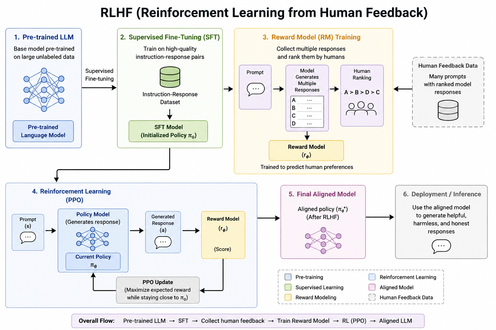
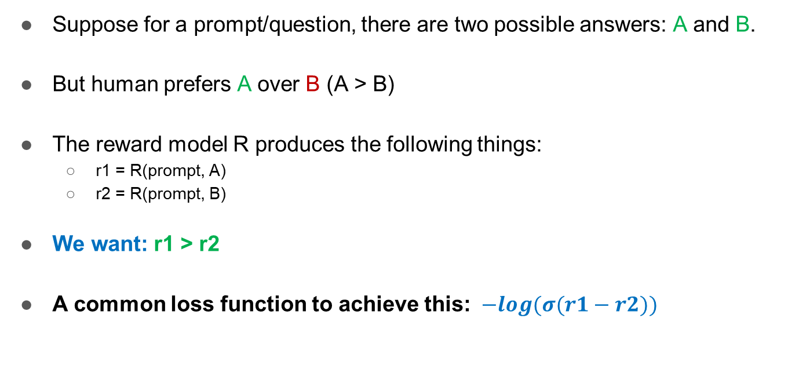
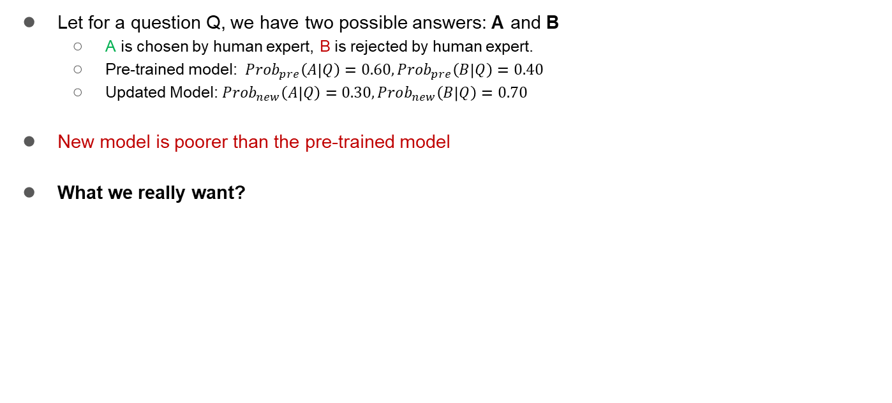

# Section 6 — Alignment: RLHF, PPO, and DPO

**Source:** Slides 48–63 · Transcript 01:17–01:40
**Topics:** 30–40 (HHH goal, RLHF motivation & pipeline, reward model, PPO, DPO data, DPO intuition, DPO loss)

> The instructor warned: *"Both these concepts are relatively non-trivial, and I will try to explain with examples."* Take that seriously — intuition matters more than formulas here, and interviews go deepest in this section.

---

## 6.1 The goal: Helpful, Harmless, Honest (Slides 48–49)

```
                        Alignment
                            │
              ┌─────────────┴─────────────┐
    Reinforcement Learning        Direct Preference
    from Human Feedback              Optimization
         (RLHF)                         (DPO)
```

**The objective:** responses that are **Helpful** (solve the problem), **Harmless** (refuse to cause damage), **Honest** (don't fabricate).

> *"We have seen fine-tuning, but we still have not done very well at mimicking human behaviour. The goal is: how can we further change the model parameters so that the responses are helpful, harmless and honest?"*

> 💡 **Learning thought — why SFT structurally cannot do this.** SFT is imitation: it maximises the likelihood of *one* gold answer and has no notion of "better." But most real prompts admit **many acceptable answers of differing quality**, and writing the single perfect one for every prompt is expensive and often impossible — humans are far better at *judging* than at *producing*. Alignment exploits exactly this asymmetry: easy to say "A is better than B," hard to write A from scratch. **That asymmetry is the entire economic justification for preference learning.**

---

## 6.2 Why RLHF? The motivating example (Slides 50–51)

**Question:** "How can I learn Python?"

| # | Answer | Verdict |
|---|---|---|
| 1 | "Python is a programming language. You can learn it by studying syntax." | Correct but thin |
| 2 | "Start with the basics: variables, data types, loops, functions, then build small projects. Practice regularly using exercises or projects that interest you." | **Best** |
| 3 | "Python is easy. Just watch some YouTube videos." | Correct-ish but unhelpful |

> *"You cannot say response 1 is wrong or 3 is wrong. To some extent they're right. But we can **prefer one over the others** — that's why preference comes into the picture."*

**All three would pass a correctness check. None is a hallucination.** SFT with any one as the gold label would be a valid SFT dataset. Only preference data captures that #2 is what a human actually wants.

> 💡 **Learning thought.** Write this example down and reuse it. It's the cleanest answer to "why isn't SFT enough?" — the failure mode isn't *wrongness*, it's *unhelpfulness*, and cross-entropy against a single target cannot express a preference ordering over multiple correct outputs.

---

## 6.3 The RLHF pipeline (Slide 52)


*Slide 52 — the full six-stage pipeline. Overall flow: Pre-trained LLM → SFT → collect human feedback → train Reward Model → RL (PPO) → Aligned LLM.*

**The thing to notice:** RLHF introduces a **second neural network** — the reward model — absent from every earlier technique. The instructor flagged this:
> *"There will be a reward model, a special model in RLHF, which was not present in any of the approaches we've seen so far. That is something you have to take note of."*

**Step 2 is mandatory:** RLHF starts *from an SFT model*, not a base model. RL needs a policy that already produces plausible responses, or the reward signal is meaningless noise.

---

## 6.4 The Reward Model (Slides 53–54)


*Slide 54 — the pairwise loss: −log(σ(r1 − r2)).*

### Why it exists
> A reward model converts human preferences into something **approximately measurable**: `R(good answer) = 0.9`, `R(bad answer) = 0.1`.

**The deeper reason:** RL requires a *scalar reward for every generated sample*. Humans can't label millions of rollouts in real time. So you train a model to **imitate the human judge** and query it for free, millions of times.

### How it's trained

```
r₁ = R(prompt, A)        # preferred
r₂ = R(prompt, B)        # rejected
We want:  r₁ > r₂
Loss:     L = − log σ( r₁ − r₂ )
```

### Read the loss slowly

| Situation | r₁ − r₂ | σ(r₁−r₂) | −log σ(·) = Loss |
|---|---|---|---|
| Strongly correct | +5 | 0.993 | **0.007** |
| Slightly correct | +1 | 0.731 | 0.313 |
| Indifferent | 0 | 0.500 | 0.693 |
| Slightly wrong | −1 | 0.269 | 1.313 |
| Strongly wrong | −5 | 0.007 | **4.99** |

```python
import torch, torch.nn.functional as F

def reward_loss(r_chosen, r_rejected):
    """Bradley-Terry pairwise loss. Identical to -log(sigmoid(margin))."""
    return -F.logsigmoid(r_chosen - r_rejected).mean()

for margin in [5.0, 1.0, 0.0, -1.0, -5.0]:
    r1 = torch.tensor([margin]); r2 = torch.tensor([0.0])
    print(f"margin {margin:+.1f} → sigmoid {torch.sigmoid(r1-r2).item():.3f} "
          f"→ loss {reward_loss(r1, r2).item():.3f}")
```

### Training a reward model end to end

```python
from transformers import AutoModelForSequenceClassification, AutoTokenizer
from trl import RewardTrainer, RewardConfig
from datasets import Dataset

# num_labels=1 → the "head" outputs ONE scalar: the reward.
rm = AutoModelForSequenceClassification.from_pretrained(
    "Qwen/Qwen2.5-0.5B-Instruct", num_labels=1)
tok = AutoTokenizer.from_pretrained("Qwen/Qwen2.5-0.5B-Instruct")

ds = Dataset.from_list([{
    "chosen":  [{"role":"user","content":"How can I learn Python?"},
                {"role":"assistant","content":"Start with variables, loops, functions, "
                                              "then build small projects."}],
    "rejected":[{"role":"user","content":"How can I learn Python?"},
                {"role":"assistant","content":"Python is easy. Watch some YouTube videos."}],
}])

trainer = RewardTrainer(model=rm, processing_class=tok, train_dataset=ds,
                        args=RewardConfig(output_dir="./rm", num_train_epochs=1))
trainer.train()

# Use it: score any (prompt, response) pair.
def score(prompt, response):
    text = tok.apply_chat_template(
        [{"role":"user","content":prompt},{"role":"assistant","content":response}],
        tokenize=False)
    with torch.no_grad():
        return rm(**tok(text, return_tensors="pt")).logits[0, 0].item()
```

> 💡 **Learning thought — the shape you'll see three times.** `−log σ(difference)` is *the* preference-learning loss. It appears here for the reward model and again, almost unchanged, in the DPO loss. Properties:
> - It only cares about the **difference** — reward models are defined only up to an additive constant, which is fine since PPO uses relative reward and normalises advantages.
> - It's smooth and never fully saturates, so learning continues.
> - It's the negative log-likelihood of the **Bradley–Terry model**: P(A ≻ B) = σ(r_A − r_B). *Naming Bradley–Terry in an interview is a strong signal.*

**From the Q&A — a real failure mode:**
> *"So we always keep the preferred response as r₁ and the less-preferred as r₂?"* → **Yes.** Consistently mark the preferred response as `chosen` and the less-preferred as `rejected`, so the loss knows which direction to optimize.

Swap the columns on 10% of your dataset and you're actively training the model to prefer bad answers on that 10%.

### 📚 Go deeper
- [InstructGPT (Ouyang et al., 2022)](https://arxiv.org/abs/2203.02155) — §3.5 for reward model training details
- [TRL — RewardTrainer](https://huggingface.co/docs/trl/reward_trainer)
- [Bradley–Terry model](https://en.wikipedia.org/wiki/Bradley%E2%80%93Terry_model) — the 1952 statistics behind the loss
- [Illustrating RLHF (HF blog)](https://huggingface.co/blog/rlhf) — best free visual explainer of the full pipeline

---

## 6.5 PPO — Proximal Policy Optimization (Slides 55–57)


*Slide 56 — policy, state, action, and π(a|s) mapped onto an LLM.*

### The principle
> - Improve the model based on reward
> - **But don't change the model too much in a single update.**

> *"If we change the model too much, it can dismantle all the learning we had. Remember **catastrophic forgetting** — if we change completely it might forget useful information."*

### The RL vocabulary mapped to LLMs — a guaranteed interview question

| RL term | In an LLM | Slide example |
|---|---|---|
| **Policy** | The LLM itself | The model M |
| **State (s)** | The prompt + tokens so far | "What is 2 + 2?" |
| **Action (a)** | The next token | "4" |
| **π(a\|s)** | Next-token probability | P("4") = 0.80 |
| **Reward** | Reward model's score of the full response | r_φ(s, a) |

```python
# π(a|s) is literally just the softmax over the vocabulary.
import torch
inputs = tok("What is 2 + 2?", return_tensors="pt")
with torch.no_grad():
    logits = model(**inputs).logits[0, -1]        # next-token logits
probs = torch.softmax(logits, dim=-1)

top = torch.topk(probs, 5)
for p, i in zip(top.values, top.indices):
    print(f"π({tok.decode(i)!r} | s) = {p:.4f}")
# π(' 4' | s) = 0.8012      ← the action we want reinforced
# π(' The' | s) = 0.0501
# π(' 2' | s) = 0.0233
```

> 💡 **Learning thought.** *Text generation is a sequential decision process.* Each token is an action, the sequence is a trajectory, and reward arrives only at the end — a **sparse terminal reward**. Once you see it this way the whole RL toolbox applies, and so do RL's difficulties: high variance, credit assignment across hundreds of tokens, instability. **That difficulty is exactly what motivates DPO.**

### What PPO computes (Slide 57)


*Slide 57 — the probability ratio: π_newLLM(a|s) / π_oldLLM(a|s).*

- ratio > 1 → the new model made this action *more* likely
- ratio < 1 → *less* likely
- ratio = 1 → no change

**The full PPO objective** (beyond the slide, but standard and worth knowing):

```
L_PPO = E[ min( r(θ)·Â ,  clip(r(θ), 1−ε, 1+ε)·Â ) ]
```

```python
def ppo_loss(logp_new, logp_old, advantage, eps=0.2):
    ratio = torch.exp(logp_new - logp_old)         # ratio in log space (stable)
    unclipped = ratio * advantage
    clipped   = torch.clamp(ratio, 1-eps, 1+eps) * advantage
    return -torch.min(unclipped, clipped).mean()   # pessimistic bound

# Why min() and clip(): once the ratio leaves [0.8, 1.2], the objective FLATTENS,
# so there is no gradient incentive to push the policy further in one update.
for r in [0.5, 0.9, 1.0, 1.1, 1.5]:
    ratio = torch.tensor([r]); adv = torch.tensor([1.0])
    obj = torch.min(ratio*adv, torch.clamp(ratio,0.8,1.2)*adv)
    print(f"ratio {r:.1f} → objective {obj.item():.3f}")
```

In RLHF a **KL penalty against the SFT reference** is also added to the reward, for the same reason.

> 💡 **Learning thought — count the models.** RLHF/PPO needs **four** models in memory simultaneously: the **policy** (training), the **reference/SFT model** (KL penalty), the **reward model** (scoring), and the **value/critic** (advantages). That's ~4× the memory plus a notoriously fiddly hyperparameter set. **This engineering burden — not any theoretical flaw — is why DPO took over.** Saying this in an interview signals you've actually run one.

### 📚 Go deeper
- [PPO paper (Schulman et al., 2017)](https://arxiv.org/abs/1707.06347)
- [The 37 Implementation Details of PPO](https://iclr-blog-track.github.io/2022/03/25/ppo-implementation-details/) — why PPO is hard in practice
- [TRL — PPOTrainer](https://huggingface.co/docs/trl/ppo_trainer)
- [Spinning Up in Deep RL (OpenAI)](https://spinningup.openai.com/en/latest/algorithms/ppo.html) — if RL vocabulary is new, start here

---

## 6.6 DPO — Direct Preference Optimization (Slides 58–63)

### The pitch (Slide 58)
> - **No reward model or RL**
> - **Directly train the language model using preference pairs**

```
RLHF:  preferences → reward model → PPO/RL loop → aligned model    (4 models)
DPO:   preferences ─────────────────────────────▶ aligned model    (2 models)
```

### The data (Slide 59)

Identical in shape to reward-model data — that's the point; DPO is a drop-in replacement consuming the same dataset.

```python
{"prompt":   "Explain photosynthesis simply.",
 "chosen":   "Plants use sunlight to turn water and carbon dioxide into food, "
             "releasing oxygen.",
 "rejected": "Photosynthesis is a biological process involving complex "
             "biochemical reactions in chloroplasts..."}
```

**Note what's being taught.** Both answers are *factually correct*. The rejected one is rejected for being **inappropriately complex given the instruction "simply."** DPO teaches style and instruction-adherence, not facts.

---

## 6.7 The DPO loss, built up from intuition (Slides 61–63)

The instructor built this in three stages. Follow the same path.

### Stage 1 — the motivating example (Slide 62)


*Slide 62 — pre-trained: P(A)=0.60, P(B)=0.40. Updated: P(A)=0.30, P(B)=0.70. The new model is **poorer**.*

**What we really want:**
- The new model should choose **A with higher probability than the pretrained model**.
- The new model should reject **B with higher probability than the pretrained model**.

### Stage 2 — the key move: make it RELATIVE

> *"I'm going to measure things **relative to the pretrained model**. It's a relative measure — how well am I doing compared to my pretrained model."*

```
                π_θ(A | Q)                        π_θ(B | Q)
Chosen ratio = ─────────────       Rejected ratio = ─────────────
               π_ref(A | Q)                        π_ref(B | Q)

     want this HIGH                        want this LOW
```

> 💡 **Learning thought — *the* idea of DPO, heavily under-appreciated.** Why relative, not absolute?
> **(1) It encodes the KL constraint for free.** Measuring against π_ref inherently penalises drifting from the reference — the same job PPO's clipping and KL penalty do, but built in rather than bolted on.
> **(2) It normalises away intrinsic difficulty.** Long or unusual responses have low absolute probability under *any* model. Dividing by the reference cancels that, so you measure *what the update changed*, not *what the sentence costs*.
> **(3) It's what makes the reward model disappear.** The DPO derivation shows that for the KL-constrained RLHF objective, the optimal reward is an *analytic function* of the log-ratio: `r(x,y) = β·log(π_θ/π_ref) + const`. Substitute into the Bradley–Terry loss and the reward model vanishes algebraically. **DPO isn't an approximation of RLHF — it's the closed-form solution of the same objective.**

### Stage 3 — the final loss (Slides 61, 63)


*Slide 63 — the polished DPO loss, exactly as presented.*

```
                   ⎡    ⎛      π_θ(y_w | x)              π_θ(y_l | x)  ⎞ ⎤
L_DPO  =  − log σ  ⎢ β · ⎜ log ─────────────  −  log ───────────────  ⎟ ⎥
                   ⎣    ⎝     π_ref(y_w | x)           π_ref(y_l | x)  ⎠ ⎦
                              └──── chosen ────┘      └─── rejected ───┘
                               want LARGE               want SMALL
```

| Piece | Role |
|---|---|
| `log π_θ(y_w)/π_ref(y_w)` | How much *more* likely the new model makes the **chosen** answer. **Maximise.** |
| `log π_θ(y_l)/π_ref(y_l)` | Same for the **rejected** answer. **Minimise.** |
| The subtraction | Enforces both goals with one scalar |
| **β** | *"Controls the smoothness — sometimes the curve can be extremely sharp."* Typical 0.1. Higher β = stay closer to reference. |
| **σ** | Squashes into (0,1) |
| **−log** | Negative log-likelihood — the standard ML objective form |

### Implement it

```python
import torch, torch.nn.functional as F

def dpo_loss(policy_chosen_logps, policy_rejected_logps,
             ref_chosen_logps,    ref_rejected_logps, beta=0.1):
    """The entire DPO objective. Four numbers in, one loss out."""
    chosen_logratio   = policy_chosen_logps   - ref_chosen_logps      # log(π_θ/π_ref) for y_w
    rejected_logratio = policy_rejected_logps - ref_rejected_logps    # log(π_θ/π_ref) for y_l

    logits = beta * (chosen_logratio - rejected_logratio)             # implicit reward margin
    loss = -F.logsigmoid(logits).mean()

    # Useful diagnostics — LOG THESE, not just the loss (see failure mode below).
    chosen_rewards   = beta * chosen_logratio.detach()
    rejected_rewards = beta * rejected_logratio.detach()
    accuracy = (chosen_rewards > rejected_rewards).float().mean()
    return loss, chosen_rewards, rejected_rewards, accuracy

# Slide 62's numbers, in log space:
import math
p_ref_A, p_ref_B = math.log(0.60), math.log(0.40)     # pretrained
p_new_A, p_new_B = math.log(0.30), math.log(0.70)     # updated (BAD)
loss_bad, *_ = dpo_loss(torch.tensor([p_new_A]), torch.tensor([p_new_B]),
                        torch.tensor([p_ref_A]), torch.tensor([p_ref_B]))

p_good_A, p_good_B = math.log(0.85), math.log(0.15)   # what we WANT
loss_good, *_ = dpo_loss(torch.tensor([p_good_A]), torch.tensor([p_good_B]),
                         torch.tensor([p_ref_A]), torch.tensor([p_ref_B]))

print(f"loss for the BAD update  : {loss_bad.item():.4f}")   # 0.7739
print(f"loss for the GOOD update : {loss_good.item():.4f}")  # 0.6229
# The loss correctly penalises exactly the situation slide 62 complains about.
```

### Compare to the reward model loss

```
Reward model:   L = − log σ(  r₁  −  r₂ )
DPO:            L = − log σ( β·(log-ratio_chosen − log-ratio_rejected) )
                                    └──── this IS the implicit reward ────┘
```

**Structurally identical.** DPO replaces the *learned* reward `r` with the *analytic* reward `β·log(π_θ/π_ref)`. **The language model is its own reward model.**

> 💡 **Learning thought — the instructor's own closing plea.** *"What I would request you is to understand the **intuition**: increase the relative probability of the chosen answer compared to the pretrained model, and decrease the relative probability of the rejected answer."* If you carry one sentence out of this section, carry that. The σ, log, and β are mathematical convenience wrapped around those two goals.

### ⚠️ A known failure mode

DPO's loss can be minimised by pushing `π_θ(y_l)` down *harder* than it pushes `π_θ(y_w)` up — the difference widens either way. In practice this can **reduce the chosen response's absolute probability** while still lowering the loss. Symptoms: degenerate or overly terse outputs.

```python
# This is why you log chosen_rewards separately:
#   loss ↓ but chosen_rewards ↓ too  →  the model is suppressing everything.
#   Healthy run: loss ↓, chosen_rewards ↑ (or flat), rejected_rewards ↓↓
```
Mitigations: higher β, fewer epochs, or variants (IPO, KTO, ORPO) designed to address it. **Mentioning this shows you've read past the headline.**

### 📚 Go deeper
- [DPO paper (Rafailov et al., 2023)](https://arxiv.org/abs/2305.18290) — §4 has the derivation that makes the reward model cancel. Read it once the intuition is solid.
- [TRL — DPOTrainer](https://huggingface.co/docs/trl/dpo_trainer) — the exact API in the notebook
- [Zephyr-7B](https://arxiv.org/abs/2310.16944) — the first prominent open model to show DPO working at scale
- [KTO](https://arxiv.org/abs/2402.01306) and [ORPO](https://arxiv.org/abs/2403.07691) — the successors; ORPO merges SFT and alignment into one stage
- [HF Alignment Handbook](https://github.com/huggingface/alignment-handbook) — production-grade SFT+DPO recipes you can run

---

## 6.8 RLHF vs DPO

| | RLHF (PPO) | DPO |
|---|---|---|
| **Reward model** | ✅ Separate, trained first | ❌ Implicit in the policy |
| **RL loop** | ✅ Online sampling + PPO | ❌ Direct supervised-style gradient |
| **Models in memory** | 4 | 2 |
| **Stability** | Notoriously fiddly | Much more stable |
| **Compute** | High | ~SFT-level |
| **KL control** | Explicit penalty + clipping | Built into the objective |
| **Can exceed the data?** | ✅ Yes — online exploration | ❌ No — offline |
| **Used by** | InstructGPT, ChatGPT (original) | Zephyr, Llama-3 pipelines, most open models |

> 💡 **Learning thought — the honest caveat.** DPO is not strictly better. RLHF is **online**: the policy generates fresh responses scored by the reward model, so it can discover behaviours absent from the original dataset. DPO is **offline**: bounded by your fixed pairs. At the frontier, labs still use online methods (or online DPO variants) for exactly this reason. DPO wins on **cost, stability, simplicity** — for almost everyone, the right trade.

---

## 🎯 Interview Questions — Section 6

### Q1. Why isn't SFT enough? Why do we need alignment?
**Answer.** SFT is imitation learning against a single gold answer, so it has no notion of "better." Most prompts admit many correct answers of differing helpfulness — the "how do I learn Python" example has three correct answers, one clearly best. Cross-entropy cannot express that ordering. Alignment also exploits a practical asymmetry: humans are far better and cheaper at *judging* which of two answers is better than at *writing* the ideal answer. Preference data is both more expressive and easier to collect at scale.

### Q2. Walk me through the RLHF pipeline.
**Answer.** Start from a pretrained LLM. Run SFT on instruction-response pairs to get a policy producing plausible outputs — mandatory, since RL on a base model has no useful signal. Collect preference data: sample multiple responses per prompt, have humans rank them. Train a reward model on those rankings with the Bradley–Terry pairwise loss. Finally run PPO: the policy generates responses, the reward model scores them, and PPO updates the policy to increase reward while a KL penalty and ratio clipping keep it near the SFT reference. Output is the aligned policy.

### Q3. Explain the reward model loss.
**Answer.** `L = −log σ(r₁ − r₂)` where r₁ scores the preferred response and r₂ the rejected. Minimising drives r₁ − r₂ large and positive. It's the negative log-likelihood of the Bradley–Terry model, P(A ≻ B) = σ(r_A − r_B). It depends only on the *difference*, so reward is identified only up to an additive constant — fine, since PPO uses relative reward and normalises advantages anyway.

### Q4. Why does PPO clip the probability ratio?
**Answer.** To bound how far the policy moves in one update. Large policy jumps destabilise RL and, for LLMs, cause catastrophic forgetting — the model chases reward and collapses into degenerate high-reward text. Clipping to [1−ε, 1+ε] flattens the objective outside that band so there's no gradient incentive to move further. RLHF adds an explicit KL penalty against the SFT reference for the same purpose.

### Q5. Map the RL vocabulary onto an LLM.
**Answer.** The policy is the LLM. The state is the prompt plus tokens generated so far. An action is the next token. π(a|s) is the model's next-token probability — literally the softmax over the vocabulary. The reward is the reward model's score of the completed response: a sparse *terminal* reward, which makes credit assignment across hundreds of token-level actions genuinely hard and is a major source of PPO's variance.

### Q6. How does DPO eliminate the reward model?
**Answer.** The DPO paper shows that for the KL-constrained reward-maximisation objective RLHF optimises, the optimal policy has a closed form; inverting it expresses the reward analytically as `r(x,y) = β·log(π_θ(y|x)/π_ref(y|x))` plus a prompt-dependent constant. Substituting into the Bradley–Terry loss makes that constant cancel — it's shared by both responses — and the reward model disappears, leaving a loss in terms of the policy and frozen reference only. DPO isn't a heuristic approximation; it's the closed-form solution to the same optimisation problem.

### Q7. Write the DPO loss and explain each term.
**Answer.** `L = −log σ( β·[ log(π_θ(y_w|x)/π_ref(y_w|x)) − log(π_θ(y_l|x)/π_ref(y_l|x)) ] )`. The first log-ratio is how much more likely the trained policy makes the chosen response relative to the frozen reference — we want it large. The second is the same for the rejected response — we want it small. Their difference is the implicit reward margin. β controls how aggressively we push and how tightly we stay near the reference, typically 0.1. Sigmoid maps the margin to a probability; −log turns it into a negative log-likelihood to minimise.

### Q8. Why measure probabilities *relative to* the reference model?
**Answer.** Three reasons. It bakes the KL constraint into the objective, so no separate penalty is needed. It normalises away intrinsic difficulty — long or unusual responses have low absolute probability under any model, and dividing by the reference cancels that so you measure only what training changed. And it's what makes the reward model cancel algebraically in the derivation: the implicit reward *is* the log-ratio.

### Q9. What does β do in DPO?
**Answer.** It scales the implicit reward margin and thereby the strength of the KL constraint. Low β (0.01) lets the policy move far from the reference — more aggressive alignment, more risk of degeneration and forgetting. High β (0.5) anchors it tightly — safer but weaker effect. 0.1 is the common default and what the session notebook uses.

### Q10. When would you still use PPO over DPO?
**Answer.** When you need *online* exploration. DPO is offline: it can only learn from the fixed pairs you collected, so it can never discover a behaviour absent from the dataset. PPO samples fresh responses from the current policy and scores them with the reward model, so it can find and reinforce behaviours no human demonstrated. That matters at the frontier or with a strong reward model. You'd also prefer a reward model when you want to reuse it across policies, or for eval and rejection sampling.

### Q11. What is a known failure mode of DPO?
**Answer.** The loss depends on the *difference* of log-ratios, so it can be reduced by suppressing the rejected response harder than it lifts the chosen one. This can drive down the chosen response's absolute probability too, producing degenerate, unnaturally terse, low-diversity outputs. That's why you log `chosen_rewards` and `rejected_rewards` separately rather than watching loss alone — a healthy run shows loss falling with chosen rewards flat or rising. Mitigations: higher β, fewer epochs, or variants like IPO, KTO, ORPO.

### Q12. What must be true of your preference dataset?
**Answer.** The chosen/rejected assignment must be *consistent across every row*. Both losses are directional; swapped labels on even a fraction of rows actively train toward worse behaviour there. Beyond that, pairs should differ on the dimension you care about (style, safety, helpfulness) rather than on confounds like length — otherwise the model simply learns "longer is better," which is the documented origin of verbosity bias in early RLHF'd models.

---

## ✅ Self-check

1. Write the reward-model loss and the DPO loss side by side. What single substitution turns one into the other?
2. Name all four models PPO holds in memory, and what each is for.
3. Why does DPO divide by π_ref instead of using raw probabilities? Give three reasons.
4. Your DPO run shows falling loss but terser, worse outputs. What's happening, and which metric would have caught it?
5. Run the `dpo_loss` snippet on slide 62's numbers. Explain why the "bad" update scores higher loss.

---

**Previous:** [Section 5](05-qlora.md) · **Next:** [Section 7 — Hands-on](07-handson-guardrails-and-redteam.md) · **Index:** [00-INDEX.md](00-INDEX.md)
